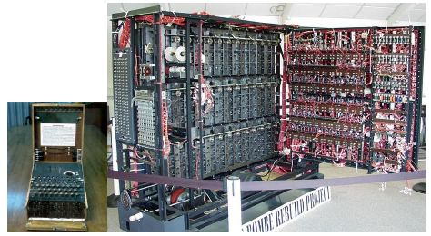

# Petite histoire de l'informatique 

## Le stockage des informations

!!! abstract "Informatique"
    En 1957, l'ingénieur allemand Karl Steinbuch crée le terme &laquo; Informatik &raquo; pour son essai intitulé *Informatik: Automatische Informationsverarbeitung*, pouvant être rendu en français par &laquo; Informatique : traitement automatique de l'information &raquo;.

    En 1966, l'Académie française consacre l'usage officiel du mot pour désigner la &laquo; **science du traitement de l'information** &raquo;. La presse, l'industrie et le milieu universitaire l'adoptent dès cette époque. 

    *D'après Wikipedia, article «Informatique »*

L'informatique est donc, étymologiquement, bien antérieure aux ordinateurs. Il s'agit de savoir **comment les informations sont stockées**, sur **quels supports**, et comment elles sont **traitées**.

### Pré-histoire de l'informatique :

#### Stocker l'information

Les premières traces laissées délibérément et nous étant parvenues par les êtres humains sont les peintures et gravures rupestres. Elles gardent de nombreux mystères, mais sont réellement des chefs-d'œuvre de civilisations passées.

{: style="width:30%; margin:auto;display:block;background-color: #d2dce0;" title="Écriture cunéiforme"}

Les archéo-anthropologues s'accordent actuellement sur le fait que des [proto-écritures](https://fr.wikipedia.org/wiki/Grotte_de_Lascaux#Interpr%C3%A9tations){: target="_blank"} ont été utilisées, mais nous ne disposons actuellement pas de *[pierres de Rosette](https://fr.wikipedia.org/wiki/Pierre_de_Rosette){: target="_blank"}* permettant de les décrypter.

On trouve ensuite les gravures sur rochers, puis rapidement les tablettes d'argiles, etc.

{: style="width:30%; margin:auto;display:block;background-color: #d2dce0;" title="Écriture cunéiforme"}

Ces supports sont particulièrement résistants, mais difficiles à stocker et ne peuvent contenir que peu d'informations. Mais ils étaient utilisés quotidiennement par les scribes, y compris pour l'apprentissage des mathématiques, de la loi, de la médecine, etc.

{: style="width:30%; margin:auto;display:block;background-color: #d2dce0;" title="Écriture cunéiforme"}

Les supports de type papyrus, vélins (peau) sont probablement très anciens, mais ils se dégradent facilement, sont sensibles aux incendies, etc. Leurs difficultés de conservation sont cependant contrebalancées par la plus grande facilité à les travailler. Ils deviennent dès l'antiquité le support privilégié pour transmettre et conserver des informations, dans toutes les grandes civilisations. Les [techniques de fabrication du papier](https://www.youtube.com/watch?v=aUw1_2xbYWM){:target="_blank"} se développent à partir de la Chine et atteignent l'Europe entre le Xe siècle et le XIVe siècle.

{: style="width:30%; margin:auto;display:block;background-color: #d2dce0;" title="Texte Chinois"}
{: style="width:80%; margin:auto;display:block;background-color: #d2dce0;" title="Diffusion papier"}

Jusqu'à la fin de l'époque médiévale, la possibilité la plus répandue pour obtenir un *manuscrit* était de le recopier à la main - d'où la grande importance des moines-copistes et des monastères qui s'y consacraient dans la sphère d'influence occidentale. Cependant, le procédé de *xylographie* (principe du tampon encreur avec une matrice en bois), ainsi que des procédés simplifiés de fabrication du papier transitent avec la grande horde mongole par l'intermédiaire de la route de la soie. Vers 1430, **Johannes Gutenberg** invente le principe de la presse à imprimer à caractères mobiles et facilite grandement la copie d'œuvres écrites. Une nouvelle ère de développement de la science et des idées se répand sur l'Europe.

{: style="width:30%; margin:auto;display:block;background-color: #d2dce0;" title="Gutemberg"}

#### Traiter l'information

Les systèmes de comptages sont limités, du *calculi* (petits cailloux en latin), aux systèmes de comptages cunéiformes *sexagésimaux* (en base $60$), dont nous avons hérité pour notre décompte des heures et des angles en degré. On trouve rapidement cependant le système des bouliers (ou abaques), découvert de manières indépendantes par de multiples civilisations tout autour du globe.

{: style="width:30%; margin:auto;display:block;background-color: #d2dce0;" title="Boulier"}

La [machine d'Anticythère](https://fr.wikipedia.org/wiki/Machine_d%27Anticyth%C3%A8re){: target="_blank"}, découverte en 1900 et datée de 87 avant J.C. est une machine servant à calculer les positions astronomiques, et donc à naviguer. Elle nous montre que le calcul a toujours un enjeu capital, et que l'humanité a fait preuve d'une très grande ingéniosité pour améliorer ses capacités de calculs (une très bonne vidéo en anglais est disponible [ici](https://www.youtube.com/watch?v=mTsCx0E7YkA){: target="_blank"}).

{: style="width:30%; margin:auto;display:block;background-color: #d2dce0;" title="Mécanisme d'Anticythere"}

De l'Antiquité jusqu'au Moyen Âge, les sciences se développent tranquillement, mais sans base mathématique autre que la géométrie. L'arrivée des chiffres dits *arabes*, qui remplacent les peu efficaces chiffres romains, modifient complètement les manières de faire : les commerçants s'emparent de ces chiffres et des algorithmes de calculs développés par les savants du monde musulman, et on assiste à l'apparition d'une bourgeoisie éduquée et savante qui communique à travers toute l'Europe. L'algèbre et l'arithmétique se développent, mais tous les calculs restent effectués au boulier où à la main. 

### Des machines à calculer et des métiers à tisser

Au XVIIe siècle, [Blaise Pascal](https://fr.wikipedia.org/wiki/Blaise_Pascal){: target="_blank"}, scientifique et penseur français, invente à 19 ans (en 1642) une machine à calculer pour aider son père à remettre de l'ordre dans les recettes fiscales d'une province française. Cette machine, la *pascaline*, était capable d'effecteur des opérations élémentaires par l'intermédiaire d'un ingénieux système d'engrenages. Cependant, la précision nécessaire à la réalisation de ces engrenages en a rendu la conception extrêmement couteuse, et peu de machines furent produites.

{: style="width:30%; margin:auto;display:block;background-color: #d2dce0;" title="Pascaline du CNAM"}

[Gottfried Leibniz](https://fr.wikipedia.org/wiki/Gottfried_Wilhelm_Leibniz){: target="_blank"} est un penseur allemand. Il fait progresser la philosophie, les mathématiques, la physique et l'ingénierie tout autant que son homologue français. Entre 1671 et 1694, il améliore la pascaline en lui ajoutant la possibilité de multiplier, et l'utilise pour le *calcul différentiel*.

En 1725, **Basile Bouchon**, un Lyonnais, met au point le premier système de programmation d’un métier à tisser grâce à un ruban perforé. En 1728, **Jean-Baptiste Falcon**, son assistant, remplace le ruban par une série de cartes perforées reliées entre elles. **Jacques de Vaucanson** reprend cette idée en remplaçant ruban et cartes perforées par un cylindre métallique et enfin **Joseph Marie Jacquard** lie le tout dans son métier à tisser qui fut adopté dans le monde entier à partir de 1801. 

Ces cartes perforées sont les premiers exemples de supports de stockages permettant de stocker d'autres informations que l'écrit ou l'image. En effet, ces cartes sont utilisées dans les [orgues de barbarie](https://www.youtube.com/watch?v=QXZGH2Kgb70){:target="_blank"} pour représenter de la musique, et sur les métiers Jacquard afin d'y représenter des motifs de tissage.
 
Les métiers à tisser Jacquard sont la pointe de la technologie. Ils utilisent les cartes perforées pour réaliser des motifs complexes et sont donc &laquo; programmables &raquo; par l'introduction de nouvelles cartes.

{: style="width:30%; margin:auto;display:block;background-color: #d2dce0;" title="Métier Jacquard"}

!!! tip "Le canard de Vaucanson : un robot"

    Dans l'histoire des automates, le canard de Vaucanson possède une place privilégiée : à la fois merveilleuse imitation mécanique de la vie mais aussi trucage relevant de la prestidigitation, il est déjà porteur de toutes les interrogations de notre monde contemporain concernant les robots et l'IA. La [vidéo d'Arte](https://www.youtube.com/watch?v=OP6IttkwD0g){:target="_blank"} le concernant est un must à voir absolument !

## Les pères et mères de l'informatique

## Les machines à calculer

{: style="width:30%; margin:auto;display:block;background-color: #d2dce0;" title="Charles Babbage"}

Au XIXème siècle, l'Empire Britannique est à son apogée et sa puissance repose sur sa force navale, aussi bien commerciale que militaire. Or à bord d'un navire la navigation se fait toujours aux étoiles et par l'intermédiaire de cartes marines de plus en plus détaillées. Un navigateur à cette époque utilise quotidiennement des tables de navigations, qui ne sont rien d'autre que des tables de trigonométrie et de *logarithmes*. Et ces tables sont établies et calculées à la main et sont loin d'être exemptes d'erreurs de calcul. En 1833 - 1834, le mathématicien anglais Charles Babbage imagine une machine utilisant des cartes perforées qui permettrait d'effectuer des calculs scientifiques, la {==**machine analytique**==} (*Differential engine*). Cette machine ne sera jamais opérationnelle du vivant de Babbage.

{==**Ada Lovelace**==} (1815 - 1852), est une mathématicienne anglaise. Travaillant avec Charles Babbage, elle imagine pouvoir faire jouer de la musique, afficher des chiffres et des lettres avec la machine analytique. Elle décrit, plus d'un siècle avant son invention, l'ordinateur : &laquo; La machine analytique n'a nullement la prétention de créer quelque chose par elle-même. Elle peut exécuter tout ce que nous saurons lui ordonner d'exécuter. Elle peut suivre une analyse ; mais elle n'a pas la faculté d'imaginer des relations analytiques ou des vérités. Son rôle est de nous aider à effectuer ce que nous savons déjà dominer. &raquo;
 
{: style="width:30%; margin:auto;display:block;background-color: #d2dce0;" title="Ada Lovelace"}
 
 
Vers 1842 elle écrit des algorithmes pour réaliser un programme informatique et toutes les instructions à donner à la machine, jusqu'aux positions des rouages. Elle invente les concepts de boucle et de branchements conditionnels et devient ainsi la première programmeuse.

L'apparition de l'électricité comme source d'énergie va rapidement permettre le développement de moteurs qui améliorent les machines à calculer. À la fin du XIXe siècle, Herman Holerith conçoit une machine utilisant des cartes perforées qui permet de simplifier le recensement de la population arrivant à New-York. Il fonde une société qui prendra rapidement le nom d'IBM. Les machines à calculer électromagnétiques se développent rapidement, et en parallèle les mathématiques progressent à grand pas. 
 
  

Mathématicien et cryptologue britannique (1912-1954), {==**Alan Turing**==} a d'abord travaillé sur l'idée de calculabilité. Il montre que ce qui est calculable peut se décomposer en un nombre fini d'étapes et peut de ce fait être réalisé par une machine. Il imagine à la fin des années 1930 un calculateur (appelé **«Machine de Turing»**, voir plus loin), mais celui-ci ne sera construit que 20 ans plus tard. Il imagine le moyen pour une machine de reproduire certaines actions humaines , et développe par une expérience de pensée un procédé appelé aujourd'hui **« Test de Turing»** permettant de savoir si une intelligence artificielle est capable de convaincre un humain qu'elle est humaine.
 
{: style="width:30%; margin:auto;display:block;background-color: #d2dce0;" title="Alan Turing"}

Lors de la seconde guerre mondiale, Alan Turing coordonne l'équipe chargée du décodage de la machine **Enigma** utilisée par les Nazis. Il construit une machine, surnommée &laquo; La bombe &raquo;, qui permet le déchiffrement rapide des messages allemands. Cette machine peut être considérée comme le premier ordinateur électronique, mais elle était difficilement reprogrammable, car il fallait re-câbler pour changer de programme.

{: style="width:30%; margin:auto;display:block;background-color: #d2dce0;" title="Enigma"}

## De l'électronique à la micro-informatique

L'électronique nait de l'invention des {==**tubes à vides**==} au début du XXe siècle. La machine **Colossus**, créée entre 1943 et 1945 (mais dont l'existence ne fur révélée qu'en 1970) utilise ces tubes à vides.

{: style="width:30%; margin:auto;display:block;background-color: #d2dce0;" title="Lampe double-triode de fabrication russe, image wikipedia"}

L'ENIAC est créé en 1944 d'une idée de John William Mauchly, aidé pour la résolution des problèmes d'ingénierie par J. Presper Eckert. Il sert à calculer des trajectoires balistiques et est financé par l'armée américaine, pour un cout important, les tubes à vides ayant une fâcheuse tendance à voir leur durée de vie fortement limitée. L'ENIAC est surtout connu pour son côté colossal : 30 tonnes, $167 ~m^2$ de surface au sol. 

{: style="width:30%; margin:auto;display:block;background-color: #d2dce0;" title="Eniac"}

Il est cependant d'un grand secours pour les calculs balistiques dont les calculs sont fastidieux. Par exemple voici le temps de calcul pour une table de tir :

| Moyen | Temps |
| :---: | :---: |
|A la main | 2,6 j |
| Avec une machine à calculer | 12 h |
| Model 5 (concurrent de l'ENIAC) | 40 min |
| ENIAC | 3 s |
| PC moderne | <30  µs  |

Entre $1944$ et $1955$, six femmes, Kathleen Antonelli, Jean Bartik, Betty Holberton, Marlyn Meltzer, Frances Spence et Ruth Teitelbaum sont les premières personnes à programmer l'ENIAC, pour un calcul balistique. Elles sont toutes mathématiciennes. Kathleen Antonelli et Frances Spence sont recrutées en 1942 par l’armée américaine pour calculer manuellement les trajectoires de tir. Marlyn Meltzer et Ruth Teitelbaum sont également calculatrices. Elles travaillent sur l'ENIAC à partir de 1944. Il s'agit d'identifier les différentes étapes du calcul et ensuite de câbler physiquement la machine. Ruth Teitelbaum, Frances Spence et Kathleen Antonelli poursuivirent leur travail sur l’Eniac lorsque celui-ci est transféré à Aberdeen en 1947.

Le transistor est inventé en $1947$, et il remplace rapidement les tubes à vides à partir du milieu des années $1950$, le cout de fabrication d'un transistor commençant à être plus faible que celui d'un tube à vide.

{: style="width:30%; margin:auto;display:block;background-color: #d2dce0;" title="Transistors, image Wikipedia"}

Dès $1958$ apparaissent les premiers circuits intégrés, et en $1971$ le premier **microprocesseur** commercial voit le jour : c'est *l'Intel 4004*. Les machines sont désormais miniaturisées, fiables et leur cout de fabrication décroit fortement. L'informatique s'ouvre aux particuliers.

{: style="width:30%; margin:auto;display:block;background-color: #d2dce0;" title="Par Thomas Nguyen — Travail personnel, CC BY-SA 4.0, https://commons.wikimedia.org/w/index.php?curid=47684767"}

De multiples machines sont commercialisées : l’Altair 8008, l’Apple II (1977), l’IBM PC (1981), le [ZX 81](https://fr.wikipedia.org/wiki/ZX81){: target="_blank"} (1981), le [commodore 64](https://fr.wikipedia.org/wiki/Commodore_64){: target="_blank"}  (1982), le Macintosh (1984) ... Le **ZX 81** est considéré à son époque comme le premier ordinateur familial en kit en France, sa résolution et sa capacité mémoire (1 ko) ne permettait pas énormément de prouesses au niveau des jeux.

De nombreuses sociétés se lancent dans la production de machines familiales à partir du début des années $1980$, et l'informatique rentre à l'école et commence à y être enseignée, en particulier sur les machines Thomson en France, comme le [TO7](https://fr.wikipedia.org/wiki/Thomson_TO7){: target="_blank"}, le [MO5](https://fr.wikipedia.org/wiki/Thomson_MO5){: target="_blank"}...

#### Les consoles de jeu

Si les consoles de jeu sont présentes depuis le début des années 1970 - la console [Odyssey](https://fr.wikipedia.org/wiki/Magnavox_Odyssey){: target="_blank"} est la première console à pouvoir être branchée sur l'écran de la télévision dès 1972, les jeux vidéos restent souvent cantonnés dans les salles d'arcades, où les bornes fleurissent à côtés des flippers et billards.

À la fin des années 1970 et au début des années 1980, le marché des consoles de jeu est florissant, avec pas moins de 744 modèles différents de consoles rien que pour l'année 1977, dont certaines telles l'[Atari 260](), la console [Vectrex]() ou bien la console Videopac ont un certain succès en France.

{: style="width:30%; margin:auto;display:block;background-color: #d2dce0;" title="Console VideoPac G 7200, image Wikipedia"}

Le crack du jeu vidéo de 1983 mènera à une forte réduction du nombre d'acteurs sur le marché des consoles, jusqu'à l'arrivée en 1986 de la console Nintendo NES qui bat tous les records de ventes.

{: style="width:30%; margin:auto;display:block;background-color: #d2dce0;" title="Console NES, image Wikipedia"}
    

## Le Stockage numérique des informations

### Unités d'informations

!!! abstract "Bit"

    Le {==**bit**==} est l'unité d'information la plus simple dans un système de numération, ne pouvant prendre que deux valeurs, représentées par les chiffres 0 et 1. Un bit peut aussi bien représenter une alternative logique (*Vrai* et *Faux*), qu'un chiffre binaire, ou qu'une autre information ne pouvant prendre que deux états (par ex. *Ouvert* ou *fermé*).
    
    En théorie de l'information de [Shannon](https://fr.wikipedia.org/wiki/Claude_Shannon){: target="_blank"}, le bit est la quantité minimale d'information pouvant être transmise par un message, et constitue à ce titre l'unité de mesure de base de l'information en informatique.

    Un {==**ensemble ordonné de bits**==} permet donc de représenter des informations.

Par exemple :

* avec 1 bit, on peut stocker une information prenant deux états :

    | Noir | Blanc |
    | :-: | :-: |
    | 0 | 1 |

* avec 2 bits, on peut stocker une information prenant 4 états :

    | Nord | Sud | Est | Ouest |
    | :-: | :-: | :-: | :-: |
    | 00 | 01 | 10 | 11 |

* avec 3 bits, on peut stocker une information prenant 8 états :

    | Nord | Nord-Est | Est | SUd-Est | Sud | SUd-Ouest | Ouest | Nord-Ouest |
    | :-: | :-: | :-: | :-: | :-: | :-: | :-: | :-: |
    | 000 | 001 | 010 | 011 | 100 | 101 | 110 | 111 |

!!! question "Questions I"

    1. Combien d'états différents peuvent être représentés par ? 4 bits ? 8 bits ? 10 bits ?
    2. Quel est le nombre minimal de bits nécessaire pour représenter l'alphabet latin en majuscule, sans accents et autres signes diacritiques ?
    3. Combien de bits sont nécessaires pour représenter tous les caractères de l'alphabet français, en y incluant les signes de ponctuations et les chiffres ?

!!! abstract "Octets"

    Un {==**octet**==} est un *mot binaire* de 8 bits, et permet de représenter $256$ informations différentes. Il est devenu l'unité standard de mémorisation des mémoires informatiques. Son symbole dans le système international est **o**, et ses multiples sont :

    | nom | symbole | valeur | 
    | :--- | :---: | ---: |
    | kilooctet | ko | $10^3$o |
    | mégaoctet | Mo | $10^6$o |
    | gigaoctet | Go | $10^9$o |
    | téraoctet | To | $10^{12}$o |
    | pétaoctet | Po | $10^{15}$o |
    | exaoctet | Eo | $10^{18}$o |

### Les stockages de données

Un des premiers systèmes de stockage de masse utilisé est la carte perforée. En 1884, **Herman Hollerith** dépose un brevet pour une machine électromécanique utilisant des cartes perforées permettant d'accélérer le recensement des états du gouvernement américain. Il lance par la suite une société qui deviendra IBM.

Une {==**carte perforée**==} est un support d'informations exprimées sous la forme binaire : une grille de « cases » est représentée, cases qui peuvent être perforées (1) ou non (0).

Par exemple la carte ci-dessous, modèle standard d'IBM breveté en 1928, possède 80 colonnes et 12 lignes (les lignes numérotées de 0 à 9, plus deux lignes supérieures non numérotées) permettant techniquement d'encoder un mot de 12 bits (mais en pratique seulement 9 bits étaient utilisés, les lignes numérotées 0 à 8, la ligne 9 servant de « bit de contrôle », et les deux lignes supérieures indiquant des opérations spéciales).

{: style="width:50%; margin:auto;display:block;background-color: #d2dce0;"}[^IBM]

[^IBM]: Image Wikipedia, crédit :« Par Arnold Reinhold — I took this picture of an artifact in my possession. The card was created in the late 1960s or early 1970s and has no copyright notice., CC BY-SA 2.5, [https://commons.wikimedia.org/w/index.php?curid=775153](https://commons.wikimedia.org/w/index.php?curid=775153){:target="_blank"} »

Ces cartes étaient stockées par boites de 2 000, et le coin tronqué servait de repère pour les insérer dans le bon sens dans un chargeur de cartes ou pour les remettre à l'endroit quand la boite tombait par terre.

!!! abstract "Standardisation"

    Si au départ chaque constructeur de machines lectrices de cartes perforées utilisait ses propres cartes, il est devenu assez vite clair qu'une standardisation devait être nécessaire. Cette standardisation est entrée en collision avec la standardisation des *bus de données*, c'est-à-dire des tailles des mots acceptés par les processeurs (en anglais *bytes*). Au départ les machines pouvaient accepter des *bytes* de 5, 6, 7, 8 ou même 9 bits, mais le procédé de standardisation a amené a une généralisation de l'octet comme unité de base.

    Sur les cartes perforées IBM, on utilisait alors les lignes numérotées de 0 à 7 pour représenter un octet, le numéro de ligne donnant le poids de chaque bit. Par exemple l'octet `1100 0001` aurait consisté en une colonne trouée en ligne 0, 6 et 7.

    Une carte perforée pouvait donc contenir 80 octets, une boite de 2000 cartes perforées contenait 160 ko.

La deuxième génération de support de stockages est constituée par les supports magnétiques. D’abord utilisés sous forme de **bandes magnétiques** à partir de 1928, ils se sont ensuite miniaturisés et démocratisés sous forme de **disques durs** à partir des années 1950 puis de **cassettes** et de **disquettes** dans les années 1960.

| Bande magnétique | Cassette | Disquettes |
| :---: | :---: | :---: |
| {: style="width:90%; margin:auto;display:block;background-color: #d2dce0;" title="Bande Magnétique, Wiipedia"} | {: style="width:90%; margin:auto;display:block;background-color: #d2dce0;" title="Cassette, Wikipedia"} | {: style="width:45%; margin:auto;display:block;background-color: #d2dce0;" title="Disquettes, Wikipedia"} |

La quantité d'information pouvant être contenue dans ces supports croit exponentiellement :

| Année de sortie | Type | Stockage |
| :-: | :-- | :-- |
| 1928 | Bande magnétique | 50 octets par cm |
| 1967 | Disquette 8’ | environ 82 ko |
| 1981 | Disquette 5’1⁄4 | environ 369 ko |
| 1984 | Disquette 5’1⁄4 (2nde génération) | environ 1,2 Mo |
| 1987 | Disquette 3’1⁄2 | environ 1,47 Mo |

!!! question "Questions II"

    1. Combien de cartes perforées standards sont-elles nécessaires pour contenir autant d'information qu'une disquette 3’1⁄2 de 1987 ?
    2. Quelle est la longueur de bande magnétique nécessaire pour contenir autant d'information qu'un disquette 3’1⁄2 de 1987 ?

La troisième génération est constituée par les supports optiques. Parmi ceux-ci, on trouve le disque compact (CD) développé au début des années 1980, le DVD apparu au milieu des années 1990 et le Blu-Ray commercialisé à partir du milieu des années 2000. La quatrième génération, enfin, est constituée par les mémoires flash. Cette technologie développée à la fin des années 1980 est au début couteuse et peu efficace pour le stockage. Elle va cependant être
améliorée pour devenir le mode standard de nos jours avec les clés USB, les cartes SD et micro SD et les disques SSD.

{: style="width:45%; margin:auto;display:block;background-color: #d2dce0;" title="Supports de générations 3 et 4"}

La quantité d'information pouvant être contenue dans ces supports continue à croitre exponentiellement :

| Année de sortie | Type | Stockage |
| :-: | :-- | :-- |
| 1990 | CD-ROM | environ 682 Mo |
| 1995 | DVD | entre 4,7 et 17 Go |
| 2000 | Mémoire flash | 16 Go |
| 2007 | SSD | 1 To |
| 2013 | SSD | 6 To |
| 2015 | SSD | 10 To |
| 2019 | SSD | 16 To |

!!! question "Questions III"
    1. Combien de cartes perforées standards sont-elles nécessaires pour contenir autant d'information qu'un DVD de 4,7 Go ?
    2. Sachant qu'une carte mesure 17/100 de mm d'épaisseur, quelle serait l'épaisseur du paquet de carte nécessaire pour contenir autant de données qu'un DVD de 4,7 Go ?

## Se représenter les volumes d'informations

### Le texte

!!! abstract "Norme ASCII"

    L'*American Standard Code for Information  Interchange* est une norme d'encodage de caractères, construite d'abord sur 7 bits puis étendue par la suite sur 1 octet.

    {: style="width:95%; margin:auto;display:block;background-color: #d2dce0;"}

    Dans cette table le caractère `A` est représenté par l'octet `0100 0001`.

!!! abstract "L'Unicode"

    Avec la démocratisation d'internet, de nombreux standards différents sont apparus pour gérer toutes les langues et tous les alphabets. Le problème : la même séquence de bits représentait différents caractères selon les alphabets, les langues, etc.

    La norme Unicode a été développée pour répondre à ce problème, et englober l'intégralité des signes possibles.

    Le code `UTF-8` est l'implémentation de la norme Unicode aujourd'hui la plus utilisée. En unicode, un caractère est codé sur 1, 2, 3 ou 4 octets. «La principale caractéristique d'`UTF-8` est qu'elle est rétro-compatible avec le standard `ASCII`, c'est-à-dire que tout caractère `ASCII` se code en `UTF-8` sous forme d'un unique octet, identique au code `ASCII`. Par exemple « A » (A majuscule) a pour code `ASCII` 65 (0x41) et se code en `UTF-8` par l'octet 65. Chaque caractère dont le point de code est supérieur à 127 (0x7F) (caractère non `ASCII`) se code sur 2 à 4 octets. Le caractère « € » (euro) se code par exemple sur 3 octets : 226, 130, et 172 (0xE2, 0x82 et 0xAC).»[^utf8]

[^utf8]: D'après Wikipedia page [UTF8](https://fr.wikipedia.org/wiki/UTF-8){:target="_blank"}

!!! question "Questions IV"

    En supposant que tous les caractères utilisés soient codés sur 1 octet :

    1. Quelle est la taille en ko d'une page de 1 000 caractères ?
    2. Quelle est la taille en Mo d'un livre de 1 000 pages ?
    3. Quelle est la taille de Go d'une bibliothèque de 1000 livres ?
    4. Un volume de l'Encyclopedia Britannica contient 8 millions de caractères. Quelle serait sa taille en octet (sans les images) ?
    5. A votre avis, quelle est la taille de Wikipedia en Anglais, sans les images ?[^wiki]

[^wiki]: voir [ici](https://fr.wikipedia.org/wiki/Mod%C3%A8le:Wikip%C3%A9dia_sur_papier){:target="_blank"}

### Les images

!!! abstract "Codage des images matricielles sans compression"

    Une image est définie par sa taille en pixel, puis par un certain nombre de facteurs :

    * un pixel d'une image en noir et blanc pur (pas de niveau de gris) correspond à 1 bit (0 pour noir, 1 pour blanc) ;
    * un pixel d'une image en nuance de gris correspond à 1 octet (valeurs de 0 (Noir) à 255 (Blanc)) ;
    * un pixel d'une image en couleur RGB utilise trois octets (1 pour la nuance de rouge, un pour la nuance de vert, un pour la nuance de bleu) ;
    * un pixel d'une image en couleur RGBA, c'est-à-dire avec transparence, utilise 4 octets.

!!! question "Questions V"

    1. Sur la console Vectrex[^vectrex], sortie en 1982, l'écran monochrome noir et blanc offrait une résolution de 360x480 pixels. Quel était la taille en octets d'une image sur cet écran ?
    2. Sur la console NES[^NES], sortie en 1986, la résolution était de 256x240 pixels, mais 52 couleurs étaient possibles, codées sur 1 octet (pour simplifier). Quelle était la taille en octet d'une image ?
    3. Combien de nuances de couleurs sont disponibles pour un appareil utilisant un codage RGB ?
    4. En 2007, le Nokia N95 possède une optique photo en 5 Mégapixels en mode RGB. Quelle était la taille en octets d'une photo ?
    5. La résolution d'un écran d'ordinateur actuel est souvent de 1920x1080 pixels (Full HD). Quel est le poids en octet d'un fond d'écran en mode RGBA ? A combien de livres de la partie précédente cela revient-il ?

[^vectrex]: voir [ici](https://en.wikipedia.org/wiki/Vectrex){:target="_blank"}
[^NES]: voir [ici](https://www.nintendo.fr/Hardware/L-histoire-de-Nintendo/Nintendo-Entertainment-System/Specifications-detaillees/Specificites-techniques-627027.html){:target="_blank"}

### La vidéo

Une vidéo, ce n'est rien de plus que des images qui se succèdent à une certaine cadence, un nombre d'images par seconde, où FPS (*Frame per second*).

!!! question "Questions VI"

    1. Quel est le poids d'une vidéo non-compressée d'une minute en Full HD en mode RGB avec 25 images par secondes ?
    2. Un DVD contient au maximum 8.5 Go en double-couche. Quelle durée de film en Full HD/RGB peut-il supporter théoriquement ?
    3. En 4K, la résolution est de 3840x2160 pixels en RGB. Le film «le Hobbit : La bataille des cinq armées» dure 164 minutes en version longue. Quelle quantité théorique d'information faut-il pour contenir ce film ?
    4. Quelle est la quantité d'octet serait théoriquement nécessaire pour jouer 30 minutes sur un jeu en 60 FPS avec une résolution Full HD ?
    5. J'ai scrollé 1h30 aujourd'hui sur TikTok, en regardant des vidéos FullHD RGB en 25 images par secondes. Combien de livres aurais-je pu télécharger avec la même consommation ?

!!! info "Compression de données"

    Bien entendu tout ceci est théorique, puisque des algorithmes de compression de données sont utilisés en permanence pour ce qui est du texte, des images ou des vidéos.

    Par exemple, le format `png` est en fait issu d'un algorithme de compression de données **sans pertes** (on peut retrouver toutes les informations de l'image originale). Le format `jpg` est un format de compression **avec pertes**, donc donnant un résultat utilisant moins de ressources, mais qui a le défaut de ne pas permettre d’obtenir toutes les  informations de l'image originale.

    Pour ce qui est de la vidéo, l'importance de la compression est phénoménale à l'heure actuelle, et des entreprises mènent une guerre de brevet dans ce domaine (voir l'excellente [vidéo](https://www.youtube.com/watch?v=Kv4FzAdxclA){:target="_blank"} de la chaine `_UNDERSCORE` avec J.B. Kempf de VLC ).

