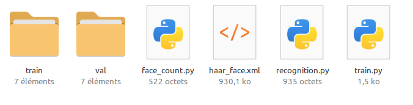

# TP : Apprentissage Supervisé

*TP largement inspiré par les documents disponibles [ici](https://touchardinforeseau.servehttp.com){target="_blank"}, et par la chaine youtube [Machine Learnia](https://www.youtube.com/@MachineLearnia){target = "_blank"}.*

## Avant de commencer

L'objectif du TP est d'apprendre à l'ordinateur à reconnaitre un visage après apprentissage. Nous allons utiliser Python avec le logiciel `Thonny`, et plus spécifiquement certains modules liés à l'IA. Problème : certains de ces modules ne sont pas installés et sont particulièrement lourds à télécharger.

Donc avant de commencer, nous allons installer la totalité de nos besoins :

1. Ouvrir `Thonny`.
2. Dans le menu `Outils`, cliquer sur `Ouvrir la console du système`.
3. Taper la ligne suivante : `pip install opencv-python opencv-contrib-python numpy` dans la console, puis valider en appuyant sur ++return++.
4. Pendant que les modules s'installent, téléchargez l'[archive](Apprentissage_supervise.zip){target='_blank'} contenant les fichiers nécessaires à l'activité.
5. Cliquez droit sur le fichier `Apprentissage_supervise.zip`, puis :
    * dans le menu contextuel, sélectionnez `7-zip` puis `Extraire les fichiers...`
    * dans le champ `Extraire vers`, sélectionnez votre dossier personnel `Documents`, puis cliquez sur `OK`.
    * Attendez que l'archive soit intégralement décompressée. Vous devriez avoir dans votre dossier `Document` un dossier `Apprentissage_supervise` contenant lui-même 4 fichiers et deux dossiers.

## Notions d'apprentissage supervisé

Commençons par regarder cette [vidéo](https://www.youtube.com/watch?v=EUD07IiviJg){target="_blank"}.

L'apprentissage automatique supervisé est donc une branche de l'**apprentissage machine** (*Machine Learning*) dans laquelle, sous la supervision d'une intelligence humaine, la machine va apprendre à résoudre des problèmes de **classification** ou de **régression**, à partir d'un jeu de données *bien construit*.

Par exemple, on, pourrait fournir à l'IA une série de photos de pommes et d'oranges, avec pour chaque photo une étiquette portant le nom `Pomme`ou `Orange`. On entraine l'IA à reconnaitre ces éléments, puis on lui fournit une photo **ne provenant pas du jeu de données d'entrainement**. L'IA, si l'entrainement a été efficace et que la photo n'est pas trop éloignée de celles du jeu de données d'entrainement, devrait alors fournir une l'étiquette correspondante :

{title="https://www.kdnuggets.com/understanding-supervised-learning-theory-and-overview" style="width:30vw;display:block;margin:auto;"}


Nous ne rentrerons pas dans les détails mathématiques de l'entrainement, d'une part parce qu'ils sont trop complexes pour le cours d'enseignement scientifique, et d'autre parce que je les maitrise moi-même très mal.

Cependant, on peut toujours préciser que nous avons tous participé à l'entrainement de nombreuses IA par apprentissage supervisé : chaque [CAPTCHA](https://fr.wikipedia.org/wiki/CAPTCHA#Num%C3%A9risation){target="_blank"} que vous avez dû remplir pour accéder à un service web à pu être utilisé afin de constituer des jeux de données pour l'apprentissage supervisé.

## Application : reconnaissance de visages

### Utilisation de l'archive.

Dans le dossier `Apprentissage_supervise`, vous devriez trouver les fichiers et dossiers suivants :

{style="width:30vw;display:block;margin:auto;"}

* un dossier `train` contenant lui-même 7 sous-dossiers, chacun contenant une douzaine de photos d'une célébrité (réelle ou imaginaire).
* un dossier `train` contenant lui-même 7 sous-dossiers, chacun contenant quelques photos d'une célébrité (réelle ou imaginaire), **différentes de celles du dossier `train`.
* un fichier `haar_face.xml`, contenant des matrices numériques, qui est un **classificateur** au format `xml` indiquant la structure de données à rechercher dans une image, ici, des visages. Ce fichier a été créé à partir de la bibliothèque `OpenCV` (*Open Computer Vision*, initialement créée par Intel). On peut trouver [ici](https://github.com/opencv/opencv/tree/master/data/haarcascades){target="_blank"} d'autres classificateurs. Le classificateur que nous utiliserons travaillera uniquement sur des photos en nuances de gris.
* trois fichiers Python :
    * `face_count.py` est un script permettant de compter le nombre de visages repérés sur une photo ;
    * `train.py` est le fichier permettant d'entrainer l'IA à partir des données du dossier `train` ;
    * `recognition.py` est le fichier auquel on fournit une image du dossier `val` pour que l'IA tente de le classifier.

### Première utilisation

1. Ouvrir le fichier `train.py` dans `Thonny`.
2. En ligne 4, on trouve l'instruction' suivante :

    ``` python
    people = ['ben_afflek', 'elton_john', 'jerry_seinfeld', 'madonna', 'mindy_kaling']
    ```
    Il s'agit des noms de dossiers (et donc des personnes) qu'on va parcourir pour effectuer notre premier entrainement. Cliquez sur la flèche verte, et attendez le message `Saving done`.
    
3. Ouvrez maintenant le fichier `recognition.py`dans `Thonny`.
4. En ligne 10, on trouve l'instruction suivante :

    ``` python
    img = cv.imread(r'val/ben_afflek/2.jpg')
    ``` 
    Il s'agit du chemin relatif vers la photo que nous allons fournir à l'IA pour qu'elle tente une reconnaissance. Exécutez le code en cliquant sur la flèche verte. Vous verrez apparaitre une photo en noir et blanc (celle sur laquelle travaille réellement l'IA), puis la photo en couleur sur laquelle un rectangle vert sera surmonté du nom de l'étiquette que l'IA a associé à la photo. Dans notre exemple, il s'agit d'un succès, avec une confiance de $61%$.

5. Changez la photo en remplaçant en ligne 10 par `'val/ben_afflek/1.jpg'`. L'IA est-elle efficace ?
6. Testez ensuite d'autres photos du dossier `val`.

### Jeu de données alternatif

1. Dans le premier entrainement, nous n'avons pas utilisé les fichiers des dossiers `dark_vador` et `han_solo` situés dans le dossier `train`. Ajoutez-les en ligne 4 du fichier `train.py`.
2. Ré-entrainez l'IA.
3. Essayez de faire reconnaitre les images situées dans les sous-dossiers `val\dark_vador` et `val\han_solo`. Quel est le problème ?

### Création d'un jeu de données

Vous avez maintenant la possibilité de modifier les codes des fichiers `train.py` et `recognition.py` pour entrainer l'IA à reconnaitre d'autres visages. À vous de constituer un nouveau jeu de données, soit à partir de vos propres photos, soit à partir de photos d'une star quelconque que vous téléchargerez directement sur le net.

Vous pouvez utiliser le fichier `face_count.py` pour tester si un visage est bien repéré sur les photos que vous utilisez.
