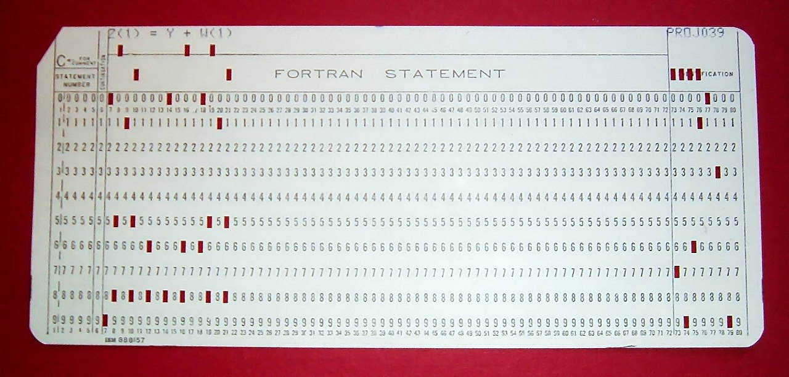
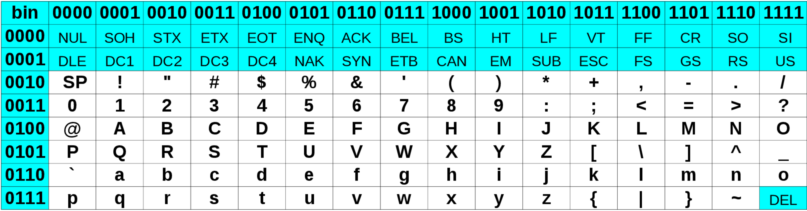

# Stockage et transferts de données

!!! abstract "Science informatique"

    La science informatique est définie comme la **«science du traitement automatisé de l'information»**.

Avant de traiter des informations, encore faut-il les organiser et les stocker de manière efficace. Nous verrons dans ce TP comment sont structurées et stockées des données de tous types.

## Unités d'informations

### La notation binaire pour les entiers

Historiquement, on trouve des utilisations de symboles binaires depuis les antiquités chinoises et indiennes : on trouve des utilisations dans les hexagrammes du *Yi Jing* en Chine (-750), et le mathématicien indien Pingala présente une table représentant les nombres 0 à 7 en binaire (troisième ou deuxième siècle av J.C.). Mais c'est à Leibniz au XVIIIème s., qui montre la compatibilité du système binaire avec les quatre opérations, et surtout au mathématicien George Boole, qui publie en 1847 une algèbre binaire dite depuis {==**booléenne**==}, qu'on doit la théorie liée à l'utilisation de la notation binaire avec uniquement des `0` et des `1`.

!!! abstract "Les chiffres binaires (*binary digits*)"

    Un nombre écrit en binaire est écrit comme une suite de `0` et de `1`, chaque chiffre binaire (en anglais *binary digit*, ou {==**bit**==}), ayant la valeur d'une puissance de 2 selon sa position dans le nombre, tout comme on décompose un nombre selon les puissances de 10 en notation décimale :

    $$
    \begin{align}
    (10~0101)_2 &= 1 \times 2^5 + 0\times 2^4 + 0 \times 2^3 + 1\times 2^2 + 0 \times 2^0 + 1\times 2^0\\
    &=1 \times 32 +0 \times 16 + 0\times 8 + 1 \times 4 + 0\times 2 +1\times 1\\
    &= 32 + 4 + 1\\
    &= 37\\
    \end{align}
    $$

!!! question "Questions I"

    1. Écrire les 10 premiers entiers (de 0 à 9) sous forme binaire.
    2. Déterminer l'écriture décimale de $(10~1010)_2$.
    3. Déterminer l'écriture décimale de $(1111~1111)_2$.
    4. Comment faire pour trouver l'écriture binaire du nombre $164$.

!!! warning "Entiers négatifs et Nombres réels"

    Ici nous avons utilisé le système binaire pour représenter des **entiers naturels**, mais nous n'aborderons pas la représentation des entiers relatifs et des nombres réels.

### Bits

!!! abstract "Bit"

    Le {==**bit**==} est l'unité d'information la plus simple dans un système de numération, ne pouvant prendre que deux valeurs, représentées par les chiffres 0 et 1. Un bit peut aussi bien représenter une alternative logique (*Vrai* et *Faux*), qu'un chiffre binaire, ou qu'une autre information ne pouvant prendre que deux états (par ex. *Ouvert* ou *fermé*).
    
    En théorie de l'information de {: target="_blank"}, le bit est la quantité minimale d'information pouvant être transmise par un message, et constitue à ce titre l'unité de mesure de base de l'information en informatique.

    Un {==**ensemble ordonné de bits**==} permet donc de représenter des informations.

!!! question "Questions II"

    1. Combien d'informations différentes peuvent être représentées par 2 bits ? 4 bits ? 8 bits ? 10 bits ?
    2. Quel est le nombre minimal de bits nécessaire pour représenter l'alphabet latin en majuscule, sans accents et autres signes diacritiques ?
    3. Combien de bits sont nécessaires pour représenter tous les caractères de l'alphabet français, en y incluant les signes de ponctuations et les chiffres ?
    4. De manière générale, un nombre entier naturel $N$ nécessitera $n$ bits, où $n$ est l'entier naturel tel que $2^{n-1}\leqslant N < 2^n$. 
        1. Combien de bits sont nécessaire pour représenter en binaire le nombre $500$ ?
        2. Combien de bits sont nécessaires pour représenter en binaire le nombre $10~000$ ?
        3. Quel est le plus grand nombre représentable avec $24$ bits ?
    5. Il est possible d'utiliser la fonction $ln$ (*logarithme népérien*) pour obtenir le nombre $n$ de bits nécessaires pour représenter un nombre entier naturel donné $N$, par la formule 
    
    $$
    n = E\left(\dfrac{\ln(N)}{\ln(2)}\right) +1
    $$
    où $E$ est la fonction renvoyant la partie entière d'un nombre donné.
        1. Combien de bits sont nécessaires pour représenter $10^6$ ?
        2. Combien de bits sont nécessaires pour représenter $10^9$ ?

!!! abstract "Octets"

    Un {==**octet**==} est un *mot binaire* de 8 bits, et permet de représenter 256 informations différentes. Il est devenu l'unité standard de mémorisation des mémoires informatiques. Son symbole dans le système international est **o**, et ses multiples sont :

    | nom | symbole | valeur | 
    | :--- | :---: | ---: |
    | kilooctet | ko | $10^3$ |
    | mégaoctet | Mo | $10^6$ |
    | gigaoctet | Go | $10^9$ |
    | téraoctet | To | $10^{12}$ |
    | pétaoctet | Po | $10^{15}$ |
    | exaoctet | Eo | $10^{18}$ |

    

## Premiers stockages : les cartes perforées (*punch cards*)

Comme nous l'avons vu dans la partie précédente, les informations numériques peuvent être représentées sous la forme binaire, mais elles ne sont pas les seules. Si une {==**convention**==} est adoptée, il est tout à fait possible de représenter d'autres informations, comme du texte, des images ou autres données.

Un des premiers systèmes de stockage de masse utilisé est la carte perforée. En 1884, Herman Hollerith dépose un brevet pour une machine électromécanique utilisant des cartes perforées, permettant d'accélérer le recensement des états du gouvernement américain. Il lance par la suite une société qui deviendra IBM.

Une carte perforée est un support d'informations exprimées sous la forme binaire : une grille de « cases » est représentée, cases qui peuvent être perforées (1) ou non (0).

Par exemple la carte ci-dessous, modèle standard d'IBM breveté en 1928, possède 80 colonnes et 12 lignes (les lignes numérotées de 0 à 9, plus deux lignes supérieures non numérotées) permettant techniquement d'encoder un mot de 12 bits (mais en pratique seulement 9 bits étaient utilisés, les lignes numérotées 0 à 8, la ligne 9 servant de « bit de contrôle », et les deux lignes supérieures indiquant des opérations spéciales).

{: style="width:95%; margin:auto;display:block;background-color: #d2dce0;"}[^IBM]

[^IBM]: Image Wikipedia, crédit :« Par Arnold Reinhold — I took this picture of an artifact in my possession. The card was created in the late 1960s or early 1970s and has no copyright notice., CC BY-SA 2.5, [https://commons.wikimedia.org/w/index.php?curid=775153](https://commons.wikimedia.org/w/index.php?curid=775153){:target="_blank"} »

Ces cartes étaient stockées par boîtes de 2 000, et le coin tronqué servait de repère pour les insérer dans le bon sens dans un chargeur de cartes ou pour les remettre à l'endroit quand la boîte tombait par terre.

!!! question "Questions III"

    La carte perforée ci-dessus encode l'expression `Z(1) = Y + W(1)`, dans le langage *Fortran*. Il est inutile de comprendre le sens de cette expression pour répondre aux questions suivantes :

    1. Quel est le code utilisé pour la lettre `Z` ?
    2. Quel est le code utilisé pour la lettre `Y` ?
    3. Quel est le code utilisé pour la lettre `W` ?
    4. Quel pourrait alors être le code pour `T`?
    4. Comment sont encodés les espaces ?
    5. Comment sont encodés les parenthèses ouvrantes et fermantes ?

!!! abstract "Standardisation"

    Si au départ chaque constructeur de machines lectrices de cartes perforées utilisait ses propres cartes, il est devenu assez vite clair qu'une standardisation devait être nécessaire. Cette standardisation est entrée en collision avec la standardisation des *bus de données*, c'est-à-dire des tailles des mots acceptés par les processeurs (en anglais *bytes*). Au départ les machines pouvaient accepter des *bytes* de 5, 6, 7, 8 ou même 9 bits, mais le procédé de standardisation a amené a une généralisation de l'octet comme unité de base.

    Sur les cartes perforées IBM, on utilisait alors les lignes numérotées de 0 à 7 pour représenter un octet, le numéro de ligne donnant le poids de chaque bit. Par exemple l'octet `1100 0001` aurait consisté en une colonne trouée en ligne 0, 6 et 7.

!!! abstract "Norme ASCII"

    L'*American Standard Code for Information  Interchange* est une norme d'encodage de caractères, construite d'abord sur 7 bits puis étendue par la suite sur 1 octet.

    {: style="width:95%; margin:auto;display:block;background-color: #d2dce0;"}

    Dans cette table le caractère `A` est représenté par l'octet `0100 0001`.

!!! question "Questions IV"

    1. Combien d'octets sont alors possible sur une carte standard d'IBM ?
    2. Quelle quantité de données, en octet, pouvait être représentée dans un casier de 2000 cartes perforées ?
    3. Une carte mesurant 17/100 de mm d'épaisseur, quelle est l'épaisseur d'un casier ? 
    3. Quelles lignes doivent être perforées pour représenter le caractère `d` ?
    4. Combien de cartes sont nécessaires pour écrire un texte de 1 000 caractères, ce qui revient à une page A4 complète ?
    5. Combien de cartes sont nécessaires pour encoder un programme de 72 ko, correspondant au programme ayant permis l’alunissage d'Apollo 11 ?

!!! info "Les cartes perforées aujourd'hui"

    Si les cartes perforées ne sont plus utilisées aujourd'hui pour stocker des données informatiques, elles ont cependant encore été utilisée il y a un, comme lors de l'élection présidentielle américaine de 2002. Bien qu'elles aient représenté une évolution considérable dans la manière de stocker l'information, les nombreux défauts des cartes et leur sensibilité aux erreurs humaines ont amené à leur abandon progressif au profit de mémoires électroniques plus fiables et permettant de stocker des quantités d'informations de plus en plus importantes.

## Comparaisons de quantités d'informations

### Le texte

!!! abstract "L'Unicode"

    Avec la démocratisation d'internet, de nombreux standard différents sont apparus pour gérer toutes les langues et tous les alphabets. Le problème : la même séquence de bits représentait différents caractères selon les alphabets, les langues, etc.

    La norme Unicode a été développée pour répondre à ce problème, et englober l'intégralité des signes possibles.

    Le code `UTF-8` est l'implémentation de la norme Unicode aujourd'hui la plus utilisée. En unicode, un caractère est codé sur 1, 2, 3 ou 4 octets. «La principale caractéristique d'`UTF-8` est qu'elle est rétro-compatible avec le standard `ASCII`, c'est-à-dire que tout caractère `ASCII` se code en `UTF-8` sous forme d'un unique octet, identique au code `ASCII`. Par exemple « A » (A majuscule) a pour code `ASCII` 65 (0x41) et se code en `UTF-8` par l'octet 65. Chaque caractère dont le point de code est supérieur à 127 (0x7F) (caractère non `ASCII`) se code sur 2 à 4 octets. Le caractère « € » (euro) se code par exemple sur 3 octets : 226, 130, et 172 (0xE2, 0x82 et 0xAC).»[^utf8]

[^utf8]: D'après Wikipedia page [UTF8](https://fr.wikipedia.org/wiki/UTF-8){:target="_blank"}

!!! question "Questions V"

    En supposant que tous les caractères utilisés soient codés sur 1 octet :

    1. Quelle est la taille en ko d'une page de 1 000 caractères ?
    2. Quelle est la taille en Mo d'un livre de 1 000 pages ?
    3. Quelle est la taille de Go d'une bibliothèque de 1000 livres ?
    4. Un volume de l'Encyclopedia Britannica contient 8 millions de caractères. Quelle serait sa taille en octet (sans les images) ?
    5. A votre avis, quelle est la taille de Wikipedia en Anglais, sans les images ?[^wiki]

[^wiki]: voir [ici](https://fr.wikipedia.org/wiki/Mod%C3%A8le:Wikip%C3%A9dia_sur_papier){:target="_blank"}

### Les images

!!! abstract "Codage des images matricielles sans compression"

    Une image est définie par sa taille en pixel, puis par un certain nombre de facteurs :

    * un pixel d'une image en noir et blanc pur (pas de niveau de gris) correspond à 1 bit (0 pour noir, 1 pour blanc) ;
    * un pixel d'une image en nuance de gris correspond à 1 octet (valeurs de 0 (Noir) à 255 (Blanc)) ;
    * un pixel d'une image en couleur RGB utilise trois octets (1 pour la nuance de rouge, un pour la nuance de vert, un pour la nuance de bleu) ;
    * un pixel d'une image en couleur RGBA, c'est-à-dire avec transparence, utilise 4 octets.

!!! question "Questions VI"

    1. Sur la console Vectrex[^vectrex], sortie en 1982, l'écran monochrome noir et blanc offrait une résolution de 360x480 pixels. Quel était la taille en octets d'une image sur cet écran ?
    2. Sur la console NES[^NES], sortie en 1986, la résolution était de 256x240 pixels, mais 52 couleurs étaient possibles, codées sur 1 octet (pour simplifier). Quelle était la taille en octet d'une image ?
    3. Combien de nuances de couleurs sont disponibles pour un appareil utilisant un codage RGB ?
    4. En 2007, le Nokia N95 possède une optique photo en 5 Mégapixels en mode RGB. Quelle était la taille en octets d'une photo ?
    5. La résolution d'un écran d'ordinateur actuel est souvent de 1920x1080 pixels (Full HD). Quel est le poids en octet d'un fond d'écran en mode RGBA ? A combien de livres de la partie précédente cela revient-il ?

[^vectrex]: voir [ici](https://en.wikipedia.org/wiki/Vectrex){:target="_blank"}
[^NES]: voir [ici](https://www.nintendo.fr/Hardware/L-histoire-de-Nintendo/Nintendo-Entertainment-System/Specifications-detaillees/Specificites-techniques-627027.html){:target="_blank"}

### La vidéo

Une vidéo, ce n'est rien de plus que des images qui se succèdent à une certaine cadence, un nombre d'images par seconde, où FPS (*Frame per second*).

!!! question "Questions VII"

    1. Quel est le poids d'une vidéo non-compressée d'une minute en Full HD en mode RGB avec 25 images par secondes ?
    2. Un DVD contient au maximum 8.5 Go en double-couche. Quelle durée de film en Full HD/RGB peut-il supporter théoriquement ?
    3. En 4K, la résolution est de 3840x2160 pixels en RGB. Le film «le Hobbit : La bataille des cinq armées» dure 164 minutes en version longue. Quelle quantité théorique d'information faut-il pour contenir ce film ?
    4. Quelle est la quantité d'octet serait théoriquement nécessaire pour jouer 30 minutes sur un jeu en 60 FPS avec une résolution Full HD ?
    5. J'ai scrollé 1h30 aujourd'hui sur TikTok, en regardant des vidéos FullHD RGB en 25 images par secondes. Combien de livres aurais-je pu télécharger avec la même consommation ?

!!! info "Compression de données"

    Bien entendu tout ceci est théorique, puisque des algorithmes de compression de données sont utilisés en permanence pour ce qui est du texte, des images ou des vidéos.

    Par exemple, le format `png` est en fait issu d'un algorithme de compression de données **sans pertes** (on peut retrouver toutes les informations de l'image originale). Le format `jpg` est un format de compression **avec pertes**, donc donnant un résultat utilisant moins de ressources, mais qui a le défaut de ne pas permettre d’obtenir toutes les  informations de l'image originale.

    Pour ce qui est de la vidéo, l'importance de la compression est phénoménale à l'heure actuelle, et des entreprises mènent une guerre de brevet dans ce domaine (voir l'excellente [vidéo](https://www.youtube.com/watch?v=Kv4FzAdxclA){:target="_blank"} de la chaine `_UNDERSCORE` avec J.B. Kempf de VLC ).
