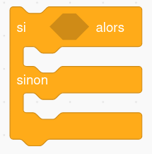

# Structures Conditionnelles

*D'après un notebook de Thomas FOIRIEN.*


## Les conditions

### Première approche

!!! info "Structure conditionnelle de base : `si ... alors ... sinon ..`"

    {: style="width:40%; margin:auto;display:block;background-color: #d2dce0;"}

    Cela correspond au pseudo-code suivant :

    ````
    Bloc d'instructions A
    Si condition vraie faire :
        Bloc d'instructions B
    Sinon
        Bloc d'instructions C
    Bloc d'instructions D
    ````
    En Scratch, ceci correspond au bloc : 
    
    {: style="width:20%; margin:auto;display:block;background-color: #d2dce0;"}


    En Python, les mot-clés sont `if` (si) et `else` (sinon) :

    ```` python 
    A
    if condition :
        B
    else:
        C
    D
    ````

    Avec `condition` qui est une expression évaluée comme un {==**booléen**==} (voir plus loin).

Le programme ci-dessous adapte son comportement à la réponse fournie par l'utilisateur :


```python
age = int(input("Veuillez entrer votre âge ! "))
if (age >= 18):
    print("Vous êtes majeur!")
else:
    print("Vous êtes mineur!")
print("Au revoir!")
```

!!! question "Exercice 1"
    Il faut mesurer au moins 1m30 pour pouvoir entrer dans un parc d'attractions.

    Écrire un programme qui demande à l'utilisateur sa taille en cm, et qui lui indique s'il peut ou non rentrer dans le parc.   

!!! question "Exercice 2"
    Écrire un programme qui demande à l'utilisateur de saisir deux nombres, puis qui affiche **le plus grand** de ces deux nombres.

!!! question "Exercice 3"
    Écrire un programme qui demande à l'utilisateur de saisir un nombre (positif ou négatif), puis qui affiche la **valeur absolue** de ce nombre.


### Les tests

Voici les différents tests possibles pouvant servir à écrire des conditions :

| Symbole en Python | Signification |
| :---: | :--- |
| == | égal à |
| != | différent de |
| < | strictement supérieur à |
| > | strictement inférieur à |
| <= | inférieur ou égal à |
| >= | supérieur ou égal à |


!!! warning "Attention : différence entre `=` et `==`"

    * Le symbole `=` est réservé pour l'*affectation de variables* :

        ```` python 
            >>> a = 5
        ````
        Ici le nom de variable `a` est associé à la valeur 5 (ou autrement dit, le contenu de la variable `a` est le nombre entier `5`).
    
    * Le symbole `==` sert à comparer deux valeurs, plus précisément à savoir si deux valeurs sont égales.

        ```` python 
            >>> a == 5
            True
            >>> a == 'toto'
            False
        ````

        Ici, python regarde si la valeur contenue dans la variable `a` est `5`, et évalue l'expression en `True` si c'est le cas, ou `False` sinon.
    Cette confusion est une importante source de bug chez les débutants en programmation.

!!! question "Exercice 4"
    Écrire un programme qui demande à l'utilisateur de saisir le mot de passe qui permet de se connecter au serveur du Lycée, et qui lui indique si l'accès est autorisé ou pas.
    Le mot de passe est "Pavie".


### Structure conditionnelle incomplète : `si ... alors ...`

La clause `else` est facultative. On obtient alors la structure suivante :

```
    Bloc A
    Si condition vraie faire :
        Bloc B
    Bloc C
```

Ainsi, si la condition est vraie, on effectuera les blocs `A-B-C`.

Si la condition n'est pas vraie, on effectuera les blocs `A-C`

!!! question "Exercice 5" 
    Réécrire le programme qui affiche la plus grande des deux valeurs saisies par l'utilisateur, mais cette fois sans utiliser la clause `else`


## Les booléens


Une variable booléenne ne peut prendre que deux valeurs : `True`et `False`

Par exemple les lignes de code suivantes sont évaluées comme des booléens :

```python
>>> 7 > 4
True
>>> 8 < 2
False
>>> a = 7 > 4 
>>> print(a)
True
>>> print(type(a))
<class 'bool'>
```

Le mot "booléen" provient de [George Boole](https://fr.wikipedia.org/wiki/George_Boole){: target="_blank"} (1815-1864), un mathématicien et logicien anglais qui a créé l'algèbre binaire, aujourd'hui appelée algèbre booléenne. Cette algèbre booléenne permet de traduire des raisonnements logiques par des calculs algébriques.


!!! question "Exercice 6"
    Déterminer pour chaque ligne le type et la valeur de chacune des variables ou expressions ci-dessous.
    On suppose que les lignes sont exécutées l'une après l'autre.

    ```` python
    x = 18
    x > 7
    x == 6
    x > 7
    x = 6
    x > 7
    x == 6
    ````

!!! question "Exercice 7"
    Qu'affiche le code suivant ? 

    ```` python
    b = 5
    a = (b == 3)
    print(a)
    ```` 


Les booléens (ou variables booléennes) sont utilisés dans les conditions. En fait, l'expression qui suit le mot clé `if` doit toujours être une valeur ou une variable de type booléen :


```python
majeur = True    # ou False
if majeur == True:
    print("Vous êtes majeur.")
else:
    print("Vous êtes mineur")
```

!!! info "Syntaxe raccourcie des conditions"
    Dans le programme précédent, `majeur == True` est en fait un booléen qui vaut `True` ou `False` selon la valeur de la variable `majeur`.

    Ainsi, les booléens permettent une syntaxe raccourcie et plus lisible lorsqu'on écrit des conditions. Au lieu d'écrire :

    ```` python
    if majeur == True:
    ````
    on peut écrire : 
    ```` python
    if majeur:
    ````

    Il est préférable d'utiliser cette syntaxe raccourcie, comme dans le code suivant :

    ```python
    majeur = True    # ou False
    if majeur:
        print("Vous êtes majeur.")
    else:
        print("Vous êtes mineur")
    ```

!!! question "Exercice 8"
    Écrire un programme qui :
    
    * Demande à l'utilisateur sa `taille` en cm
    * Crée une variable booléenne appelée `grand` dont la valeur dépend de la taille saisie ;
    * Affiche un message différent selon que l'utilisateur est grand ou pas (plus de 180 cm).
    
## Les conditions multiples

On a parfois besoin de tester plusieurs conditions successivement comme dans l'exemple suivant.

!!! example "Le problème du pass sanitaire"

    On demande à une personne si elle est vaccinée et si elle a un test PCR négatif.
    Si elle est vaccinée, elle peut entrer.
    Sinon, elle ne peut entrer que si elle a un test PCR négatif.


    ```python
    vaccine = input("Etes-vous vacciné (O/N)?") == 'O'
    test_negatif = input("Avez-vous un test PCR négatif (O/N)?") == 'O' 

    if vaccine:
        print("Vous pouvez entrer...")
    else:
        if test_negatif:
            print("Vous pouvez entrer!")
        else:
            print("Vous ne pouvez pas entrer!")
    ```

Le défaut de ce programme est qu'il est **assez difficile à lire**.

En Python, on dispose d'une syntaxe plus légère qui permet de clarifier un peu le programme : on peut condenser le `else if` en une seule ligne `elif`

Le programme ci-dessous fait exactement la même chose que le précédent, mais nécessite une ligne de moins et fait moins appel à l'indentation dans les deux dernières lignes :


```python
vaccine = input("Etes-vous vacciné (O/N)?") == 'O'
test_negatif = input("Avez-vous un test PCR négatif (O/N)?") == 'O' 
          
if vaccine:
    print("Vous pouvez entrer...")
elif test_negatif:
    print("Vous pouvez entrer!")
else:
    print("Vous ne pouvez pas entrer!")
```

!!! question "Exercice 9"
    Écrire un programme qui demande à l'utilisateur sa moyenne du bac et qui lui indique sa mention :

    * $[0;8[$ : Recalé ;
    * $[8;10[$ : Rattrapage ;
    * $[10;12[$ : Passable ;
    * $[12;14[$ : Assez Bien ;
    * $[14;16[$ : Bien ;
    * $[16;18[$ : Très Bien ;
    * $[18;20]$ : Félicitations.

!!! question "Exercice 10"
    Écrire un programme qui demande une année à l'utilisateur et indique s'il s'agit d'une année bissextile : une année est bissextile si elle est multiple de 4 mais pas multiple de 100, ou bien si elle est multiple de 400.

    Tester ensuite votre programme avec les années 2023, 2020, 1900 et 2000.

    *Indice* : Pour savoir si le contenu de la variable `n`est un multiple de `6`, on peut utiliser l'opérateur {==**modulo**==} `%` qui donne le reste de la division euclidienne. Si ce reste est égal à 0, alors le nombre associé à `n`est bien un multiple de `6` Ainsi :

    ``` python
    >>> n = 18
    >>> n%6 #Opération modulo
    0
    >>> n%6 == 0 #n est-elle un multiple de 6 ?
    True
    >>> n%5 == 0 # n est-elle un multiple de 5 ?
    False
    ```
