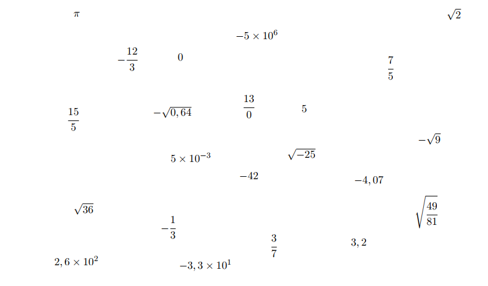
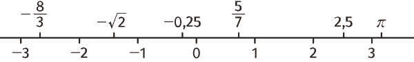
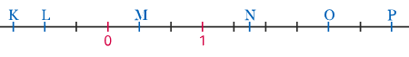

# **C01-01 : Ensembles de Nombres**

*La version pdf de ce cours est téléchargeable [ici](https://fvergniaud-drive.mytoutatice.cloud/public?sharecode=gnHv02IFdLNh). (version 2021-2022)*

## Activité : Classer des nombres

1.  Dans la liste ci-dessus, deux écritures sont interdites. Lesquelles et pourquoi ?

2.  Classer les nombres restants en **cinq groupes**, en justifiant vos choix.

!!! info "Différence entres propriétés et écritures"
	Un nombre peut être écrit de différentes manières, plus ou moins compliquées. Par exemple :
	
	$$
	2 = \cfrac{6}{3} = 20 \times 10^{-1} = \sqrt{4}= - \left(-2\right) = 2,0000 
	$$
	
	Pour autant, ce qui nous intéresse en mathématiques c'est d'étudier les
	**propriétés** de ce nombre, qui elles sont indépendantes de l'écriture
	de ce nombre.

## Nombres entiers naturels et relatifs

!!! tip "Définitions"

	* L'ensemble des {==**entiers naturels**==}, noté $\mathbb{N}$, est l'ensemble des nombres permettant de dénombrer une collection d'objets, de personnes, etc, c'est-à-dire la suite naturelle    $0~;~1~;~2~;~3~;~...$

	* L'ensemble des {==**entiers relatifs**==}, noté $\mathbb{Z}$, est l'ensemble des entiers naturels et **leurs opposés**, c'est-à-dire la suite $...~;~-3~;~-2~;~-1~;~0~;~1~;~2~;~3~;~...$

!!! info
	-   L'ensemble $\mathbb{N}$ possède un plus petit élément, c'est $0$.

	-   Les nombres entiers naturels sont tous {==**positifs ou nuls**==}.

	-   Tous les entiers naturels {==sont aussi des entiers relatifs==}.

!!! tip "Vocabulaire et notations"

	* **Appartenance** :   On dit que $5$ {==**appartient**==} à $\mathbb{N}$, et on note $5 \in \mathbb{N}$. De même $-2$ {==**n'appartient pas**==} à $\mathbb{N}$, et on note  $-12 \notin \mathbb{N}$.

	* **Inclusion** :  Tous les éléments de $\mathbb{N}$ sont aussi des éléments de $\mathbb{Z}$. On dit alors que $\mathbb{N}$ est un {==**sous-ensemble**==} de $\mathbb{Z}$ et on note alors $\mathbb{N} \subset \mathbb{Z}$ (qui se lit $\mathbb{N}$ est inclu dans $\mathbb{Z}$).

??? example "Application : choix du bon symbole"

	=== "Exercice"
	
		Compléter avec $\in$ ou $\notin$  :
		
		$7 \dots \mathbb{N}$

		$-3 \dots \mathbb{N}$

		$-5 \dots \mathbb{Z}$

		$7 \dots \mathbb{Z}$

		$\dfrac{1}{3} \dots \mathbb{N}$

		$\sqrt{9} \dots \mathbb{N}$

		$-\sqrt{25} \dots \mathbb{N}$

		$-\sqrt{2} \dots \mathbb{Z}$

		$5 \times 10^{3} \dots \mathbb{N}$

		$5 \times 10 ^{-3} \dots \mathbb{Z}$

		$-4,2 \dots \mathbb{Z}$

		$3 \times (1 - \dfrac{1}{3}) \dots \mathbb{N}$

	=== "Solution"
	
		Compléter avec $\in$ ou $\notin$  :
		
		$7 \in \mathbb{N}$

		$-3 \notin \mathbb{N}$

		$-5 \in \mathbb{Z}$

		$7 \in \mathbb{Z}$

		$\dfrac{1}{3} \notin \mathbb{N}$

		$\sqrt{9} \in \mathbb{N}$ car $\sqrt{9} = 3$

		$-\sqrt{25} \notin \mathbb{N}$ car $-\sqrt{25} = -5$

		$-\sqrt{2} \notin \mathbb{Z}$ car $-\sqrt{2} \simeq -1,414...$

		$5 \times 10^{3} \in \mathbb{N}$ car $5 \times 10^3 = 5 \times 1000 = 5000$

		$5 \times 10 ^{-3} \notin \mathbb{Z}$ car $5 \times 10 ^{-3}  = 5 \times  0,001 = 0,005$

		$-4,2 \notin \mathbb{Z}$

		$3 \times (1 - \dfrac{1}{3}) \in \mathbb{N}$ car $3 \times (1 - \dfrac{1}{3}) = 3 - 1 = 2$ (en développant) ou $3 \times (1 - \dfrac{1}{3}) = 3 \times \dfrac{2}{3} = 2$ (en calculant entre parenthèses).
	
	
	
## Nombres décimaux

!!! tip "definition : Nombres décimaux"
	Un {==nombre décimal==} est un nombre pouvant s'écrire sous la forme d'une {==fraction décimale==}, c'est à dire sous la forme 
	$$
	\dfrac{a}{10^n}
	$$ 
	avec $a\in \mathbb{Z}$ et $n\in \mathbb{N}$.

	L'ensemble des décimaux est noté $\mathbb{D}$.

??? example "Application  : Nombres décimaux et puissances de 10"
	=== "Exercice"
		Pour chacun des nombres suivants, déterminer si possible une écriture de la forme $\dfrac{k}{10^n}$.

		$4,37$

		$0,002$

		$-12$

		$\dfrac{1}{3}$

		$\dfrac{2}{5}$

		$\sqrt{0,16}$

		$10^3$

		$10^{-5}$

		$-10^5$

		$\dfrac{3.10^5}{10^7}$

		$\dfrac{10^7}{3.10^5}$
	
	=== "Solution"
		Pour chacun des nombres suivants, déterminer si possible une écriture de la forme $\dfrac{k}{10^n}$.

		$4,37 = \dfrac{437}{100} = \dfrac{437}{10^{2}}$

		$0,002 = \dfrac{2}{1~000} = \dfrac{2}{10^{3}}$

		$-12 = \dfrac{-12}{1} = \dfrac{-12}{10^{0}}$ ( car $a^0 =1$ pour tout nombre $a \neq 0$).

		$\dfrac{1}{3} \notin \mathbb{D}$ car $\dfrac{1}{3} \simeq 0,333...$ (La démonstration réelle sera donnée plus tard dans l'année)

		$\dfrac{2}{5} = \dfrac{4}{10} = \dfrac{4}{10^1}$

		$\sqrt{0,16} = 0,4 = \dfrac{4}{10} = \dfrac{4}{10^1}$

		$10^3 = \dfrac{1~000}{1} = \dfrac{1~000}{10^{0}}$

		$10^{-5} = \dfrac{1}{10^5}$ (par définition des exposants négatifs $a^{-n} = \dfrac{1}{a^n}$ pour tout $n \in \mathbb{Z}$ si $a \neq 0$)

		$-10^5 = - 100~000 = \dfrac{- 100~000}{1} = \dfrac{- 100~000}{10^{0}}$$

		$\dfrac{3.10^5}{10^7} = \dfrac{3}{10^2}$ par division des puissances ($\dfrac{a^m}{a^n} = a^{m-n}$ pour tout $m,n \in \Z$)

		$\dfrac{10^7}{3.10^5} = \dfrac{10^2}{3} \simeq 33,333.... \notin \mathbb{D}$  
		

!!! info "Remarques"
	-   Les entiers relatifs sont des décimaux, car si $k \in \mathbb{Z}$, on peut aussi écrire $k=\dfrac{k}{1}=\dfrac{k}{10^0}$. On a donc la  propriété {==$\mathbb{Z} \subset \mathbb{D}$==}.
	-   Un nombre décimal possède une {==**écriture décimale finie**==}.

## Nombres rationnels

!!! tip "Définition : Nombres rationnels"
	{==Un nombre rationnel==} est un nombre pouvant s'écrire sous la forme $\dfrac{a}{b}$ avec $a\in \mathbb{Z}$ et $b\in \mathbb{N}^{*}$ (c'est-à-dire $\mathbb{N}$ privé de $0$).

	L'ensemble des nombres rationnels est noté $\mathbb{Q}$.

!!! info "Remarque"
	Un nombre décimal est par définition un nombre rationnel.
	
	Par définition de $\mathbb{D}$ et $\mathbb{Q}$, on a la propriété {==$\mathbb{D} \subset \mathbb{Q}$==}.

!!! tip "Propriété : Caractérisation des rationnels non décimaux"
	Tous les nombres rationnels ne possèdent pas d'écriture décimale finie. En particulier, $\dfrac{1}{3}$ n'est pas décimal.

??? note "Preuve"
	La démonstration de cette propriété sera faite plus tard dans l'année, dans le chapitre arithmétique.

!!! info "Remarques"
	-   Les nombres rationnels non décimaux possèdent une {==**écriture décimale infinie périodique**==}, c'est-à-dire avec une série de chiffres qui
		se répètent à l'infini. Par exemple $\dfrac{1}{7} = 0,14285714285714...$ (on constate la répétition de la séquence {==142857}).

	-   Réciproquement, si un nombre possède une écriture décimale infinie périodique, alors c'est un rationnel.

!!! abstract "Méthode : Déterminer une fraction égale à une écriture décimale infinie périodique"
	On considère le nombre $a$ dont l'écriture décimale est infinie périodique  $a = 2,71347134...$. Démontrons que ce nombre est rationnel.
	
??? success "Solution"
	On constate que la partie répétitive des chiffres de $a$ est $7134$, donc de taille 4.
	
	Donc $10^4 \times a = 10~000\times a = 27134,71347134...$.
	
	D'où $10~000\times a - a = 27134,71347134... - 2,71347134... = 27134 -2 = 27~132$.
	
	Or $10~000\times a - a = 9~999\times a$.
	
	D'aperès les deux lignes précédentes, on a alors $9~999\times a = 27132$ soit $a = \dfrac{27~132}{9~999} = \dfrac{9~044}{3~333}$.

	Donc $a$ est bien un nombre rationnel puisqu'il s'écrit sous la forme d'une fraction.

??? example "Application : Calculs avec les rationnels"
	=== "Exercice"
		Dans chacun des cas suivants, calculer **à la main** chacune des expressions suivantes :
		
		$A = \dfrac {5}{7} - \dfrac{3}{11}$

		$B = -\dfrac {4}{3} + \dfrac{7}{8}$

		$C = \dfrac {3}{8} - \dfrac{5}{12}$

		$D = \dfrac {-6}{7} \times \dfrac{8}{9}$

		$E = \dfrac {3}{2} \times \left(-\dfrac{7}{3}\right)$

		$F = \dfrac {48}{35} \times \dfrac{25}{64}$

		$G = \dfrac {4}{7} \div \dfrac{8}{21}$

		$H = \dfrac{~~\dfrac{3}{4}~~}{\dfrac{18}{20}}$

		$I = \dfrac{~~7~~}{\dfrac{5}{3}}$

		$J = \dfrac{~~\dfrac{7}{5}~~}{3}$

	=== "Solution"
		$A = \dfrac {5}{7} - \dfrac{3}{11} = \dfrac {5\times 11}{7\times 11} - \dfrac{3\times 7}{11\times 7} = \dfrac {55}{77} - \dfrac{21}{77} = \dfrac{34}{77}$
		
		$B = -\dfrac {4}{3} + \dfrac{7}{8} = -\dfrac {4 \times 8}{3 \times 8} + \dfrac{7 \times 3}{8 \times 3} = -\dfrac {32}{24} + \dfrac{21}{24} -\dfrac {11}{24}$
		
		$C = \dfrac {3}{8} - \dfrac{5}{12} = \dfrac {3\times 3}{8\times 3} - \dfrac{5 \times 2}{12 \times 2} = \dfrac {9}{24} - \dfrac{10}{24}  = - \dfrac{1}{24}$
		
		$D = \dfrac {-6}{7} \times \dfrac{8}{9} = \dfrac{-6 \times 8}{7 \times 9} = \dfrac{-2 \times 3 \times 8}{7 \times 3 \times 3} = -\dfrac{16}{21}$ N'oubliez pas de simplifier ! 
		
		$E = \dfrac {3}{2} \times \left(-\dfrac{7}{3}\right) =  -\dfrac {3 \times 7}{2 \times3} = - \dfrac{7}{2}$
		
		$F = \dfrac {48}{35} \times \dfrac{25}{64} = \dfrac{48 \times 25}{35 \times 64} = \dfrac{2 \times 3 \times 8 \times 5 \times 5}{5\times 7 \times 2 \times 4 \times 8} = \dfrac{15}{28}$
		
		$G = \dfrac {4}{7} \div \dfrac{8}{21} = \dfrac {4}{7} \times \dfrac{21}{8} = \dfrac{4 \times 21}{7 \times 8} = \dfrac{ 4 \times 3 \times 7}{7 \times 2 \times 4} = \dfrac{3}{2}$
		
		$H = \dfrac{~~\dfrac{3}{4}~~}{\dfrac{18}{20}} = \dfrac{3}{4}\div\dfrac{18}{20} = \dfrac{3}{4}\div\dfrac{20}{18} = \dfrac{3 \times 4 \times 5}{ 4 \times 3 \times 6} = \dfrac{5}{6}$.
		
		$I = \dfrac{~~7~~}{\dfrac{5}{3}} = 7 \div \dfrac{5}{3} = 7 \times \dfrac{3}{5} = \dfrac{21}{5}$
		
		$J = \dfrac{~~\dfrac{7}{5}~~}{3} = \dfrac{7}{5} \div 3 = \dfrac{7}{5} \times \dfrac{1}{3} = \dfrac{7}{15}$

## Nombres réels

!!! tip "Définition : Nombres réels"
	Un {==nombre réel==} est un nombre exprimant une longueur, ou l'opposé d'un nombre exprimant une longueur.
	
	L'ensemble des nombres rationnels est noté $\mathbb{R}$.

!!! info "Remarques"
	-   Un nombre réel est un {== nombre dont le carré est positif ou nul ==}.

	-   Par définition, tous les nombres rationnels sont des réels. On a alors {== $\mathbb{Q} \subset \mathbb{R}$ ==}.

	-   Certains nombres réels ne sont pas rationnels. Par exemple $\pi$ n'est pas rationnel, tout comme $\sqrt{2}$ ( on le montrera en     exercice ). Ces nombres sont dits {== **irrationnels** ==}.

!!! tip "Propriété : Ensembles de nombres"
	Des remarques précédentes, on à la propriété :
	
    $$
	\mathbb{N} \subset \mathbb{Z} \subset \mathbb{D} \subset \mathbb{Q} \subset \mathbb{R}
	$$
	
	

	{ width=30% : .imagepng}
	

!!! tip "Propriété : Droite des réels"
	Tout nombre réel est représenté par l'abscisse d'un point sur la droite numérique ( appelée aussi **droite des réels** ).
	
	

	{width=30% : .imagepng}
	

	
??? example "Application : Représenter sur la droite des réels"

	1.  Déterminer l'abscisse de chacun des points de la droite ci-dessous :

    

    {width=50% : .imagepng}
    

	2.  Représenter la droite des réels ( unité : 5 ) et y placer le plus précisément possible les nombres suivants :
	
    $$
	3 ~;~ -0,75 ~;~ \dfrac{5}{4} ~;~\dfrac{-2}{5} ~;~ \dfrac{7}{3} ~;~ \sqrt{2}
	$$

