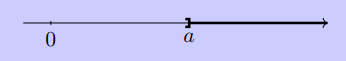

# $C01-02$ Intervalles

## Intervalles de nombres réels

!!! abstract "Définition" 
	Soient $a$ et $b$ deux nombres réels.
	
	* On appelle intervalle fermé $[a;b]$ l’ensemble des nombres réels $x$ tels que $a\leqslant x\leqslant b$.
	

	
	

	* On appelle intervalle ouvert $]a;b[$ l’ensemble des nombres réels $x$ tels que $a<x<b$.
	

	
	

	* On définit de même les intervalles $[a;b[$ et $]a;b]$.
	* On note $[a;+\infty[$ l’ensemble des nombres réels $x$ tels que $x\geqslant a$.
	

	
	

	* On note $]a;+\infty[$ l’ensemble des nombres réels $x$ tels que $x>a$.
	

	
	

	* On définit de même $]- \infty;a]$ et $]-\infty;a[$.

!!! info "Remarques"

	* Le symbole $+\infty$ se lit " Plus l'infini ".
	* Le symbole $-\infty$ se lit " Moins l'infini ".
 
??? question "Représenter des intervalles"

	=== "Enoncé"
		Ecrire les inégalités suivantes sous la forme d'un intervalle, puis représenter cet intervalle sur la droite des réels :

		1. $x\leqslant 5$
		2. $x>-3$
		3. $2<x<5$
		4. $-4\leqslant x \leqslant -3$
		5. $-3\leqslant x < 8$
		6. $-2< x \leqslant 0$
	 
	=== "Solution"
		
		1. $]-\infty ; 5]$		
		2. $]-3 ; +\infty[$
		3. $]2;5[$
		4. $[-4;-3]$
		5. $[-3;8[$
		6. $]-2;0]$
		
??? question "Appartient ou pas ?"

	=== "Enoncé"
		Compléter avec un symbole $\in$ ou $\notin$ :
		
		* $-2 \dots [-2; 1[$
		* $-3 \dots [-5; -1[$
		* $-\dfrac{26}{5} \dots ]-5; -4[$
		* $4 \dots [-3; 4[$  
		* $2\pi \dots [7;8]$
		* $0 \dots \mathbb{R}$
		* $0 \dots \mathbb{R}^*$

	=== "Solution"
		
		* $-2 \in [-2; 1[$
		* $-3 \in [-5; -1[$
		* $-\dfrac{26}{5} \notin ]-5; -4[$
		* $4 \notin [-3; 4[$  
		* $2\pi \notin [7;8]$
		* $0 \in \mathbb{R}$
		* $0 \notin \mathbb{R}^*$
		

??? question "Travailler les représentations"
	
	=== "Enoncé"
		Recopier et compléter :
		

		
		

		
	=== "Solution"
	
		A venir....
 
## Unions et intersections d'intervalles

!!! abstract "Définition"
	Soient $I$ et $J$ deux intervalles.
	
	* L’intersection de $I$ et $J$ est l’ensemble des réels qui appartiennent à la fois à $I$ \textbf{ET} à $J$. On note cet ensemble $I \cap J$.
	* La réunion de $I$ et $J$ est l’ensemble des réels qui appartiennent à $I$ \textbf{OU} à $J$. On note cet ensemble $I \cup J$.

!!! info "Remarques"

	* La notation $\cap$ se lit \og inter \fg. D'où $I \cap J$ se lit \og $I$ inter $J$ \fg.
	* La notation $\cup$ se lit \og union \fg. D'où $I \cup J$ se lit \og $I$ union $J$ \fg.
	* Parfois, il n'y a aucun élément qui appartiennent à la fois à $I$ et $J$. L'intersection est donc \textbf{vide}, et on note $\emptyset$ l'ensemble vide. Dans ce cas $I \cap J = \emptyset$.
	
!!! example "Exemple"
	
	On considère les intervalles $I=[3;7]$ et $J=]2; 5[$.
	

	
	

	* L'ensemble $I\cap J$ est $[3;5[$.
	

	
	

	* L'ensemble $I\cup J$ est $]2;7]$.
	

	
	

	
??? question "Utiliser les notations $\cap$ et $\cup$"

	=== "Enoncé"
		R\'eduire sous la forme d'un seul intervalle si possible et représenter sur la droite des réels :

		* $]-3;7] \cap ]-2;8[$
		* $]-4;3] \cap [-2;3,5[$
		* $[-7;4[ \cup ]-3;5]$
		* $]-3;5] \cup [-1;2]$}
		* $[-6;6]\cup[-2;2]$
		* $]-\infty;2[ \cap ]1;+\infty[$
		* $]-\infty;-1] \cup ]2;6]$
		* $[-5;3] \cap [6;8]$

	=== "Solution"
		* $]-3;7] \cap ]-2;8[ =$
		* $]-4;3] \cap [-2;3,5[$
		* $[-7;4[ \cup ]-3;5]$
		* $]-3;5] \cup [-1;2]$}
		* $[-6;6]\cup[-2;2]$
		* $]-\infty;2[ \cap ]1;+\infty[$
		* $]-\infty;-1] \cup ]2;6]$
		* $[-5;3] \cap [6;8]$

\begin{ExerciceNomme}{Travailler les inéquations et les intervalles}
 Compléter en s'aidant de la méthode donnée dans l'exemple ci-dessous.\\ 
 
 \vspace{0.2cm}
 
 \textbf{Exemple :} on a les équivalences :\\
 \begin{center}
 \begin{tabular}{cccp{1cm}l}
                          $x \in [1;2]$& $\Longleftrightarrow$ &$1 \leqslant x \leqslant 2$&&par définition\\
                          &$\Longleftrightarrow$& $3 \leqslant 3x \leqslant 6$&&en multipliant chaque membre de l'inégalité par $3$\\
                          &$\Longleftrightarrow$&$3x \in [3;6]$&&par définition\\
                         \end{tabular}
                         \end{center}

 d'où : \fbox{$x \in [1;2]$ si et seulement si $3x \in [3;6]$}
 
 \begin{enumerate}
  * $x \in [7;20]$ si et seulement si $7x \in \dots$
  * $x \in ]-1;3]$ si et seulement si $x+4 \in \dots$
  * $x \in [2;6]$ si et seuelemnt si $8-x \in \dots$
  * $x \in \dots $ si et seulement si $x+6 \in ]3 ; +\infty[$
  * $x \in \dots $ si et seulement si $-2x \in [4 ; +\infty[$
  * $x \in \dots $ si et seulement si $4x+3 \in [-6;5]$
 \end{enumerate}

\end{ExerciceNomme}
\begin{ExerciceNomme}{Représenter sous  la forme d'intervalles}
 \begin{enumerate}
  * $y>-3$ et $y<4$
  * $y>-3$ ou $y<4$
  * $y \leqslant \dfrac{1}{3}$ et $y \leqslant \dfrac{1}{2}$
  * $y \leqslant \dfrac{1}{3}$ ou $y \leqslant \dfrac{1}{2}$
 \end{enumerate}

\end{ExerciceNomme}
\begin{ExerciceNomme}{Résolutions d'équations du premier degré}
 \begin{enumerate}
  * Résoudre dans $\mathbb{R}$ chacune des équations suivantes :
  \begin{enumerate}
  \parbox{0.3\linewidth}{
   * $3x -6 =0$
   }\parbox{0.3\linewidth}{
   * $ 3x -4 = 0$
   }\parbox{0.3\linewidth}{
   * $-3x +64 = 19$
   }\\
   \parbox{0.3\linewidth}{
   * $-2(x+5)=-8$
   }\parbox{0.3\linewidth}{
   * $3x -\pi=0$
   }\parbox{0.3\linewidth}{
   * $\dfrac{x-8}{3}=-4$
   }
   
  \end{enumerate}
* Lesquelles de ces 4 équations sont résolubles dans $\Z$ ? Dans $\Q$ ?
  
 \end{enumerate}

\end{ExerciceNomme}
\begin{ExerciceNomme}{Résolutions d'inéquations du premier degré}
 Résoudre les inéquations suivantes et présenter le résultat sous la forme d'un intervalle :
 \begin{enumerate}
  \parbox{0.3\linewidth}{
   * $3x -6 >0$
   }\parbox{0.3\linewidth}{
   * $ 3x -4 \leqslant  0$
   }\parbox{0.3\linewidth}{
   * $-3x +64 < 19$
   }
 \end{enumerate}

\end{ExerciceNomme}

\end{document}
