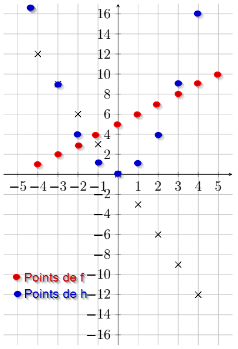
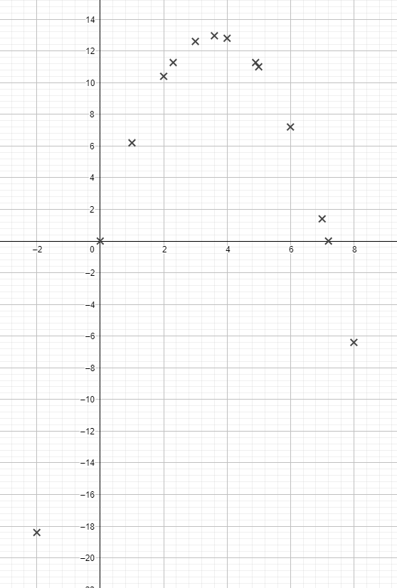

# $C03 - 01$ Vocabulaire et rappels sur les fonctions

## Activité : Fonctions, tableaux de valeurs, enchaînements

Malia trouve une étrange machine dans le tiroir de son grand-père.

{: style="width : 30%;"}
	

Quand elle appuie sur les touches ++4++ et ++f++, la machine affiche $9$.

Quand elle appuie sur les touches ++minus++ ++2++ ++g++, la machine affiche $6$.

Pour exprimer cela plus rapidement, on dira que :

* {==**l'image**==} de $4$ par $f$ est $9$ ;
* {==**un antécédent**==} de $6$ par $g$ est $-2$ ;
* Chacune des touches ++f++ ++g++ ++h++ ++k++ est une fonction.

Elle teste la machine sur plusieurs nombres et note les résultats dans les tableaux suivants :

| Nombre | -4 | -3 | -2 | -1 | 0 | 1 | 2 | 3 | 4 |
| :--- | :-: | :-: | :-: | :-: | :-: | :-: | :-: | :-: | :-: |
| Image par ++f++ | 1 | 2 | 3 | 4 | 5 | 6 | 7 | 8 | 9 |

| Nombre | -4 | -3 | -2 | -1 | 0 | 1 | 2 | 3 | 4 |
| :--- | :-: | :-: | :-: | :-: | :-: | :-: | :-: | :-: | :-: |
| Image par ++g++ | 12 | 9 | 6 | 3 | 0 | -3 | -6 | -9 | -12 |

| Nombre | -4 | -3 | -2 | -1 | 0 | 1 | 2 | 3 | 4 |
| :--- | :-: | :-: | :-: | :-: | :-: | :-: | :-: | :-: | :-: |
| Image par ++h++ | 16 | 9 | 4 | 1 | 0 | 1 | 4 | 9 | 16 |

!!! info "Notation"
	Pour des raisons de commodité, on utilisera les nortations suivantes : $f$ pour ++f++ , $g$ pour ++g++, etc...

!!! question "Question  1"

	=== "Enoncé"
	
		1. Quel est l'image de $3$ par $f$ ? de $2$ par $h$ ?
		2. Quel(s) est(sont) l'(les) antécédent(s) de $-6$ par $g$ ? de $1$ par $h$ ?
		3. Pour quelle(s) fonction(s) $9$ est-il l'image de $-3$ ?
		4. Laquelle de ces fonctions représente une situation de proportionnalité ?

	=== "Solution"
		
		1. L'image de $3$ par $f$ est $8$, autrement dit $f(3)=8$, et l'image de $2$ par $g$ est $-6$, autrement dit $g(2) = -6$.
		2. D'après le tableau, le seul antécédent connu de $-6$ par $g$ est $2$. De même, les seuls antécédents de $1$ par $h$ sont $-1$ et $1$.
		3. Il s'agit des fonctions $g$ et $h$ : $g(-3) = h(-3) =  9$
		4. Ce ne peut pas être la fonction $f$, car l'image de $0$ est $5$, ce qui ne représente pas une situation de proportionnalité. 
			Ensuite en extrayant le sous tableau suivant de la fonction $h$ : 
			
			| 2 | 3 |
			| :-: | :-: |
			| 4 | 9 |
			
			On constate que $2\times 9 \neq 4 \times 3$. Il n'y a pas d'égalité des produits en croix, donc pas de situation de proportionnalité.
			
			Il s'agit donc de la fonction $g$, avec un coefficient de proportionnalité qui est égal à $-3$.

!!! question "Question 2"
	
	=== "Enoncé"
	
		Malia essaie maintenant d'appuyer sur plusieurs touches.
	
		1. Elle essaie la séquence {: style="height: 1.5em";}. Quelle valeur va être affichée par la machine ?
  		2. Quelle est l'image par $h$ de l'image de $-3$ par $f$ ?
  		3. Quel(s) est(sont) l'(les) antécédent(s) par $h$ du(des) antécédent(s) de $-3$ par $g$ ?
  		
	=== "Solution"
	
		1. On cherche **l'image par $g$ de l'image par $f$ de $-2$**. Or $f(-2) = 3$ et $g(3) = -9$. Donc le nombre cherché est $-9$.
		2. $f(-3) = 2$ et $h(2) = 4$, donc le nombre cherché est $4$.
		3. D'apr-s le tableau de $g$, $-3$ ne possède qu'un antécédent, le nombre $1$. Le nombre $1$ lui possède deux antécedents par $h$, les nombres $-1$ et $1$. Les nombres cherchés sont donc $-1$ et $1$.

!!! abstract " Fonctions : définitions, notations et vocabulaire"
 
	* Une {==**fonction**==} est une relation entre deux ensembles de nombres, un ensemble de départ, appelé {==**ensemble de définition**==} et un ensemble d'arrivée.
	
	* Cette relation possède donc un *sens*, chaque nombre de **l’ensemble de définition** possède {==**une et une seule image**==} dans l’ensemble d’arrivée.
	
	* Un nombre de l’ensemble d’arrivée peut posséder (mais ce n’est pas obligé) {==**un ou plusieurs antécédents**==} dans l’ensemble de départ.
	
	* Une fonction peut être nomméee par une lettre ($f$, $g$, $h$, $F$... - attention, comme en Python,  la casse est importante) ou par un nom plus complexe dans des cas particuliers ($sin$, $cos$, $tan$, $ln$,...).
	
	* On représente une fonction $f$ par le schéma suivant :
	
		$$
		f : x \longmapsto y
		$$
	
		où $x$ est un nombre de l'ensemble de définition et $y$ est le nombre qui lui correspond par $f$ dans l'ensemble d'arrivée.
		Cette notation sera lue &laquo; $y$ *est l'image de* $x$ *par la fonction* $f$ &raquo;.
		
		On notera aussi : $y=f(x)$, qui sera lu &laquo; $y$ *est égal à* $f$ *de* $x$ &raquo;

!!! example "Exemples"
	D'après les questions précédentes :

	* $f : 4 \mapsto 9$ ou autrement noté $f(4) = 9$ ;
	* $g : -2 \mapsto 6$ ou autrement noté $g(-2) = 6$ ;
	* $h : 2 \mapsto  4$ ou autrement noté $h(2) = 4$.

!!! question "Question 3"

	=== "Enoncé"
	
		Parmi les propositions ci-dessous, préciser celles qui sont vraies et celles qui sont fausses :
		
		1. $g(4) = -12$
		2. $h(4) = 2$
		3. $3$ est la solution de $h(x) = 9$
		4. $3$ est une solution de $f(x) = 8$
		5. Si $x$ est le nombre de départ, alors $h(x) = \sqrt{x}$
		6. Le programme de calcul suivant pourrait correspondre à $h$ :
		
				Prendre un nombre 
				Le mettre au carré
				Donner le résultat.
		
	=== "Solution"
		
		1. Vrai
		2. Faux $h(4) = 16$
		3. Faux, il n'est pas la seule solution. On sait que au moins $-3$ et $3$ sont solutions de cette équation.
		4. Vrai
		5. Faux car en prenant $4$ comme nombre de départ, on obtient $16$ et non pas $\sqrt{4}=2$.
		6. Vrai
		
!!! question "Question 4"

	=== "Enoncé"
	
		Pour chacune des fonctions $f$, $g$ et $h$ :

		1. Déterminer un programme de calcul pouvant correspondre à la fonction.
		2. Soit $x$ le nombre de départ. Déterminer l'image de $x$ par la fonction. Une telle expression est appelée {==**expression algébrique de la fonction**==}. 
		3. D'après vos réponses précédentes :
			1. Quelle serait l'image prévisible alors pour $10$ par $f$ ?
			2. Quelle serait l'image prévisible alors pour $4,3$ par $g$ ?
			3. Quelle serait l'image prévisible alors pour $\sqrt{5}$ par $h$ ?
			
	=== "Solution"
	
		1. Pour chacune des fonctions
		
		=== " $f$ "
			
				Prendre un nombre
				Lui ajouter 5
				Donner le résultat
		
		=== " $g$ "
				
				Prendre un nombre
				Le multiplier par -3
				Donner le résultat
				
		=== " $h$ "
			
				Prendre un nombre
				Le mettre au carré
				Donner le résultat
				
		2. $f(x) = x+5$
			
			$g(x) = -3x$
			
			$h(x) = x^2$
		3. D'après la question précédente :
			1. $f(10) = 10 + 5 = 15$
			2. $g(4,3) = -3 \times 4,3 = -12,9$
			3. $h(\sqrt{5}) = (\sqrt{5})^2 = 5$
			
		
!!! question "Question 5"

	=== "Enoncé"
		Malia veut maintenant représenter graphiquement les trois fonctions $f$, $g$ et $h$. Pour cela elle construit le repère suivant, où l'axe des abscisse représente l'ensemble de départ et l'axe des ordonnées représente l'ensemble d'arrivée.
		
		{: style="width:15vw;"}
		
		1. Elle n'a complété le graphique que pour une seule des fonctions. Laquelle ?
		2. Compléter de même pour les deux autres.

	=== "Solution"
	
		1. Les points représentés sont alignés avec l'origine, il s'agit d'une situation de proportionnalité, donc de la fonction $g$.
		2. {: style="width:15vw;"}
		
		
!!! question "Question 6"
	La touche ++k++  de sa machine ne semble pas fonctionner.
	
	Étant une experte de la recherche sur le web, elle parvient à trouver un manuel d'utilisation de la machine. Dans celui-ci, elle trouve la courbe ci-contre représentant la fonction $k$.
	
	{: style="width:15vw;"}
	
	=== "Enoncé"
	
		1. Quelle est l'image de $1$ par $k$ ? de $3$ par $k$ ?
		2. Compléter un tableau de valeur de la fonction $k$ pour les nombres entiers allant de $-4$ à $4$.
		3. Proposer une  expression algébrique représentant $k$ sur $[-4 ;4]$.
		4. Résoudre graphiquement $k(x) = 0$.
		5. Résoudre algébriquement $k(x) = 0$.
		6. Résoudre graphiquement $k(x) \leqslant 8$.
		7. Résoudre algébriquement $k(x) \leqslant 8$.
		
	=== "Solution"
	
		1. $k(1) = 2$ et $k(3) = 8$
		2. Le tableau :
		
			| Nombre | -4 | -3 | -2 | -1 | 0 | 1 | 2 | 3 | 4 |
			| :--- | :-: | :-: | :-: | :-: | :-: | :-: | :-: | :-: | :-: |
			| Image par $k$ | -13 | -10 | -7 | -4 | -1 | 2 | 5 | 8 | 11 |
		3. $$
			f : x \mapsto 3x-1
			$$
		4.	Résoudre graphiquement $k(x) = 0$, c'est trouver l'abscisse des points d'intersections de la courbe représentative de $k$ avec l'axe des abscisses
				
			Ici on trouve graphiquement $\mathscr{S} = \left\lbrace \simeq 0,3 \right\rbrace$.
		5. $$
			\begin{array}{rcl}
			k(x) &=& 0\\
			3x-1 &=& 0\\
			3x &=& 1\\
			x &=& \dfrac{1}{3}
			\end{array}
			$$
			
			D'où $\mathscr{S} = \left\lbrace \dfrac{1}{3} \right\rbrace$
		6.	Résoudre graphiquement $k(x) \leqslant 8$, c'est trouver les intervalles de l'abscisses sur lesquels la courbe représentative de la fonction $k$ possède des ordonnées inférieures ou égales à 8.
			
			{: style="width : 15vw;";}
			
			Ici on trouve graphiquement $\mathscr{S} = ] -\infty ; 3]$
		7. $$
			\begin{array}{rcl}
			k(x) &\leqslant& 8\\
			3x-1 &\leqslant& 8\\
			3x &\leqslant& 9\\
			x &\leqslant& 3
			\end{array}
			$$
			
			D'où $\mathscr{S} = ] -\infty ; 3]$
			

!!! abstract "Représentations d'une fonction"
	Une fonction peut-être **représentée** de différentes manières :
	
	* **par une expression algébrique :** on connaît *explicitement* les opérations nécessaires pour calculer une image. Déterminer un antécédent se fait alors en **résolvant une équation**.
	* **par un tableau de valeurs :** la connaissance de la fonction n'est que *parcellaire*. Il est impossible de connaître les images en dehors de celles données dans le tableau.
	* **par une représentation graphique :** la courbe représentative d'une fonction $f$  est la courbe d'équation $y=f(x)$, c'est-à-dire l'ensemble des points du plan dont les coordonnées $(x~;~y)$ vérifient $y=f(x)$.
	
		Une représentation graphique n'est qu'une vision *partielle* d'une fonction, et ne permet de donner que des **valeurs approchées** ou des **estimations** des images et antécédents par cette fonction.
	
!!! info "Remarques"

	* Un graphique représentant une fonction se trace au crayon à papier ou au criterium, pas au stylo !
	* Il faut toujours réfléchir avant de tracer ! Quelle sera mon échelle ? Comment placer mes axes pour avoir tous mes points ?
	* On ne trace que ce dont on est sûr et certain !
	
		En effet, un tableau de valeur ne permet pas de connaître l'allure réeelle de la courbe. Différentes courbes peuvent passer par les mêmes points, comme sur les trois exemples ci-dessous 
	
		=== "Courbe 1"
			
			{: style="width:15vw;background-color : white;" }
			
		=== "Courbe 2"
			
			{: style="width:15vw;background-color : white;"}
			
		=== "Courbe 3"
			
			{: style="width:15vw;background-color : white;"}
 

!!! question "Question 7 : Enchaînement de fonctions"
	*On admet dans cette question que les fonctions $f$, $g$, $h$ et $k$ admettent bien comme expression algébrique les expressions données dans les questions précédentes.*
		
	=== "Enoncé"
		
		1. Malia souhaite connaître la fonction qui est créé par l'appui sur ++f++ puis sur ++h++. Elle appelle cette fonction $u$.
			1. Compléter un tableau de valeur de $u$ pour les nombres entiers allant de $-4$ à $4$.
			2. Donner une expression algébrique de cette fonction.

		2. Elle souhaite faire de même, mais en changeant l'ordre des touches, donc en appuyant d'abord sur ++h++ puis sur ++f++. Elle appelle cette fonction $v$.
			1. Compléter un tableau de valeur de $v$ pour les nombres entiers allant de $-4$ à $4$.
			2. Donner une expression algébrique de cette fonction.

		3. L'ordre d'appui sur les touches (c'est-à-dire l'ordre d'enchainement des fonctions ) est-il important ?
		4. *Questions pour ceux qui ont terminé en avance :*
		
			La fonction $u$ est définie par  $u(x)= h\left(f\left(x\right)\right)$, et la fonction $v$ par $v(x)= f\left(h\left(x\right)\right)$. En utilisant la même notation, Déterminer les expressions algébriques des fonctions suivantes :

			* $m_1(x) = g\left(f\left(x\right)\right)$
			* $m_2(x) = f\left(g\left(x\right)\right)$
			* $m_3(x)= h\left(g\left(x\right)\right)$
			* $m_4(x) = g\left(h\left(x\right)\right)$
			* $m_5(x) = h\left(f\left(g\left(x\right)\right)\right)$
			* $m_6(x) = h\left(g\left(f\left(x\right)\right)\right)$
			* $m_7(x) = f\left(g\left(h\left(x\right)\right)\right)$
			* $m_{8}(x) = f\left(h\left(g\left(x\right)\right)\right)$

	=== "Solution"
	
		1. Fonction $u$ :
			1. Le tableau
				
				| Nombre | -4 | -3 | -2 | -1 | 0 | 1 | 2 | 3 | 4 |
				| :--- | :-: | :-: | :-: | :-: | :-: | :-: | :-: | :-: | :-: |
				| Image par $u$ | 1 | 4 | 9 | 16 | 25 | 36 | 49 | 64 | 81 |
				
			2. $u(x) = (x+5)^2$
		2. Fonction $v$ :
			1. Le tableau
				
				| Nombre | -4 | -3 | -2 | -1 | 0 | 1 | 2 | 3 | 4 |
				| :--- | :-: | :-: | :-: | :-: | :-: | :-: | :-: | :-: | :-: |
				| Image par $u$ | 21 | 14 | 9 | 6 | 5 | 6 | 9 | 14 | 21 |
				
			2. $v(x) = x^2 + 5$
		3. Oui l'ordre d'appui est important.
		4. Sans explications :
			
			* $m_1(x) = -3(x+5) = -3x-15$
			* $m_2(x) = -3x+5$
			* $m_3(x) = (-3x)^2 = 9x^2$
			* $m_4(x) = -3x^2 $
			* $m_5(x) = (-3x+5)^2 = 9x^2 - 30x +25$
			* $m_6(x) = (-3x-15)^2 = 9x^2 + 90x +225$
			* $m_7(x) = -3x^2 +5$
			* $m_8(x) = (-3x)^2 +5 = 9x^2 + 5$
			
			
			
## Activite : Du programme de calcul à la fonction}
On considère l'algorithme suivant :
  
	Prendre un nombre réel.
	Le multiplier par -1.
	Ajouter 7,2 au résultat.
	Multiplier le dernier résultat par le nombre de départ et donner le résultat final.

!!! question "Question 1"
	Ce programme peut-être représenté par le schéma suivant, que vous complèterez par des opérations sur les flèches si possible.
	
	=== "Enoncé"

		{: style="width:30vw;"}
		
	=== "Solution"
		
		{: style="width:30vw;"}
	

!!! question "Question 2"
	
	=== "Enoncé"

		Ce programme correspond-il à la définition de fonction donnée plus haut ? Justifiez.
		
	=== "Solution"
		
		A un nombre de la case de départ, correspond bien un et un seul nombre dans la case d'arrivée. Donc oui ce schéma correspond à la définition d'une fonction.

 
On notera ce programme de calcul $f$ a partir de maintenant.

!!! question "Question 3 : **Etude par un tableau de valeur**"

	=== "Enoncé"
	
		1. Appliquer le programme de calcul sur tous les nombres entiers compris entre $−2$ et $8$, puir ecopier et compléter le tableau ci-dessous :
		
			| $x$ | $-2$ | $-1$  | $0$  | $1$  | $2$  | $3$  | $4$  | $5$  | $6$  | $7$  | $8$ |
			| :-: | :-: | :-: | :-: | :-: | :-: | :-: | :-: | :-: | :-: | :-: | :-: |
			| $f(x)$ |  |  |  |  |  |  |  |  |  |  |  |
			
		2.  Cette fonction traduit-elle une situation de proportionnalité ?
		3. Quelle est l'image de $2$ ? De $5$ ?
		4. Donner un antécédent de $12,8$.
		
	=== "Solution"
	
		1. Le tableau  :
		
			| $x$ | $-2$ | $-1$  | $0$  | $1$  | $2$  | $3$  | $4$  | $5$  | $6$  | $7$  | $8$ |
			| :-: | :-: | :-: | :-: | :-: | :-: | :-: | :-: | :-: | :-: | :-: | :-: |
			| $f(x)$ | -18,4 | -8,2 | 0 | 6,2 | 10,4 | 12,6 | 12,8 | 11 | 7,2 | 1,4  | -6,4 |
			
		2. Non car il n'y a pas égalité des produits en croix, par exemple avec :
		
			| $4$  | $5$ |
			| :-: | :-: |
			| 12,8 | 11 | 
			
			$4 \times 11 \neq 12,8 \times 5$.
			
		3. L'image de $2$ est $10,4$, et $f(5) = 11$.
		4. Un antécedéent de $12,8$ est $4$.

!!! question "Question 4 : **A l'aide du schéma**"

	=== "Enoncé"
	
		1. Calculer les images de $2,3$ et $4,9$. Quelle remarque peut-on faire ?
		2. Déterminer les antécédents de $0$.
		3. Soit $x$ le nombre de départ. Déterminer en fonction de $x$ le nombre final obtenu. L'expression obtenue est  {==**une expression algébrique**==} de $f$.
		
	=== "Solution"
		
		1. $f(2,3) = 2,3 \times (7,2 - 2,3) = 2,3 \times 4,9 = 11,27$ et $f(4,9) = 4,9 \times (7,2 - 4,9) = 4,9 \times 2,3 = 11,27$ . 
		
			Les deux nombres $2,3$ et $4,9$ ont la même image. Ils sont des antécédents de $11,27$.
		2. On sait déjà que $0$ est un antécédent de $0$. Mais il est aussi possible d'avoir un antécédent de $0$ si l'avant dernière case du schéma dans le chemin du bas vaut $0$ :
		
			{: style="width:30vw;"}
			
			On en conclut que $0$ possède exactement deux antécédents : $0$ et $7,2$.
		
		3. $$
			f : x \mapsto x(7,2-x)
			$$
		
!!! question "Question 5 : **Différentes expressions algébriques**"

	=== "Enoncé"
	
		On considère les expressions $A= x (7,2-x)$ et $B=12,96 - (x - 3,6)^2$

		1. Démontrer que $A$ et $B$ sont égales quel que soit le nombre réel $x$.
		2. Soit $C= (x-3,6)^2$
			1. Quelles est la plus petite valeur possible pour $C$ et pour quelle(s) valeur(s) de $x$ est-elle atteinte ?
			2. En déduire la plus grande valeur pour le nombre $B$.
			3. Quelle est la plus grande valeur possible pour le nombre $A$ ?\\
				Pour quelle(s) valeur(s) de $x$ obtient-on cette plus grande valeur de $A$ ?\\
				Conclure pour la fonction $f$.
				
	=== "Solution"
	
		1. Pour tout $x \in \mathbb{R}$, on développe $A$ et $B$ :
		
			$$
			\begin{array}{rcl}
			A &=& x (7,2-x)\\
			A &=& 7,2x -x^2
			\end{array}
			$$
		
			$$
			\begin{array}{rcl}
			B &=& 12,96 - (x - 3,6)^2\\
			 &=& 12,96 - (x^2 - 7,2x +12,96) \\
			 &=& 12,96 - x^2 + 7,2x -12,96 \\
			B  &=& - x^2 + 7,2x
			\end{array}
			$$
			
			On en conlut que pour tout $x \in \mathbb{R}$, on a $A = B$
		2. $C= (x-3,6)^2$
			1. $C$ est un carré donc il est positif ou nul. Donc la plus petite valeur possible pour $C$ est $0$, et on a :
			
				$$
				C=0 \Longleftrightarrow (x-3,6)^2 = 0 \Longleftrightarrow x-3,6 = 0 \Longleftrightarrow x = 3,6
				$$
		
				La plus petite valeur possible pour $C$ est donc $0$ atteinte pour $x=3,6$.
			2. On a :
			
				$$
				\begin{array}{rcl}
				C &\geqslant & 0\\
				-C &\leqslant & 0\\
				12,96 - C&\leqslant & 12,96\\
				B &\leqslant & 12,96\\
				\end{array}
				$$
					
				La plus grande valeur possible pour $B$ est donc $12,96$ et elle est atteinte quand $C$ est égal à $0$, c'est-à-dire quand $x$ vaut $3,6$.
			3. Comme $A =B$ pour tout $x$ réel, on en conclut que la plus grande valeur possible pour $A$ est aussi $12,96$ atteinte pour $x$ valant $3,6$.
			
				On dira que $f$ {==**atteint pour maximum $12,96$ en $3,6$**==}.
				

!!! question "Question 6 : **Tracé du graphe**"
		
		
		=== "Enoncé"
			Dans un plan muni d’un repère orthonormé (axes perpendiculaires et même unité sur chaque
			axe), on place les points d’abscisses $x$ et d’ordonnées $f(x)$.
			
			Placer tous les points possibles.
		
		=== "Solution"
		
			{: style="width:20vw;"}