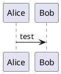
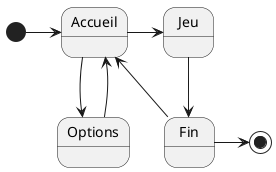
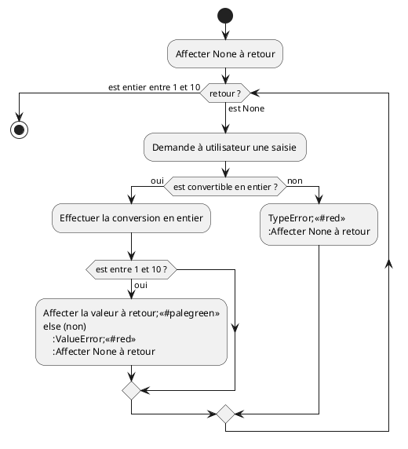

# Test de l'extension PlantUML sur vscodium


1. Installation de `PlantUML` depuis les extensions.
2. Installation de `mkdocs_puml` pour intégration dans du markdown


## Exemple de base

```code 
@startuml
Alice -> Bob: test
@enduml
```




### Diagrammes d'état

```
@startuml
[*] -right-> Accueil
Accueil -down-> Options
Options -up-> Accueil
Accueil -right-> Jeu
Jeu -right-> Fin
Fin --> Accueil
Fin -right-> [*]
@enduml
```



## Diagramme d'activité

```
@startuml
start
:Affecter None à retour;
while (retour ?)  is (est None)
    :Demande à utilisateur une saisie ;
    if (est convertible en entier ?) then (oui)
        :Effectuer la conversion en entier;
        if (est entre 1 et 10 ?) then (oui)
            :Affecter la valeur à retour;<<#palegreen>>
        else (non)
            :ValueError;<<#red>>
            :Affecter None à retour;
        endif    
    else (non)
        :TypeError;<<#red>>
        :Affecter None à retour;
    endif
endwhile (est entier entre 1 et 10)
stop
@enduml
```




Test pour Tour