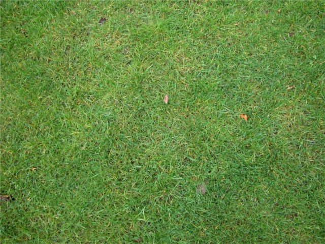

# Bases de Pygame

Ce cours est très largement et assez honteusement copié sur [celui-ci](http://sdz.tdct.org/sdz/interface-graphique-pygame-pour-python.html#Lesinterfacesgraphiques). Merci à vous ! En cas de soucis de droits, n'hésitez pas à me contacter par le lien  situé en bas de page !

## Importer Pygame et ses constantes

`Pygame` est une bibliothèque, et en tant que telle, elle est construite à partir de plusieurs modules. Les noms de ces modules sont :

* display
* mixer
* draw
* event
* image
* mouse
* time

Il existe alors plusieurs possibilités pour importe `pygame` 

1. **Importation complète** :

		import pygame
    
	La totalité de la bibliothèque est alors importée, et pour utiliser la fonction `update` du module `display` on devra alors utiliser `pygame.display.update()`.

2. **Importation partielle des modules nécessaires** :

		from pygame import display
    
	Seul le module display est alors importé, et pour utiliser la fonction `update` de ce module, on devra alors utiliser `display.update()`. 

3. **Importation complète avec import des constantes directement dans l'espace de nommage (conseillée)** :
  
		import pygame
		from pygame.locals import *
    
	Dans ce cas, pour utiliser la constante représentant la touche espace, au lieu d'utiliser `pygame.locals.K_SPACE`, on utilisera simplement `K_SPACE`.
## Création d'une fenêtre graphique et boucle d'évènements

!!! abstract "Le projet"
	Commençons un petit programme qui nous amènera à déplacer un personnage de gauche à droite sur un fond d'écran, pendant que des balles tombent depuis le haut de l'écran à différentes vitesses. Le jeu consistera à éviter que le personnage entre en collision avec les balles, et s'arrêtera dès qu'une collision aura lieu.

Le premier point est d'afficher une fenêtre graphique d'une dimension donnée : $640 \times 480~ pixels^2$ (oui, en bon prof de maths, je respecte à minima les unités...).

On utilise le script suivant, dans un fichier nommé `dodgeTheBall.py` :
``` python linenums="1"

import pygame
from pygame.locals import *

pygame.init()

fenetre = pygame.display.set_mode((640, 480))
```

!!! abstract "Analysons le code"

	* Dans les deux premières lignes, nous importons `pygame` en totalité ainsi que les constantes spécifiques dans l'espace de nommage courant.
	* En ligne 4, nous initialisons tous les modules de `pygame`.
	* En ligne 6, nous appelons ensuite la fonction `set_mode()` contenue dans le module `display` de `pygame`, qui prend en argument un **tuple** contenant la **largeur et la hauteur de la fenêtre voulue** (attention, c'est bien un tuple ! `pygame.display.set_mode(640, 480)` ne fonctionne pas !).
	
??? bug "Y'a un bug !"

	La fenêtre reste bloquée  et ne se ferme pas sauf si on force l'arrêt du script !
 
	Effectivement, on se retrouve bloqué... Il faut rajouter à notre code une instruction supplémentaire pour que la fenëtre se ferme :
	``` python linenums="1"

	import pygame
	from pygame.locals import *

	pygame.init()

	fenetre = pygame.display.set_mode((640, 480))

	pygame.quit()
	```

??? bug "Encore un"
		
	Et oui ! Notre fenêtre s'ouvre mais se ferme immédiatement !
	
	Or nous aimerions qu'elle ne se ferme que sur demande explicite de l'utilisateur, par exemple par un clic sur la croix.
	
C'est là qu'intervient la notion de **boucle d'évènements**. 

Dans un programme classique, en *programmation impérative*, le programme se déroule plus ou moins linéairement de la première ligne à la dernière. Mais lorsqu'on utilise des **interfaces graphiques**, on ne peut prévoir à l'avance le comportement de l'utilisateur, et donc suivre un chemin clairement défini à l'avance. C'est pour cette raison qu'on utilise plutôt le paradigme de la **programmation événementielle**, c'est-à-dire un  paradigme où on prévoira l'action de l'utilisateur, mais pas dans un ordre précis. Chaque action prévue dans la **boucle d'évènements** aura un impact précis.

Dans notre cas, nous souhaiterions que la fenêtre reste ouverte **tant que l'utilisateur** n'a pas exprimé le désir de la fermer, soit par l'intermédiaire de la croix, soit par l'intermédiaire de la combinaison de touches ++alt+f4++.

!!! info "Notion d'évènements"

	Dans la construction d'interfaces graphiques, on utilise souvent la notion d'*évènements*. Un évènement correspond à :
	
	* un déplacement de la souris ;
	* le survol d'une zone spécifique de l'écran par le pointeur de la souris ;
	* un appui sur une ou plusieurs touches du clavier :
	* le relâchement d'une touche de clavier ;
	* un appui ou relâchement d'un bouton de la souris ;
	* un événement spécifique prévu dans le programme ;
	* un changement de luminosité devant un capteur vidéo ;
	* ...
	
	Ces évènements sont stockés à leur apparition dans une **file**(fifo) de **dimension limitée**, nettoyée régulièrement de ses évènements les plus anciens. 
	

Dans `pygame`, les évènements sont des constantes, et celui qui nous intéresse est l'évènement `QUIT`. Nous allons donc parcourir la liste des évènements pour ensuite pouvoir quitter la fenêtre si celui-ci est exprimé :
``` python linenums="1"

import pygame
from pygame.locals import *

pygame.init()

fenetre = pygame.display.set_mode((640, 480))

for event in pygame.event.get() :
	if event == QUIT :
		pygame.quit()
```

??? bug "L'arnaque : ça ne marche pas !"

	On retombe sur notre problème précédent : la fenêtre ne se ferme plus...
	
	C'est parce que la **file** d'évènements se construit et se nettoie très rapidement ! Nous n'avons pas le temps de cliquer sur la croix que déjà le parcours par la boucle `for` est terminé ! Et donc dans ce cas **on ne passe jamais par l'instruction `pygame.quit()`.**
	
	Il va donc falloir répéter la lecture d'évènements pour pouvoir détecter quand l'utilisateur souhaite fermer sa fenêtre.
	

!!! info "Boucle d'évènements"

	Une boucle d'évènements est une boucle qui se répète tant qu'un évènement précis ne s'est pas produit. A chaque tour de boucle on va lire la totalité des évènements enregistrés dans la file, et on déclenchera la sortie de cette boucle si l'évènement est trouvé.
	<p align="center">
	{width = 10%}
	</p>
	
Pour notre exemple, nous allons créer une boucle `while` dépendant d'une variable `continuer` initialisée à `True`, que nous basculerons à `False` lorsque l'évènement `QUIT` est intercepté :


??? done "Un code fonctionnel"

	``` python linenums="1"
	import pygame
	from pygame.locals import *

	pygame.init()

	fenetre = pygame.display.set_mode((640, 480))

	continuer = True
	while continuer :
		for event in pygame.event.get():
			if event.type == QUIT:
				continuer = False

	pygame.quit()
	```

	Enfin ! Notre fenêtre fonctionne !


## Ajout d'image de Fond

!!! abstract "Image de fond"
	Notre fond noir est un peu déprimant. Mettons un peu de verdure grâce à l'image suivante :
	<p align="center">
	{width = "10%";}
	</p>
	Téléchargez cette image sous le nom `background.jpg` puis ajoutez la ligne suivante en ligne 7 :
	
	``` python linenums="7"
	fond = pygame.image.load("background.jpg").convert()
	```
Bon : mauvaise nouvelle, **ce ne sera pas suffisant !**
	
La variable `fond` n'est qu'une référence à une `Surface` de `pygame`, retournée par la fonction `load()`. Une `Surface` est une classe d'objets définie dans `pygame` qui possède de nombreux attributs et méthodes (cf. [la doc](https://www.pygame.org/docs/ref/surface.html) ). La **méthode** `convert()` des objets `Surface` sert à convertir l'image source au format utilisé par `pygame`.

Le principe d'affichage de la **SDL** (la sous-couche logicielle gérant les images, le son, etc...) est à connaître pour bien afficher ses images : 
`fenetre` est une surface vide, sur laquelle on va "coller", ou "empiler" les autres images. **Le fond doit donc être empilé sur la surface vide de la fenêtre**, grâce à la méthode `blit()`. Cette méthode prend une `Surface` en argument ainsi qu'un *tuple* représentant les **coordonnées du coin supérieur gauche** auquel sera collé la `Surface` argument par rapport à la `Surface` appelante.

!!! info "Système de coordonnées"
	On peut donner comme exemples de *tuple* de coordonnées ceux de l'image suivante :
	<p align="center">
	{width = "10%";}
	</p>

On pourrait donc utiliser le code suivant :


``` python linenums="1"
import pygame
from pygame.locals import *

pygame.init()

fenetre = pygame.display.set_mode((640, 480))
fond = pygame.image.load("background.jpg").convert()

continuer = True
while continuer :
    for event in pygame.event.get():
        if event.type == QUIT:
            continuer = False

pygame.quit()
``` 

??? bug "Mais pourquoi ça n'affiche rien !"
	
	Parce que quand on `blit` une `Surface`, `pygame` calcule ce qu'il faut mais ne l'exécute pas réellement. Il faut forcer le rafraichissement de l'écran pour y parvenir, par l'intermédiare de la commande `pygame.display.update()`. 
	
	Comme nous comptons bien faire bouger un personnage sur l'écran, et que les mouvements de celui-ci dépendront de la boucle d'évènements, autant mettre immédiatement cette commande en fin de boucle, pour que l'image soit systématiquement mise à jour. :
	
	``` python linenums="1"
	
	import pygame
	from pygame.locals import *

	pygame.init()

	fenetre = pygame.display.set_mode((640, 480))
	fond = pygame.image.load("background.jpg").convert()
	fenetre.blit(fond,(0,0))
	continuer = True
	while continuer :
		for event in pygame.event.get():
			if event.type == QUIT:
				continuer = False
		pygame.display.update()
	pygame.quit()
	``` 
	Et voilà ! 15 lignes de code, et nous voilà avec une fenêtre graphique digne de ce nom !


## Ajout du sprite du joueur

!!! abstract "Les sprites"

	=== "Explications"
		Ajoutons maintenant une nouvelle image, celle représentant le personnage du joueur.
		<p align="center">
		{width : 10%;}
		</p>
		Cette image est de dimension $ 100 \times 100$, et nous voudrions la placer 
		tout en bas  de l'écran, au centre. Les coordonnées de son
		coin supérieur gauche seront donc $(\dfrac{640 - 100}{2} ; 480 - 100)$.

		Pour cela, on ajoute hors de la boucle la commande suivante `perso = pygame.image.load("perso.png").convert()`,
		 suivie de la commande `fenetre.blit(perso,(270,380))` (mais après avoir collé le fond).
	=== "Code complet"
		``` python linenums="1"

		import pygame
		from pygame.locals import *

		pygame.init()

		fenetre = pygame.display.set_mode((640, 480))
		fond = pygame.image.load("background.jpg").convert()
		perso = pygame.image.load("Perso.png").convert()
		fenetre.blit(fond,(0,0))
		fenetre.blit(perso, (270,380))
		continuer = True
		while continuer :
			for event in pygame.event.get():
				if event.type == QUIT:
					continuer = False
			
			pygame.display.update()
		pygame.quit()
		``` 

!!! info "Transparence et canal alpha"
	
	=== "Canal Alpha"
		Le résultat est peu probant. En effet nous voyons  un cadre noir autour 
		sprite du  personnage. Il va donc falloir ajouter de la **transparence** 
		à cette image.
		
		Cette possibilité est offerte par le format `png`, qui possède un format
		de couleur basé sur la système `RGB + canal Alpha`. Un pixel est donc 
		représenté par 4 octets :
			
		* Les trois premiers pour les canaux `RGB`, chacun étant donc représenté par un
		nombre entre 0 et 255 ( sommairement 0 représentant le canal éteint, et 255
		le canal allumé au maximum) ;
		* Le dernier octet pour le `canal Alpha`, qui va représenter le 
		**niveau de transparence** du pixel. Ainsi un pixel possédant un `canal Alpha` 
		à $0$ sera totalement transparent, alors qu'avec une valeur de $255$, il sera
		totalement opaque.
			
		Pygame est bien entendu capable de gérer cette transparence, il suffit d'utiliser 
		la méthode `convert_alpha()` à la place de la méthode `convert()`.
		
	=== "Code complet"
		``` python linenums="1"

		import pygame
		from pygame.locals import *

		pygame.init()

		fenetre = pygame.display.set_mode((640, 480))
		fond = pygame.image.load("background.jpg").convert()
		perso = pygame.image.load("Perso.png").convert_alpha()
		fenetre.blit(fond,(0,0))
		fenetre.blit(perso, (270,380))
		continuer = True
		while continuer :
			for event in pygame.event.get():
				if event.type == QUIT:
					continuer = False
			
			pygame.display.update()
		pygame.quit()
		``` 
	=== " Et les autres formats ?"
		
		Le format `png` est à privilégier pour l'utilisation de sprites.
		cependant il est aussi possible de forcer une couleur d'une image de format quelconque 
		à devenir transparente, grâce à la méthode `set_colorkey()` utilisée comme dans la ligne suivante :
		
			image.set_colorkey((255,255,255)) 
			
		Ici on a rendu la couleur blanche (triplet RGB $(255, 255, 255)$) transparente
		pour l'objet `image`.

## Déplacement du joueur

Cette partie a pour objectif de vous faire comprendre deux points :
	
* la notion d'objet `Rect` de `pygame` ;
* l'utilisation d'évènements claviers.

Elle n'est pas formellement correcte, car je n'utilise pas ici de constructeur d'objets
et de capteurs d'évènements. Nous verrons ceci dans la partie suivante.

!!! abstract "Images et objets `Rect`"

	`Pygame` utilises des objets de type `Rect` pour stocker et manipuler
	des surfaces rectangulaires. Un objet de type `Rect`peut être créer
	par une combinaison de  valeurs `left, top, width, height` représentant
	respectivement l'abscisse du côté gauche du rectangle, l'ordonnée
	du côté haut du rectangle, sa largeur puis sa hauteur en pixels.
	
	Des objets de type `Rect` peuvent être aussi créés à partir d'autres
	objets `pygame` qui sont soit des `Rect`, soit possèdent un {==**attribut**==}
	nommé `rect` (ce qui est le cas des images).
	
	Un objet de type `Rect` possède de nombreux attributs définissant la
	position et la taille de l'objet :
		
		x,y
		top, left, bottom, right
		topleft, bottomleft, topright, bottomright
		midtop, midleft, midbottom, midright
		center, centerx, centery
		size, width, height
		w,h
		
	On peut aussi affecter directement tous ces attributs :

		rect1.right = 10
		rect2.center = (20,30)

	Affecter à `size, width, height, w` ou `h` change les dimensions du rectangle.
	Toute les autres affectations déplacent le rectangle sans le redimmensionner.
	
	Notez que certains attributs sont des entiers (`x, y, top, bottom, centerx,...`),
	 et que d'autres sont des tuples d'entiers de dimension 2 ( `topleft, bottomright, center,...`)
	
		Les méthodes ou fonctions `Rect` qui changent la position ou la taille 
	d'un `Rect` {==**renvoient une nouvelle copie de ce `Rect` avec les changements effectués**==}.
	Le `Rect` original n'est pas modifié.
	
	Cependant certaines méthodes ont une version {==**in-place**==} 
	qui retournent `None` mais  affectent le `Rect` original.
	Ces méthodes "in-place" sont celles préfixées par `ip_`.
	
	La liste complète des méthodes et des détails est bien sûr disponible dans 
	la [doc pygame](https://www.pygame.org/docs/ref/rect.html).
	
!!! abstract "Les évènements claviers"

	Lorsque vous coderez une interface graphique, il est probable que vous assignerez des touches clavier aux différentes actions.
	Le type d'événement créé lorsque l'on appuie sur une touche est repéré par la constante `KEYDOWN`, (ou `KEYUP` au relâchement de la touche).
	Dans la boucle d'évènement, on pourra alors utiliser une structure conditionnelle telle que

		if event.type == KEYDOWN:

	Mais attention, **cette condition sera vraie quelque soit la touche pressée** !
	Pour définir une seule touche du clavier, vous devrez utilisez en plus `event.key`, qui détermine la touche pressée,
	 disponible uniquement lors d'un événement clavier.
	Cet `event.key` peut prendre les valeurs suivantes :

	* Lettres: `K_a ... K_z`
	* Nombres: `K_0 ... K_9`
	* Contrôles: `K_TAB, K_RETURN, K_ESCAPE,...`
	* Flèches: `K_LEFT, K_UP, K_RIGHT, K_DOWN`
	* ...
	
	La liste complète des constantes est disponible [ici](http://sdz.tdct.org/sdz/interface-graphique-pygame-pour-python.html#Lesinterfacesgraphiques)
	

!!! abstract "Déplacement du sprite de gauche à droite"

	=== "Mise en place du code"
		Bien maintenant nous savons a peu prêt quoi faire. Commençons par créer
		un `Rect` a partir de l'image du personnage, juste après la ligne 
		de création de l'image `perso` :
			
			persoRect = perso.get_rect()
			
		Mais attention, on ne vient que de créer le `Rect`, et il n'a pas de position définie.
		On va alors effacer la ligne de `blit` du personnage, et la remplacer
		par :
		
			persoRect.topleft = (270,380)
		
		Notre rectangle est ainsi positionné correctement au centre de l'écran, en bas.
			
		Nous allons modifier ensuite `persoRect`pour déplacer le sprite.
		Nous fixons la vitesse de déplacement du sprite avec une base de
		$10$ pixels par tour de boucle.
		
		Dans la boucle d'événement, nous ajoutons alors les lignes suivantes :
		
			if event.type == KEYDOWN  :
				if event.key == K_LEFT :
					if persoRect.left>=10 :
						persoRect = persoRect.move(-10,0)
				if event.key == K_RIGHT :
					if persoRect.right<=630 :
						persoRect = persoRect.move(10,0)
		
		Nous avons ainsi un déplacement, mais si vous testez le code à ce moment, rien ne se passe.
		
		En effet, il ne faut pas oublier de `blitter` l'image à la nouvelle
		position du `Rect`. On rajoute donc à la fin de la boucle `while True` la ligne suivante :
		
			fenetre.blit(perso, persoRect)
			
	=== "Code complet"
		``` python linenums="1"

		import pygame
		from pygame.locals import *

		pygame.init()

		fenetre = pygame.display.set_mode((640, 480))
		fond = pygame.image.load("background.jpg").convert()
		perso = pygame.image.load("Perso.png").convert_alpha()
		persoRect = perso.get_rect()
		persoRect.topleft = (270,380)

		fenetre.blit(fond,(0,0))
		continuer = True
		while continuer :
			for event in pygame.event.get():
				if event.type == QUIT:
					continuer = False
				if event.type == KEYDOWN  :
						if event.key == K_LEFT :
							if persoRect.left>=10 :
								persoRect = persoRect.move(-10,0)
						if event.key == K_RIGHT :
							if persoRect.right<=630 :
								persoRect = persoRect.move(10,0)
						
			fenetre.blit(perso, persoRect)
			pygame.display.update()
		pygame.quit()


		``` 

??? bug "Mais c'est nul !"

	=== "raisons et corrections"
		Et oui, pour plusieurs raisons :
		* la page ne se rafraîchit pas totalement, et la trace des anciennes
		positions du sprite est gardée;
		* il faut rappuyer sur la touche pour redéplacer le personnage, le déplacement n'est pas fluide.
		
		Le premier problème vient de la ligne `pygame.display.update()`, 
		qui ne change que les pixels modifiés par rapport au dernier affichage.
		Une solution simple consiste à forcer l'affichage du fond  **avant**
		le blit du sprite :
		
		``` python
		fenetre.blit(fond, (0,0))
		fenetre.blit(perso, persoRect)
		
		```
		
		Pour le second problème, une solution simple (mais pas toujours efficace)
		consiste à utiliser la méthode `set_repeat()` du module `key`,qui prend en paramètres :
		
		* le délai avant de continuer les déplacements quand la touche reste enfoncée (en millisecondes);
		* le temps entre chaque déplacement. (en millisecondes)

		Vous devez donc, après initialisation de `pygame` placer la ligne :
		
			pygame.key.set_repeat(400, 30)
			
	=== "Le code complet"
		
		``` python linenums="1"

		import pygame
		from pygame.locals import *

		pygame.init()
		pygame.key.set_repeat(400, 30)

		fenetre = pygame.display.set_mode((640, 480))
		fond = pygame.image.load("background.jpg").convert()
		perso = pygame.image.load("Perso.png").convert_alpha()
		persoRect = perso.get_rect()
		persoRect.topleft = (270,380)

		fenetre.blit(fond,(0,0))
		continuer = True
		while continuer :
			for event in pygame.event.get():
				if event.type == QUIT:
					continuer = False
				if event.type == KEYDOWN  :
						if event.key == K_LEFT :
							if persoRect.left>=10 :
								persoRect = persoRect.move(-10,0)
						if event.key == K_RIGHT :
							if persoRect.right<=630 :
								persoRect = persoRect.move(10,0)
			fenetre.blit(fond, (0,0))
			fenetre.blit(perso, persoRect)
			pygame.display.update()
		pygame.quit()

		``` 

??? tips "Une solution plus élégante, et plus efficace (mais inutile ici)"

	=== "Solution"
		Le problème de l'utilisation de la méthode ci-dessus est qu'il est impossible
		de traiter des appuis sur des combinaisons de touches, puisqu'une seule
		touche est représentée par l'attribut `event.key`.
		
		Heureusement, les concepteurs de `pygame` ont prévu une méthode bien plus efficace :
		la méthode `get_pressed()` du module `key`, qui renvoie un {==** dictionnaire de booléens**==}
		ayant pour clé  la constante représentant la touche, et pour lequel les valeurs `True`
		correspondent aux touches actuellement appuyées.
		
		On peut alors retirer de la boucle d'évènements toute la partie concernant les appuis de touches, et les remplacer
		par :
		
		``` python 									
		dicKeys = pygame.key.get_pressed()
		if dicKeys[K_LEFT] :
			if persoRect.left>=10 :
				persoRect = persoRect.move(-10,0)
		if dicKeys[K_RIGHT] :
			if persoRect.right<=630 :
				persoRect = persoRect.move(10,0)
			
		```
		
		
		
	=== "Le code de remplacement"
	
		``` python linenums="1"

		import pygame
		from pygame.locals import *

		pygame.init()
		pygame.key.set_repeat(400, 30)

		fenetre = pygame.display.set_mode((640, 480))
		fond = pygame.image.load("background.jpg").convert()
		perso = pygame.image.load("Perso.png").convert_alpha()
		persoRect = perso.get_rect()
		persoRect.topleft = (270,380)

		fenetre.blit(fond,(0,0))
		continuer = True
		while continuer :
			for event in pygame.event.get():
				if event.type == QUIT:
					continuer = False
								
			dicKeys = pygame.key.get_pressed()
			if dicKeys[K_LEFT] :
				if persoRect.left>=10 :
					persoRect = persoRect.move(-10,0)
			if dicKeys[K_RIGHT] :
				if persoRect.right<=630 :
					persoRect = persoRect.move(10,0)
			fenetre.blit(fond, (0,0))
			fenetre.blit(perso, persoRect)
			pygame.display.update()
			pygame.quit()

		```
	
## Création d'une classe d'objets "Balle"

!!! abstract "classe `Balle`"
	=== "Interface"
		Sachant que plusieurs balles vont tomber simultanément, nous allons construire une **classe**
		d'objets pour représenter ces balles.

		Chaque balle sera représentée par une **image**, qui devra donc être associée à un **rectangle**.
		Chaque balle aura une position, qui sera donnée originellement par son **centre**. Elle aura par ailleurs une **vitesse**,
		dont la valeur de départ sera tirée aléatoirement.

		Un certain nombre d'actions seront utilisées sur ou par cette balle :

		* elle se **déplacera** ;
		* on testera sa **collision** avec le joueur, en renvoyant un booléen ;
		* et bien sur on l'**affichera**.
		
		On représente donc la classe balle par l'interface suivante :
		<p align="center">
		{width = 30%}
		</p>
		
		Nous implémentons de cette classe dans un fichier `balle.py`. Le code est donné dans l'onglet
		ci contre, et ne nécessite que peu de commentaires, à part pour la méthode `collision(self,targetRect)`.
		
		Dans le cadre de ce tutoriel, nous utiliserons la méthode `colliderect` des objets `Rect`. Cette méthode renvoie `True`
		si le rectangle de la balle est en collision avec le rectangle passé en argument et `False` sinon. Deux rectangles sont en collision si ils 
		ont une partie commune.
		
		Pour les amateurs de *hitbox* plus précises, il faudra voir du côté de la classe [`Mask` de `pygame`](https://www.pygame.org/docs/ref/mask.html), 
		qui utilise le canal alpha ou bien une clé colorimétrique pour détecter des collisions au pixel près.
		
		
	=== "Code"
		``` python linenums="1"

		import pygame
		from random import randint

		class Balle :
			def __init__(self, image, center) :
				""" Initialisation d'un objet de classe Balle a partir de deux arguments :
			- image est l'adresse relative ou absolue de l'image voulue pour l'objet ;
			- center est un tuple de deux entiers donnant la position du centre de la balle lors de
			sa création."""
		
				self. image = pygame.image.load(image).convert_alpha()
				self.rect = self.image.get_rect()
				self.rect.center = center
				self.vitesse = randint(1,5)
			
			def affiche(self, fenetre) :
				fenetre.blit(self.image, self.rect)
				
			def deplace(self) :
				self.rect = self.rect.move(0,self.vitesse)
				
				
			def collision(self, targetRect) :
				return self.rect.colliderect(targetRect) 					
				

		```

## Apparition des objets "Balles"

	

## Gestion des collisions
