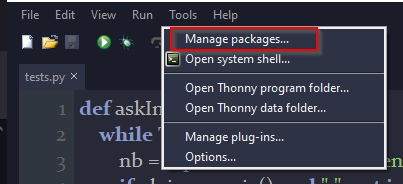
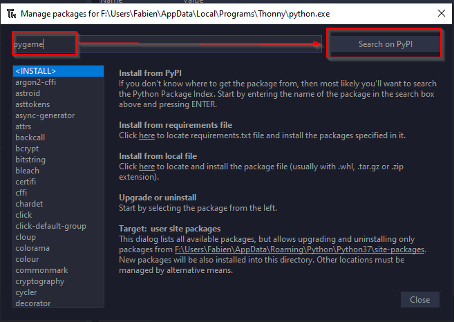
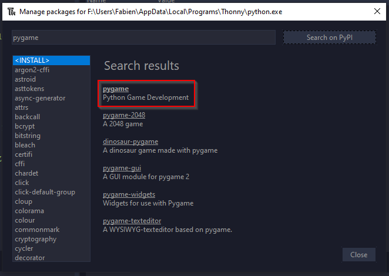
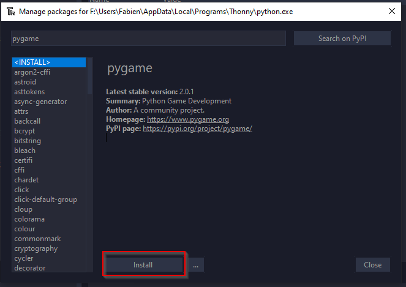
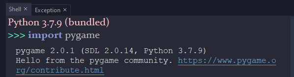

# Installation de Pygame dans Thonny

## C'est quoi Pygame

`Pygame`Pygame est une bibliothèque (= un ensemble de modules),
 libre, multiplate-forme, qui facilite le développement de jeux vidéo temps réel avec le langage de programmation Python. 
 
"Construite sur la bibliothèque **SDL**, elle permet de programmer la **partie multimédia** (graphismes, son et entrées au clavier, à la souris ou au joystick), sans se heurter aux **difficultés des langages de bas niveaux** comme le C et ses dérivés. Cela se fonde sur la supposition que la partie multimédia, souvent la plus contraignante à programmer dans un tel jeu, est suffisamment indépendante de la logique même du jeu pour qu'on puisse utiliser un langage de haut niveau (en l'occurrence le Python) pour la structure du jeu.

Pygame, en plus d'adapter la SDL au Python, fournit également un petit nombre de fonctions spécifiques au développement de jeux.

On peut aussi remarquer que Pygame n'est plus utilisée exclusivement pour des jeux vidéo, mais également pour des applications diverses nécessitant du graphisme. " [wikipedia](https://fr.wikipedia.org/wiki/Pygame){ : target="_blank" }.

Depuis Octobre 2020, après 20 ans d'existence,`pygame` est passé en version 2, et c'est une très bonne nouvelle !
 
## Où trouver de la documentation ?

La documentation en français de `Pygame` est à la fois assez limitée (il n'y a pas un site de référence) et en même temps très touffue (on trouve des dizaines de vidéos tutorielles sur Youtube).

On trouvera cependant l'excellent tutoriel situé autrefois sur le [site du zéro](http://sdz.tdct.org/sdz/interface-graphique-pygame-pour-python.html){ : target="_blank" } (c'est une copie de mauvaise qualité graphique, mais le document en lui même est excellent).

Pour les plus anglophones d'entre-vous (mais vous l'êtes tous 😛 ), vous trouverez toutes les informations nécessaires dans la [documentation de pygame](https://www.pygame.org/docs/){ : target="_blank" }.

## Installation du module dans Thonny

!!! tips "How to "

	Dans Thonny, ouvrez le menu `Tools` puis `Manage Packages` :
	

	{width = 30%}
	

	
	Dans la nouvelle fenêtre, tapez `pygame` puis `Search on PyPI` :
	

	{width = 30%}
	

	
	Sélectionnez le module `pygame` dans la fenêtre de résultats :
	

	{width = 30%}
	

	Cliquez enfin sur `Install` :
	

	{width = 30%}
	

	Une fois ces manipulations terminées, vous pouvez tester l'installation de `Pygame` dans le shell de `Thonny`. Si vous avez un message de bienvenue tel que dans l'image ci-contre, `Pygame` est installé. Sinon vous devriez recommencer l'installation, ou bien chercher l'erreur rencontrée sur [StackOverflow](https://stackoverflow.com/).
	

	{width = 15%}
	

	
	
## Installation hors de Thonny

Si vous n'utilisez pas d'**environnements virtuel python** (c'est une très mauvaise idée), vous pouvez toujours utiliser la commande suivante pour installer `pygame` :

	python3 -m pip install pygame

Si vous utilisez un **venv** python, vous savez déjà probablement quoi faire !