#  Utiliser P5 avec Thonny

La configuration de Thonny au Lycée ne premet pas d'utiliser le module `p5` correctement. La méthode suivante permet cependant d'utiliser une version de python suffisante :

## Installer une version récente de Python 64 bits
	
Le module `p5` ne fonctionne pas en 32 bits, il faut donc installer une version de python en 64 bits. Heureusement, il est toutefois possible de faire une installation locale de python :

1. Téléchargez la dernière version de Python en 64 bits [ici](https://www.python.org/downloads/){: target="_blank"}
2. Exécutez le fichier, puis décochez *Install laucher for all users*

	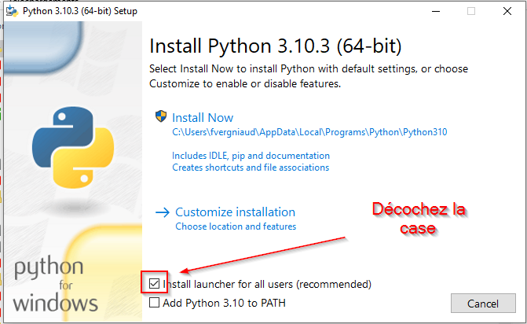{: style="width:60%; margin:auto;display:block;background-color: #546d78;"}
	
3. Sélectionnez *Customize installation*

	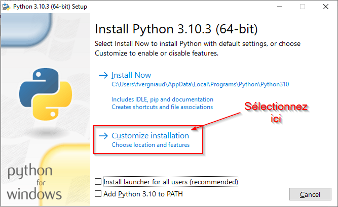{: style="width:60%; margin:auto;display:block;background-color: #546d78;"}
	
4. Puis *Next*

	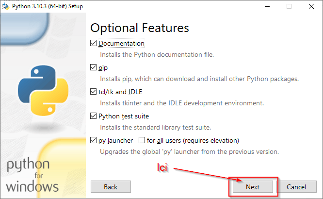{: style="width:60%; margin:auto;display:block;background-color: #546d78;"}

5. Changez le lieu d'installation en créant un dossier `Python310` (si la version est 3.10) dans votre dossier `Documents`.

	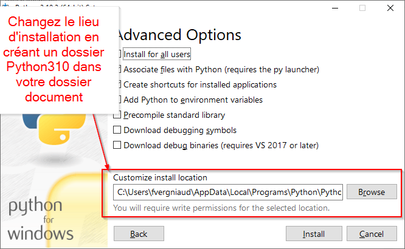{: style="width:60%; margin:auto;display:block;background-color: #546d78;"}

6. Lancez l'installation... {==**Et patientez !**==}

	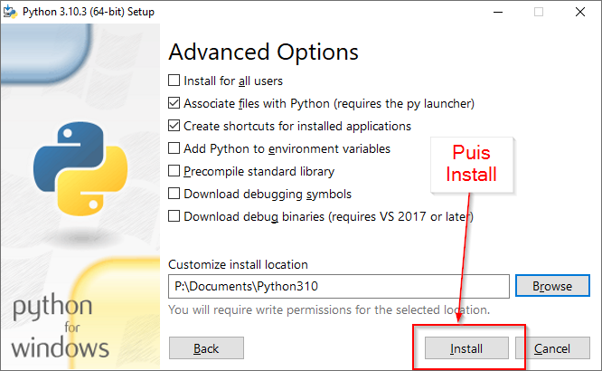{: style="width:60%; margin:auto;display:block;background-color: #546d78;"}
		
## Créer un environnement virtuel Python

Afin de garder une installation propre de Python, il est toujours préférable de travailler avec un {==**environnement virtuel**==}. Pour ce faire, il faut suivre la méthode suivante :

1. Créer un dossier `Thonny310` dans votre dossier `Document` (soit à côté de votre dossier `Python310`).
2. Lancez l'invite de commande windows `CMD`, et déplacez vous dans votre dossier `Document`.
3. Lancez la commande suivante, permettant de créer un {==**environnement virtuel**} correspondant à la version de Python que vous avez installée dans la partie précédente :

	```` bash
	Python310\python.exe -m venv Thonny310	
	````
	
	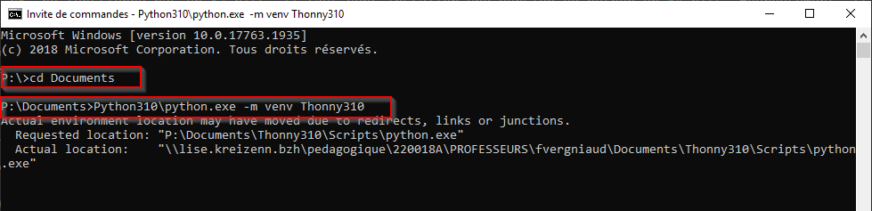{: style="width:60%; margin:auto;display:block;background-color: #546d78;"}
	
	Au retour du *prompt*, l'environnement virtuel est crée.
	
## Activer le venv dans Thonny et installer p5

L'environnement virtuel étant créé, on peut désormais configurer *Thonny* pour l'utiliser :

1. Ouvrez *Thonny*.
2. Dans la console, on voit la version de Python actuellement exécutée par *Thonny*

	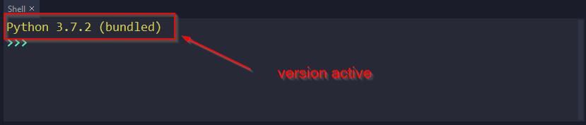{: style="width:60%; margin:auto;display:block;background-color: #546d78;"}


3. Ouvrez le menu `Tools > Options`

	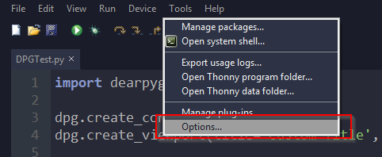{: style="width:60%; margin:auto;display:block;background-color: #546d78;"}
	
4. Dans l'onglet `Interpreter`, dans le menu déroulant, sélectionnez `Alternative Python 3 Interpreter or virtual environnement`.

	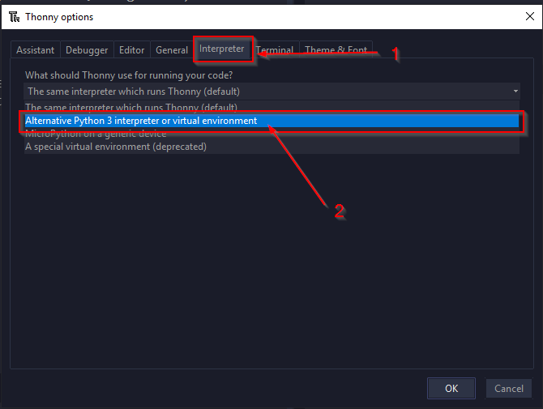{: style="width:60%; margin:auto;display:block;background-color: #546d78;"}
	
5. Sélectionnez `Locate another python.exe`.

	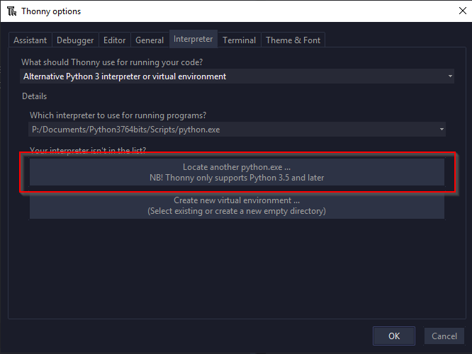{: style="width:60%; margin:auto;display:block;background-color: #546d78;"}
	
6. Déplacez vous alors dand le dossier `Scripts` de l'environnement virtuel que vous avez créé dans la partie précédente, et sélectionnez l'exécutable `python.exe` qui s'y trouve.

	{: style="width:60%; margin:auto;display:block;background-color: #546d78;"}
	
7. Vérifiez que le chemin sélectionné est correct, puis validez en appuyany sur le bouton `Ok`

	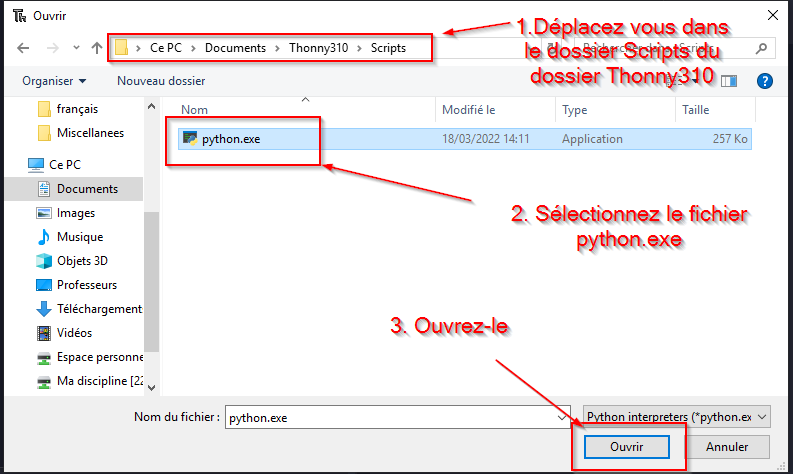{: style="width:60%; margin:auto;display:block;background-color: #546d78;"}
	
8. Au bout de quelques secondes, vous devriez voir dans la console le changement d'interpréteur.

	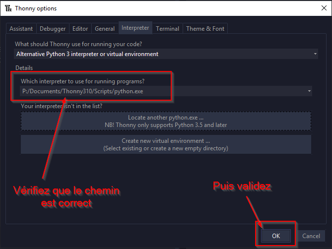{: style="width:60%; margin:auto;display:block;background-color: #546d78;"}
	
9. Vous pouvez maintenant installer le module `p5` par la manière habituelle (`Tools > Manage Packages`). Patience, **l'installation est très longue !**
	


		
