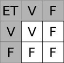
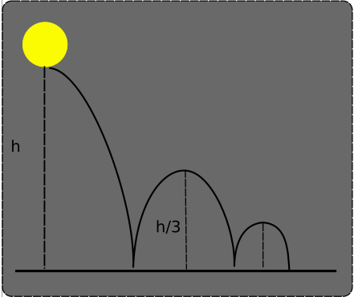

# Conditions et boucles en  

## Structures conditionnelles

### Comparateurs et appartenance

En Python, comme dans de nombreux langages, on utilise les comparateurs et opérateurs d'appartenance :

* `==` : comparateur d'égalité ;
* `!=` : comparateur de différence;
* `<`, `<=`, `>`, `>=` : comparateurs d'ordre ;
* `in`, `notin` : opérateurs d'inclusion.

!!! warning "Evaluation des opérateurs de comparaisons et d'inclusion"
    Les expressions contenant ces opérateurs sont évaluées par l'interpréteur Python comme des valeurs de type **booléen** ( donc `True` ou `False`). 


!!! example "Exemples"

    * Egalité :

        ``` python
        >>> 5 == 2.0+3.0
        True
        ```

    * Inégalités :

        ``` python
        >>> 4 != 2+3
        True
        ```
    * Ordre :

        ``` python
        >>> 7 < 5
        False
        >>> 7 >= 7
        True 
        ```

        Les relations d'ordre ne sont pas limitées aux nombres, puisqu'on peut comparer des chaines de caractères grâce à {==**l'ordre lexicographique**==} (grosso modo en Python l'ordre alphabétique, les majuscules étant situées avant les minuscules) :

        ```` python
        >>> 'ABC' < 'DEFGH'
        True
        >>> 'JKLMN' < 'OPQ'
        True
        >>> 'toto' < 'Toto'
        False
        >>> 'électricité' > 'electricite'
        True
        ````

        L'ordre des caractères dépend de leur position dans la table `UTF-8`, que nous étudierons plus tard dans l'année mais dont voici un extrait :

        


    * Appartenance :

        ``` python
        >>> 'to' in 'Toto'
        True
        >>> 'TO' in 'Toto'
        False
        >>> 5 not in [0, 1, 2, 3, 4] # On utilise une structure de liste (objets entre crochets et séparés par des virgules)
        True
        ```


### Opérations logiques

Il est souvent nécessaire de vérifier que plusieurs conditions soient vérifiées en même temps, ou bien qu'au moins une condition parmi plusieurs soit vérifiée. On utilisera aussi souvent la négation d'une condition.

Pour combiner ainsi plusieurs conditions ensembles, on va utiliser la {==**logique booléenne**==} et les opérateurs `NON`, `ET` et `OU`:

* `NON` opérateur qui renvoie ``Vrai`` si la condition passée est `Faux`, et réciproquement. En python on utilise l'opérateur `not` :

    ```` python
    >>> not(True)
    False
    >>> not ('a' in 'abc')
    False
    >>> not ('A' in 'abc')
    True
    >>> 2*5 < 50
    True
    >>> not(2*5 < 50)
    False
    ````


* `ET` qui renverra `Vrai` si les deux conditions sont simultanément `Vrai`, comme présenté dans la ==**table de vérité**== ci-dessous :

    {: style="width:10%; margin:auto;display:block;background-color: #d2dce0;"}

    En python on utilisera l'opérateur `and`.

    ``` python
    >>> 5<2 and 5<7
    False
    >>> 2<5 and 2<7
    True
    >>> 2<5 and 2>7
    False
    >>> 2>5 and 2>7
    False
    ```

* `OU` qui renverra `Vrai` si au moins une des deux conditions est `Vrai`, comme présenté dans la ==**table de vérité**== ci-dessous :

    {: style="width:10%; margin:auto;display:block;background-color: #d2dce0;"}

    En python on utilisera l'opérateur `or`.

    ``` python
    >>> 5<2 or 5<7
    True
    >>> 2<5 or 2<7
    True
    >>> 2<5 or 2>7
    True
    >>> 2>5 or 2>7
    False
    ```

!!! warning "Une erreur courante"

    Supposons qu'on ait besoin de savoir si le nombre `a` est égal à `0` ou à `1`. Il serait assez naturel d'écrire :

    ```` python
    a == 0 or 1
    ````
    {== C'est une erreur courante chez les débutants en programmation, mais qu'il faut éviter à tout prix ! ==}

    En effet, testons plusieurs fois les lignes suivantes dans le terminal ci-dessous, en utilisant les valeurs suivantes pour `a` : `0`, `1` et `5`.

    {{ IDEv('Bad_Or') }}

    Les trois expression ne renvoient pas `True`, `True` et `False` comme on pourrait s'y attendre, mais `1`, `1` et `1` (Ce qui est équivalent à trois `True`).

    En effet les expressions utilisant l'opérateur `or` ou l'opérateur `and` sont évaluées en utilisant deux booléens :

    `bool1 OR bool2`

    Quand l'interpréteur Python évalue `a == 0 or 1`, il évalue :

    * `a == 0` comme booléen ;
    * puis `1` comme booléen. Or en Python `1` est évalué comme `True`. 
    
    Donc quelle que soit la valeur de `a`, le deuxième *opérande* de l'opérateur `or` sera `True`. D'après la table de vérité, le résultat sera donc toujours `True`.
    
!!! warning "Une bonne pratique"

    Concernant l'écriture d'expressions contenant `or` ou `and`, une bonne pratique est de toujours reformuler notre première idée. Avec l'exemple précédent :

    * **Première idée** : `a` doit être égal à `0` ou `1` ;
    * **Reformulation** : `a`doit être égal à `0` ou `a`doit être égal à `1` ;
    * **Code Python correct :**

        ```` python
        a == 0 or a == 1
        ````

!!! question "Conditions sur les nombres entiers"

    === "Énoncé"
        On considère un objet de type `int` dont le nom est `nb`. Que faut-il écrire pour :

        1. Le nombre ``nb`` est égal à `5` ou `7` ?
        1. Le nombre ``nb`` est supérieur ou égal à `5` et strictement inférieur à `7` ?
        1. Savoir si le nombre ``nb`` est un nombre pair et strictement supérieur à 50 ?
        2. Savoir si le nombre ``nb`` est un nombre pair ou un multiple de 3 ?
        3. Savoir si le nombre `nb` appartient à l'intervalle $[-13 ; 25]$  ?
        4. Savoir si le nombre `nb` n'appartient pas à l'intervalle $[-13 ; 25]$  ?

    === "Solution"

        1. `nb == 5 or nb ==7`
        1. `nb>= 5 and nb <7`
        1. `nb%2 == 0 and nb > 50`
        2. `nb%2 == 0 or nb%3 == 0`
        3. `nb >= -13 and nb <= 25` (et en python, on a aussi la possibilité d'écrire ``13<= nb <= 25``)
        4. `nb<13 or nb >25` ou `not(nb >= -13 and nb <= 25)` ou en python  `not(13<= nb <= 25)`

        Vous pouvez tester les conditions ci-dessus en exécutant le code suivant, qui crée un objet `int` aléatoire entre -20 et 70, puis en vérifiant en affichant la valeur de `nb`

        {{ IDEv('P2_Code1') }}


!!! question "Exercice"

    === "Enoncé"

        Le code suivant est-il correct d'un point de vue logique ?

        ```python
        'toto' and 'plage' in 'toto va à la plage'
        ```

    === "Solution"

        Non, il faut utiliser :

        ```python
        'toto' in  'toto va à la plage' and 'plage' in 'toto va à la plage'
        ```


??? tips "Pour les cracks : évaluation au plus court"

    Dans une évaluation de condition possédant un ou plusieurs opérateurs `and` et `or`, l'interpréteur python évalue de gauche vers la droite. Si les évaluations déjà effectuées permettent déjà de donner le booléen réponse, l'interpréteur python s'arrête automatiquement. Ainsi :

    * `5 < 7 or 5 < 9` : `5 < 7` renvoie `True`, et l'opérateur `or` renvoie `True` dès qu'une des deux condition est vérifiée. La condition  `5 < 9` n'est donc pas évaluée, ce serait inutile.
    * `5 < 7 and 5 < 9` : `5 < 7` renvoie `True`, et l'opérateur `and` renvoie `True` dès que les deux conditions sont vérifiées. La condition  `5 < 9` est donc obligatoirement évaluée.
    * `5 < 2 and 5 < 9` : `5 < 2` renvoie `False`, et l'opérateur `and` renvoie `False` dès qu'une des deux condition n'est pas vérifiée. La condition  `5 < 2` n'est donc pas évaluée, ce serait inutile.
    * `5 < 9 and 5 < 2` : `5 < 9` renvoie `True`, et l'opérateur `and` doit obligatoirement évaluer `5 < 2` pour conclure.

    Les deux derniers exemples montrent l'importance de l'ordre dans les opérations booléennes, certains ordre permettant de gagner du temps de calcul.

## Structures conditionnelles 

### Syntaxe des structures conditionnelles

En Python, on utilise pour les structures conditionnelles la syntaxe suivante :


```python
if condition1 :#Le : est important !
    #bloc de une ou
    #plusieurs lignes
    #indentées ( avec la touche tabulation)
elif condition2 :
    #encore un autre bloc
elif condition3 :
    #etc
    #etc
    #etc

.
.
.

else :
    #et enfin un dernier bloc si aucune des conditions précédentes n'a été réalisée.    
```

Les différents blocs d'instructions doivent être {==**correctement indentés**==} (c'est-à-dire correctement décalés vers la droite).

La règle de bonne conduite est d'utiliser 4 espaces par indentation (qu'il est souvent possible d'obtenir grâce à la touche tabulation ++tab++ ). Il est {==**réellement fondamental de respecter les indentations**==}, celles-ci étant pour l'interpréteur Python le signal de déclenchement d'un bloc de code indépendant. Par exemple, le code ci-dessous renverra une erreur :


{{ IDEv('P2_Code2') }}


On peut aussi noter qu'il est possible dans certaines situations de se passer des instructions `elif` et `else`, mais cela peut conduire à certains **effets de bords** qui peuvent être parfois dommageables. Testez par exemple le code suivant :


```python
nb = int(input("Entrez un nombre entre 1 et 100 :"))
if nb<1 :
    print("Votre nombre est trop petit")
if nb>100 :
    print("Votre nombre est trop grand")
if nb < 50 :
    nb = nb + 50
    print(f"Le nombre final est {nb}")
if nb>= 50 :
    nb = nb - 50
    print(f"Le nombre final est {nb}")
print("FIN")

```
    


Les structures conditionnelles peuvent aussi être imbriquées, en indentant à plusieurs reprises :


```python
nb=int(input("Entrez un nombre entier, positif ou négatif :"))
if nb>0 :
    print("Votre nombre est positif !")
    if nb%2==0 :
        print("Et c'est un multiple de 2 !")
    else :
        print("Et ce n'est pas un multiple de 2 !")
else :
    print("Votre nombre est négatif !")
```

    Entrez un nombre entier, positif ou négatif :9
    Votre nombre est positif !
    Et ce n'est pas un multiple de 2 !

### Exercice sur les structures conditionnelles

!!! question "Un début de Pierre-Feuille-Ciseaux"

    On veut écrire un programme qui permettra de jouer plus tard à Pierre-Feuille-Ciseaux contre l'ordinateur.

    Pour l'instant on considère que l'ordinateur ne joue qu'une seule chose : Pierre.

    Écrire un code Python dans la zone de script de Thonny (que vous sauvegarderez sous le nom `PFC.py`) qui :

    1. Demande à un utilisateur×trice de saisir `p` (pour Pierre), `f` (pour Feuille) ou `c` (pour Ciseaux).
    2. Donne le résultat du jeu contre l'ordinateur ayant joué Pierre.

    Attention ! Il faut aussi signaler à l'utilisateur×trice qu'il/elle a fait une erreur s'il/elle n'a saisi aucune des trois possibilités.

!!! question "Premières étapes de Devine Nombre"

    On veut réaliser un jeu de «Devine Nombre», dans lequel l'ordinateur tirera un nombre au hasard entre 1 et 100, et dans lequel le joueur/la joueuse proposera plusieurs possibilités, et aura un feedback du type «Trop grand» ou «Trop petit». L'objectif est de deviner le plus rapidement possible le nombre sélectionné par l'ordinateur.

    Pour l'instant, nous allons nous concentrer sur une seule étape : le joueur/la joueuse donne un nombre, et l'ordinateur lui répond.

    Vous aurez besoin de tirer au hasard un nombre entre 1 et 100. Pour ce faire, vous devrez, dans le code insérer les deux lignes suivantes :

    ```python
    import random

    nb = random.randint(1, 100)
    ```
    Vous aurez alors un nombre sélectionné au hasard affecté à la variable `nb`.

    Vous sauvegarderez votre script sous le nom `devineNombre.py`.

## Boucles

### Boucle non bornée `while`

!!! abstract "Boucle bornée"
    On utilise une boucle bornée lorsqu'on veut ré-exécuter un bloc de code **tant qu'une condition est vérifiée**.

La boucle `while` (appelée `Tant que` en pseudo-code), possède la structure suivante en Python :


```python
while condition :#Encore une fois, ne pas oublier le signe :
    #bloc de code
    #indenté
```

Le bloc de code situé sous l'instruction `while` sera exécuté {==**tant que la condition donnée sera vraie**==}, comme dans l'exemple donné ci-dessous :


{{ IDEv('P2_Code3') }}


!!! question "Rebond d'une balle"

    On considère une balle de rayon $5$ cm lancée d'une hauteur $h$. La balle rebondit à $\dfrac{1}{3}$ de la hauteur précédente à chaque rebond. On considère que la balle arrête de rebondir lorsque le rebond est inférieur à $5$ cm.

    {: style="width:20%; margin:auto;display:block;background-color: #d2dce0;"}

    Écrire un script Python qui demande à l'utilisateur×trice une hauteur de départ (en cm) puis donne le nombre de rebonds de la balle.

### Boucle bornée : `for`

!!! abstract "Boucle bornée"
    On utilise une boucle bornée lorsqu'**on connait à l'avance le nombre de fois où un bloc de code doit être exécuté**.

#### La boucle classique `for`

Dans de nombreux langages de programmation, une boucle `for` (`Pour` en pseudo-code) fonctionne en :

* Créant un **compteur** ( ou **itérateur**), nommé traditionnellement `i` ;
* en **initialisant** ce compteur à une valeur de départ ;
* en augmentant à chaque tour de boucle le compteur d'une certaine valeur appelée le **pas** (**step** en anglais);
* en continuant tant qu'une certaine valeur **limite** n'est pas atteinte (ou qu'une condition est respectée).

En Python, on utilisera la structure suivante :

```python
for i in range(depart, limite, pas) :
    # Bloc de code
```
où :

* `i` est le {==**compteur**==} (ou ==itérateur==). C'est une variable donc on peut choisir son nom selon les règles de nommages habituelles ;
* `depart` est la valeur de départ à laquelle est initialisée `i` ;
* `limite` est la valeur telle que si `i` est {==**supérieure ou égale**==} à cette valeur, la boucle s'arrête.
* `pas` est le pas, c'est-à-dire la valeur d'augmentation de `i` à chaque tour.

Même s'il s'agit d'une simplification abusive de ma part, vous pouvez considérer que la fonction `range()` construit l'ensemble des valeurs que peut prendre le compteur `i`, et fait passer `i` d'une valeur à l'autre à chaque tour de boucle.

!!! example "Exemple de boucle for"

    Prenons comme exemple la boucle suivante :

    ``` python
    for i in range (12,24,3) :
        print(i, end=" ")
    ```
    La valeur d'initialisation de `i` est `12`, la valeur limite est `24`, et le pas est `3`.

    L'exécution du programme donnera donc en sortie :
    ``` python
    12 15 18 21 
    ```

    Cette boucle `for` est donc exactement équivalente au code suivant :

    ```` python
    i = 12
    while i < 24 :
        print(i)
        i = i + 3
    ````

!!! question "Exercice"

    === "Enoncé"
        On considère le code suivant :

        ``` python
        for toto in range(15,30,5) :
            # Bloc de code
            ...
        ```


        Combien y aura-t-il de répétitions du bloc de code dans cette boucle `for`  ?

    === "Solution"

        Il y aura une exécution du bloc de code pour chacune des valeurs suivante de ``toto`` : $15$, $20$ et $25$. Lorsque `toto` prend la valeur `30`, la boucle est arrêtée et le bloc n'est pas exécuté.


!!! tips "Raccourcis d'écriture"
    Il existe des facilités de programmation qui permettent de simplifier l'écriture de la fonction `range` :

    * Si le pas est de `1`, on peut l'omettre : `range(12, 17)` est équivalent à `range(12, 17, 1)`, et crée la liste `12, 13, 14, 15, 16` ;
    * Si la valeur de départ est `0`, et le pas de `1`, on peut les omettre : `range(5)` est équivalent à `range(0, 5, 1)` et crée la liste `0, 1, 2, 3, 4` (ce qui permet d'avoir exactement 5 tours de boucle) ;

    Attention, il n'est pas possible de donner le pas sans donner la valeur de départ ! `range(0, 45, 3)` ne peut pas être raccourci !


#### La boucle `for` en Python

En python, la boucle `for` peut aussi être utilisée comme une boucle `foreach` (`Pour chaque` en pseudo-code) :

Testez par exemple le code suivant :

{{ IDEv('P2_Code4') }} 

Le compteur `lettre` prendra successivement **chaque** (**each**) caractère de la chaîne `texte`, soit `U`, `n`, ` `(1 espace), `t`, ..., jusqu'à ce que le parcours de la chaîne soit terminé. 

Dans ce cas, il n'y a pas de **pas**, on parcourt **chaque élément** d'un ensemble donné. Nous verrons plus tard dans l'année qu'on peut parcourir ainsi des listes, des tuples, etc.


!!! question "Exercice"

    Comment faire pour prendre en compte les majuscules dans le compte des voyelles ?

## Exercices

!!! question "Conditions, saisies et affichages"

    === "Énoncé"

        1. Écrire un programme qui demande un nombre à l'utilisateur, puis affiche le carré de ce nombre.
        2. Écrire un programme qui demande l'heure qu'il est (un nombre pour les heures, un nombre pour les minutes et un pour les secondes). Cet algorithme indiquera en outre si l'heure donnée est valide, c'est-à-dire que les nombres sont bien des entiers, et qu'ils sont compris entre 0 et 23 ou 0 et 59.
        3. Compléter le programme précédent afin que l'algorithme donne l'heure qu'il sera 10 minutes après l'heure saisie.
        4. Une année est dite bissextile si cette année est divisible par 4, sauf si elle est divisible par 100 et pas par 400. Construire un programme qui dit si une année saisie par un utilisateur·trice est bissextile ou non.
        4. Écrire un programme qui demande les coefficients $a$ et $b$ d'une fonction affine, et qui donne son nombre de racines et leurs valeurs éventuelles. Attention aux cas particuliers !
        5. Étendre le programme précédent pour la résolution d'équations du type $ax+b = cx+d$, où $a,b,c,d$ sont des entiers saisis par l'utilisateur·trice.
        6. *Pour les élèves ayant encore des maths,* reprendre le problème n°5 pour un trinôme du second degré.

    === "Solutions"

        A venir !

!!! question "Exercices sur les boucles `for` et `while`"

    === "Énoncé"

        1. Écrire un programme qui affiche les 20 premiers nombres de la table de multiplication d'un entier choisi par l'utilisateur·trice, sous la forme (avec choix de `7` par l'utilisateur) :
            
            ```` python
            7 x 0 = 0
            7 x 1 = 7
            7 x 2 = 14
            ...
            ````
            

        2. Écrire un programme qui affiche les restes des divisions euclidiennes des $200$ premiers entiers par  $7$.
        3. Écrire un programme qui affiche les restes des divisions euclidiennes des $300$ premières puissances de $2$ par $9$. Que constate-t-on ?
        4. Écrire un programme qui affiche une suite de 12 nombres dont chaque terme soit égal au triple du nombre précédent, le nombre de départ étant choisi par l'utilisateur·trice.
        5. La suite de Syracuse est définie ainsi :

            * on part d'un nombre entier choisis par l'utilisateur.trice ;
            * si le nombre est pair, on le divise par 2, et on recommence avec le résultat ;
            * sinon on le multiplie par 3 et on ajoute 1, et on recommence avec le résultat.

            Construire un programme qui affiche les 30 premiers nombres de la suite de Syracuse à partir d'un nombre entier choisis par un·e utilisateur·trice.
        5. Écrire un programme qui demande un nombre entier entre 1 et 10 à l'utilisateur·trice, et qui poursuit cette demande tant que l'utilisateur·trice n'a pas exactement fait ce qui lui était demandé ( on appelle ce type de programme **dumbproof**). 

    === "Solutions"

        A venir !


!!! question "TP Turtle"

    Faire le TP suivant sur [Capytale](https://capytale2.ac-paris.fr/web/c/7b41-1846263){:target="_blank"}
