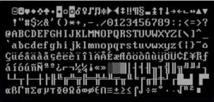
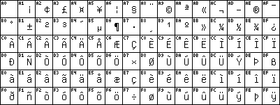
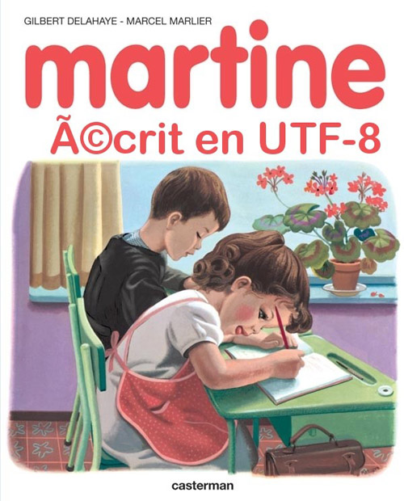

# Normes d'encodage des caractères


Nous avons vu que les nombres entiers et flottants sont codés en binaires, ainsi bien entendu que les booléens. Il en est de même pour les caractères. Cependant de nombreuses normes existent. Les raisons en sont pour la plupart historiques, mais pas seulement. Nous regarderons dans ce cours trois de ces normes, dont la dernière - l'{==**unicode**==} - est aujourd'hui celle majoritairement utilisée.

## Historiquement - la norme ASCII

A partir des années 1960, les ordinateurs commencent à être équipés d'un clavier et d'un rouleau pour imprimer les sorties. Il fut donc nécessaire de décider comment manipuler les caractères alphanumériques.

La décision fut prise de représenter *les caractères de l'alphabet anglais* sur un octet de la manière suivante :

* les 7 octets de poids faible (les plus à droite) serviront à associer une valeur numérique à chaque caractère ;
* l'octet de poids fort (celui le plus à gauche) sera le **bit de parité** - une clé de contrôle.

!!! info "Bit de parité"
	Les ordinateurs de cette époque étant peu fiables au niveau des transmissions et traitement des bits, il arrivait des erreurs lors du traitement des signaux et un octet `1101 1011` pouvait vite se transformer en `1001 1011` : les données étaient alors corrompues et le mauvais caractère serait affiché. Le {==**bit de parité**==} est un bit qui prenait la valeur 0 ou 1 selon la parité du nombre de 1 dans les 7 bits représentant le caractère. 
	
	Ainsi, si les 7 bits sont `101 1001`, le bit de parité est à `0`, et l'octet complet devient `0101 1001`. Si celui reçu est `0101 0001`, un simple calcul avec le bit de parité permet de constater que le traitement du signal est défectueux. 


Il reste donc $7$ bits pour encoder les caractères, soit $2^7 = 128$ possibilités. Ce codage est appelé American Standard Code for Information Interchange, soit {==**ASCII**==}, et est présenté dans la *table de jeu de caractères ASCII* ci-dessous :

{: style="width:80%; margin:auto;display:block;background-color: #546d78;"}


La table ASCII contient 95 caractère imprimables :
* les chiffres de `0` à `9` ;
* les lettres minuscules de `a` à `z` et majuscules de `A` à `Z` ;
* des symboles mathématiques et de ponctuation.

Les 32 premiers caractères de `00` à `1F`, ainsi que le 128ème caractère `FF` ne sont pas imprimables, ils correspondent à des commandes de contrôle de terminaux informatiques (le caractère `FF` est la commande pour effacer le caractère précédent, le `07` provoque l'émission d'un signal sonore, etc).

Il faut différencier la notion de {==**jeu de caractère**==} (*Character set* en anglais) de celle de {==**police de caractère**==}. Dans une police de caractère, chaque *glyphe* est associé à un numéro correspondant à un caractère du **jeu de caractère*. Intrinsèquement, un ordinateur ne fait aucune différence entre deux glyphes de la même lettre.
!!! info "Glyphes"
	Un **glyphe** est  une représentation graphique d'un signe typographique, c'est-à-dire d'un caractère ou bien un idéogramme.
	 
	<div style="display:flex;">
	<div style="display : inline; width : 33%;">
	
	{: style="width:80%; margin:auto;display:block;background-color: #546d78;" title="Glyphe a police Caliban"}
	  
	</div>
	<div style="display : inline; width : 33%;">
	
	{: style="width:80%; margin:auto;display:block;background-color: #546d78;" title="Glyphe a police Caston Italic"}
	
	</div>
	<div style="display : inline; width : 33%;">

	{: style="width:80%; margin:auto;display:block;background-color: #546d78;" title="Glyphe ki kanji"}

	</div>
	</div>

!!! question "En Python"
	=== "Enoncé"

		1. Pour obtenir un caractère correspondant à un code hexadécimal donné, il faut convertir en entier le nombre hexadécimalavec `int` puis passer par la fonction `chr` : 
		
			```` python
			chr(int('Ox41',16))
			````
			Vérifiez avec quelques caractères. Comment faire à partir du code binaire  ?
			
 
		2. Testez `ord('A')`. Que renvoie cette fonction ? 
		3. Testez de même les fonctions `hex()` et `bin()`.
 
	=== "Réponses"
		A venir
		
!!! question "Discussion"

	=== "Enoncé"
		Quelles sont les  limites de la norme ASCII ?
		
	=== "Réponse"


## La norme ISO-8859

Dès la fin des années 60, alors que la qualité des ordinateurs s'améliore, il devient possible de bénéficier de l'octet de poids fort pour disposer de $2^8 = 256$ possibilités de codage. Les différentes constructeurs d'ordinateurs se précipitent sur cette possibilité afin de palier aux défauts de l'ASCII, malheureusement sans se coordonner. Différentes normes voient le jour, appelées **ASCII étendues**, pour **la plupart incompatibles entre elles**. Par exemple IBM produit une table, la $CP437$, possédant des accents, ainsi que de nombreux symboles de tracés de boites - les interfaces graphiques n'existant pas encore sur ces machines :

{: style="width:50%; margin:auto;display:block;background-color: #546d78;" title="CP437"}

!!! info "ISO-8859 ets es variantes"

	Malgré tout, une norme arrive à être établie, l'**ISO-8859**, avec les conventions suivantes :

	*  le codage des caractères présents dans la tables ASCII est conservé (principe de **rétro-compatibilité**) ;
	* on conserve le principe de caractères sur 1 octet, avec utilisation complète de $8$ bits.


	Plusieurs jeus de caractères coexistent alors :

	<div style="display:flex;">
	<div style="display : inline; width : 50%;">

	{: style="width:80%; margin:auto;display:block;background-color: #546d78;" title="ISO 8859-1 (Occidental)"}

	</div>
	<div style="display : inline; width : 50%;">

	{: style="width:80%; margin:auto;display:block;background-color: #546d78;" title="ISO 8859-5 (Cyrillique)"}

	</div>
	</div>

	Le jeu occidental ISO 8859-1, aussi appelé {==**ISO-Latin-1**==}, a été le jeu par défaut du web avant d'être à son tour remplacé par l'{==**unicode**==}. La norme ISO 8859-1 a été révisée en ISO 8859-15 à la fin des années 1990 pour y ajouter de nouveaux caractères (comme le symbole €). 

A noter que les efforts de normalisation ont parfois mené à des absurdités : pas moins de 5 normes ISO 8859 différentes coexistent pour l'aplphabet cyrillique...

Cependant un problème majeur demeurait : certaines langues, comme le chinois, ne pouvaient tout simplement pas être utilisées, le nombres de glyphes nécessaires étant bien supérieur à $256$.

!!! question "Avec Python"
	=== "Enoncé"
		Il est possible avec Python de basculer d'un jeu de caractère à un autre. Le principe est de récupérer l'octet correspondant à un caractère dans un *charmap*, et d'afficher le caractère correspondant dans le nouveau *charmap*. Pour cela on utilise les méthodes suivantes :

		* `.encode(charmap)` : transforme une chaine de caractère de la *charmap* passée en argument  en une séquence d'octets ;
		* `.decode(charmap)` : transforme une séquence d'octets en une chaine de caractère de la *charmap* passée en argument.


	 
		1. Tester l'encodage de la chaine `'A'` d'abord en `ascii`, puis en `ISO8859-1`, puis en `ISO8859-5` et enfin en `CP437`. Que constate-t-on ?
		2. Faire de même avec la chaine `'é'`. Que constate-t-on ?
		3. A quels caractères correspond l'octet dont le code Python est `b'\xe7'` selon l'encodage utilisé :
			1. en Latin-1 ?
			1. en CP437 ?
			1. en ISO8859-5 ?
		4. Quel est le code Latin-1 cordresponant à la lettre 'œ' ?
	
	=== "Réponses"
		A venir !

## L'encodage unicode UTF-8


!!! info "Naissance d'Unicode"
	<div style="display:flex;">
	<div style="display : inline; width : 70%;">

	Internet naisant, les problèmes liés aux différents encodages ont augmentés exponentiellement (et perdurent toujours aujourd'hui sur certains logiciels). La solution trouvée est le standard {==**unicode**==}, né au début des années 1990.

	L'objectif de cette norme est triple :

	* Rétro-compatibilité avec ASCII, et en grande partie avec ISO8859-1 ;
	* Gestion d'un plus grand nombre de caractères ;
	* Affichage de textes bi-directionnels.

	</div>
	<div style="display : inline; width : 30%;">

	{: style="width:70%; margin:auto;display:block;background-color: #546d78;" title="Martine et l'UTF8"}

	</div>
	</div>

Un des formats d'encodage de l'unicode, et le plus utilisé, est l'{==**UTF-8**==} pour &laquo;*8-Bit Universal Character Set Transformation Format* &raquo;. L’UTF-8 code les caractères en utilisant jusqu'à 4 octets. Il attribue à chaque caractère unicode existant une séquence de bits précise. La force de cette norme est de **ne pas forcément utiliser 4 octets**. La table ASCII est d’ailleurs codée sur 1 seul octet (8 bits), pour garantir la rétro-compatibilité.

En utf-8, chaque caractère est représenté sous la forme d'un bloc `U+xxxx` (où `xxxx` est un hexadécimal de 4 à 6 chiffres, entre `U+0000` et `U+10FFFF`). La plage ainsi définie permet d'attribuer jusqu'à 1 114 112 caractères. A l'heure actuelle, on recense environ 130 000 caractères dans unicode.

Pour savoir combien d’octets on va utiliser les bits de poids fort du premier octet (celui de gauche) et pour savoir qu’un octet est la suite du précédent on commence par 10 :

| Codes | Encodage en UTF-8 | Caractères dans cet intervalle |
| :---: | :---: | :---: |
| jusqu’à `U+007F` ($2^7-1$) | $0bbbbbbb$ | latin de base (ASCII) |
| jusqu’à `U+07FF` ($2^{11}-1$) | $110bbbbb~10bbbbbb$ | alphabets d’Europe et du Moyen-Orient |
| jusqu’à `U+FFFF` ($2^{16-1}$) | $1110bbbb~ 10bbbbbb~ 10bbbbbb$ | 	La quasi-totalité des alphabets actuels |
| jusqu’à \textbf{U+10FFFF} ($2^{21}-1$) | $11110bbb~ 10bbbbbb~ 10bbbbbb~ 10bbbbbb$| tous les caractères |

Cette norme permet donc d’être rapide pour les alphabets courants. Elle présente le défaut de ne pas pouvoir aller directement chercher le 10ème caractère d’une phrase puisque le nombre d’octets par lettre est variable. L’UTF-16, lui,  est codé sur 4 octets ou 2 octets en fonction du code du caractère. La norme UTF-32 utilise elle 32 bits en permanence. Cela consomme bien plus de mémoire mais permet de trouver très rapidement le x-ième caractère d’une chaîne de caractères.

L'UTF-8 est utilisé par $82,2\%$ des sites web en décembre 2014, puis $87.6\%$ en 2016 et enfin $95,2\%$ en octobre 2020.

Par sa nature, UTF-8 est d'un usage de plus en plus courant sur Internet, et dans les systèmes devant échanger de l'information.

Il s'agit également du codage le plus utilisé dans les systèmes GNU/Linux et compatibles pour gérer le plus simplement possible des textes et leurs traductions dans tous les systèmes d'écritures et tous les alphabets du monde.

Concrètement, **UTF-8 est utilisé par quasi tous les serveurs Web**. Aujourd'hui, il n'y a plus de questions à se poser : {==**choisissez systématiquement l'encodage utf-8 pour vos travaux**==}, et comme *explicit is better than implicit*, comme dit le zen de Python, expliquez clairement dans tous vos codes l'encodage utilisé :

* en HTML : 
	```` html
	<meta charset="utf8">
	````
* au début d'un script Python, avec le **shebang** : 
	```` python
	#-*- coding: utf-8 -*-
    ````

!!! question "Jouer avezc les encodages"

	=== "Enoncé"
		1. On considère la liste Python suivante : ``[233, 112, 97, 116, 97, 110, 116, 32, 33]``. Quel est le message caché ?
		2. En HTML :
			1. Créez une page vide en HTML avec la code  suivant dans Notepad++, en vérifiant que l'encodage est bien UTF-8 :
				```` html
				<!DOCTYPE html>
				<html lang="fr">
					<head>
						<meta charset="utf-8">
						<title> Nombreux accents  </title>
					</head>
					<body>
		
					</body>
				</html>
				````
			2. Insérez la phrase suivante dans le corps du document : 
				````
				Portez ce vieux whisky au juge blond qui fume sur son île intérieure, à côté de l'alcôve ovoïde,
				où les bûches se consument dans l'âtre, ce qui lui permet de penser à la cænogénèse de l'être 
				dont il est question dans la cause ambiguë entendue à Moÿ, dans un capharnaüm qui, pense-t-il, 
				diminue çà et là la qualité de son œuvre. 
				````
			3. Ouvrez ensuite le fichier dans un navigateur. L'affichage est-il correct ?
			4. Remplacez maintenant la ligne ``<meta charset="utf-8">`` par la ligne ``<meta charset="iso-8859-1">``.
			5. Actualisez la page. Que se passe-t-il ?
			6. Ouvrez maintenant le fichier HTML avec le logiciel `HexEditorNeo`. Que retrouve-t-on ?

	=== "Réponses"
		A venir !

