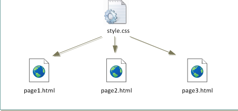

# Mettre en forme : le CSS

## Séparer le fond et la forme : un exemple avec un traitement de texte

!!! question "Activité avec un traitement de texte"
	
	1. Téléchargez puis ouvrez le fichier [`Styles_et_modèles.odt`](Styles_et_modèles.odt) avec *Libre Office*.
	2. Allez à la page 7 du document.
	3. Ouvrez la fenêtre de style en appuyant sur ++f11++. 
	4. cherchez le menu `Titre 1`, puis cliquez-droit et `Modifier`.
	6. Passez la couleur de la police en rouge, puis activez un surlignage simple en jaune. Validez puis observez le document. 
		1. Quelles parties ont été changées ? 
		2. Y-a-t-il eu des changements sur d'autres pages ?
		3. Qu'ont en commun toutes les zones changées ?
	7. Dans la fenêtre de style, modifiez `Corps de texte -> Liste 1` en ajoutant une lettrine, et en ajoutant au fond un dégradé de type `Radial`. Observez les modifications du document.
	8. Allez à la page 11,  sélectionnez les éléments de la liste à puce, et changez le style de celle-ci, qui est actuellement en `Liste 1`, en `Liste 2`. Le texte at-il été changé ?


!!! info "Séparer le fond de la forme"

	Un même document numérique peut être lu de différentes manières :

	* sur un écran couleur ;
	* par un logiciel de synthèse vocale ;
	* sur un écran monochrome (ou dans la console) ;
	* sur un écran de smartphone ;
	* par une impression sur un papier A4, ou A3, ou autres formats ;
	* ...
	
	Pour éviter de créer un document différent pour chacun de ces supports, l'idée est apparue à la fin des années 1960 de créer une séparation complète entre la structure logique d'un document (titres, chapitres, paragraphes, illustrations...), et sa mise en page, qui dépend du support de présentation, et qui est définie en dehors du document lui-même dans une ou plusieurs {==**feuilles de style**==}, regroupant police, style, taille et couleur des caractères, alignement et espacement des paragraphes...


## Cascading Style Sheets

### Définition

!!! asbtract "CSS"
	CSS est l'acronyme de {==**Cascading Style Sheets**==}, soit *Feuilles de Styles en cascades* en français. Un fichier `CSS` est appelé  par une ou plusieurs pages `HTML` (entre autre), et associe à certaines {==**balises**==} et/ou {==**attributs**==} `html` certaines caractéristiques graphiques, à l'aide d'un {==**sélecteur**==} de balises.
	
	Pour utiliser une feuille de style nommée `toto.css` dans une page `html`, il faut inclure entre les balises `<head>` et `</head>` la ligne suivante :

	```` html
		<link href="toto.css" rel="stylesheet" type="text/css">
	````

!!! example "Exemple"
	Dans l'exemple ci-dessous, le fichier `style.css` est utilisé par les différentes pages *html* :
	<p align="center">
	 {:style="width:50%;"}
	</p>

### Déclaration d'une règle CSS : vocabulaire associé et premiers exemples

!!! asbtract "Vocabulaire"
	Au sein d'un fichier CSS, on déclare des {==**règles**==}, qui vont permettre la mise en forme d'éléments bien précis. Par exemple :
	
	<p align=center>
	{:style="width:30%;"}
	</p>

	* le {==**sélecteur**==} `p` signale que les déclarations suivantes s'appliquent à toutes les balises `<p>` et `</p>`. Toutes les déclarations doivent être à l'intérieur d'une paire d'accolades ( ++ctrl+alt+grave++ ou ++alt-graph+grave++ donne ++brace-left++ et ++ctrl+alt+equal++ ou ++alt-graph+equal++ donne ++brace-right++).
	* la {==*propriété*==} `color` indique que la règle concerne la couleur de police ;
	* la {==*valeur*==} associée `red` indique que la couleur de police sera rouge ;
	* la {==**déclaration**==} est terminée par un **point-virgule** (c'est important !), et *propriété* et *valeur* sont séparées par un symbole deux-points.

Il est possible et même souhaitable d'effectuer plusieurs déclarations au sein de la même règle. Par exemple, la déclaration suivante est parfaitement valable :

```` CSS
h1 {
	color : magenta;
	background-color : lightblue;
	font-style : italic;
	font-size : 3em;
	font-variant : small-caps;
}
````

Il existe des **dizaines de propriétés** et des **centaines de déclarations possibles**. Pour les trouver je vous conseille fortement le site [MDN webdocs](https://developer.mozilla.org/fr/docs/Apprendre/Commencer_avec_le_web/Les_bases_CSS) et surtourt (mais en anglais) [W3Schools](https://www.w3schools.com/css/).

Vous pouvez essayer de modifier le CSS dans le [bac-à-sable suivant sur capytale](https://capytale2.ac-paris.fr/web/c-auth/list?returnto=/web/code/c50c-144590).

!!! info "L'inspecteur d'objet"
	Il est possible dans `Firefox`, comme dans de nombreux navigateurs actuels, d'afficher les informations d'une page web, y compris bien sûr les styles CSS attachés à cette page. Dans `Firefox`, vous obtiendrez cet inspecteur de style par l'intermédiaire des touches ++ctrl+shift+i++, ou bien par `Menu > Outils supplémentaires > Outils de développement web`.
	 
	L'intérêt de l'inspecteur est de pouvoir modifier à sa guise les attributs et valeurs CSS d'une page web et d'en voir immédiatement les effets. Les modifications sont bien entendues **locales** (elles ne sont valables que sur la copie de la page web dans votre navigateur, vous ne modifiez pas vraiment la page web réelle... Et heureusement !!!)

!!! question "Exercice : Modifier une page web existante"

	1. Ouvrez **l'inspecteur d'objets**.
	3. Cliquez sur la petite flèche située à droite de la barre de menu de l'inspecteur, puis sélectionnez ensuite le titre de la page `Mettre en forme : le CSS`.
	4. Vous devez voir apparaitre toutes les déclarations dont dépend le titre de la page. Ajoutez au sélecteur `.md-typeset h1` la déclaration `background-color : pink`.
	5. Enjoy :smile:
	

## Les sélecteurs en CSS


### Le DOM, ou comment ça marche en vrai !

!!! abstract "le DOM"
	Le {==**DOM**==}, ou *Document Object Model* est une interface de programmation pour des documents `HTML` ou `XML` qui représente le document (la page web actuelle) sous une forme qui permet aux langages de script comme le JavaScript d'y accéder et d'en manipuler le contenu et les styles.

	Le DOM est ainsi une représentation structurée du document sous forme &laquo; d'arbre &raquo; crée automatiquement par le navigateur 
	
	<p align="center">
	{: style="display : inline-block; width:45%;"}
	{: style="display : inline-block; width:45%;"}
	</p>
	
	Pratiquement,le DOM est créé  à partir du code HTML[^1], et chaque style CSS est attaché à un noeud du DOM :

	[^1]: Le HTML n'a pas besoin d'être intégralement chargé pour que le CSS lui soit ajouté. Il est tout à fait possible de passer le HTML par morceaux depuis le serveur, et l'arbre du DOM se construit petit à petit. Merci Armand pour cette remarque pertinente !
	
	<p align="center">
	{: style="width:50%;"}
	</p>
	Pour atteindre en CSS un noeud du DOM, ou pour interagir avec lui, il faut utiliser le bon **sélecteur**.

Il est possible de cibler de manière très précise des éléments d'une page web par l'intermédiaire de ces sélecteurs. La syntaxe permettant d'effectuer ce ciblage est très précise, mais particulièrement efficace quand elle est bien utilisée. L'objectif du cours n'est pas d'apprendre tous les sélecteurs, mais d'en discerner les plus utiles.

### Sélecteur de type :
Cible toutes les balises d'un certain nom. Par exemple :

```` CSS
body {
	background-color : black;
}
p {
	color : green;
}
````
### Sélecteur de classe :

Il est possible de regrouper des balises, même différentes, en leur donnant un attribut `class`. Toutes les balises possédant le même attribut `class` peuvent être alors ciblées en ajoutant un point `.` précédant le nom de la classe. Par exemples :

* cibler toutes les balises possédant l'attribut `class="definition"`

```` CSS
.definition {
	color : red; 
	border-width : 2px;
	border-style : dashed;
}
````

* cible les titres de rang `h2` et possédant l'attribut `class="chapitre"` (les autres balises possédant uniquement l'un des deux attributs ne sont pas ciblées)


```` CSS
h2.chapitre {
	text-decoration : underline;
}
````


### Sélecteur d'identifiant :

Il est aussi possible de spécifier une balise spécifique en lui attribuant un {==**identifiant unique**==} par l'intermédiaire de l'attribut `id`. Par exemple, pour cibler la balise possédant l'attribut `id="titresite"`, on utilise le symbole `#` :

```` CSS
#titresite{
	text-align: center;
}
````
### Sélecteur d'enfants :

Cible toutes les balises descendantes directes d'un autre élément. Par exemple :

```` CSS
body > p  {
	background-color : red;
}
````

Ici on sélectionne les balises `p` qui sont directement héritées de `body` (c'est-à-dire directement **encadrées** par les balises `<body>` et `</body>`).

### Sélecteur de descendants :

Cible toutes les balises qui descendent d'un autre élément Par exemple :

```` CSS
body  p  {
	background-color : red;
}
````

Ici on sélectionne toutes les balises `p` qui sont **à l'intérieur** de `<body>...</body>`.

### Sélecteurs de pseudo-classes

Lors de la construction de l'arbre du DOM, certaines *pseudo-classes* sont ajoutées automatiquement à certains noeuds. Il est possible d'interagir avec ces pseudo-classes :

* `:first-child` : Cible un élément quand il est le premier enfant d'un autre élément.
```` CSS
li:first-child  {
	background-color : yellow;
}
````
	Existe aussi en version `:last-child`, `:nth-child`, je vous laisse rechercher les possibilités  en ligne.

* `:hover` : Cible un élément quand il possède la souris le survole.
```` CSS
h1:hover {
	font-size :5em;
}
````

* `:link` : Cible un lien qui n'a pas été visité.
```` CSS
a:link {
	text-color : red;
}
````

* `:visited` : Cible un lien qui a été visité.
```` CSS
a:link {
	text-color : orange;
}
````

Il existe bien d'autres pseudo-classes. Comme toujours Mozilla a fait un [travail remarquable de documentation](https://developer.mozilla.org/fr/docs/Web/CSS/Pseudo-classes).

## Ordre d'application des sélecteurs

!!! abstract "Priorité des sélecteurs"

	Il existe une priorité des sélecteurs, tout comme existe une priorité des opérations arithmétiques. Il s'agit d'une norme, donc par nature elle est à connaitre pour éviter les comportement erratiques du CSS :
	
	1. La mise en forme définie pour le sélecteur le plus précis l'emporte (`id` est plus précis que `class` qui est plus précis que le nom de la balise).
	2. Le dernier défini est appliqué lorsque le niveau de priorité est égal.

## Les boîtes CSS...

*Cette partie est quasiment copié-collée depuis [MDN Mozilla](https://developer.mozilla.org/fr/docs/Apprendre/Commencer_avec_le_web/Les_bases_CSS).*

### Une boite...

Vous verrez rapidement qu'avec les CSS, tout tourne autour de boites : définir leurs tailles, leurs couleurs, leurs positions, etc. Les éléments HTML d'une page peuvent, pour la plupart, être vus comme des boites placées les unes sur les autres.

Chacun de ces blocs prend un certain espace sur la page, de cette façon :

* `padding` : l'espace autour, proche du contenu (par exemple, l'espace autour du texte d'un paragraphe) (en français, on pourrait traduire cela par du « remplissage » mais le terme `padding` étant communément utilisé lorsqu'on parle de CSS, on continuera à utiliser ce terme)
* `border` : la ligne qui est juste autour du `padding` (en français cela correspond à la bordure).
* `margin` : l'espace extérieur, autour de l'élément (en français cela correspond à la marge).


{:style="width:50%;"}

### Des boites !

Chaque élément possède par défaut un type de placement :

* Élément `block` : un élément `block` occupe par défaut toute la largeur de l'écran. Quand des éléments `block` s'enchainent, ils sont les uns au-dessus des autres. Par défaut les éléments `<h1>,<h2>,...,<h6>`, `<p>` et surtout `<div>` (balise générique de type `block`) sont des éléments de type `block`.
* Élément `inline` : un élément `inline` s'insère dans la ligne de texte, sans générer de saut de ligne avant ou après. Par défaut les éléments `<a>,,<strong>,...` sont des éléments de type `inline`.

Il existe bien des subtilités concernant les éléments `inline` et `block`, qui dépassent largement le cadre de ce cours. Ce [document](https://la-cascade.io/la-difference-entre-block-et-inline/) permettra peut-être de répondre à certaines questions que vous pourriez vous poser. 

!!! tips "Modifier le type d'un élément : `display`"
	Il est possible de spécifier explicitement pour un élément son type d'apparition dans le flux de données d'une page `html`. Pour cela on utilise la propriété `display` et ses différentes valeurs :
	
	* `none` : retire l'élément des éléments disponibles. Cet élément ainsi que ses descendants ne sont plus accessibles.
	* `block` : rend l'élément de type `block`;
	* `inline` : rend l'élément de type `inline`;
	* `grid` : insère l'élément comme élément d'une grille(ou tableau) ;
	* `flex` : insère l'élément comme élément de dimension flexible - outil à privilégier pour rendre la page ou le site visible sur différents appareils. La [documentation](https://developer.mozilla.org/fr/docs/Web/CSS/flex) en ligne est très bien faite.
	
	
	


## Les dimensions et unités de mesures les plus utiles 

En CSS, il est souvent impératif de donner des longueurs ou des bases de dimensions pour les éléments. Les unités sont nombreuses, souvent mystérieuses ou absconses pour nous européens. En voici quelques types :


* **valeur en pourcentage :** `font-size : 120\%;` définit une taille de police valant 120% de la valeur de l'élément parent. Il ne faut pas d'espace entre le nombre et le symbole %.
*  **hauteur `em` :** cadratin ou hauteur de la fonte dans une police donnée égal à la largeur du caractère `M`. `font-size : 1.5em;` écrira le texte 50% plus gros que la taille de base utilisée, qui est par définition de `1em`.
*  **valeur en pixels :** il est toujours possible de calculer une taille en pixels, mais l'application exacte dépend du navigateur utilisé. Par exemple `width : 50px;` mettra la largeur de l'élément à 500 pixels. À proscrire sauf cas particuliers.
*  **valeur en unité relative à la largeur de la fenêtre :** `margin-left : 50vw;` permettra de créer une marge à gauche de la boite valant 50% de la largeur de la fenêtre.
*  **valeur en unité relative à la largeur de la fenêtre :** `margin-left : 50vh;` permettra de créer une marge en haut de la boite valant 50\% de la hauteur de la fenêtre.


## Pour aller plus loin : adaptation aux différents écrans/médias de sortie

Jusqu'aux années 2010, les sites web étaient souvent conçus pour n'être lus que sur des écrans d'ordinateurs. Depuis, les smartphones sont arrivés, avec leurs nombreuses tailles d'écrans différentes et leur capacité à basculer du format portrait au format paysage.

Afin d'afficher correctement un site web, il faut donc prévoir à l'avance, dans le fichier *css*, différentes versions du site. Pour cela on utilise des **media-queries** - soit *requêtes de media*. Il s'agit d'un type particulier de commande qui évalue certaines caractéristiques du média utilisé pour lire le site.

Il existe de nombreuses requêtes, mais en pratique nous n'utiliserons que les deux requêtes suivantes :

*  `max-width` : applique les règles si la largeur de l'écran est **inférieure ou égale** à la taille donnée en pixel ;
*  `min-width` : applique les règles si la largeur de l'écran est **supérieure ou égale** à la taille donnée en pixel ;

!!! example "Exemple"
	*L'exemple suivant provient du document [Outils CSS pour le responsive design](https://ensweb.users.info.unicaen.fr/pres/resp/) d'Alexandre Niveau, sur le site de l'Université de Caen.*
	
	```` CSS
	/* version par défaut: sur grand écran */
	.menu {
		width: 30em; /* etc. */ 
	}

	/* écran plus petit: on passe le menu en horizontal */
	@media (max-width: 100em) {
		.menu { width: 100%; }
		.menu li { display: inline-block; }
		/* etc. */
	}

	/* écran encore plus petit: on cache le menu */
	@media (max-width: 50em) {
		.menu { display: none; }
	}
	````
