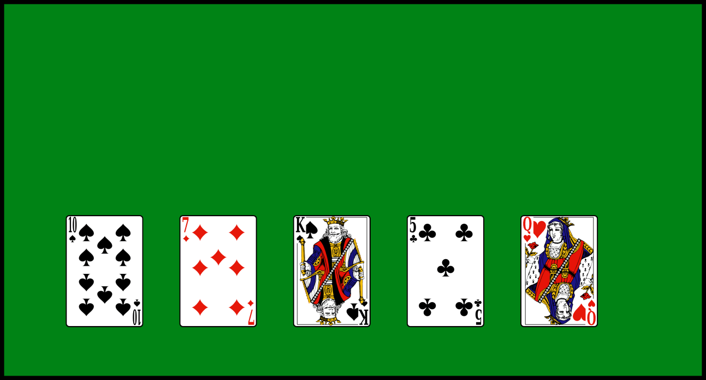
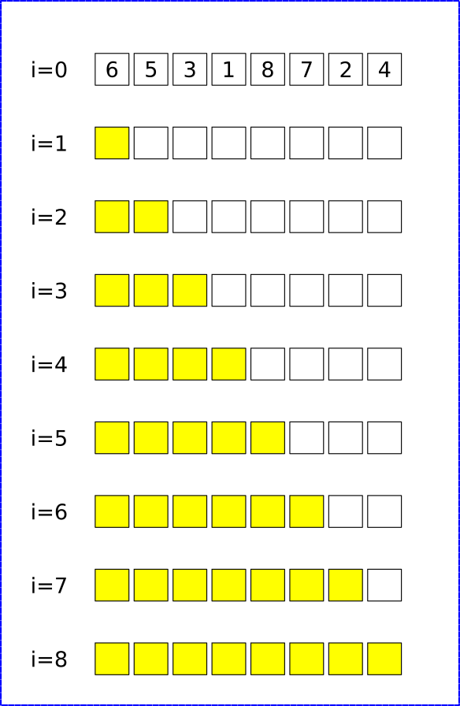
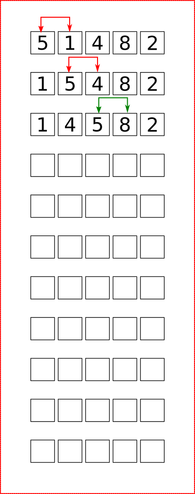

# Premiers algorithmes de tri de tableaux

## Trier de manière naturelle : les algorithmes naïfs

!!! question "Trier à la main"

	=== "Enoncé"
		On donne une main de 5 cartes d'un jeu de 54 cartes. Trier les cartes par ordre croissant, sans tenir compte des couleurs. Vous devrez marquer dans le tableau suivant l'ensemble des changements de positions des cartes dans votre main :
		
		{: style="width:40%; margin:auto;display:block;background-color: #d2dce0;"}
		
		Avez-vous tous utilisé la même méthode ?
	
	=== "Solution 1"
	
		{: style="width:60%; margin:auto;display:block;background-color: #d2dce0;"}
		
	=== "Solution 2"
	
		{: style="width:60%; margin:auto;display:block;background-color: #d2dce0;"}

## Tri par insertion

### Principes

Le principe du {==**tri par insertion**==} est le suivant :

* un tableau de dimension 1 est considéré comme trié, donc le sous-tableau contenant le premier élément est trié ;
* on prend ensuite le deuxième élément, et on l'insère à la bonne place dans le sous-tableau trié ;
* on recommence en considérant chaque élément du tableau.

!!! example "Exemple"

	On veut trier le tableau `[6, 5, 3, 1, 8, 7, 2, 4]`  par un tri par insertion. Compléter le tableau suivant en représentant :
	
	* par des flèches bleues les déplacements d'éléments déjà triés ;
	* par des flèches rouges l'insertion de nouveau éléments dans le sous-tableau trié (cases jaunes).
	
	=== "A compléter"

		{: style="width:40%; margin:auto;display:block;background-color: #d2dce0;"}

	=== "Version complétée"
	
		A venir
		
	=== "GIF extrait de wikipedia"
	
		{: style="width:60%; margin:auto;display:block;background-color: #d2dce0;"}
		
		
### Algorithme en pseudo-code et complexité

!!! abstract "Algorithme"

	<div style="height : 30vh;"></div>
	
!!! info "Quelques remarques"

	* Le tri par insertion est un {==**tri en place**==}, car il trie un tableau sans avoir besoin de tableau auxilliaire.
	* La complexité du tri par insertion est {==**quadratique**==}, c'est-à-dire en $\mathscr{O}(n^2)$ dans le pire des cas, quand le tableau est à l'envers. C'est aussi le cas moyen - ce qui n'est pas très bon en terme de complexité en temps.
	* Cependant, pour un tableau trié ou presque trié, la complexité tombe en $\mathscr{O}(n)$, ce qui est une complexité linéaire, très efficace.

!!! question "Application : Python"

	=== "Exercice"
	
		Construire une *procédure* (c'est-à-dire une fonction sans valeur de retour) Python `triInsertion(tab)` qui trie le tableau `tab` par un tri par insertion.
		
	=== "Solution"
		```` python
		def triInsertion(tab): 
			# Parcour de 1 à la taille du tab
			for i in range(1, len(tab)): 
				k = tab[i] 
				j = i-1
				while j >= 0 and k < tab[j] : 
						tab[j + 1] = tab[j] 
						j -= 1
				tab[j + 1] = k
		````
## Le tri par sélection

### Principes

Le principe du {==**tri par sélection**==} est le suivant :

* On cherche le plus petit élément du tableau, et on échange sa place avec l'élément d'indice 0.
* On recherche ensuite le plus petit élément dans le sous-tableau commençant à l'indice 1, et on échange sa place avec l'élément d'indice 1.
* On recommence ainsi en allant jusqu'à l'avant dernier élément.

!!! example "Exemple"

	On veut trier le tableau `[6, 5, 3, 1, 8, 7, 2, 4]`  par un tri par sélection. Compléter le tableau suivant en représentant par des flèches rouges les échanges de positions entre éléments
	
	=== "A compléter"

		{: style="width:40%; margin:auto;display:block;background-color: #d2dce0;"}

	=== "Version complétée"
	
		A venir

### Algorithme en pseudo-code et complexité

!!! abstract "Algorithme"

	<div style="height : 30vh;"></div>
	
!!! info "Quelques remarques"

	* Le tri par sélection est un {==**tri en place**==}, car il trie un tableau sans avoir besoin de tableau auxilliaire.
	* La complexité du tri par sélection est {==**quadratique**==}, c'est-à-dire en $\mathscr{O}(n^2)$ ddans tous les cas, puisqu'il faut parcourir chques sous-tableau afin de trouver son minimum, et ce pour chaque élément du tableau.

!!! question "Application : Python"

	=== "Exercice"
	
		Construire une *procédure* (c'est-à-dire une fonction sans valeur de retour) Python `triSelection(tab)` qui trie le tableau `tab` par un tri par sélection.
		
	=== "Solution"
		```` python
		def triSelection(tab):
			for i in range(len(tab)):
			  # Trouver le min
			   min = i
			   for j in range(i+1, len(tab)):
				   if tab[min] > tab[j]:
					   min = j						
			   tmp = tab[i]
			   tab[i] = tab[min]
			   tab[min] = tmp
		````
		
## Un autre algorithme de tri : le tri à bulle

L'algorithme de {==**tri à bulles**==} consiste à trier la liste en n'autorisant qu'à intervertir deux éléments consécutifs de la liste. On peut le décrire comme ceci:

* Parcourir tout le tableau et comparer les éléments consécutifs. Lorsque deux éléments sont dans le désordre, les inverser.
* Une fois la fin du tableau, recommencer.
* S'arrêter dès qu'un parcours du tableau n'a échangé aucun élément.

!!! example "Exemple"
	Effectuer le tri à bulle du tableau `[5, 1, 4, 8, 2]`

	=== "A compléter"

		{: style="width:30%; margin:auto;display:block;background-color: #d2dce0;"}

	=== "Version complétée"
	
		A venir
		
!!! question "Exercice"

	=== "Enoncé"
	
		1. Pourquoi, à votre avis, appelle-t-on ce tri un &laquo; tri à bulle &raquo; ?
		2. Quelles propriété at-on après un parcours complet d'un tableau ?
		1. Ecrire un algorithme représentant un tri à bulle.
		2. Quelle est la complexité de cet algorithme ?
		3. Implémenter une procédure python `triBulle(tab)`.
		
	=== "Solution"
		A venir ! 
		