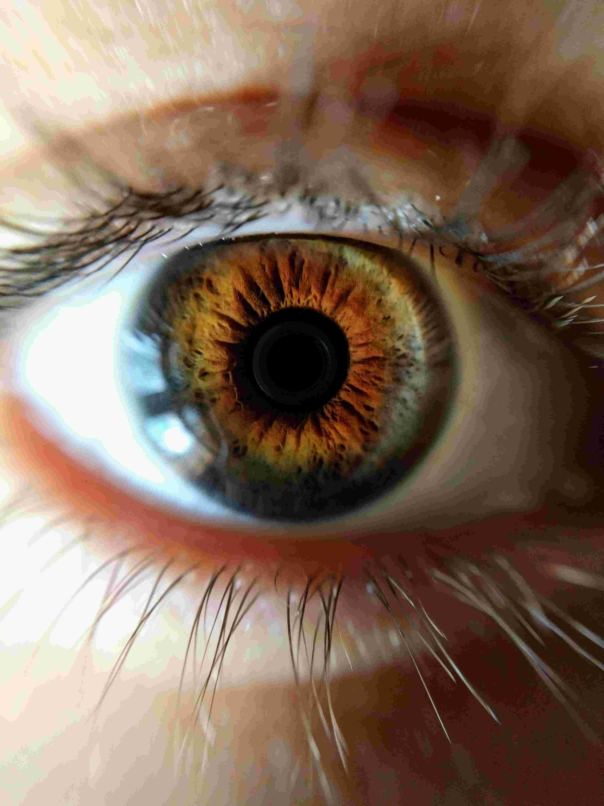

# Les images matricielles

Avant toutes choses, nous allons utiliser le module `pillow` de Python.
Nous allons donc l'installer dans Thonny, en utilisant le menu `Tools > Manage Packages`, et dans la barre de recherche, chercher le module `pillow`, et l'installer s'il n'est pas déjà installé.
			
{: style="width:50%; margin:auto;display:block;background-color: #d2dce0;"}


## Notion de BitMap : une image en noir et blanc

### Bitmap

!!! question "Analyser une première image"
	Considérons l'image suivante :

	{: style="margin:auto;display:block;background-color: #d2dce0;"}
		
	=== "Énoncé"
	
		1. Téléchargez [ici](YingYang.pgm){:target = "_blank"} cette image et sauvegardez-la dans un dossier `BitMap` que vous aurez créé.
		2. Quel est le format de cette image ? Recherchez sa signification sur le web.
		3. Quelles en sont les dimensions en pixels ? Quelle est sa taille en octets ?
		4. Ouvrez l'image grâce au logiciel `Hex Editor Neo` (que vous pouvez mettre en Français par l'intermédiaire de `Tools > Settings > Language`). Le réglage basique de `Hex Editor Neo` donne les valeurs hexadécimales des différents octets composant l'image. Dans la colonne située à droite de ces valeurs hexadécimales, on trouve une représentation de ces octets au format *ANSI*, c'est-à-dire sous forme de caractères. Que retrouve-t-on au tout début de cette colonne ?
		5. En cliquant droit sur les groupes d'octets, effectuer le réglage suivant :
		
			* `Afficher comme > Décimale`
			* `Colonnes > 32 colonnes`
				
			Puis supprimer les 13 premiers octets (juste avant la première valeur 255). Dézoomer avec `CTRL + Molette de souris`. Que voit-on apparaitre ?
		6. Que représente une valeur décimale `255` (ou  `ff` en hexadécimal) ?
		7. Que représente une valeur décimale `0` (ou  `00` en hexadécimal) ?
		
	=== "Réponses"
	
		1. RAS
		2. Format `pgm` : *Portable Gray Map*, permet de faire des images matricielles en nuances de gris.
		3. $32 \times 32$ pixels, soit $1024$ pixels. En octets : $1037$
		4. On retrouve les valeurs 255 et 0.
		5. On voit apparaitre l'image.
		6. 255 représente un pixel blanc.
		7. 0 représente un pixel noir.
	
		
!!! info "Les images matricielles"

	Les {==**images matricielles**==}, ou &laquo; cartes de points &raquo; (de l'anglais *Bitmap*) est une image constituée d'une matrice de points colorés. C'est-à-dire, constituée d'un tableau, d'une grille, où chaque case possède une couleur qui lui est propre et est considérée comme un point. Il s'agit donc d'une juxtaposition de points de couleurs formant, dans leur ensemble, une image. 
	
	Dans notre cas, l'image est une matrice carrée de taille $32\times 32$ pixels. Chaque pixel peut donc être repéré par ses coordonnées, comme sur le schéma ci-dessous, où `width` (*largeur* en anglais) et `height` (*hauteur* en anglais) sont les dimensions de l'image. **Attention ! Le sens de l'axe de ordonnées est inversés par rapport aux mathématiques !**
	
	{: style="width:50%;margin:auto;display:block;background-color: #d2dce0;"}
	
!!! info "Taille des images en noir et blanc"
	En fait notre image utilise beaucoup plus de place en mémoire qu'elle ne le devrait. En effet, pour représenter 2 couleurs (noir et blanc), un seul bit suffit. 0 représente un pixel noir, et 1 représente un pixel blanc. Le format `pgm` n'est pas vraiment adapté aux pures images en noir et blanc, puisqu'il utilise 1 octet complet pour représenter la couleur, soit 8 fois plus que ce qui est strictement nécessaire.
	
### Manipulation d'images avec Pillow
	
!!! info "Module Pillow"

	Le module `pillow` de python permet la manipulation des images. Son guide (en anglais) est disponible [ici](https://pillow.readthedocs.io/en/stable/handbook/index.html){: target="_blank"}.
	
	Son utilisation basique est relativement simple, testez par exemple le code suivant :
	
	```` python linenums="1"
	from PIL import Image 
	
	originale = Image.open("YingYang.pgm")
	width, height = originale.size 
	
	copie = Image.new(originale.mode, originale.size) 	
	
	for x in range(width) : 						
		for y in range(height) :					
			if originale.getpixel((x,y)) == 255 :	
				copie.putpixel((x, y), 0)
			else :
				copie.putpixel((x, y),  255)
				
	copie.save("YangYing.bmp")
	copie.show()
	````
	
	Explicitons alors ce code :
	
	* Ligne 1 : on importe la *classe* `Image` du module `PIL` (c'est-à-dire `pillow`).
	* Ligne 3 : on utilise la *méthode* `open` de la classe `Image` pour ouvrir l'image `YingYang.pgm` et la stocker dans la variable `originale`, qui est donc un objet de type `Image`.
	* Ligne 4 : on utilise l'*attribut* `size` des objets `Image` extraire la largeur et la hauteur de notre image, et les stocker dans les variables `width` et `height`, de type `int`.
	* Ligne 6 : `copie` est un nouvel objet de type `Image`, qui possède les mêmes caractéristiques que l'image originale : son `mode` (nous reviendrons dessus plus loin), et sa taille grâce à l'attribut `size`.
	* Lignes 8-9 : on va parcourir l'image originale pixel par pixel, en effectuant le parcours colonnes par colonnes.
	* Lignes 10 : on récupère la valeur du pixel de coordonnées $(x;y)$ de l'image originale grâce à la *méthode* `getpixel`, et **on regarde si il est blanc** (`==255`).
	* Ligne 11 : si la condition précédente est vraie, on va fixer la couleur du pixel de coordonnées $(x;y)$ de la copie à noir (`0`), grâce à la méthode `putpixel` (**Attention !** `putpixel` et `getpixel` n'acceptent que des tuples pour les coordonnées ! Si vous oubliez la paire de parenthèses, vous risquez d'obtenir `TypeError: putpixel() takes 3 positional arguments but 4 were given`).
	* Lignes 12-13 : si la condition est fausse, on va fixer la couleur du pixel de coordonnées $(x;y)$ de la copie à blanc (`255`).
	* Ligne 15 : on sauvegarde la copie sous le nom `YangYing.bmp`. Vous devriez trouver ce fichier dans votre dossier. On notera que `pillow` accepte de changer le type de fichier (ici on est passé de `pgm` à `bmp`).
	* Ligne 16 : on affiche l'image `copie`.
	
	
!!! question "Factorisation du code"

	=== "Énoncé"
		Transformez le code précédent en créant une fonction `inverseNB(img)` qui prend en argument un objet `img` de type `Image` et qui renvoie un nouvel objet de type `Image` de même dimension et même mode que l'argument, mais ayant ses couleurs noirs et blanc inversées.
		
	=== "Correction"
		```` python
		def inverseNB(img) :
			width, height = img.size 
			copie = Image.new(img.mode, img.size) 	
	
			for x in range(width) : 						
				for y in range(height) :					
					if img.getpixel((x,y)) == 255 :	
						copie.putpixel((x, y), 0)
					else :
						copie.putpixel((x, y),  255)
			return copie
		````
	
??? question "Pour les cracks : améliorons le code"

	=== "Énoncé"
		En fait le code ci dessus n'est valable que pédagogiquement, pour comprendre les . Il est tout à fait possible de se passer de la structure conditionnelle des lignes 10 à 13, qui peuvent être effectuées en une seule ligne ! Comment faire ?
	=== "Réponse"
		```` python
		def inverseNB(img) :
			width, height = img.size 
			copie = Image.new(img.mode, img.size) 	
	
			for x in range(width) : 						
				for y in range(height) :					
					copie.putpixel((x, y), 255 - img.getpixel((x,y)))
			return copie
		````

## Les niveaux de gris

### Un exemple


!!! question "Une nouvelle image"
	On considère maintenant l'image suivante :

	{: style=";margin:auto;display:block;"}

	téléchargeable [ici](Troopers.pgm){:target = "_blank"}.
	
	
	=== "Énoncé"
	
		1. Quelle est la dimension de cette image en pixels ? Quelle est sa dimension en octets ?
		2. Ouvrez-là avec `Hex Editor Neo`. Quelle est la principale différence avec l'image précédente ?
		3. Testez sur cette image la fonction `inverseNB`. Obtient-on un négatif de cette image ?
	=== "Réponses"
		
		1. $29 \times 54$ pixels, soit 1566 pixels, pour une taille de 1579 octets.
		2. Il y a d'autres valeurs entre 0 et 255.
		3. Non.
		
!!! abstract "Images en niveaux de gris - *Grayscale*"

	Pour représenter une palette de 256 couleurs allant du noir au blanc, on utilise un octet complet
	
	* la valeur 0 représente le noir ;
	* la valeur 255 représente le blanc ;
	* une valeur proche de 0 représente un gris foncé
	* une valeur proche de 255 représente un gris clair.
	
	Une telle image, dite en &laquo; niveaux de gris &raquo;, utilise 1 octet par pixel.
	
### Manipulation d'une image en niveau de gris

!!! question "Manipuler les images"

	=== "Énoncé"
	
		1. Téléchargez une image quelconque libre de droits sur internet - peu importe son format.
		2. On cherche à obtenir un négatif de l'image. Pour ce faire, il faut utiliser une fonction mathématique. En effet, ce que nous voulons, c'est une fonction qui transforme :
		
			* 0 en 255
			* 1 en 254
			* 2 en 253 
			* ...
			* 254 en 1
			* 255 en 0
			
			Quelle est cette fonction ?
		3. Créer alors une fonction python `négatif(img)` qui renvoie le négatif de l'objet `img` de type `Image`.
		4. **Éclaircissement d'une image :**
		
			Pour éclaircir une image, il faut transformer les valeurs *grayscale* de chaque pixel en les augmentant. Une possibilité simples est de les augmenter d'un terme constant, comme 20 par exemple. Ainsi, un pixel initialement à 0 sera changé à 20, et un pixel à 147 sera changé à 167 (pillow n'autorisera pas les dépassement au delà de 255, donc un pixel à 250 sera bien transformé à 255).
			
			Créer alors une fonction python `éclaircir(img, t=20)` qui renvoie un nouvel objet de type `Image`, version éclaircie de l'objet `img` de type `Image` passé en argument, et utilisant l'argument optionnel `t`.
		5. **Assombrissement d'une image :** 
		
			Créer de même une fonction python `assombrir(img, t=20)` qui renvoie un nouvel objet de type `Image`, version assombrie de l'objet `img` de type `Image` passé en argument, et utilisant l'argument optionnel `t`.
			
		6. Était-on vraiment obligé de faire deux fonctions ?
			
	=== "Correction" 
	
		1. RAS
		2. $f : x \mapsto 255 -x$
		3. La fonction :
			```` python
			def negatif(img) :
				width, height = img.size 
				copie = Image.new(img.mode, img.size) 	
		
				for x in range(width) : 						
					for y in range(height) :					
						copie.putpixel((x, y), 255 - img.getpixel((x,y)))
				return copie
			````
		4. La fonction :
			```` python
			def eclaircir(img, t=20) :
				width, height = img.size 
				copie = Image.new(img.mode, img.size) 	
		
				for x in range(width) : 						
					for y in range(height) :					
						copie.putpixel((x, y), t + img.getpixel((x,y)))
				return copie
			````
		5. La fonction :
			```` python
			def assombrir(img, t=20) :
				return eclaircir(img, -t)
			````
		6. Non, au vu de la question précédente 
		
??? question "Pour les cracks"

	Nos éclaircissement et assombrissement précédents ne sont guère satisfaisants... car nous ne jouons pas sur le contraste. Il existe bien de fonctions mathématiques permettant d'améliorer notre méthode. Vous pouvez vous inspirer du travail de [Paul Milan](https://www.lyceedadultes.fr/sitepedagogique/documents/math/mathTermS/08_integration/08_cours_algorithme_fonction_retouche.pdf){: target= "_blank"}, très mathématique, ou bien tester les fonctionnalités du module `pillow`, en suivant par exemple ce [tutoriel](http://www.ordinateur.cc/programmation/Programmation-Python/93546.html){: target="_blank"}.
		 

### Images en couleur


Il est temps de mettre un peu de couleur !

!!! asbtract "Synthèse additive RGB"
	Un pixel  de couleur est représenté par un triplet $(R;G;B)$, où $R$, $G$ et $B$ sont des valeurs de $0$ à $255$ représentant respectivement les couleurs rouges, vertes et bleues. Un tel système permet de représenter $256^3 = 16~277~216$ nuances de couleurs différentes, par **synthèse additive des couleurs**. Ce format est adapté à la lecture sur écran (on utilise un système différent pour l'impression des images, le système *CYMB* - Cyan Yellow Magenta Black - qui utilise la synthèse soustractive).

	{: style="width:20%;margin:auto;display:block;background-color: #d2dce0;"}

	De ce fait, dans un format non compressé comme le format `BMP`, chaque pixel est représenté par 3 octets.

!!! example "Exemple"
	On considère l'image suivante :
	
	{: style="width:30%;margin:auto;display:block;background-color: #d2dce0;"}
	
	L'image est de dimension $320 \times 100$ et pèse 96 ko, ce qui correspond $320 \times 100 \times 3 = 96~000~o$ (en n'oubliant pas les méta-données).
	
!!! question "RGB et pillow"

	=== "Énoncé"
		1. Téléchargez l'image suivante : {: style="width:20%;margin:auto;display:block;background-color: #d2dce0;" title ="Depuis wikipedia RGB"}
		2. Créer un code  dans Thonny ouvrant l'image et affichant cette image :
			
			```` python
			from PIL import Image	
			originale = Image.open("TroisCercles.bmp") ## Attention si vous avez changé le nom !
			originale.show()
			````
		3. .
			1. Insérez dans ce code la commande :
				```` python
				print(image.getpixel((150,50)))			
				````
			Que renvoie-t-elle ?
			2. A l'aide d'un éditeur d'images, repérer dans l'image précédente le pixel de coordonnées $(150 ; 50)$. Quelle est sa couleur ?
		4. Reprendre la question 3 avec les pixels suivants :
			1. $(50 ; 100)$
			2. $(250 ; 100)$
			3. $(100 ; 130)$
			4. $(200 ; 130)$
			5. $(50 ; 230)$
			6. $(150 ; 150)$
			
	=== "Solutions"
	
		A venir !

!!! info "Transparence"

	Dans certains formats d'image il est possible d'utiliser un quatrième octet pour chaque pixel, qui permet de gérer la {==**transparence**==}(aussi appelée {==**canal alpha**==}) de ce pixel. Cette valeur défini un pourcentage de transparence permettant de voir au travers de ce pixel, et donc de superposer des images.

	Par exemple, les deux images suivantes sont construites ainsi : une est construite en `jpg`, sans transparence, avec fond noir, et la seconde est en `png`, avec transparence pour le fond de couleur noire :

	<div style="display:flex;">
	<div style="display : inline; width : 50%;">

	{: style="width:15%; margin:auto;display:block;background-color: #d2dce0;"}

	</div>
	<div style="display : inline; width : 50%;">

	{: style="width:15%; margin:auto;display:block;"}

	</div>
	</div>

	Dans un format avec transparence, la valeur 0 correspond à un pixel totalement opaque, et une valeur 255 à un pixel totalement transparent.


### Compression des images

!!! tips "Compression des images"

	Les images sont très gourmandes en place mémoire. Un moniteur moderne supportant une résolution 4K a pour dimension $4~096 \times 2~160$ pixels, soit plus de 8,8 millions de pixels. Une image de fond d'écran couleur, avec transparence, **non compressée**,  représente donc plus de $8,8 \times 4 \simeq 35$ millions d'octets, soit plus de 35 Mo.
	
	Pourtant une image comme [celle-ci](https://s1.1zoom.me/big3/272/Star_Wars_Soldiers_458514.jpg){: target="_blank"} (crédits inconnus), pourtant bien de la dimension $4~096 \times 2~160$, pèse seulement 4,52 Mo.
	
	Ceci est du à un processus appelé {==**compression d'images**==}, qui peut être effectué de plusieurs manières différentes :
	
	* en réduisant le nombre de couleurs réelles de l'image (on crée une palette spécifique pour cette image, dont la table de correspondance est insérée dans les méta-données de l'image) ;
	* en groupant les pixels contigus de même couleur (100 pixels de la même couleur sur la même ligne occupent a minima 300 octets, alors que l'information  &laquo; Il y a 100 pixels sur cette ligne de la même couleur à partir de la position $(x_0;y_0)$ &raquo; peut occuper uniquement 6 octets - 1 pour le nombre 100, un pour $x_0$, un pour $y_0$ et 3 pour la couleur RGB) ;
	* etc...
	
	Par exemple, l'algorithme de compression JPEG redéfinit les couleurs des pixels en leurs ré-attribuant une couleur moyenne qui est calculée en fonction des couleurs des pixels voisins, et  qui dépend d'un **taux de compression** définissable par l'utilisateur. Plus le taux de compression est élevé, plus l'image sera dégradée ({==**compression avec perte**==}):
	
	<div style="display:flex;">
	<div style="display : inline; width : 30%;">

	{: style="width:80%; margin:auto;display:block;background-color: #d2dce0;"}

	Original : 1,42 Mo
	
	Format déjà compressé
	
	</div>
	<div style="display : inline; width : 30%;">

	{: style="width:80%; margin:auto;display:block;background-color: #d2dce0;"}
	
	Copie 1 : 205 ko
	
	Compression depuis original : 90%

	</div>
	<div style="display : inline; width : 30%;">

	{: style="width:80%; margin:auto;display:block;background-color: #d2dce0;"}
	
	Copie 2 : 162 ko
	
	Compression depuis original  : 99%

	</div>
	</div>
	
	Il existe cependant des algorithmes de {==**compression sans perte**==}, comme par exemple avec le format `png`.
	
### Les formats des fichiers images

Il existe de nombreux formats d'images numériques de types **matriciels**. Les principaux sont donnés dans le tableau suivant :

| Type | Extension | Compression | Transparence | Utilisation |
| :---: | :---: | :---: | :---: | :---: |
| JPEG | .jpg , .jpeg , .jfif , .pjpeg , .pjp | avec pertes | Non |  Web, aperçus, impressions (si peu de compression) |
| PNG | .png | sans pertes | Oui | Besoin de transparence fine, peu de couleurs   |
| GIF | .gif | avec pertes | Oui (partielle) | Images animées, fichiers de petites tailles |
| TIFF | .tiff, .tif | sans pertes | Non | Images hautes définition, scans précis |
| RAW |.raw, .data, ...| Non | Non | Images brutes, éditions de photos |
| BMP | .bmp | Non | En partie | Paint... |


Les logiciels de retouches et d'édition d'images matricielles sont nombreux, le plus connu étant le célèbre `Photoshop`, mais qui est un logiciel propriétaire. 

Son équivalent libre est `GIMP`. Il offre les mêmes fonctionnalités, et ne demande qu'une simple adaptation à l'interface...


??? tips "Images Vectorielles"

	Dans le tableau précédent, vous n'avez que des format d'images *matricielles*. Il existe aussi un autre type d'images numériques appelé **images vectorielles**, construites sur un tout autre principe.
	
	Une image vectorielle est une image pour laquelle les éléments constitutifs sont **stockée sous la forme d'équations**.
	
	Ainsi l'image du manchot [Tux](https://upload.wikimedia.org/wikipedia/commons/b/b0/NewTux.svg){: target="_blank"}, mascotte officielle du noyau Linux (à ne pas confondre avec [GNU/Linux](https://upload.wikimedia.org/wikipedia/commons/5/53/GNU_and_Tux.svg){: target="_blank"}), est une image vectorielle au format `SVG`, qui peut être ouverte par `Notepad++`. On trouve dans le fichier la description des différentes courbes, surfaces, etc... qui décrivent l'image. 
	
	L'avantage d'une telle image est qu'elle ne pixelisera pas, quel que soit le zoom qui lui est appliqué (en théorie...).
	
	De telles images peuvent être crées et manipulées à l'aide du logiciel libre `Inkscape`.


## Manipulation des images

### Création d'images

!!! info "Exemple de création d'image RGB avec Pillow"

	Le code suivant permet de créer une image au format `png` des trois cercles colorés de la synthèse additive :
	
	```` python linenums="1"
	from PIL import Image
	from math import sqrt

	def distance(p1, p2) :
		return sqrt((p1[0]-p2[0])**2+(p1[1]-p2[1])**2)

	def makeCircles(a) :
		width = 3*a
		height = int((2+sqrt(3)/2)*a)
		img = Image.new("RGB", (width, height))
		for x in range(width) :
			for y in range(height) :
				R = 255*(distance((x, y), (2*a, (1+sqrt(3)/2)*a))<a)
				G = 255*(distance((x, y), (3*a/2, a))<a)
				B = 255*(distance((x, y), (a, (1+sqrt(3)/2)*a))<a)
				img.putpixel((x, y),(R, G, B))
		return img
		
	if __name__ == "__main__" :
		image = makeCircles(100)
		image.save("TroisCercles.png")
	````
	
	Les lignes importantes sont les suivantes :
	
	* Ligne 10 : on crée une nouvelle image utilisant le format RGB, de la largeur et de la hauteur donnée (sous la forme d'un tuple de dimension 2). On pourrait créer une image avec transparence en utilisant le format `RGBA` - voir [ici](https://pillow.readthedocs.io/en/stable/handbook/concepts.html#concept-modes){: target = "_blank"}
	* Lignes 11-12, on parcours l'image colonne par colonne, `x` étant l'abscisse (= le numéro de colonne) et `y` étant l'ordonnée (= le numéro de ligne).
	* ligne 16 : on place à la position $(x;y)$ un pixel dont la couleur est donnée par le tuple `(R, G, B)`, conformément au mode choisi en ligne 10.
	* ligne 21 : l'objet `image` renvoyé par la fonction `makeCircles` avec l'argument 100 est sauvegardée sous le nom `TroisCercles.png` grâce à la *méthode* `save`.
	
??? info "Un peu de maths"

	L'image est construite à partir d'un triangle équilatéral de côté $a$ dont les sommets sont les centres des trois cercles RGB, et dont les coordonnées sont respectivement $(2a ; (1+\cfrac{\sqrt{3}}{2}a)$, $(\cfrac{3}{2}a ; a)$ et $(a ; (1+\cfrac{\sqrt{3}}{2}a)$.
	
!!! question "Créer des images simples"

	=== "Énoncé"
	
		1. Créer le drapeau français sous la forme d'une image de taille $300 \times 200$.
		2. Créer le drapeau néerlandais sous la forme d'une image de taille $300 \times 210$.
		3. Créer un damier noir et blanc (ou toute autre paire de couleurs), de dimension $600 \times 400$, et donc chaque carré à une taille de 20 pixels (*Indice : pensez à la division euclidienne et à l'opérateur modulo %*).
		
	=== "Corrigé"
		
		1. Le drapeau français :
			```` python
			def drapeauFR() :
				drapeau = Image.new('RGB', (300,200))
				for x in range(300) :
					for y in range(200) :
						drapeau.putpixel((x, y), (255*(x>=100), 255*(100<=x<200), 255*(x<200)))
				drapeau.show()
			````
		2. Le drapeau Néerlandais
			```` python
			def drapeauNL() :
				drapeau = Image.new('RGB', (300,210))
				for x in range(300) :
					for y in range(210) :
						drapeau.putpixel((x, y), (255*(y<=140), 255*(70<=y<140), 255*(y>70)))
				drapeau.show()				
			````
		3. Le damier de taille 20 pixels :
		
			```` python
			def damier() :
				damier = Image.new('RGB', (600,400))
				for x in range(600) :
					for y in range(400) :
						c = x//20 # Numéro de colonne
 						l = y//20 # Numéro de ligne
						if  c%2 == l%2 :
							damier.putpixel((x, y), (0,0,0))
						else :
							damier.putpixel((x, y), (255,255,255))
				damier.show()				
			````
		
			
		
### Symétries

!!! question "Symétries axiales et centrales"

	=== "Énoncé"
		
		Sélectionnez une image libre de droit sur le web.
		
		1. Créez une fonction `symetrieVerticale` qui prend en argument un objet de type `Image` et qui renvoie un nouvel objet de type `Image` qui correspond à l'image symétrique de l'originale par une symétrie d'axe médian vertical.
		2. Créez une fonction `symetrieHorizontale` qui prend en argument un objet de type `Image` et qui renvoie un nouvel objet de type `Image` qui correspond à l'image symétrique de l'originale par une symétrie d'axe médian horizontal.
		3. Créez une fonction `symetrieCentrale` qui prend en argument un objet de type `Image` et qui renvoie un nouvel objet de type `Image` qui correspond à l'image symétrique de l'originale par une symétrie de centre correspondant au centre de l'image.
		
	=== "Solutions"
	
		1. Symétrie Verticale :

			```` python
			def symetrieVerticale(originale) :
				width, height = originale.size
				nouvelle = Image.new(originale.mode, originale.size)
				for x in range(width) :
					for y in range(height) :
						p = originale.getpixel((x,y))
						nouvelle.putpixel((width-1-x, y) , p)
				return nouvelle
			````
			
		2. Symétrie horizontale :

			```` python
			def symetrieHorizontale(originale) :
				width, height = originale.size
				nouvelle = Image.new(originale.mode, originale.size)
				for x in range(width) :
					for y in range(height) :
						p = originale.getpixel((x,y))
						nouvelle.putpixel((x, height-1-y) , p)
				return nouvelle
			````
		3. Symétrie centrale :
		
			```` python
			def symetrieCentrale(originale) :
				return symetrieHorizontale(symetrieVerticale(originale))
			````
			
### Filtres colorés

!!! info "Filtre vert"

	Quand on applique un filtre vert à une image numérique, on parcourt l'image entière en ne récupérant pour chaque pixel que sa composante verte, et en mettant le rouge et le bleu à 0. Par exemple, avec une image de type `png` et en gardant le canal alpha : 
	
	<div style="display:flex;">
	<div style="display : inline; width : 50%;">

	{: style="width:15%; margin:auto;display:block;"}

	</div>
	<div style="display : inline; width : 50%;">

	{: style="width:15%; margin:auto;display:block;"}

	</div>
	</div>
	
	
!!! question "Filtres de couleur"

	=== "Énoncé"
	
		1.  Créer une fonction `filtreCouleur` qui prend en argument un objet de type `Image` et un tuple `(r, g, b, a)`, où `r, g, b` et `a` sont des  booléens, et qui renvoie une nouvelle image pour lesquelles les couleurs RGBA sont conservées si le booléen correspondant est `True`. Par exemple, l'image de Naruto verte ci-dessus est obtenue par le code :
		
			```` python
			naruto = Image.open("Naruto.png")
			narutoGreen = filtreCouleur(naruto, (False, True, False, True))
			narutoGreen.show()
			````
		
			Créer ainsi des images `NarutoRouge.png`, `NarutoBleu.png`, `NarutoJaune.png`, `NarutoMagenta.png` et `NarutoCyan.png`
		
		3. Créer maintenant l'image suivante à partir de `pillow` (*indice : pensez à l'opération modulo !*) :
			
			{: style="width:80%; margin:auto;display:block;"}
			
		2. Créer une fonction `negatif` qui prend en argument une image et inverse les octets de chacune de ses composantes, en conservant le canal alpha. On obtiendra par exemple :
		
			{: style="width:15%; margin:auto;display:block;"}
			
	=== "Réponse"
		
		1. Filtre couleur :

			```` python
			def filtreCouleur(img, filtre) :
				fr, fg, fb, fa = filtre
				copie = Image.new(img.mode, img.size)
				width, height = img.size
				for x in range(width) :
					for y in range(height) :
					   pr, pg, pb, pa = img.getpixel((x,y))
					   copie.putpixel((x,y), (pr*fr, pg*fg, pb*fb, pa*fa))
					   # ou copie.putpixel((x,y), tuple(f*p for f, p in zip(filtre, img.getpixel(x,y))
				return copie
			````
		

### Agrandissements et réductions d'un facteur 2

#### Version naïve

!!! question "Agrandissement d'un facteur 2"

	=== "Énoncé"

		Le principe d'agrandissement d'un facteur 2 est le suivant : chaque pixel va être dupliqué 4 fois comme sur le schéma suivant :
		
		{: style="width:30%; margin:auto;display:block;;background-color: #d2dce0;"}
		
		Compléter la fonction `doubleSimple(image)` qui prend en argument un objet de type `Image` et renvoie un autre objet de type `Image` deux fois plus grand utilisant la technique montrée ci-dessus :
		
		```` python linenums="1"
		def doubleSimple(image) :
			w, h = image.size
			double = Image.new('RGBA', ...)    
			for x in range(...) :
				for y in range(...) :
					double.putpixel((2*x,2*y), image.getpixel((x, y)))
					...
					...
					...
			return double
		````
	=== "Solution"
		```` python linenums="1"
		def doubleSimple(image) :
			w, h = image.size
			double = Image.new('RGBA', (2*w, 2*h))    
			for x in range(w) :
				for y in range(h) :
					double.putpixel((2*x,2*y), image.getpixel((x, y)))
					double.putpixel((2*x+1,2*y), image.getpixel((x, y)))
					double.putpixel((2*x,2*y+1), image.getpixel((x, y)))
					double.putpixel((2*x+1,2*y+1), image.getpixel((x, y)))
			return double
		````
	
!!! question "Réduction d'un facteur 2"

	=== "Énoncé"
	
		Encore une fois le principe est simple, on ne garde qu'un pixel sur deux, au choix, les pixels de rang pairs ou bien impairs (ici on garde ceux de rang impair):

		{: style="width:30%; margin:auto;display:block;;background-color: #d2dce0;"}
		
		Créer une fonction `reductionSimple(image)` qui prends en argument un objet de type `Image` est qui renvoie sa version réduite avec la méthode ci-dessus.
		
	=== "Solution"
	
		```` python linenums = "1"
		def reductionSimple(image) :
			w, h = image.size
			reduction = Image.new('RGBA', (w//2, h//2))    
			for x in range(w//2) :
				for y in range(h//2) :
					reduction.putpixel((x,y), image.getpixel((x*2, y*2)))
			return reduction
		````
		
!!! question "Combiner les deux"

	=== "Énoncé"
	
		1. Créer, à partir d'une image de base, une image réduite, puis, à partir de cette image réduite, une nouvelle image agrandie.
			1. Vérifier que cette dernière est bien de la même taille que l'image originale.
			2. Comparer alors cette image avec l'originale. La transformation est-elle avec pertes ou sans pertes ?
		2. Recommencer mais en agrandissant d'abord.
		3. Comparer les images obtenues en 1 et en 2. Sont-elles identiques ?
	
	=== "Solution"
	
		A venir !
		
### Version "pour les cracks"

!!! info "Interpolation"

	Le principe de l'interpolation est d'augmenter ou de diminuer la matrice initiale d'une image, en créant les nouveaux points à partir de ceux de l'image originale, en y appliquant éventuellement des fonctions mathématiques.
	
	Il existe de nombreuses méthodes d'interpolation en imagerie numérique, certaines nécessitant des algorithmes complexes.
	
	Celles présentées ici font partie des plus simples.
	
	
	
	
!!! question "Agrandissement avec interpolation par moyenne"

	=== "Énoncé"
	
		La méthode que nous allons utiliser est la suivante :
		
		{: style="width:30%; margin:auto;display:block;;background-color: #d2dce0;"}
		
		Entre deux pixels existants, que ce soit horizontalement, verticalement ou en diagonale, on insère un pixel dont la valeur `RGBA` est égale à la moyenne des valeurs `RGBA` des deux pixels qui l'encadrent.
		
		1. Créer une fonction `moyenne(px1, px2)` qui prend en argument les valeurs `RGBA` de ces deux pixels et renvoie un tuple de dimension 4 correspondant à la moyenne par composante `RGBA`.
		2. Créer, en s'inspirant de la fonction à partir de la fonction `doubleSimple`, une fonction `doubleInterpolation(image)` qui prend en argument un objet de type `Image` et qui renvoie un nouvel objet de dimension double en utilisant la technique précédente. *Attention ! Il y a des cas limites à prévoir  dans la manipulation des pixels !*
		
	=== "Solution"
	
		A venir !
		
!!! question "Réduction avec interpolation par moyenne des voisins"

	=== "Énoncé"
	
		La méthode que nous allons utiliser va consister à reprendre la méthode utilisée dans la réduction simple, c'est-à-dire de prendre un pixel sur deux, mais le pixel écrit dans la nouvelle image sera obtenu en effectuant la moyenne des valeurs `RGBA` de tous les voisins du pixel choisi :
		
		{: style="width:30%; margin:auto;display:block;;background-color: #d2dce0;"}
		
		1. Créer une fonction `moyenneVoisin(image, x, y)` qui prend en argument un objet de type `Image`, et deux entiers `x` et `y`, et qui renvoie un tuple correspondant à la moyenne des valeurs `RGBA` des voisins du pixel de coordonnées $(x~;~y)$ de l'image `image`.
		2. A l'aide de la fonction précédente, et en s'inspirant de la fonction `reductionSimple`, créer une fonction `reductionInterpolation(image)` qui renvoie une image réduite en utilisant la technique précédente.
		
!!! question "Combiner les deux"

	=== "Énoncé"
	
		1. Créer, à partir d'une image de base, une image réduite, puis, à partir de cette image réduite, une nouvelle image agrandie.
			1. Vérifier que cette dernière est bien de la même taille que l'image originale.
			2. Comparer alors cette image avec l'originale. La transformation est-elle avec pertes ou sans pertes ?
		2. Recommencer mais en agrandissant d'abord.
		3. Comparer les images obtenues en 1 et en 2. Sont-elles identiques ?
		4. Comparer maintenant les transformations simples avec les transformations avec interpolation.
		
	
	=== "Solution"
	
		A venir !
		

		
	
	
	