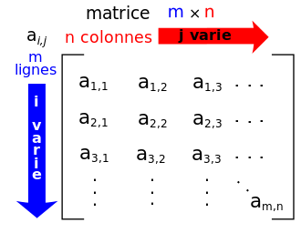

# Tableaux à deux dimensions : les Matrices


## Définitions et premiers exemples

!!! abstract "Matrices"
	En mathématiques, on appelle {==**matrice**==} un tableau $M$ de nombres $a_{i,j}$ où $i$ est le numéro de ligne et $j$ le numéro de colonne. On parlera de matrice de dimension $m\times n$ si la matrice possède $m$ lignes et $n$ colonnes.
 
 	{: style="width:20%; margin:auto;display:block;background-color: #d2dce0;"}
	
	Les matrices sont des éléments esentiels de l'algèbre linéaire, et elles sont un outils efficace dans beaucoup de problèmes aussi bien mathématiques qu'informatique.
 
!!! info "Représentation informatique"
	Pour représenter informatiquement une matrice de nombres, entiers ou flottant, on utilise un **tableau de tableau**. Ainsi la matrice $M = \begin{pmatrix}1&2&3\\4&5&6\end{pmatrix}$ sera représentée sous la forme suivante :

	```` python
	M = [[1, 2, 3], [4, 5, 6]]
	````
	
	En Python, il est souvent préférable de définir une matrice en utilisant la possibilité de sauter des lignes à l'intérieur de deux délimiteurs (paires de parenthèses, crochets, etc...) :
	
	```` python
	M = [
		[1, 2, 3],
		[4, 5, 6]
		]		
	````

	On peut alors accéder aux éléments de la matrice par la notation suivante `M[1][2]`, ce qui correspond à **l'élément d'indice 2 de la ligne d'indice 1**, soit dans notre exemple $6$. Autrement dit, il s'agit de l'élément de la ligne 1 et de la colonne 2 : 
	
	<iframe width="800" height="350" frameborder="0" src="https://pythontutor.com/iframe-embed.html#code=M%20%3D%20%5B%5B1,%202,%203%5D,%0A%20%20%20%20%5B4,%205,%206%5D%5D%0Aprint%28M%5B1%5D%5B2%5D%29&codeDivHeight=400&codeDivWidth=350&cumulative=false&curInstr=0&heapPrimitives=nevernest&origin=opt-frontend.js&py=3&rawInputLstJSON=%5B%5D&textReferences=false"> </iframe>
	
!!! warning "Une règle implicite"

	Mathématiquement, toutes les lignes d'un matrice sont de la même dimension. Or ce n'est pas obligatoire dans une construction de liste de listes en Python. En effet une variable telle que la suivante est tout à fait possible :
	
	```` python
	M = [
		[1, 2],
		[3, 4, 5, 6],
		[],
		[7, 8, 9, 10, 11, 12]
		]	
	````
	
!!! question "Lire une matrice"
	On considère la matrice suivante :
	```` python
	>>> M =[
			[1, 2, 3, 4, 5],
			[2, 4, 6, 8, 10],
			[3, 6, 9, 12, 15],
			[4, 8, 12, 16, 20]
			]
	````
	=== "Enoncé"

		1. A quel nombre fait référence l'élément $M[1][3]$ ?
		1. Comment obtenir le nombre $15$  ? 
		1. A quel nombre fait référence l'élément $M[-1][2]$ ?
		1. A quel nombre fait référence l'élément $M[0][-2]$ ?
		
	=== "Solutions"
		A venir !

## Parcourir une matrice

!!! question "Parcourir une matrice"

	=== "Enoncé"
		Pour parcourir une matrice, il faut utiliser deux boucles `for` imbriquées l'une dans l'autre :
		
		1. Tester le code suivant sur une matrice $M = \begin{pmatrix}1&2&3\\4&5&6\end{pmatrix}$.
		
			```` python 
			for i in range(2) :
				for j in range(3) :
					print(M[i][j])
			````
			Dans quel ordre apparaissent les éléments ?


		2. Tester le code suivant, toujours sur la matrice $M$
			```` python 
			for j in range(3) :
				for i in range(2) :
					print(M[i][j])
			````
			Dans quel ordre apparaissent les éléments ?
		3. Dans le code précédent, que se passe-t-il si on écrit `print(M[j][i])` ?
		4. Tester le code suivant, toujours sur la matrice $M$
			```` python 
			for line in M :
				for elem in line :
					print(elem)
			````
			Dans quel ordre apparaissent les éléments ?
		5. Est-il possible d'inverser le type de parcours précédent ?
		6. Tester le code suivant, toujours sur la matrice $M$
			```` python 
			for i, line in enumerate(M) :
				for j, elem in enumerate(line) :
					print(f"M[{i}][{j}] = {elem}")
			````
			A quoi sert la fonction `enumerate` ?
		7. Ecrire une fonction `parcoursIndicesLignes(M)` qui effectue un parcours par indice et par ligne de la matrice qui lui est passée en argument. On pourra tester avec les matrices suivantes :
		
			```` python 
			M1 = [[0]]
			M2 = [[1, 2],
				[3, 4]]
			M2 = [[1, 2],
				[3, 4],
				[5, 6]]
			M3 = [[1, 2, 3, 4, 5],
				[6, 7, 8, 9, 10]]
			````
	=== "Solutions"
		A venir !

## Initialisation de matrices


!!! info "Pourquoi initialiser"
	Très souvent on va travailler sur un tableau et/ou une matrice dont on connait au préalable la dimension, et sur laquelle on va modifier les valeurs au fur et à mesure. Il sera souvent plus facile de travailler sur **une matrice déjà pré-remplie** avec des valeurs de départ - des zéros souvent, plutôt que d'être obligé de vérifier que le terme $a[i][j]$ existe, et de faire un `append` dans le cas contraire.

!!! question "Initialisation"

	=== "Enoncé"
		
		1. Avec un tableau à une dimension. Tester la ligne suivante :
			```` python 
			T = [0]*10
			````
			Que fait ce code ?
		2. Avec des tableaux à deux dimensions :
			1. Tester la ligne suivante :
				````python 
				M = [[0]*10]*4
				````
				Que fait ce code ?
			2. Tester alors la ligne suivante :
				````python 
				M[0][5] = 777
				````
			3. A quel objet est alors associé $M$ ?
			4. Quel est le problème ?
			5. Tester alors le code suivant, :
				````python 
				M = [[0]*10 for i in range(4)]
				````
			6. Faites de nouveau l'affectation suivante
				````python 
				M[0][5] = 777
				````
				A quoi est-alors associé le nom `M` ?

## Exercice : les carrés magiques
				
!!! question "Carré magiques"

	=== "Enoncé"
	
		Un carré magique d'ordre $n$ est une matrice carrée $n\times n$ telle que que la somme des nombres sur chaque ligne, sur chaque colonne et sur chaque diagonale principale soient égales.
	
		1. Vérifier que la matrice $\begin{pmatrix} 4&9&2\\3&5&7\\8&1&6\end{pmatrix}$ est bien un carré magique.
		2. On se propose de construire une fonction vérifiant qu'une matrice de taille $n \times n$ est bien un carré magique.
			1. Créer une fonction `estCarre(M)` qui vérifie que la matrice $M$ est bien carrée (son nombre de ligne est égal à son nombre de colonne). Cette fonction renverra `True` dans ce cas, et `False` sinon.
			2. Créer une fonction `sommeLigne(M,i)` qui renvoie la somme des nombres de la ligne $i$ de la matrice $M$.
			3. Créer une fonction `sommeColonne(M,i)` qui renvoie la somme des nombres de la colonne $i$ de la matrice $M$.
			4. Créer une fonction `sommeDiagPrincipale(M)` qui renvoie la somme des nombres de la *diagonale principale* de $M$ (diagonale dont les éléments ont le même numéro de ligne et de colonne).
			5. Créer une fonction `sommeDiagSecondaire(M)` qui renvoie la somme des nombres de la diagonale non principale de $M$.
			6. En utilisant les fonctions précédentes, créer une fonction `estMagique(M)` qui renvoie `True` si la matrice $M$ est magique, et `False` sinon.

!!! info "D'autres carrés magiques"
	Vous trouverez des carrés magiques de différents ordres sur les pages suivantes :

	* la page wikipédia des [carrés magiques (mathématiques)](https://fr.wikipedia.org/wiki/Carr%C3%A9_magique_(math%C3%A9matiques)){: target = "_blank"}
	* [http://www.bibmath.net/carres/](http://www.bibmath.net/carres/){: target = "_blank"}
	* [http://www.maths-rometus.org/mathematiques/maths-et-jeux/carres-magiques.asp#id1781](http://www.maths-rometus.org/mathematiques/maths-et-jeux/carres-magiques.asp#id1781){: target = "_blank"}
