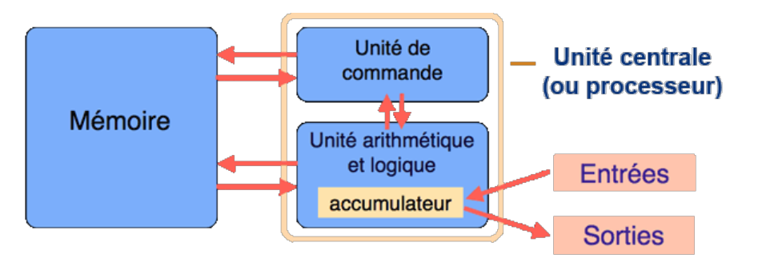
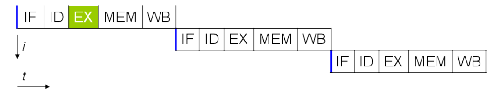
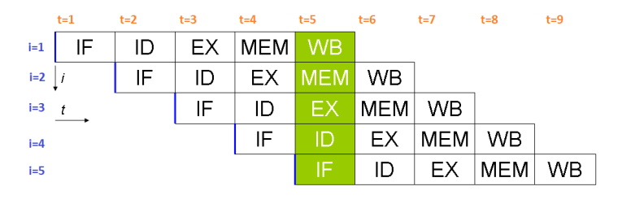
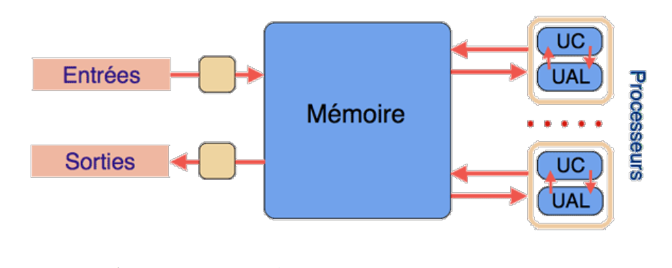
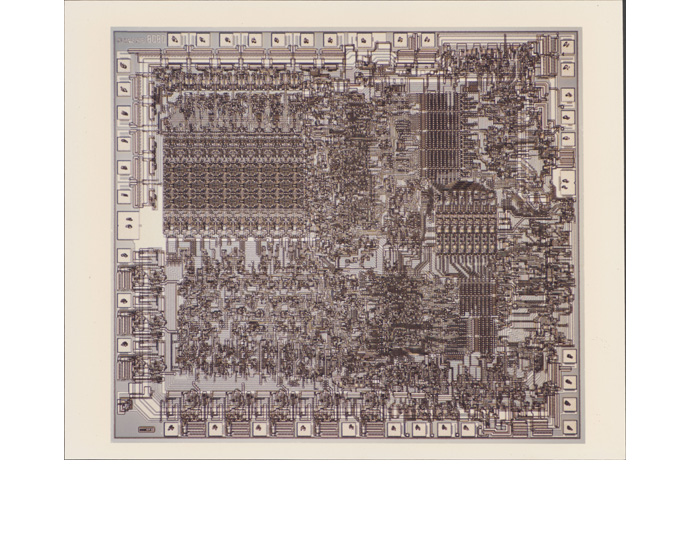
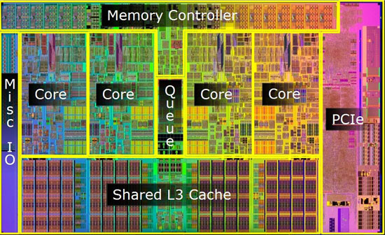
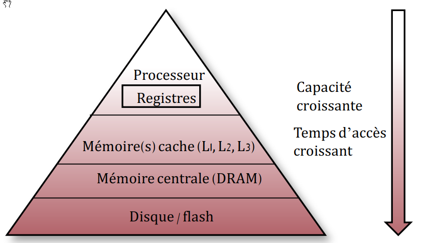
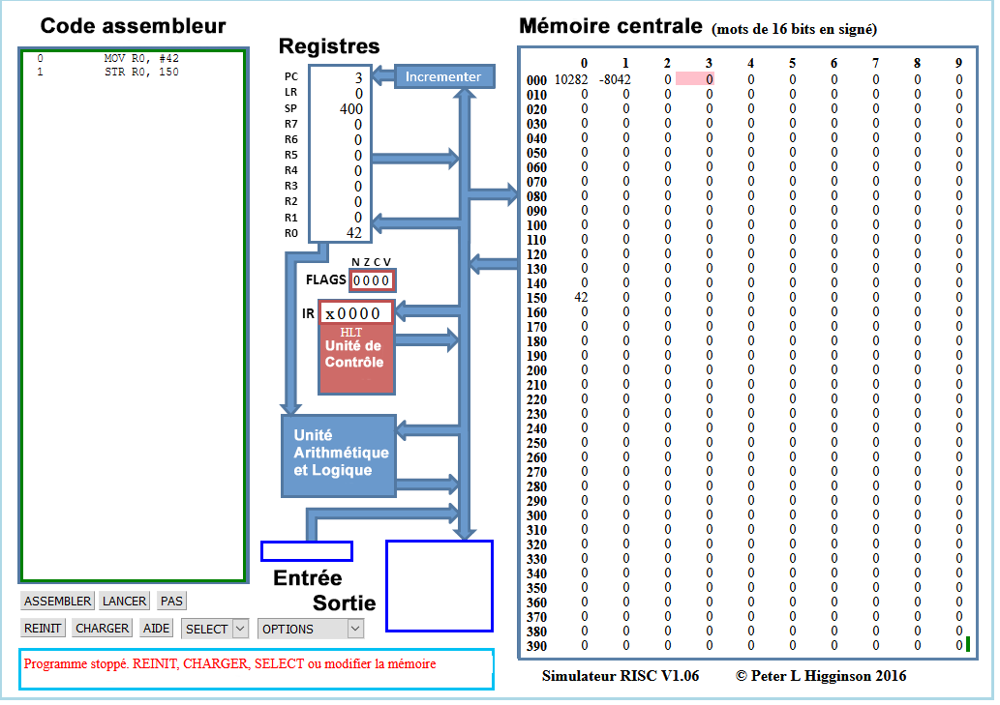

# Architecture matérielle

## Le modèle de von Neumann

### Le principe

{==**John Von Neumann**==} (1903-1957) est un ingénieur, mathématicien et physicien  américano-hongrois.Il a participé au projet Manhattan (première bombe atomique) et à l'ENIAC. Son nom reste attaché à un modèle qu'il propose en 1944,  modèle d'architecture novateur qui sert toujours de base à nos architectures actuelles.

{: style="width:30%; margin:auto;display:block;background-color: #d2dce0;" title="John Von Neumannn"}


Le {==**modèle de von Neumann**==} précise les 4 composants essentiels d'un microprocesseur ainsi que les interactions entre ces différents composants. Ces composants sont les suivants :

* **l'unité de commande** : contrôle la séquence d'instructions ;
* **l'unité arithmétique et logique**(UAL ou ALU en anglais) : exécute les instructions ;
* **la mémoire** : contient les données *et les programmes* ;
* l'unité d'entrée et sortie.

{: style="width:50%; margin:auto;display:block;background-color: #d2dce0;" title="Modèle de John Von Neumannn"}

Cette architecture est bien entendu une *architecture théorique*. Elle doit être complétée par un certain nombre d'autres sous-structures pour être effectivement fonctionnelle. On distingue entre autres :

* Les **bus** sont les liaisons entre les différents éléments de l'architecture (mémoire, ALU, E/S,...).
* L'**horloge** est le cadenceur qui organise l'accomplissement des instructions, et dont l'unité est appelé {==**cycle d'horloge**==} (1 cycle = 1 instuction).

### Cadence d'un processeur

La vitesse d'un processeur est exprimée en GigaHertz (GHz). Elle exprime le *nombre d'opérations que peut faire le processeur en une seconde*. Ainsi, un processeur à **3 GigaHerz** effectue **3 milliards d'opérations à la seconde**, c'est-à-dire 3 milliards de cycles par secondes. 

L'augmentation de la fréquence d'horloge a longtemps été un attendu des progrès de l'informatique, et elle a été longtemps corrélée à l'**augmentation du nombre de transistors** dans les processeurs. Gordon E. Moore énonça en $1965$ une loi empirique prédisant un doublement du nombre de processeurs tous les deux ans.

{: style="width:60%; margin:auto;display:block;background-color: #d2dce0;" title="Loi de Moore, image Wikipedia"}


Mais cette augmentation génère une chaleur très importante au niveau processeur, la dissipation de cette chaleur étant rapidement devenue un problème. Depuis $2005$ environ, les fabricants se sont plutôt tourné vers une **augmentation du nombre de cœurs** dans leurs processeurs, en comptant sur le {==**parallélisme**==}(le fait de pouvoir gérer des instructions en simultané sur plusieurs cœurs) pour augmenter le nombre d'instructions traitées par seconde, plutôt qu'une augmentation pure du nombre d'opérations par seconde, qui actuellement plafonne aux environs de $3,8$ GHz.

{: style="width:60%; margin:auto;display:block;background-color: #d2dce0;" title="Frequence des processeurs"}


### Cycles d'instructions et parallélisme

Dans un processeur, 5 étapes sont nécessaires pour traiter une instruction. Chacune de ces 5 étapes est exécutée :

* **IF** (*Instruction Fetch*) : charge l'instruction à exécuter ;
* **ID** (*Instruction Decode*) : décode l'instruction ;
* **EX** (*Execute*) : exécute l'instruction ;
* **MEM** (*Memory*) :  dénote un transfert depuis un registre vers la mémoire dans le cas d'une instruction du type STORE (accès en écriture) et de la mémoire vers un registre dans le cas d'un LOAD (accès en lecture); 
* **WB** (*Write Back*) : stocke le résultat dans un registre. La source de ce résultat peut être la mémoire (suite à une instruction LOAD), l'unité de calcul (suite à un calcul à l'étape EX) ou bien un registre (cas d'une instruction MOV).

En supposant que chaque étape met 1 cycle d'horloge pour s'exécuter, il faut normalement 5 cycles pour exécuter une instruction, 15 pour 3 instructions : 

{: style="width:60%; margin:auto;display:block;background-color: #d2dce0;" title="3 instructions"}


Il est cependant possible d'améliorer ce système, notamment par l'utilisation de **pipelines** dans des processeurs dits *superscalaires*. Si plusieurs opérations **d'un même programme sont indépendantes**, alors le processeur peut contenir plusieurs instructions, chacune à une étape différente. Le pipeline ci-dessous est le *Classic RISC pipeline*, créé par David Patterson, inventeur des processeurs RISC et du concept de pipeline, et mis en œuvre dès 1961 par IBM :

{: style="width:60%; margin:auto;display:block;background-color: #d2dce0;" title="Pipeline"}

Il faut alors seulement 9 cycles pour exécuter 5 instructions. Au cinquième cycle, tous les étages du pipeline sont sollicités et les 5 opérations ont lieu en même temps.

### L'évolution du modèle de von Neumann

Même si le modèle de von Neumann reste d'actualité, il a subi quelques évolutions récemment :

{: style="width:30%; margin:auto;display:block;background-color: #d2dce0;" title="Evolution du modèle de Von Neumann"}


* Les **Entrée-sorties** sont contrôlées par des processeurs autonomes.
* Les CPU sont **multiprocesseurs**, soit par unités séparées soit par multiples cœurs dans une même puce. On a ainsi une augmentation de la puissance sans augmenter la vitesse des processeurs. 
* La **mémoire** est au cœur du système, ce qui implique de plus en plus de parallélisme.

On peut voir cette évolution sur les processeurs eux-mêmes :

{: style="width:30%; margin:auto;display:block;background-color: #d2dce0;" title="Intel 4004"}

| Nom |  Année | Nombre de transistors | Vitesse d'horloge | Mémoire |
| :---: | :---: | :---: | :---: | :---: |
| Intel 4004 | $1971$ | $2300$  | 100 KHz | 640 o |

{: style="width:30%; margin:auto;display:block;background-color: #d2dce0;" title="Intel 8080"}

| Nom |  Année | Nombre de transistors | Vitesse d'horloge | Mémoire |
| :---: | :---: | :---: | :---: | :---: |
| Intel 8080 | $1974$ | $4500$ | 2 MHz | 64 ko |

{: style="width:30%; margin:auto;display:block;background-color: #d2dce0;" title="Motorola 68060"}

| Nom |  Année | Nombre de transistors | Vitesse d'horloge | Mémoire |
| :---: | :---: | :---: | :---: | :---: |
| Motorola 68060 | $1994$  | $2,5$ millions  | 50 MHz | 64 ko |

{: style="width:30%; margin:auto;display:block;background-color: #d2dce0;" title="PowerPC 970FX"}

| Nom |  Année | Nombre de transistors | Vitesse d'horloge | Mémoire |
| :---: | :---: | :---: | :---: | :---: |
| PowerPc 970Fx| $2003$ | $58$ millions | 1,6-2,7 GHz | 2Mo Cache L2 |

{: style="width:30%; margin:auto;display:block;background-color: #d2dce0;" title="Core_I7"}

| Nom |  Année | Nombre de transistors | Vitesse d'horloge | Mémoire |
| :---: | :---: | :---: | :---: | :---: |
| Intel Core I7 LGA1156 | $2009$ | +de 700 millions  | 2,3 à 3,8 GHz | 12 Mo de cache L3 |

## Les mémoires informatiques

### La hiérarchie des mémoires

{: style="width:70%; margin:auto;display:block;background-color: #d2dce0;" title="Hierachie des mémoires"}


Dans un ordinateur, le processeur accède aux instructions du programme à exécuter ainsi qu'aux données nécessaires à son exécution depuis la mémoire.

Il existe une hiérarchie des mémoires informatiques : les {==**plus rapides sont les plus coûteuses**==}, donc en nombre limité, et sont **placées le plus près du processeur** (les registres font partie intégrante du processeur). Les plus lentes sont les moins coûteuses et sont éloignées du processeur.

Le matériel et le *système d'exploitation* sont responsables du déplacement des objets le long de cette hiérarchie. 

A titre d'information, voici une illustration des capacités et du temps d'accès aux différentes mémoires (sur un processeur de $2012$) :

| Type | Capacités | Vitese |
| :---: | :---: | :---: |
| Registre |  $\simeq 1000 o$ | 1 cycle | 
| Cache L1 | 128 Ko | 700 Go/s | 
| Cache L2 | 1 Mo | 200 Go/s | 
| Cache L3 | 6 Mo | 100 Go/s | 
| Cache L4 | 128 Mo | 40 Go/s | 
| DRAM | $\simeq 8 Go$ |  10 Go/s | 
| HDD | Plusieurs To | 200 Mo/s | 
| SSD | 500 Mo | 600 Mo/s | 


### Random Access Memory

La mémoire {==**RAM**==} (*random Access Memory*, aussi appelée *mémoire vive*, est un type de mémoire **volatile**, ce qui signifie qu'elle perd toutes les données en mémoire une fois l'alimentation électrique coupée. Elle est caractérisée par un accès direct aux données (on accède directement aux &laquo; cases &raquo; contenant les données), contrairement à un disque dur où l'accès se fait de manière séquentielle (on parcourt le disque pour arriver aux données cherchées). On distingue deux principaux types de mémoire `RAM` :

* la `SRAM` (*Static Random Access Memory*) : dans la `SRAM`, les données sont stockées à l'aide de l'état d'une cellule mémoire composée de 6 transistors. La `SRAM` est généralement utilisée en guise de mémoire cache pour le processeur. La `SRAM` n'est généralement pas remplaçable par l'utilisateur.

* `DRAM` (*Dynamic Random Acces Memory*) : la `DRAM` stocke les données à l'aide d'un transistor et d'un accumulateur, qui constituent une cellule de `DRAM`. La `DRAM` coute moins cher à produire, mais est légèrement moins rapide que la `SRAM`. La plupart des modules de mémoire remplaçables par l'utilisateur sont des modules `DRAM`.

On trouve parfois la mémoire `ECC` (*Error Correcting Code*, pour code correcteur d’erreur), qui est un type de mémoire qui dispose d’une cellule supplémentaire pour détecter et corriger les erreurs aléatoires. La mémoire `ECC` est remplaçable par l’utilisateur, mais doit être compatible avec les autres composants.

Au vu de l'accélération des différents composants informatiques, il a été nécessaire d'accélérer la mémoire qui devenait le maillon faible de la chaine de traitement des données. Le **débit de données double**, ou **DDR** (*Double Data Rate*) fut alors développé, et la technologie qu'il a remplacée fut appelée \&laquo; débit de données simple &raquo;, ou SDR (*Single Data Rate*). La mémoire DDR était à la fois plus rapide et moins énergivore que la RAM SDR.

Les technologies de mémoire continuent d'évoluer. La génération de mémoire suivante, la DDR2, fonctionne à des vitesses supérieures et consomme moins d'énergie que la DDR originale. La DDR3 et la DDR4 ont également suivi cette tendance. Chaque génération successive est plus rapide et consomme moins d’électricité.

### Read-Only Memory

Originellement, l'expression *mémoire morte* (en anglais, *Read-Only Memory* : `ROM`) désignait une mémoire informatique non volatile (c'est-à-dire une mémoire qui ne s'efface pas lorsque l'appareil qui la contient n'est plus alimenté en électricité) et dont le contenu est fixé lors de sa programmation, qui pouvait être lue plusieurs fois par l'utilisateur, mais ne pouvait plus être modifiée.

Avec l'évolution des technologies, la définition du terme mémoire morte (en français) ou *read only memory* (en anglais) a été élargie pour inclure les mémoires non volatiles dont le contenu est fixé lors de leur fabrication, qui peuvent être lues plusieurs fois par l'utilisateur et qui ne sont pas prévues pour être modifiées. Elles peuvent parfois cependant l'être par un utilisateur expérimenté, éventuellement avec un matériel spécial. Ces mémoires sont les `UVPROM`, les `PROM`, les `EPROM` et les `EEPROM`.

## TP : programmer en assembleur

### L'assembleur, késako ?
Un programme écrit dans un langage de **haut niveau** (comme Python) éloigné du **langage machine** (dit de bas niveau) dépend le moins possible du processeur et du système d'exploitation.

Si on ouvre un fichier exécutable avec un éditeur hexadécimal, on obtient quelque chose du type 
````
01ebe814063727473747566662e6305f5f43544f525f4c
5f05f5f44544f525f4c4953545f5f05f5f4a43525f4c49
53545f5f05f5f646f5f676c6f62616c5f64746f72735f6
75780636f6d706c657465642e36353331064746f725f69
````

C'est une suite d'instructions comme $01ebe814$ que l’on peut traduire directement de façon plus lisible :

```` asm
add R0, R1 , R2
````

C'est ce qu'on appelle de {==**l'assembleur**==}. Par exemple ici l'instruction `add`, va écrire dans le registre $R0$ la somme des valeurs
des registres $R1$ et $R2$.

L'assembleur est donc une représentation du langage machine, mais qui est **dépendante directement du processeur** (ou de la famille du processeur).  En effet, les différents processeurs ne reconnaissent pas exactement les mêmes types de mots clé, ni exactement la même syntaxe. De même le nombre de registres accessibles est très différent selon le processeur utilisé.

On peut distinguer deux grands types de processeurs. Les {==**processeurs RISC**'==} (*Reduced instruction set computer* ou processeur à jeu d'instructions réduit) sont des processeurs ou le nombre d'instructions est limité et ces instructions sont généralistes - opérations arithmétiques, chargement de données dans/vers les registres, opérations binaires de décalage de bits, etc. La conséquence de ce choix est le nombre restreint de circuits spécifiques sur le processeur, et donc le nombre restreint de transistors.

On trouve aussi les {==**processeurs de type CISC**==} (*(Complex Instruction Set Computer* ou processeurs à jeu d'instruction étendu). Ce sont les processeurs de type x86, AMD64, Intel64, dont la fabrication a été rendue possible par la miniaturisation des transistors et la capacité d'organiser finement les circuits afin d'avoir des circuits spécialisés.


En pratique, un langage de haut niveau est *compilé en assembleur* puis directement codé en binaire pur. La plupart des programmeuses et programmeur ne touchent jamais à l'assembleur, sauf dans des cas très précis où il est nécessaire d'être au plus près de la machine. Mais pour comprendre le fonctionnement d'un processeur, il est quand même important d'avoir quelques notions...

### Le M99, un ordinateur en papier

*D'après le travail de Martin Quinson, ENS-Rennes*

Dans un premier temps, vous aurez besoin du processeur [M99](Archi_Exo_Memoire.pdf){:target="_blank"}.

Le `M99` est doté de 100 cases mémoire (la grille en haut), et d'un processeur (en bas). La **mémoire** est composée de 100 mots mémoire de 3 chiffres (valeur de 000 à 999). Chaque mot mémoire peut être désigné par une adresse codée sur deux chiffres. Cette mémoire va contenir *données et instructions*.\\

L'**Unité Arithmétique et Logique (ALU)** : le processeur dispose de trois registres directement utilisables. `A` et `B` sont utilisé pour les opérandes des opérations tandis que `R` est pour le résultat. Ces registres sont de 3 chiffres, mais contrairement à la mémoire, ils ont un signe. Leur étendue de valeurs est donc comprise entre $-999$ et $999$.

Le processeur dispose aussi d'un quatrième registre nommé `PC` (*Program Counter*). C'est le pointeur d'instruction, contenant l'adresse mémoire de la prochaine instruction à exécuter. Lorsqu'on utilise le `M99`, on peut noter le numéro de l'instruction à exécuter dans la case prévue à cet effet, mais en pratique, il est plus simple de le matérialiser avec un \&laquo; pion&raquo; situé sur une des cases de la grille mémoire, ou même de simplement suivre avec son doigt.

Le jeu d'instruction est défini ci-dessous :

{: style="width:70%; margin:auto;display:block;background-color: #d2dce0;" title="Instructions M99"}

Ainsi on a les codes suivants :

* $245$ qui se traduit en `LDB 45`, soit &laquo; Charger le contenu de la case mémoire $45$ dans le registre $B$ &raquo; ;
* $312$ qui se traduit en `MOV 12`, soit &laquo; Copier le contenu du registre $B$ dans le registre$A$ &raquo; .


!!! question "Lire et écrire un programme en assembleur"

	=== "Énoncé"
		Sur le processeur `M99` fourni, deux différents programmes sont déjà en mémoire.
		
		1. Dérouler &laquo; à la main &raquo; le programme chargé à l'adresse  $00$. Quel est le résultat obtenu ? Quel est l'objectif de ce programme ?
		2. Dérouler &laquo; à la main &raquo; le programme chargé à l'adresse  $13$. Quel est le résultat obtenu ? Quel est l'objectif de ce programme ?
		3. Écrire un programme sur le M99, chargé en adresse $40$, qui prend deux nombres  en entrée (l'entrée étant considéré comme étant tout nombre mis en case $99$) et renvoie la somme de ces deux nombres en sortie.
		
	=== "Solution"
		A venir !

### Utilisation d'un simulateur RISC

*D'après le travail de [David Roche](https://pixees.fr/informatiquelycee/n_site/nsi_prem_sim_cpu.html)*

Afin de mettre en pratique ce que nous avons étudié dans le cours, nous allons utiliser un simulateur de processeur RISC développé en `Javascript` par Peter L Higginson. Ce simulateur est basé sur une architecture de von Neumann. Nous allons trouver dans ce simulateur une `RAM` et un `CPU`.

Une version en français de ce simulateur est disponible [ici](simu_risc.zip) sous la forme d'un dossier compressé.

Voici ce que vous devriez obtenir :

{: style="width:70%; margin:auto;display:block;background-color: #d2dce0;" title="Capture SimRisc"}


Il est relativement facile de distinguer les différentes parties du simulateur :

* à droite, on trouve la mémoire centrale ;
* au centre, on trouve le microprocesseur ;
* à gauche on trouve la zone d'édition (&laquo; Code assembleur&raquo;), c'est dans cette zone que nous allons saisir nos programmes en assembleur.

Plus spécifiquement :

* pour la **RAM**, par défaut le contenu des différentes cellules de la mémoire est en base 10 (entier signé), mais d'autres options sont possibles : base 10 (entiers non-signés), base 16 (hexadécimal), base 2 (binaire). On accède à ces options à l'aide du bouton `OPTIONS` situé en bas dans la partie gauche du simulateur.


	!!! question "Exercice"

		=== "Énoncé"
			À l'aide du bouton `OPTIONS`, passez à un affichage en binaire.
			Quelle est la taille des mots utilisés dans ce simulateur ? Combien y-a-t'il de cases mémoires ?
		
		=== "Réponse"
			A venir !


* pour Le **CPU**, dans la partie centrale du simulateur, nous allons trouver en allant du haut vers le bas :
	* le bloc &laquo; Registres&raquo;, où nous avons 8 registres (`R0` à `R7`) + 1 registre (`PC`) qui contient l'adresse mémoire de l'instruction en cours d'exécution ;
	* le bloc &laquo; Unité de Contrôle&raquo; qui contient l'instruction machine en cours d'exécution (au format hexadécimal) ;
	* le bloc &laquo; Unité Arithmétique et Logique&raquo;, qui effectuera les opérations.

	Nous ne nous intéresserons pas aux autres composants de la partie CPU.

!!! question "Exercice"

	=== "Énoncé"
		1. Avec le bouton `OPTIONS`, repassez en entiers signés, puis, dans la partie \&laquo; Code assembleur &raquo;, saisissez les lignes de codes suivantes :
			```` asm
			MOV R0, #42
			STR R0, 150
			````
			Cliquez sur le bouton Valider. Que se passe-t-il ?

		2. Pour exécuter notre programme, il suffit maintenant de cliquer sur le bouton `LANCER`. Vous allez voir le CPU \&laquo; travailler &raquo; en direct grâce à de petites animations. Si cela va trop vite (ou trop doucement), vous pouvez régler la vitesse de simulation à l'aide des boutons `<<` et `>>`. Un appui sur le bouton `STOP` met en pause la simulation, si vous rappuyez une deuxième fois sur ce même bouton `STOP`, la simulation reprend là où elle s'était arrêtée. Vous pouvez aussi lancer la simulation pas à pas grâce au bouton `PAS`, et réinitialiser avec le bouton `REINIT`. Attention, la mémoire n'est pas modifiée par un appui sur le bouton `REINIT`, pour remettre la mémoire à 0, il faut cliquer sur le bouton `OPTIONS` et choisir `réinit. mémoire`. Si vous remettez votre mémoire à 0, il faudra cliquer sur le bouton `ASSEMBLER` avant de pouvoir exécuter de nouveau votre programme. 
		
		Qu'obtient-on à la fin de l'exécution ?

		3. Modifiez le programme précédent pour qu'à la fin de l'exécution on trouve le nombre 54 à l'adresse mémoire 50. On utilisera le registre `R1` à la place du registre `R0`. Testez vos modifications en exécutant la simulation. 
		
		4. Saisissez et testez le programme suivant :
			```` asm
			MOV R0, #4
			STR R0,30
			MOV R0, #8
			STR R0,75
			LDR R0,30
			CMP R0, #10
			BNE 10
			MOV R0, #9
			STR R0,75
			BRA 13
			LDR R0,30
			ADD R0, #1
			STR R0,30
			MOV R0, #6
			STR R0,23
			````

			1. Quels sont les changements apportés à la mémoire après avoir exécuté ce code ?
			2. Que se passe-t-il après l'exécution de la ligne `BNE 10` ? Pourquoi ?
			3. Modifier la première ligne du code avec :
				```` asm
				MOV R0, #10
				````
				Quels sont les changements apportés à la mémoire après avoir exécuté ce code ?
			4. Que se passe-t-il après l'exécution de la ligne `BNE 10` ? Pourquoi ?

		5. Pour les courageux, voici un programme simple en Python :
			```` python
			x = 0
			while x < 3 :
				x = x+1
			````
			Traduisez-le en assembleur.
