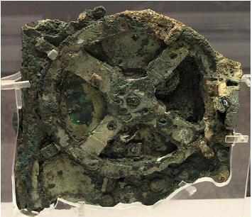
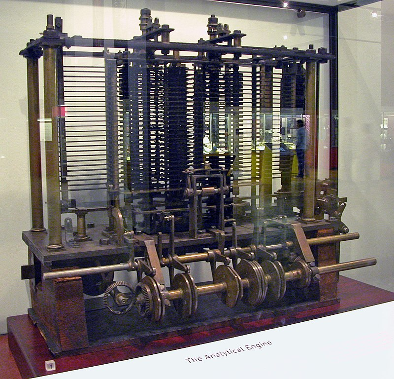
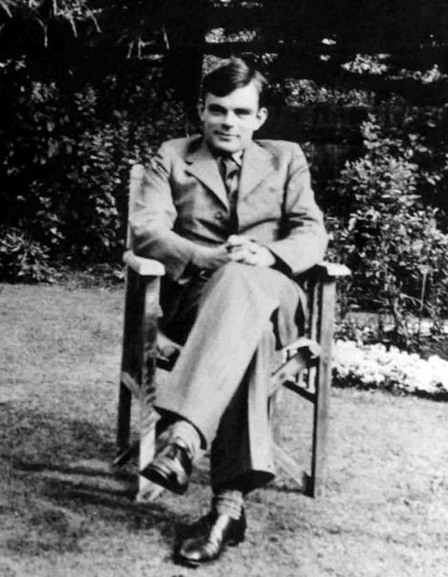

# Architecture Matérielle

## Petit historique de l'informatique

### Informatique : une définition

!!! abstract "Informatique"
	En 1957, l'ingénieur allemand Karl Steinbuch crée le terme &laquo; Informatik &raquo; pour son essai intitulé *Informatik: Automatische Informationsverarbeitung*, pouvant être rendu en français par &laquo; Informatique : traitement automatique de l'information &raquo;.

	En 1966, l'Académie française consacre l'usage officiel du mot pour désigner la &laquo; **science du traitement de l'information** &raquo;. La presse, l'industrie et le milieu universitaire l'adoptent dès cette époque. 

	D'après Wikipedia, article *Informatique*

L'informatique est donc, étymologiquement, bien antérieure aux ordinateurs. Il s'agit de savoir **comment les informations sont stockées**, sur **quels supports**, et comment elles sont **traitées**.

### Pré-histoire de l'informatique

Les premières traces laissées délibérément et nous étant parvenues par les êtres humains sont les peintures rupestres. Elles gardent de nombreux mystères, mais sont réellement des chefs d'oeuvres de civilisations passeés.  Les archéo-anthorpologues s'accordent actuellement sur le fait que des [proto-écritures](https://fr.wikipedia.org/wiki/Grotte_de_Lascaux#Interpr%C3%A9tations){: target="_blank"} ont été utilisées, mais nous ne disposons actuellement pas de *[pierres de Rosette](https://fr.wikipedia.org/wiki/Pierre_de_Rosette){: target="_blank"}* permettant de les décrypter.
 On touve ensuite les gravures sur rochers, puis rapidement les tablettes d'argiles,etc.

{: style="width:30%; margin:auto;display:block;background-color: #546d78;" title="Ecriture cunéiforme"}

Ces supports sont particulièrement résistants, mais difficiles à stocker et ne peuvent contenir que peu d'informations. 

Les systèmes de comptages sont encore très primitifs et peu optimisés, du *calculi* (petit cailloux en latin), aux systèmes de comptages cunéiformes *sexagésimaux* (en base $60$), dont nous avons hérité pour notre décompte des heures et des angles en degré. On trouve rapidement cependant le système des bouliers, découvert de manières indépendantes par de multiples civilisation tout autour du globe.

{: style="width:30%; margin:auto;display:block;background-color: #546d78;" title="Boulier"}

Les supports de type papyrus, vélins (peau) et papiers sont probablement très anciens, mais ils se dégradent facilement, sont sensibles aux incendies, etc. Leurs difficultés de conservation sont cependant contrebalancées par la plus grande facilité à les travailler. Ils deviennent dès l'antiquité le support privilégié pour transmettre et conserver des informations, dans toutes les grandes civilisations.

{: style="width:30%; margin:auto;display:block;background-color: #546d78;" title="Texte Chinois"}

La [machine d'Anticythère](https://fr.wikipedia.org/wiki/Machine_d%27Anticyth%C3%A8re){: target="_blank"}, découverte en 1900 et datée de 87 avant J.C. est une machine servant à calculer les positions astronomiques, et donc à naviguer. Elle nous montre que le calcul a toujours un enjeu capital, et que l'humanité a fait preuve d'une très grande ingéniosité pour améliorer ses capacités de calculs.

{: style="width:30%; margin:auto;display:block;background-color: #546d78;" title="Mécanisme d'Anticythere"}

Jusqu'à la fin de l'époque médiévale, la possibilité la plus répandue pour obtenir un *manuscrit* était de le recopier à la main - d'où la grande importance des moines-copistes et des monastère qui s'y consacraient dans la sphère d'influence occidentale. Cependant le procédé de *xylographie* (principe du tampon encreur avec une matrice en bois), ainsi que des procédés simplifiés de fabrication du papier transitent avec la grande horde mongole  par l'intermédiaire de la route de la soie.  Vers 1430, Johannes Gutenberg invente le principe de la presse à imprimer à caractères mobiles, et facilite grandement la copie d'oeuvres écrites. Une nouvelle ère de développement de la science et des idées se répend sur l'europe.

{: style="width:30%; margin:auto;display:block;background-color: #546d78;" title="Gutemberg"}

Les sciences se développent rapidement, les chiffres dits *arabes* remplacent les peu efficaces chiffres romains. Les techniques de calculs évoluent, mais restent effectuées au boulier où à la main. Au XVIIème siècle, [Blaise Pascal](https://fr.wikipedia.org/wiki/Blaise_Pascal){: target="_blank"}, scientifique et penseur français, invente à 19 ans une machine à calculer pour aider son père à remettre de l'ordre dans les recttes fiscales d'une province française. Cette machine, la *pascaline*, était capable d'effecteur des opérations élémentaires par l'intermédiaire d'un ingénieux système d'engrenages. Cependant la précision nécessaire à la réalisation de  ces engrenages en a rendu la conception extrèmenent couteuse, et peu de machines furent produites.

{: style="width:30%; margin:auto;display:block;background-color: #546d78;" title="Pascaline du CNAM"}

[Gottfried Leibniz](https://fr.wikipedia.org/wiki/Gottfried_Wilhelm_Leibniz){: target="_blank"} est un penseur allemand. Il fait progesser la philosophie, les mathématiques, la physique et l'ingénierie tout autant que son homologue français. Il améliore la pascaline, et l'utilise pour le *calcul différentiel*.

En 1725, Basile Bouchon, un Lyonnais, met au point le premier système de programmation d’un métier à tisser grâce à un ruban perforé. En 1728, Jean-Baptiste Falcon, son assistant, remplace le ruban par une série de cartes perforées reliées entre elles. Jacques de Vaucanson reprend cette idée en remplaçant ruban et cartes perforées par un cylindre métallique et enfin Joseph Marie Jacquard lie le tout dans son métier à tisser qui fut adopté dans le monde entier à partir de 1801. 

{: style="width:30%; margin:auto;display:block;background-color: #546d78;" title="Carte perforée"}

Ces cartes perforées sont les premiers exemples de supports de stockages permettant de stocker d'autres informations que l'écrit ou l'image. En effet, ces cartes sont utilisées dans les orgues de barbarie pour représenter de la musique, et sur les métiers Jacquard afin d'y représenter des motifs de tissage.
 
Les métiers à tisser Jacquard sont la pointe de la technologie. Ils utilisent les cartes perforées pour réaliser des motifs complexes, et sont donc \&laquo; programmables &raquo; par l'introduction de nouvelles cartes.

{: style="width:30%; margin:auto;display:block;background-color: #546d78;" title="Métier Jacquard"}

### Les machines à calculer

{: style="width:30%; margin:auto;display:block;background-color: #546d78;" title="Charles Babbage"}

Au XIXème siècle, l'Empire Britannique est à son apogée et sa puissance repose sur sa force navale, aussi bien commerciale que militaire. Or à bord d'un navire la navigation se fait toujours aux étoile et par l'intermédiaire de cartes marines de plus en plus détaillées. Un navigateur à cette époque utilise quotidiennement des tables de navigations, qui ne sont rien d'autre que des tables de trigonométrie et de *logarithmes*. Et ces tables sont établiées et calculées à la main, et sont loin d'être exmptes d'erreurs de calcul. En 1833 - 1834, le mathématicien anglais Charles Babbage imagine une machine utilisant des cartes perforées qui permettrait d'effectuer des calculs scientifiques, la {==**machine analytique**==} (*Differential engine*). Cette machine ne sera jamais opérationnelle du vivant de Babbage.

{==**Ada Lovelace**==} (1815 - 1852), est une mathématicienne anglaise. Travaillant avec Charles Babbage, elle imagine pouvoir faire jouer de la musique, afficher des chiffres et des lettres avec la machine analytique. Elle décrit, plus d'un siècle avant son invention, l'ordinateur : &laquo; La machine analytique n'a nullement la prétention de créer quelque chose par elle-même. Elle peut exécuter tout ce que nous saurons lui ordonner d'exécuter. Elle peut suivre une analyse ; mais elle n'a pas la faculté d'imaginer des relations analytiques ou des vérités. Son rôle est de nous aider à effectuer ce que nous savons déjà dominer. &raquo;
 
{: style="width:30%; margin:auto;display:block;background-color: #546d78;" title="Charles Babbage"}
 
 
Vers 1842 elle écrit des algorithmes pour réaliser un programme informatique et toutes les instructions à donner à la machine, jusqu'aux positions des rouages. Elle invente le concept de boucle, et devient ainsi la première programmeuse.

L'apparition de l'électricité comme source d'énergie va rapidement permettre le développement de moteurs  qui améliorent les machines à calculer. A la fin du XIXème siècle, Herman Holerith conçoit une machine utilisant des cartes perforées qui permet de simplifier le recensement de la population arrivant à New-York. Il fonde une société qui prendra rapidement le nom d'IBM. Les machines à calculer électromagnétiques se développent rapidement, et en parallèle les mathématiques pr&laquo;ressent à grand pas. 
 
  

{: style="width:30%; margin:auto;display:block;background-color: #546d78;" title="Charles Babbage"}

Mathématicien et cryptologue britannique (1912-1954), Alan Turing a d'abord travaillé sur l'idée de calculabilité. Il montre que ce qui est calculable peut se décomposer en un nombre fini d'étapes, et peut de ce fait être réalisé par une machine. Il imagine à la fin des années 1930 un calculateur, mais celui-ci ne sera construit que 20 ans plus tard. Il imagine le moyen pour une machine de reproduire certaines action humaines : &laquo; Je crois que dans une cinquantaine d’années il sera possible de programmer des ordinateurs, avec une capacité de mémoire d’à peu près $10^9$, pour les faire si bien jouer au jeu de l’imitation qu’un interrogateur moyen n’aura pas plus de 70 pour cent de chances de procéder à l’identification exacte après cinq minutes d’interrogation. &raquo;
 
 
Lors de la seconde guerre mondiale, Alan Turing coordonne l'équipe chargée du décodage de la machine Enigma utilisée par les Nazis. Il construit une machine, le Colossus Mark II, surnommée \&laquo; La bombe &raquo;, qui permet le déchiffrement rapide des messages allemands. Cette machine peut être considére comme le premier ordinateur électronique, mais elle était difficilement repr&laquo;rammable car il fallait recabler pour changer de pr&laquo;ramme.

{: style="width:30%; margin:auto;display:block;background-color: #546d78;" title="Charles Babbage"}

### De l'électronique à la micro-informatique

\noindent\parbox{0.6\linewidth}{
L'électronique nait de l'invention des tubes à vides au début du XXème siècle. La machine **Colossus**, créée entre \np{1943} et \np{1945} (mais dontl'existence ne fur révélée qu'en \np{1970}) utilisent ces tubes à vides.\\
L'ENIAC est créé en \np{1944} d'une idée de John William Mauchly, aidé pour la résolution des problèmes d'ingénierie  par J. Presper Eckert. Il sert à calculer des trajectoires balistiques, et est financé par l'armée américaine, pour un coût important, les tubes à vides ayant une facheuse tendance à voir leur durée de vie fortement limitée. L'ENIAC est surtout connu pour son côté colossal : 30 tonnes, $167 ~m^2$ de surface au sol. 
}\hfill\parbox{0.35\linewidth}{
\includegraphics[width=0.9\linewidth]{ENIAC.png}
}\\
Il est cependant d'un grand secours pour les calculs balistiques dont les calculs sont fastidieux. Par exemple voici le temps de calcul pour uene table de tir :
\begin{center}
\begin{tabular}{ll}
Moyen & Temps\\
A la main & 2,6 j\\
Avec une machine à calculer & 12 h\\
Model 5 (concurrent de l'ENIAC) & 40 min\\
ENIAC & 3 s\\
PC moderne & <30 \mu s
\end{tabular}
\end{center}
\noindent Entre \np{1944} et \np{1955}, six femmes, Kathleen Antonelli, Jean Bartik, Betty Holberton, Marlyn Meltzer, Frances Spence et Ruth Teitelbaum sont les premières personnes à programmer l'ENIAC, pour un calcul balistique. Elles sont toutes mathématiciennes. Kathleen Antonelli et Frances Spence sont recrutées en 1942 par l’armée américaine pour calculer manuellement les trajectoires de tir. Marlyn Meltzer et Ruth Teitelbaum sont également calculatrices. Elles travaillent sur l'ENIAC à partir de 1944. Il s'agit d'identifier les différentes étapes du calcul et ensuite de câbler physiquement la machine. Ruth Teitelbaum, Frances Spence et Kathleen Antonelli poursuivirent leur travail sur l’Eniac lorsque celui-ci est transféré à Aberdeen en 1947.

\noindent Le transistor est inventé en \np{1947}, et il remplace rapidement les tubes à vides à partir du milieu des années \np{1950}, le coût de frabrication d'un transistor commençant à être plus faible que celui d'un tube à vide.\\

\noindent Dès \np{1958} apparraisent les premiers circuits intégrés, et en \np{1971} le premier **microprocesseur** voit le jour : c'est *l'Intel 4001*. Les machines sont désormais miniaturisées, fiables, et leur coût de fabrication décroit fortement. L'informatique s'ouvre aux particuliers.
\noindent De multiples machines sont commercialisées : l’Altair 8008, l’Apple II (1977), l’IBM PC (1981), le ZX 81 (1981), le commodore 64 (1982), le Macintosh (1984) ... Le **ZX 81** est considéré à son époque comme le premier ordinateur familial en kit en France, sa résolution et sa capacité mémoire (1 ko) ne permettait pas énormément de prouesses au niveau des jeux.
### Langages Informatiques
\noindent Les premiers ordinateurs exécutaient déjà du code binaire, et les premiers pr&laquo;rammes étaient écrits sur des cartes perforées, à la main, directement en code binaire. Ils étaient donc particulièrement longs à produire, et le risuqe d'erreur était grand.\\
En \np{1954}, IBM développe le premier langage **assembleur**. Il sert d'intermédiaire entre l'algorithme (`pour i allant de ...`) et le langage machine (`001011001...`). C'est un langage de *très bas niveau* (proche de la machine, encore très complexe à comprendre par un humain).\\
En parallèle, **Grâce Hopper** développe le premier compilateur pour le langage informatique **FORTRAN** d'IBM, et ce langage est finalisé en \np{1956}. Suivent ensuite les langages **LISP**(\np{1958}), **ALGOL**(\np{1958}), **COBOL**(\np{1959}) puis le **BASIC** en \np{1964}.\\
Puis de \np{1970} à \np{1980} : le **C** (\np{1972}), le **ML** (\np{1973}) dont est issu
**Caml**, **Ada** (\np{1983}) et **C++** (\np{1986}).\\
**C** puis **C++** sont des langages rapidement adoptés par la communauté des pr&laquo;rammeurs. rapides, à la syntaxe lisibles, ils sont toujours utilisés pour la construction d'applications et autres pr&laquo;rammes.\\

\noindent En \np{1989}, **Guido van Rossum** crée à partir de **C** le langage **Python**, qui devient le langage de script de référence. En \np{1995}, **Javascript** s'impose dans les navigateurs.
%\pagebreak
## L'architecture de von Neumann
### Le principe

\noindent\parbox{0.6\linewidth}{ John Von Neumann (1903-1957) est un ingénieur, mathématicien et physicien  américano-hongrois.Il a participé au projet Manhattan (première bombe atomique) et à l'ENIAC. Son nom reste attaché à un modèle qu'il propose en 1944,  modèle d'architecture novateur qui sert toujours de base à nos architectures actuelles.\\
Le modèle de von Neumann précise les 4 composants essentiels d'un microprocesseur ainsi que les interactions entre ces différents composants. Ces composants sont les suivants :
\coche
\begin{itemize}
\item **l'unité de commande** : contrôle la séquence d'instructions ;
\item **l'unité arithmétique et l&laquo;ique**(UAL ou ALU en anglais) : exécute les instructions ;
\item **la mémoire** : contient les données *et les pr&laquo;rammes* ;
\item l'unité d'entrée et sortie.
\end{itemize}

}\hfill\parbox{0.35\linewidth}{
\begin{center}
 \includegraphics[width=0.8\linewidth]{von_Neuman.jpg}
\end{center}

}
\begin{center}
 \includegraphics[width=0.8\linewidth]{Modele_von_Neuman.png}
\end{center}

\noindent Cette architecture est bien entendu une *architecture théorique*. Elle doit être complétée par un certain nombre d'autres sous-structures pour être effectivement fonctionnelle. On distingue entre autres :
\coche
\begin{itemize}
\item Les **bus** sont les liaisons entre les différents éléments de l'architecture (mémoire, ALU, E/S,...).
\item L'**horl&laquo;e** est le cadenceur qui organise l'accomplissement des instructions, et dont l'unité est appelé *cycle*.
\end{itemize}
### Cadence d'un processeur
\noindent La vitesse d'un processeur est exprimée en GigaHertz (GHz). Elle signifie le nombre d'opérations que peut faire le processeur en une seconde. Ainsi, un processeur à **3 GigaHerz** effectue **3 milliards d'opérations à la seconde**. \\
\noindent L'augmentation de la fréquence d'horl&laquo;e a longtemps été un attendu des pr&laquo;rès de l'informatique, mais cette augmentation génère une chaleur très importante au niveau processeur. Depuis \np{2005} environ, les fabricants se sont plutôt tourné vers une augmentation du nombre de cœurs dans leurs processeurs, en comptant sur le *parallélisme* pour augmenter le nombre d'instructions traitées par seconde, plutôt qu'une augmentation de la vitesse, qui actuellement plafonne aux environs de $3,8$ GHz.
\begin{center}
\includegraphics[width=0.5\linewidth]{Frequence.png}
\end{center}
### Cycles d'instructions et parallélisme
\noindent Dans un processeur, 5 étapes sont nécessaires pour traiter une instruction. Chacune de ces 5 étapes est exécutée :
\begin{enumerate}
\item **IF** (*Instruction Fetch*) : charge l'instruction à exécuter ;
\item **ID** (*Instruction Decode*) : décode l'instruction ;
\item **EX** (*Execute*) : exécute l'instruction ;
\item **MEM** (*Memory*) :  dénote un transfert depuis un registre vers la mémoire dans le cas d'une instruction du type STORE (accès en écriture) et de la mémoire vers un registre dans le cas d'un LOAD (accès en lecture); 
\item **WB** (*Write Back*) : stocke le résultat dans un registre. La source de ce résultat peut être la mémoire (suite à une instruction LOAD), l'unité de calcul (suite à un calcul à l'étape EX) ou bien un registre (cas d'une instruction MOV).
\end{enumerate}
\noindent En supposant que chaque étape met 1 cycle d'horl&laquo;e pour s'exécuter, il faut normalement 5 cycles pour exécuter une instruction, 15 pour 3 instructions : 
\begin{center}
\includegraphics[width=0.6\linewidth]{3_cycles.png}
\end{center}

\noindent Il est cependant possible d'améliorer ce système, notamment par l'utilisation de **pipelines** (et de processeurs *superscalaires*, mais c'est hors pr&laquo;ramme). Si plusieurs opérations *d'un même pr&laquo;ramme* sont **indépendantes**, alors le processeur peut contenir plusieurs instructions, chacune à une étape différente. Le pipeline ci-dessous est le *Classic RISC pipeline*, créé par David Patterson, inventeur des processeurs RISC et du concept de pipeline, et mis en oeuvre dès 1961 par IBM :
\begin{center}
\includegraphics[width=0.6\linewidth]{Pipeline.png}
\end{center}
\noindent Il faut alors seulement 9 cycles pour exécuter 5 instructions. Au cinquième cycle, tous les étages du pipeline sont sollicités, et les 5
opérations ont lieu en même temps. .
### L'évolution du modèle de von Neumann
\noindent Même si le modèle de von Neumann reste d'actualité, il a subi quelques évolutions récemment :
\begin{center}
\includegraphics[width=0.5\linewidth]{Evolution_von_Neumann.png}
\end{center}
Les **Entrée-sorties** sont contrôlées par des processeurs autonomes. Les CPU sont **multiprocesseurs**, soit par unités séparés soit par multiples coeurs dans une même puce. On a ainsi une augmentation de la puissance sans augmenter la vitesse des processeurs.La **mémoire** est  au coeur du système, ce qui implique de plus en plus de parallélisme.\\
On peut voir cette évolution sur les processeurs eux-mêmes :

%\pagebreak

\noindent\parbox{0.45\linewidth}{
\begin{center}
\includegraphics[width=0.8\linewidth]{Intel_4004.jpg}
\end{center}
\begin{center}
Intel 4004, \np{1971}\\
\np{2300} transistors, 100 KHz\\
640 octets de mémoire
\end{center}

}\hfill\parbox{0.45\linewidth}{
\begin{center}
\includegraphics[width=0.9\linewidth]{Intel_8080.jpg}
\end{center}
\begin{center}
Intel 8080, \np{1974}\\
\np{4500} transistors, 2 MHz\\
64 kilo-octets de mémoire
\end{center}
}\\
\noindent\parbox{0.45\linewidth}{
\begin{center}
\includegraphics[width=0.5\linewidth]{PowerPC_970FX.jpg}
\end{center}
\begin{center}
PowerPc 970Fx, \np{2003}\\
\np{58} millions de transistors, 1,6-2,7 GHz\\
2Mo Cache L2
\end{center}
}\hfill\parbox{0.45\linewidth}{
\begin{center}
\includegraphics[width=0.9\linewidth]{Core_I7.jpg}
\end{center}
\begin{center}
Intel Core I7 LGA1156, \np{2009}\\
731 à 774 millions de transistors,2,3 à 3,8 GHz\\
12 Mo de cache L3 
\end{center}
}
## Les mémoires informatiques
### La hiérarchie des mémoires
\noindent\parbox{0.45\linewidth}{
\begin{center}
\includegraphics[width=0.9\linewidth]{Hierarchie_Memoires.png}
\end{center}
}\hfill\parbox{0.45\linewidth}{
Dans un ordinateur, le processeur accède aux instructions du pr&laquo;ramme à exécuter ainsi qu'aux données nécessaires à son exécution depuis la mémoire.

Il existe une hiérarchie des mémoires informatiques : les plus rapides sont les plus coûteuses, donc en nombre limité, et placées le plus près du processeur (les registres font partie intégrante du processeur). Les plus lentes sont les moins coûteuses et sont éloignées du processeur.\\

Le matériel et le *système d'exploitation* sont responsables du déplacement des objets le long de cette hiérarchie. 
}\\
A titre d'information, voici une illustration des capacités et du temps d'accès aux différentes mémoires (sur un processeur de \np{2012}) :
\begin{center}
\begin{tabular}{|c|c|c|}
\hline 
Type & Capacités & Vitese \\ 
\hline 
Registre &  $\simeq 1000 o$ & 1 cycle \\ 
\hline 
Cache L1 & 128 Ko & 700/Go/s \\ 
\hline 
Cache L2 & 1 Mo & 200 Go/s \\ 
\hline 
Cache L3 & 6 Mo & 100 Go/s \\ 
\hline 
Cache L4 & 128 Mo & 40 Go/s \\ 
\hline 
DRAM & $\simeq 8 Go$ &  10 Go/s \\ 
\hline 
HDD & Plusieurs To & 200 Mo/s \\ 
\hline 
SSD & 500 Mo & 600 Mo/s \\ 
\hline 
\end{tabular} 
\end{center}
### Random Access Memory
\noindent La mémoire RAM (*random Access Memory*, aussi appelée *mémoire vive*, est un type de mémoire **volatile**, ce qui signifie qu'elle perd toutes les données en mémoire une fois l'alimentation électrique coupée. Elles est caractérisée par un accès direct aux donnée, contrairement à un disque dure où l'accès se fait de manière séquentielle. On distingue deux principaux types de mémoire RAM :
\coche
\begin{itemize}
\item la SRAM (*Static Random Access Memory*) : dans la SRAM, les données sont stockées à l'aide de l'état d'une cellule mémoire composée de 6 transistors. La SRAM est généralement utilisée en guise de mémoire cache pour le processeur. La SRAM n'est généralement pas remplaçable par l'utilisateur.
\item DRAM (*Dynamic Random Acces Memory*) :  la DRAM stocke les données à l'aide d'un transistor et d'un accumulateur, qui constituent une cellule de DRAM. La DRAM coûte moins cher à produire, mais est légèrement moins rapide que la SRAM. La plupart des modules de mémoire remplaçables par l'utilisateur sont des modules DRAM.
\end{itemize}
On trouve parfois la mémoire ECC (*Error Correcting Code*, pour code correcteur d’erreur), qui est un type de mémoire qui dispose d’une cellule supplémentaire pour détecter et corriger les erreurs aléatoires. La mémoire ECC est remplaçable par l’utilisateur, mais doit être compatible avec les autres composants.

\noindent Au vu de l'accélération des différents composants informatiques, il a été nécessaire d'accélérer la mémoire qui devenait le maillon faible de la chaîne de traitement des données. Le **débit de données double**, ou **DDR** (*Double Data Rate*) fut alors développé, et la technol&laquo;ie qu'il a remplacée fut appelée \&laquo; débit de données simple &raquo;, ou SDR (*Single Data Rate*). La mémoire DDR était à la fois plus rapide et moins énergivore que la RAM SDR.\\

Les technol&laquo;ies de mémoire continuent d'évoluer. La génération de mémoire suivante, la DDR2, fonctionne à des vitesses supérieures et consomme moins d'énergie que la DDR originale. La DDR3 et la DDR4 ont également suivi cette tendance. Chaque génération successive est plus rapide et consomme moins d’électricité.

### Read-Only Memory
\noindent Originellement, l'expression *mémoire morte* (en anglais, *Read-Only Memory* : ROM) désignait une mémoire informatique non volatile (c'est-à-dire une mémoire qui ne s'efface pas lorsque l'appareil qui la contient n'est plus alimenté en électricité) et dont le contenu est fixé lors de sa pr&laquo;rammation, qui pouvait être lue plusieurs fois par l'utilisateur, mais ne pouvait plus être modifiée.\\

\noindent Avec l'évolution des technol&laquo;ies, la définition du terme mémoire morte (en français) ou read only memory (en anglais) a été élargie pour inclure les mémoires non volatiles dont le contenu est fixé lors de leur fabrication, qui peuvent être lues plusieurs fois par l'utilisateur et qui ne sont pas prévues pour être modifiées. Elles peuvent parfois cependant l'être par un utilisateur expérimenté, éventuellement avec un matériel spécial. Ces mémoires sont les UVPROM, les PROM, les EPROM et les EEPROM. 
## TP : programmer en assembleur

### L'assembleur, késako ?
\noindent Un pr&laquo;ramme écrit dans un langage de **haut niveau** (comme Python) éloigné du **langage machine** (dit de bas niveau) dépend le moins possible du processeur et du système d'exploitation.\\
\noindent Si on ouvre un fichier exécutable avec un éditeur (hexadécimal), on obtient :
\begin{verbatim}
01ebe814063727473747566662e6305f5f43544f525f4c
5f05f5f44544f525f4c4953545f5f05f5f4a43525f4c49
53545f5f05f5f646f5f676c6f62616c5f64746f72735f6
75780636f6d706c657465642e36353331064746f725f69
\end{verbatim}
\noindent C'est une suite d'instructions comme $01ebe814$, que l’on peut traduire directement de façon plus lisible :
\begin{lstlisting}[language={[x86masm]Assembler}, numbers=none]
add R0, R1 , R2
\end{lstlisting}
\noindent C'est ce qu'on appelle l'assembleur. Par exemple ici l'instruction `add`, va écrire dans le registre $R0$ la somme des valeurs
des registres $R1$ et $R2$.\\
\noindent L'assembleur est donc une représentation du langage machine, mais qui est dépendante directement du processeur.  En effet, les différents processeurs ne reconnaissent pas exactement les même types de mots clé, ni exactement la même syntaxe. De même le nombre de registres accessibles est très différent selon le processeur utilisé.\\

\noindent On peut distinguer deux grands types de processeurs.Les processeurs RISC (*Reduced instruction set computer* ou processeur à jeu d'instructions réduit) sont des processeurs ou le nombre d'instruction est limité, et ces instructions sont généralistes - opérations arithmétiques, chargement de données dans/vers les registres, opérations binaires de décalage de bits,... La conséquence de ce choix est le nombre restreints de circuits spécifiques sur le processeurs, et donc le nombre restreint de transistors. On trouve aussi les processeurs de type CISC (*(Complex Instruction Set Computer* ou processeurs à jeu d'instruction étendu). Ce sont les processeurs de type $x86$, $AMD64$, $Intel64$, dont la fabrication a été rendue possible par la miniaturisation des transistors et la capacité d'organiser finement les circuits afin d'avoir des circuits spécialisés.\\

\noindent En pratique, un langage de haut niveau est compilé en assembleur puis directement codé en binaire pur. La plupart des pr&laquo;rammeuses et pr&laquo;rammeur ne touchent jamais à l'assembleur, sauf dans des cas très précis où il est nécessaire d'être au plus près de la machine. Mais pour comprendre le fonctionnement d'un processeur, il est quand même important d'avoir quelques notions...
### Le M99, un ordinateur en papier
*D'après le travail de Martin Quinson, ENS-Rennes*\\
Le M99 est dote de 100 cases mémoire (la grille en haut), et d'un processeur (en bas).La **mémoire** est composée de 100 mots mémoire de 3 chiffres (valeur de 000 à 999). Chaque mot mémoire peut être désigné par une adresse codée sur deux chiffres. Cette mémoire va contenir *données et instructions*.\\

L'**Unité Arithmétique et L&laquo;ique (ALU)** : le processeur dispose de trois registres directement utilisables. A et B sont utilisé pour les opérandes des opérations tandis que R est pour le résultat. Ces registres sont de 3 chiffres, mais contrairement à la mémoire, ils ont un signe. Leurs valeurs sont donc comprises entre -999 et 999.\\
Le processeur dispose aussi d'un quatrième registre nommé `PC` (*Pr&laquo;ram Counter*). C'est le pointeur d'instruction, contenant l'adresse mémoire de la prochaine instruction à exécuter. Lorsqu'on utilise le M99, on peut noter le numéro de l'instruction à exécuter dans la case prévue à cet effet, mais en pratique, il est plus simple de le matérialiser avec un \&laquo; pion&raquo; situé sur une des cases de la grille mémoire, ou même de simplement suivre avec son doigt.\\

Le jeu d'instruction est défini ci-dessous :
\begin{center}
\includegraphics[width=0.9\linewidth]{Instructions_M99.png}
\end{center}
Ainsi on a les codes suivants:
\begin{itemize}
\item $245$ : `LDB 45`, soit \&laquo; Charger le contenu de la case mémoire $45$ dans le registre $B$&raquo;;
\item $312$ : `MOV 12`, soit \&laquo; Copier le contenu du registre $B$ dans le registre$A$ &raquo;.
\end{itemize}

\begin{ExerciceNomme}{Lire et écrire un pr&laquo;ramme en assembleur}
\begin{enumerate}
\item Que fait le pr&laquo;ramme chargé à l'adresse  $00$ ?
\caserep{\linewidth}{2}
\item Que fait le pr&laquo;ramme Chargé à l'adresse $13$ ?
\caserep{\linewidth}{2}
\item Ecrire un pr&laquo;ramme sur le M99, chargé en adresse $40$, qui prend deux nombres  en entrée ( case $99$) et renvoie la somme de ces deux nombres en sortie.
\caserep{\linewidth}{4}

\end{enumerate}

\end{ExerciceNomme}

### Utilisation d'un simulateur RISC
*D'après le travail de David Roche, \url{https://pixees.fr/informatiquelycee/n_site/nsi_prem_sim_cpu.html*}\\
 Afin de mettre en pratique ce que nous avons étudié dans le cours "Modèle d'architecture de von Neumann", nous allons utiliser un simulateur développé par Peter L Higginson. Ce simulateur est basé sur une architecture de von Neumann. Nous allons trouver dans ce simulateur une RAM et un CPU.

Une version en français de ce simulateur est disponible dans le dossier de votre classe.\\
Voici ce que vous devriez obtenir :
\begin{center}
\includegraphics[width=0.7\linewidth]{Sim_Risc.png}
\end{center}
\noindent Il est relativement facile de distinguer les différentes parties du simulateur :
\coche
\begin{itemize}
\item à droite, on trouve la mémoire centrale;
\item au centre, on trouve le microprocesseur;
\item à gauche on trouve la zone d'édition (\&laquo; Code assembleur&raquo;), c'est dans cette zone que nous allons saisir nos pr&laquo;rammes en assembleur.
\end{itemize}
Plus spécifiquement :
\trianglenoir
\begin{itemize}
\item **La RAM :**\\
\noindent Par défaut le contenu des différentes cellules de la mémoire est en base 10 (entier signé), mais d'autres options sont possibles : base 10 (entier non-signé), base 16 (hexadécimal), base 2 (binaire). On accède à ces options à l'aide du bouton "OPTIONS" situé en bas dans la partie gauche du simulateur.
\end{itemize}
\begin{Exercice}
À l'aide du bouton "OPTIONS", passez à un affichage en binaire.
Quelle est la taille des mots utilisés dans ce simulateur ? Combien y-a-t'il de cases mémoires ?
\caserep{\linewidth}{2}
\end{Exercice}
\begin{itemize}
\item **Le CPU :**\\

\noindent Dans la partie centrale du simulateur, nous allons trouver en allant du haut vers le bas :
\coche
\begin{itemize}
\item le bloc \&laquo; Registres&raquo;, avec  nous avons 8 registres (R0 à R7) + 1 registre (PC) qui contient l'adresse mémoire de l'instruction en court d'exécution ;
\item le bloc \&laquo; Unité de Contrôle&raquo; qui contient l'instruction machine en cours d'exécution (au format hexadécimal) ;
\item le bloc \&laquo; Unité Arithmétique et L&laquo;ique&raquo;, qui effectuera les opérations.
\end{itemize}

\noindent Nous ne nous intéresserons pas aux autres composants de la partie CPU.
\end{itemize}
\begin{Exercice}
\begin{enumerate}
\item Avec le champ `Option`, repassez en entiers signés.Puis, dans la partie \&laquo; Code assembleur &raquo;, saisissez les lignes de codes suivantes :
\begin{lstlisting}[language={[x86masm]Assembler}, numbers=none]
MOV R0, #42
STR R0, 150
\end{lstlisting}
Cliquez sur le bouton Valider. Que se passe-t-il ?
\caserep{\linewidth}{4}
\item Pour exécuter notre pr&laquo;ramme, il suffit maintenant de cliquer sur le bouton `LANCER`. Vous allez voir le CPU \&laquo; travailler &raquo; en direct grâce à de petites animations. Si cela va trop vite (ou trop doucement), vous pouvez régler la vitesse de simulation à l'aide des boutons `<<` et `>>`. Un appui sur le bouton `STOP` met en pause la simulation, si vous rappuyez une deuxième fois sur ce même bouton `STOP`, la simulation reprend là où elle s'était arrêtée. Vous pouvez aussi lancé la simulation pas à pas grâce au bouton `PAS`, et réinitialiser avec le bouton `REINIT`. Attention, la mémoire n'est pas modifiée par un appui sur le bouton `REINIT`, pour remettre la mémoire à 0, il faut cliquer sur le bouton `OPTIONS` et choisir `réinit. mémoire`. Si vous remettez votre mémoire à 0, il faudra cliquer sur le bouton `ASSEMBLER` avant de pouvoir exécuter de nouveau votre pr&laquo;ramme. 
Qu'obtient-on à la fin de l'exécution ?
\caserep{\linewidth}{2}
\item Modifiez le pr&laquo;ramme précédent pour qu'à la fin de l'exécution on trouve le nombre 54 à l'adresse mémoire 50. On utilisera le registre R1 à la place du registre R0. Testez vos modifications en exécutant la simulation. 
\item Saisissez et testez le pr&laquo;ramme suivant :
\begin{lstlisting}[language={[x86masm]Assembler}, numbers=none]
MOV R0, #4
STR R0,30
MOV R0, #8
STR R0,75
LDR R0,30
CMP R0, #10
BNE 10
MOV R0, #9
STR R0,75
BRA 13
LDR R0,30
ADD R0, #1
STR R0,30
MOV R0, #6
STR R0,23
\end{lstlisting}

Quels sont les changements apportés à la mémoire après avoir exécuté ce code ?
\caserep{\linewidth}{2}
Que se passe-t-il après l'exécution de la ligne `BNE 10` ? Pourquoi ?
\caserep{\linewidth}{2}
\item Modifier la première ligne du code avec :
\begin{lstlisting}[language={[x86masm]Assembler}, numbers=none]
MOV R0, #10
\end{lstlisting}
Quels sont les changements apportés à la mémoire après avoir exécuté ce code ?
\caserep{\linewidth}{2}
Que se passe-t-il après l'exécution de la ligne `BNE 10` ? Pourquoi ?
\caserep{\linewidth}{2}
\item Pour les courageux, voici un pr&laquo;ramme en Python :
\begin{lstlisting}[language=python, numbers=none]
x = 0
while x < 3 :
	x = x+1
\end{lstlisting}
Traduisez-le en assembleur.
\caserep{\linewidth}{5}
\end{enumerate}
\end{Exercice}

\end{document}
