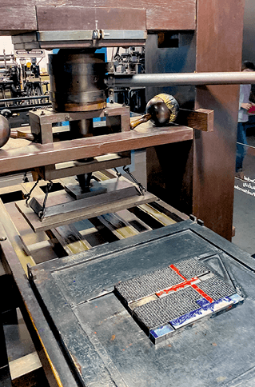

# Petit historique de l'informatique

## Informatique : une définition

!!! abstract "Informatique"
	En 1957, l'ingénieur allemand Karl Steinbuch crée le terme &laquo; Informatik &raquo; pour son essai intitulé *Informatik: Automatische Informationsverarbeitung*, pouvant être rendu en français par &laquo; Informatique : traitement automatique de l'information &raquo;.

	En 1966, l'Académie française consacre l'usage officiel du mot pour désigner la &laquo; **science du traitement de l'information** &raquo;. La presse, l'industrie et le milieu universitaire l'adoptent dès cette époque. 

	D'après Wikipedia, article *Informatique*

L'informatique est donc, étymologiquement, bien antérieure aux ordinateurs. Il s'agit de savoir **comment les informations sont stockées**, sur **quels supports**, et comment elles sont **traitées**.

## Pré-histoire de l'informatique

Les premières traces laissées délibérément et nous étant parvenues par les êtres humains sont les peintures rupestres. Elles gardent de nombreux mystères, mais sont réellement des chefs-d'œuvre de civilisations passées.   Les archéo-anthropologues s'accordent actuellement sur le fait que des [proto-écritures](https://fr.wikipedia.org/wiki/Grotte_de_Lascaux#Interpr%C3%A9tations){: target="_blank"} ont été utilisées, mais nous ne disposons actuellement pas de *[pierres de Rosette](https://fr.wikipedia.org/wiki/Pierre_de_Rosette){: target="_blank"}* permettant de les décrypter.
 On trouve ensuite les gravures sur rochers, puis rapidement les tablettes d'argiles, etc.

{: style="width:30%; margin:auto;display:block;background-color: #d2dce0;" title="Ecriture cunéiforme"}

Ces supports sont particulièrement résistants, mais difficiles à stocker et ne peuvent contenir que peu d'informations. 

Les systèmes de comptages sont encore très primitifs et peu optimisés, du *calculi* (petits cailloux en latin), aux systèmes de comptages cunéiformes *sexagésimaux* (en base $60$), dont nous avons hérité pour notre décompte des heures et des angles en degré. On trouve rapidement cependant le système des bouliers, découvert de manières indépendantes par de multiples civilisations tout autour du globe.

{: style="width:30%; margin:auto;display:block;background-color: #d2dce0;" title="Boulier"}

Les supports de type papyrus, vélins (peau) et papiers sont probablement très anciens, mais ils se dégradent facilement, sont sensibles aux incendies, etc. Leurs difficultés de conservation sont cependant contrebalancées par la plus grande facilité à les travailler. Ils deviennent dès l'antiquité le support privilégié pour transmettre et conserver des informations, dans toutes les grandes civilisations.

{: style="width:30%; margin:auto;display:block;background-color: #d2dce0;" title="Texte Chinois"}

La [machine d'Anticythère](https://fr.wikipedia.org/wiki/Machine_d%27Anticyth%C3%A8re){: target="_blank"}, découverte en 1900 et datée de 87 avant J.C. est une machine servant à calculer les positions astronomiques, et donc à naviguer. Elle nous montre que le calcul a toujours un enjeu capital, et que l'humanité a fait preuve d'une très grande ingéniosité pour améliorer ses capacités de calculs (une très bonne vidéo en anglais est disponible [ici](https://www.youtube.com/watch?v=mTsCx0E7YkA){: target="_blank"}).

{: style="width:30%; margin:auto;display:block;background-color: #d2dce0;" title="Mécanisme d'Anticythere"}

Jusqu'à la fin de l'époque médiévale, la possibilité la plus répandue pour obtenir un *manuscrit* était de le recopier à la main - d'où la grande importance des moines-copistes et des monastères qui s'y consacraient dans la sphère d'influence occidentale. Cependant, le procédé de *xylographie* (principe du tampon encreur avec une matrice en bois), ainsi que des procédés simplifiés de fabrication du papier transitent avec la grande horde mongole par l'intermédiaire de la route de la soie. Vers 1430, **Johannes Gutenberg** invente le principe de la presse à imprimer à caractères mobiles, et facilite grandement la copie d'œuvres écrites. Une nouvelle ère de développement de la science et des idées se répand sur l'Europe.

{: style="width:30%; margin:auto;display:block;background-color: #d2dce0;" title="Gutemberg"}

Les sciences se développent rapidement, les chiffres dits *arabes* remplacent les peu efficaces chiffres romains. Les techniques de calculs évoluent, mais restent effectuées au boulier où à la main. Au XVIIème siècle, [Blaise Pascal](https://fr.wikipedia.org/wiki/Blaise_Pascal){: target="_blank"}, scientifique et penseur français, invente à 19 ans une machine à calculer pour aider son père à remettre de l'ordre dans les recettes fiscales d'une province française. Cette machine, la *pascaline*, était capable d'effecteur des opérations élémentaires par l'intermédiaire d'un ingénieux système d'engrenages. Cependant, la précision nécessaire à la réalisation de ces engrenages en a rendu la conception extrêmement couteuse, et peu de machines furent produites.

{: style="width:30%; margin:auto;display:block;background-color: #d2dce0;" title="Pascaline du CNAM"}

[Gottfried Leibniz](https://fr.wikipedia.org/wiki/Gottfried_Wilhelm_Leibniz){: target="_blank"} est un penseur allemand. Il fait progresser la philosophie, les mathématiques, la physique et l'ingénierie tout autant que son homologue français. Il améliore la pascaline, et l'utilise pour le *calcul différentiel*.

En 1725, Basile Bouchon, un Lyonnais, met au point le premier système de programmation d’un métier à tisser grâce à un ruban perforé. En 1728, Jean-Baptiste Falcon, son assistant, remplace le ruban par une série de cartes perforées reliées entre elles. Jacques de Vaucanson reprend cette idée en remplaçant ruban et cartes perforées par un cylindre métallique et enfin Joseph Marie Jacquard lie le tout dans son métier à tisser qui fut adopté dans le monde entier à partir de 1801. 

{: style="width:30%; margin:auto;display:block;background-color: #d2dce0;" title="Carte perforée"}


Ces cartes perforées sont les premiers exemples de supports de stockages permettant de stocker d'autres informations que l'écrit ou l'image. En effet, ces cartes sont utilisées dans les orgues de barbarie pour représenter de la musique, et sur les métiers Jacquard afin d'y représenter des motifs de tissage.
 
Les métiers à tisser Jacquard sont la pointe de la technologie. Ils utilisent les cartes perforées pour réaliser des motifs complexes, et sont donc \&laquo; programmables &raquo; par l'introduction de nouvelles cartes.

{: style="width:30%; margin:auto;display:block;background-color: #d2dce0;" title="Métier Jacquard"}

## Les machines à calculer

{: style="width:30%; margin:auto;display:block;background-color: #d2dce0;" title="Charles Babbage"}

Au XIXème siècle, l'Empire Britannique est à son apogée et sa puissance repose sur sa force navale, aussi bien commerciale que militaire. Or à bord d'un navire la navigation se fait toujours aux étoiles et par l'intermédiaire de cartes marines de plus en plus détaillées. Un navigateur à cette époque utilise quotidiennement des tables de navigations, qui ne sont rien d'autre que des tables de trigonométrie et de *logarithmes*. Et ces tables sont établies et calculées à la main et sont loin d'être exemptes d'erreurs de calcul. En 1833 - 1834, le mathématicien anglais Charles Babbage imagine une machine utilisant des cartes perforées qui permettrait d'effectuer des calculs scientifiques, la {==**machine analytique**==} (*Differential engine*). Cette machine ne sera jamais opérationnelle du vivant de Babbage.


{==**Ada Lovelace**==} (1815 - 1852), est une mathématicienne anglaise. Travaillant avec Charles Babbage, elle imagine pouvoir faire jouer de la musique, afficher des chiffres et des lettres avec la machine analytique. Elle décrit, plus d'un siècle avant son invention, l'ordinateur : &laquo; La machine analytique n'a nullement la prétention de créer quelque chose par elle-même. Elle peut exécuter tout ce que nous saurons lui ordonner d'exécuter. Elle peut suivre une analyse ; mais elle n'a pas la faculté d'imaginer des relations analytiques ou des vérités. Son rôle est de nous aider à effectuer ce que nous savons déjà dominer. &raquo;
 
{: style="width:30%; margin:auto;display:block;background-color: #d2dce0;" title="Ada Lovelace"}
 
 
Vers 1842 elle écrit des algorithmes pour réaliser un programme informatique et toutes les instructions à donner à la machine, jusqu'aux positions des rouages. Elle invente les concepts de boucle et de branchements conditionnels et devient ainsi la première programmeuse.


L'apparition de l'électricité comme source d'énergie va rapidement permettre le développement de moteurs qui améliorent les machines à calculer. À la fin du XIXème siècle, Herman Holerith conçoit une machine utilisant des cartes perforées qui permet de simplifier le recensement de la population arrivant à New-York. Il fonde une société qui prendra rapidement le nom d'IBM. Les machines à calculer électromagnétiques se développent rapidement, et en parallèle les mathématiques progressent à grand pas. 
 
  

{: style="width:30%; margin:auto;display:block;background-color: #d2dce0;" title="Alan Turing"}

Mathématicien et cryptologue britannique (1912-1954), Alan Turing a d'abord travaillé sur l'idée de calculabilité. Il montre que ce qui est calculable peut se décomposer en un nombre fini d'étapes et peut de ce fait être réalisé par une machine. Il imagine à la fin des années 1930 un calculateur, mais celui-ci ne sera construit que 20 ans plus tard. Il imagine le moyen pour une machine de reproduire certaines actions humaines : &laquo; Je crois que dans une cinquantaine d’années, il sera possible de programmer des ordinateurs, avec une capacité de mémoire d’à peu près $10^9$, pour les faire si bien jouer au jeu de l’imitation qu’un interrogateur moyen n’aura pas plus de 70 pour cent de chances de procéder à l’identification exacte après cinq minutes d’interrogation. &raquo;
 
 
Lors de la seconde guerre mondiale, Alan Turing coordonne l'équipe chargée du décodage de la machine Enigma utilisée par les Nazis. Il construit une machine, le Colossus Mark II, surnommée \&laquo; La bombe &raquo;, qui permet le déchiffrement rapide des messages allemands. Cette machine peut être considérée comme le premier ordinateur électronique, mais elle était difficilement reprogrammable, car il fallait re-câbler pour changer de programme.


{: style="width:30%; margin:auto;display:block;background-color: #d2dce0;" title="Enigma"}


## De l'électronique à la micro-informatique

L'électronique nait de l'invention des {==**tubes à vides**==} au début du XXème siècle. La machine **Colossus**, créée entre 1943 et 1945 (mais dont l'existence ne fur révélée qu'en 1970) utilise ces tubes à vides.

{: style="width:30%; margin:auto;display:block;background-color: #d2dce0;" title="Lampe double-triode de fabrication russe, image wikipedia"}


L'ENIAC est créé en 1944 d'une idée de John William Mauchly, aidé pour la résolution des problèmes d'ingénierie par J. Presper Eckert. Il sert à calculer des trajectoires balistiques et est financé par l'armée américaine, pour un cout important, les tubes à vides ayant une fâcheuse tendance à voir leur durée de vie fortement limitée. L'ENIAC est surtout connu pour son côté colossal : 30 tonnes, $167 ~m^2$ de surface au sol. 

{: style="width:30%; margin:auto;display:block;background-color: #d2dce0;" title="Eniac"}


Il est cependant d'un grand secours pour les calculs balistiques dont les calculs sont fastidieux. Par exemple voici le temps de calcul pour une table de tir :

| Moyen | Temps |
| :---: | :---: |
|A la main | 2,6 j |
| Avec une machine à calculer | 12 h |
| Model 5 (concurrent de l'ENIAC) | 40 min |
| ENIAC | 3 s |
| PC moderne | <30  µs  |

Entre $1944$ et $1955$, six femmes, Kathleen Antonelli, Jean Bartik, Betty Holberton, Marlyn Meltzer, Frances Spence et Ruth Teitelbaum sont les premières personnes à programmer l'ENIAC, pour un calcul balistique. Elles sont toutes mathématiciennes. Kathleen Antonelli et Frances Spence sont recrutées en 1942 par l’armée américaine pour calculer manuellement les trajectoires de tir. Marlyn Meltzer et Ruth Teitelbaum sont également calculatrices. Elles travaillent sur l'ENIAC à partir de 1944. Il s'agit d'identifier les différentes étapes du calcul et ensuite de câbler physiquement la machine. Ruth Teitelbaum, Frances Spence et Kathleen Antonelli poursuivirent leur travail sur l’Eniac lorsque celui-ci est transféré à Aberdeen en 1947.


Le transistor est inventé en $1947$, et il remplace rapidement les tubes à vides à partir du milieu des années $1950$, le cout de fabrication d'un transistor commençant à être plus faible que celui d'un tube à vide.

{: style="width:30%; margin:auto;display:block;background-color: #d2dce0;" title="Transistors, image Wikipedia"}


Dès $1958$ apparaissent les premiers circuits intégrés, et en $1971$ le premier **microprocesseur** commercial voit le jour : c'est *l'Intel 4004*. Les machines sont désormais miniaturisées, fiables et leur cout de fabrication décroit fortement. L'informatique s'ouvre aux particuliers.

{: style="width:30%; margin:auto;display:block;background-color: #d2dce0;" title="Par Thomas Nguyen — Travail personnel, CC BY-SA 4.0, https://commons.wikimedia.org/w/index.php?curid=47684767"}


De multiples machines sont commercialisées : l’Altair 8008, l’Apple II (1977), l’IBM PC (1981), le [ZX 81](https://fr.wikipedia.org/wiki/ZX81){: target="_blank"} (1981), le [commodore 64](https://fr.wikipedia.org/wiki/Commodore_64){: target="_blank"}  (1982), le Macintosh (1984) ... Le **ZX 81** est considéré à son époque comme le premier ordinateur familial en kit en France, sa résolution et sa capacité mémoire (1 ko) ne permettait pas énormément de prouesses au niveau des jeux.

De nombreuses sociétés se lancent dans la production de machines familiales à partir du début des années $1980$, et l'informatique rentre à l'école et commence à y être enseignée, en particulier sur les machines Thomson en France, comme le [TO7](https://fr.wikipedia.org/wiki/Thomson_TO7){: target="_blank"}, le [MO5](https://fr.wikipedia.org/wiki/Thomson_MO5){: target="_blank"}...


#### Les consoles de jeu

Si les consoles de jeu sont présentes depuis le début des années 1970 - la console [Odyssey](https://fr.wikipedia.org/wiki/Magnavox_Odyssey){: target="_blank"} est la première console à pouvoir être branchée sur l'écran de la télévision dès 1972, les jeux vidéos restent souvent cantonnés dans les salles d'arcades, où les bornes fleurissent à côtés des flippers et billards.

À la fin des années 1970 et au début des années 1980, le marché des consoles de jeu est florissant, avec pas moins de 744 modèles différents de consoles rien que pour l'année 1977, dont certaines telles l'[Atari 260](), la console [Vectrex]() ou bien la console Videopac ont un certain succès en France.

{: style="width:30%; margin:auto;display:block;background-color: #d2dce0;" title="Console VideoPac G 7200, image Wikipedia"}


Le crack du jeu vidéo de 1983 mènera à une forte réduction du nombre d'acteurs sur le marché des consoles, jusqu'à l'arrivée en 1986 de la console Nintendo NES qui bat tous les records de ventes.

{: style="width:30%; margin:auto;display:block;background-color: #d2dce0;" title="Console NES, image Wikipedia"}
	

## Langages Informatiques


### Histoire des langages

Les premiers ordinateurs exécutaient déjà du code binaire et les premiers programmes étaient écrits sur des cartes perforées, à la main, directement en code binaire. Ils étaient donc particulièrement longs à produire et le risque d'erreur était grand.

En $1954$, IBM développe le premier langage {==**assembleur**==}. Il sert d'intermédiaire entre l'algorithme (`pour i allant de ...`) et le langage machine (`001011001...`). C'est un langage de *très bas niveau* (proche de la machine, encore très complexe à comprendre par un humain).


!!! example "Exemple de programmation en assembleur: calcul du PGCD de 56 et 42"

	=== "Programme en assembleur"

		```` asm
		main    MOV R1, #56
				PSH R1
				MOV R2, #42
				PSH R2
				PSH R7
				JMS PGCD
				POP R7
				POP R2
				POP R1
				OUT R0,5
				HLT

		PGCD    LDR R1,2(SP)
				LDR R2,1(SP)
				PSH R1 
				PSH R2 
				MOV R7,LR 
				PSH R7
				MOV R7, SP 
				PSH R7
				
		While	POP R7 
				MOV SP,R7
				POP R7
				MOV LR,R7
				POP R2
				POP R1
				CMP R2,#0
				BNE Corps
				MOV R0,R1
				RET
		Corps   MOD R1,R2
				PSH R2
				PSH R1
				MOV R7,LR 
				PSH R7
				MOV R7, SP 
				PSH R7
				BRA While
		````
		
	=== "Équivalent Python"
	
		```` python
		def pgcd(a,b):
			while b!=0 :
				r=a%b
				a,b=b,r
			return a
			
		pgcd(56,42)
		````

En parallèle, **Grâce Hopper** développe le premier {==**compilateur**==}(c'est-à-dire un programme transformant un code source en code binaire) pour le langage informatique **FORTRAN** d'IBM, et ce langage est finalisé en $1956$. Suivent ensuite les langages **LISP**($1958$), **ALGOL**($1958$), **COBOL**($1959$) puis le **BASIC** en $1964$.

{: style="width:30%; margin:auto;display:block;background-color: #d2dce0;" title="Par James S. Davis — Cette image a été publiée par l&#039;United States Navy sous l’identifiant DN-SC-84-05971.Ce bandeau n’indique rien sur le statut de l’œuvre au regard du droit d&#039;auteur, image Wikipedia"}

Puis de $1970$ à $1980$ : le **C** ($1972$), le **ML** ($1973$) dont est issu **Caml**, **Ada** ($1983$) et **C++** ($1986$).


Le langage **C**, inventé au cours de l'année 1972 dans les Laboratoires Bell, en même temps qu'Unix par [Dennis Ritchie](https://fr.wikipedia.org/wiki/Dennis_Ritchie){: target="_blank"} et [Ken Thompson](https://fr.wikipedia.org/wiki/Ken_Thompson){: target="_blank"} puis **C++** sont des langages rapidement adoptés par la communauté des programmeurs. Rapides, à la syntaxe lisibles, ils sont toujours utilisés pour la construction d'applications et autres programmes.

!!! example "Exemple de code C"

	```` C
	#include <stdio.h> 
	/* inclusion en tête du programme du fichier bibliothèque 
	C/UNIX stdio.h 
	*/ 
	int somme(int, int);          /* Déclaration d'une fonction somme */ 
	main() { 
		   int a,b,s; 
		   scanf("%d%d", &a,&b);  /* lecture des deux entiers */ 
		   s = somme (a,b);       /* appel de la fonction somme */ 
		   printf(" Voici leur somme : %d\n", s); 
	} 

	/* La fonction somme avec deux paramètres formels x et y */ 
	int somme (int x, int y) { 
		   return (x+y); 
	}
		
	````


En $1989$, **Guido van Rossum** crée à partir de **C** le langage **Python**, qui devient le langage de script de référence. 

{: style="width:30%; margin:auto;display:block;background-color: #d2dce0;" title="Par Photograph by Daniel Stroud, first retouched version uploaded by User:Deedub1983, second retouching by User:HarJIT. — Retouching (dynamic range compression) of File:Guido-portrait-2014-curvves.jpg, itself an exposure reduction of File:Guido-portrait-2014.jpg, CC BY-SA 4.0, https://commons.wikimedia.org/w/index.php?curid=82866015, image Wikipedia"}


En $1995$, **Javascript** s'impose dans les navigateurs, et depuis le nombre de langages n'a cessé de progresser. Voici d'ailleurs une vidéo montrant la prévalence des langages de 1965 à 2019 :

<iframe width="560" height="315" src="https://www.youtube.com/embed/Og847HVwRSI" title="YouTube video player" frameborder="0" allow="accelerometer; autoplay; clipboard-write; encrypted-media; gyroscope; picture-in-picture" allowfullscreen></iframe>


### Langages interprétés vs langages compilés.

Pour comprendre la différence entre langages interprétés et langages compilés, un petit tour sur [FranceIOI](http://www.france-ioi.org/algo/course.php?idChapter=561&idCourse=2368){:target="_blank"}.


