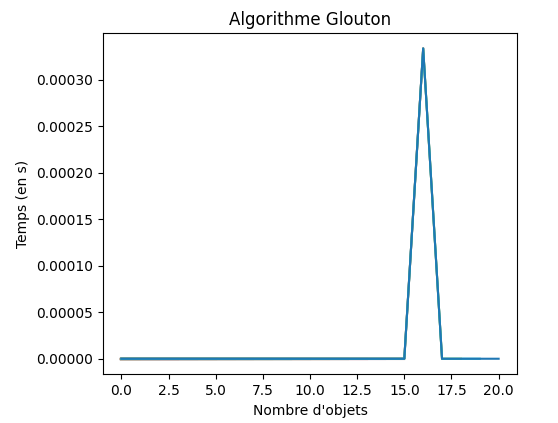

# Algorithmes Gloutons


*D'après [pixees.fr](www.pixees.fr){: target="_blank"}*

## Problèmes d'optimisations

### Le problème du sac à dos 

!!! question "Le problème du sac à dos (`KP` ou *Knapsack Problem*)"
	Un cambrioleur possède un sac à dos d'une contenance maximum de 30 Kg. Au cours d'un de ses cambriolages, il a la possibilité de dérober 4 objets A, B, C et D. Voici un tableau qui résume les caractéristiques de ces objets : 

	| Objet | A | B | C | D |
	| :---: | :---: | :---: | :---: | :---: |
	| Masse | 13 Kg | 22 Kg | 8 Kg | 10 Kg |
	| Valeur | 700 € | 400 € | 300  € | 300 € |


	1. Déterminez les objets que le cambrioleur aura intérêt à dérober, sachant que :
		* tous les objets dérobés devront tenir dans le sac à dos (30 Kg maxi) ;
		* le cambrioleur cherche à obtenir un gain maximum.
	2. Existe-t-il d'autres solutions ?
	

!!! abstract "Optimisation"
	Ce genre de problème est un grand classique en informatique, on parle de {==**problèmes d'optimisation**==}. Il existe souvent plusieurs solutions possibles à un problème d'optimisation, mais toutes ne sont pas équivalentes. En effet on cherche une **solution dite optimale** (dans notre exemple on cherche le plus grand gain possible). Souvent, dans les problèmes d'optimisation, il n'existe pas une solution optimale, mais plusieurs solutions optimales, et  résoudre un problème d'optimisation c'est donc trouver une des solutions optimales. 

!!! abstract "Solution naïve"
	En apparence, la solution la plus simple dans le cas du sac à dos serait d'écrire un algorithme qui teste toutes les combinaisons d'objets possibles et qui retient les solutions qui offrent un gain maximum.

	Dans notre cas précis, avec seulement 4 objets, cette solution pourrait être envisagée, mais avec un plus grand nombre d'objets, le temps de calcul, même pour un ordinateur très puissant, deviendrait trop important. En effet l'algorithme qui testerait toutes les combinaisons possibles aurait une complexité en temps en $\mathrm{O}(a^n)$ avec $a$ une constante et $n$ le nombre d'objets.

	On parle dans ce cas d'une {==**complexité exponentielle**==} (en temps), ce qu'on peut voir dans le graphique suivant (exécuté sur mon ordinateur personnel).
	
	{: style="width:30%; margin:auto;display:block;background-color: #d2dce0;" title="Temps d'exécution selon le nombre d'objets, algorithme KP Naif"}

	Les algorithmes à complexité exponentielle ne sont pas efficaces pour résoudre des problèmes, le temps de calcul devient beaucoup trop important quand $n$ devient très grand. 

??? question "Pour les cracks"

	=== "Coder la solution naïve"
		Cette question est vraiment difficile !
		
		Comment faire pour tester toutes les solutions possibles, sachant que la liste des objets est donnée sous la forme d'un dictionnaire (ou d'une liste de dictionnaire), où chaque objet est représenté par deux clés `masse` et `valeur` ?
		
		La solution est de créer une liste de tous les sous-ensembles possibles à partir d'une donnée d'objets, puis de calculer pour chacun de ces sous-ensemble la masse et la valeur totale...mais c'est complexe surtout sans maîtrise pas la récursivité (au programme de Terminale).
		
		Vous pouvez toujours chercher, une solution étant proposée dans l'onglet suivant.
		
	=== "Une solution hors programme"
	
		```` python
		def makeTree(T : list)  ->list :
			"""fonction récursive renvoyant l'ensemble des sous-ensembles non vides d'un ensemble
		de départ donné sous la forme d'une liste. L'ensemble de départ doit être non vide"""
			#Cas de base : la liste ne contient qu'un seul élément
			if len(T) == 1 :
				return [T]
			else :
				comp = [] # Sinon création de la liste des sous-ensembles
				nT = T[:] #on créé une copie locale de la liste de départ
				for e in T : # Pour chaque élément de la liste de départ
					comp.append([e]) # On ajoute le singleton correspondant
					nT.remove(e) #On le supprime de la liste locale
					for ne in makeTree(nT) : # On exécute récursivemment la fonction makeTree
						#et pour chaque sous-ensemble obtenu, on rajoute l'élément e
						comp.append([e]+ne)
				return comp
					
		def sacADosNaif(listeObj : dict, masseMax : int) -> list :
			""" Calcule la solution optimale pour le problème du sac à dos"""
			optimale = []
			valeurOptimale = 0
			for se in makeTree([ name for name in listeObj.keys()]) :
				masseLocale = sum([listeObj[nom]['masse'] for nom in se])
				valeurLocale = sum([listeObj[nom]['valeur'] for nom in se])
				if valeurLocale >valeurOptimale  and masseLocale<=masseMax :
					valeurOptimale = valeurLocale
					optimale = se
			return optimale, valeurOptimale
		````
	
		

### Une solution gloutonne

!!! tips "Solution &laquo; Gloutonne &raquo;"
	La résolution d'un problème d'optimisation se fait généralement par étapes : à chaque étape on doit **faire un choix**. Par exemple, dans le problème du sac à dos, nous ajoutons les objets un par un, chaque ajout d'un objet constitue une étape : à chaque étape on doit **choisir** un objet à mettre dans le sac.

	Le principe de la méthode {==**gloutonne**==}(*greedy* en anglais) est de, à chaque étape de la résolution du problème, faire le choix qui semble *le plus pertinent* sur le moment, avec l'espoir qu'au bout du compte, cela nous conduira vers une solution optimale du problème à résoudre. Autrement dit, on fait des {==**choix localement optimaux**==}, ce qui signifie de faire le choix qui semble le plus pertinent à chaque étape, dans l'espoir que ces choix mèneront à une solution globalement optimale. 

!!! question "Méthode gloutonne"

	=== "Enoncé"
		Comme on cherche à optimiser au maximum le gain, on va s'intéresser à la &laquo; valeur massique &raquo; de chaque objet.

		1. Compléter le tableau suivant :
			
			| Objet | A | B | C | D 
			| :---: |:---: |:---: |:---: |:---: |
			| Valeur Massique (en €/Kg)|  |  |  | 
			
		2. Trier le tableau par valeur décroissante de la valeur massique.
		3. Enfin, on remplit le sac en prenant les objets dans l'ordre et en s'arrêtant dès que la masse limite est atteinte.\\
		4. Quelle est la composition du sac ?
		5. Est-elle optimale ?
		
	=== "Solutions"
		A venir
		
!!! tips "Comparaison des temps d'exécution entre algorithme naïf et algorithme glouton"

	Sur les mêmes valeurs, voici une comparaison entre les temps d'éxécution des deux algorithmes :
	
	<div style="display:flex;">
	<div style="display : inline; width : 50%;">

	{: style="width:80%; margin:auto;display:block;background-color: #d2dce0;" title="Temps d'exécution, algorithme glouton"}

	</div>
	<div style="display : inline; width : 50%;">

	{: style="width:73%; margin:auto;display:block;background-color: #d2dce0;" title="Comparaison des temps d'exécution naïf/glouton"}

	</div>
	</div>
	
	{++**ATTENTION**++} Il faut bien comprendre que l'algorithme glouton ne donne pas forcément la même réponse que l'algorithme naïf, c'est-à-dire la solution optimale ! Cependant les différences de temps d'exécution lorsque $n$ est suffisamment grand sont telles que la solution approchée donnée par une méthode gloutonne est bien souvent acceptable.


!!! question "Code en Python"

	=== "Enoncé"
		La liste des objets et leur poids est donné par un dictionnaire nom : (masse; valeur).
		```` python
		objets = {
        "A" : {'masse' : 13, 'valeur' : 700},
        "B" : {'masse' : 12, 'valeur' : 400},
        "C" : {'masse' : 8, 'valeur' : 300},
        "D" : {'masse' : 10, 'valeur' : 300},
                }
		````
		

		1. Ecrire une fonction Python qui renvoie un taleau de tuples `(nom ; valeur_massique)` à partir du dictionnaire passé en argument.
		1. Trier ce tableau par ordre décroissant des valeurs massiques.
		1. Ecrire une fonction Python qui finalise l'algorithme glouton.

## Problème du rendu de monnaie

### La situation

!!! abstract "Le problème du rendu de monnaie"
	Nous sommes des commerçants, nous avons à notre disposition un nombre illimité de pièces de : 

	* 1 centime
	* 2 centimes
	* 5 centimes
	* 10 centimes
	* 20 centimes
	* 50 centimes
	* 1 euro
	* 2 euros

	Nous devons rendre la monnaie à un client à l'aide de ces pièces. La contrainte est d'utiliser {==**le moins de pièces possible**==}. 

!!! question "L'algorithme"
	
	=== "Enoncé"
		
		1. Trouvez une méthode gloutonne permettant d'effectuer un rendu de monnaie (en utilisant le moins possible de pièces).
		2. Vous devez rendre la somme de 2,63 €.
			1. Appliquez la méthode que vous venez de mettre au point.
			2. Combien de pièces avez-vous utilisées ? 
			3. La solution trouvée est-elle optimale ?
		2. Vous devez rendre la somme de 4,05 €.
			1. Appliquez la méthode que vous venez de mettre au point.
			2. Combien de pièces avez-vous utilisées ? 
			3. La solution trouvée est-elle optimale ?

### Le code

À partir de la méthode gloutonne que vous avez élaborée ci-dessus, écrivez un algorithme glouton qui permettra de déterminer le nombre minimal de pièces à utiliser pour une somme donnée. Vous proposerez ensuite une implémentation en Python de votre algorithme. Vous testerez votre programme avec une somme à rendre de 2 euros et 63 centimes. 

!!! warning "Autres systèmes de monnaie"

	Le problème du rendu de monnaie est [{==**NP-complet**==}](https://fr.wikipedia.org/wiki/Probl%C3%A8me_NP-complet){: target="_blank"} dans le cas général, c'est-à-dire très difficile à résoudre. Cependant pour certains systèmes de monnaie dits **canoniques**, l'algorithme glouton est optimal, c'est-à-dire qu'il suffit de rendre systématiquement la pièce ou le billet de valeur maximale — ce tant qu'il reste quelque chose à rendre. C'est la méthode employée en pratique, ce qui se justifie car la quasi-totalité des systèmes ayant cours dans le monde sont canoniques.
	
	Dans un système de monnaie non-canonique ne possédant que 3 pièces de valeurs 1, 3 et 4, quelle est la solution optimale du problème du rendu de monnaie pourt une valeur de 6 ? Que donne l'algorithme glouton ?
	

??? tips "Pour les cracks"

	Pour ceux intéressés, voici les fichiers permettant de visualiser la comparaison entre les méthodes :
	
	* [sacADos_Naif_Glouton.py](sacADos_Naif_Glouton.py){: target="_blank"} :
	
		* `NREP` correspond au nombre maximum d'objets testés ;
		* `LISSAGE` correspond au nombre de répétitions effectuées pour lisser les résultats
		* `FACTEUR_TAILLE ` correspond à la taille du sac à dos (dépend du nombnre d'objets).
		
		Ce fichier crée un fichier binaire `compareGreedyNatural.dat` qui contient les données de temps des méthodes naives et gloutonnes, utilisées par le fichier suivant.
	* [plotCompare.py](plotCompare.py){: target="_blank"} permet d'obtenir une animation matplotlib comparant les méthodes.
		

