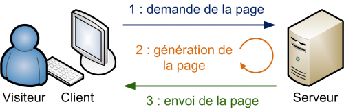
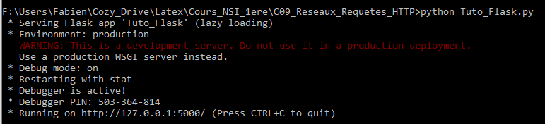
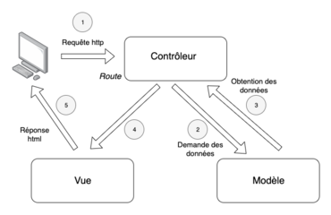

# Transmissions client-serveur

*Très fortement inspiré, voir carrément recopié depuis :
[http://lesmathsduyeti.fr/fr/lycee/nsi-premiere/interactions-client-serveur-flask](http://lesmathsduyeti.fr/fr/lycee/nsi-premiere/interactions-client-serveur-flask){: target="_blank"}*


!!! info "Modèle client-serveur"

	Pour simplifier, le modèle **client-serveur** désigne un mode de communication entre logiciels : l'un qualifié de **client** envoie des requêtes ; l'autre, le **serveur**, y répond.

	Dans le cas du web, le logiciel client est **le navigateur** et le protocole utilisé pour communiquer avec le logiciel serveur est HTTP (ou HTTPS). Le logiciel serveur est un logiciel spécialisé dans le traitement des requêtes HTTP, comme `Apache` ou `NGinx`. Ces logiciels sont épaulés par des programmes qui peuvent être écrits dans différents langages, comme **PHP** ou **Python**.

	{: style="width:60%; margin:auto;display:block;background-color: #d2dce0;" title=""}


*Pour ce TP, nous allons être dans une situation particulière : le logiciel client et le logiciel serveur seront sur la même machine.*

## Installation de Flask et premiers tests

### Installation de Flask et démarrage du serveur

!!! info "Flask"
	Flask est un micro framework (ou micro *infrastructure logicielle*) open-source de développement web en Python. Il est classé comme micro framework, car il est très léger. Flask a pour objectif de garder un noyau simple, mais extensible. Il n'intègre pas de système d'authentification, pas de couche d'abstraction de base de données, ni d'outil de validation de formulaires. Cependant, de nombreuses extensions permettent d'ajouter facilement des fonctionnalités.


!!! tips "Méthodologie"

	1. Installer `Flask` par l'intermédiaire du gestionnaire de modules de `Thonny` `Tools > Manage packages`. 
	2. Créer un fichier `Tuto_Flask.py` dans `Thonny`, puis taper les lignes suivantes et sauvegardez le fichier.

		````python
		from flask import Flask

		app = Flask(__name__)

		@app.route('/')
		def index() :
			return "Hello World !"

		if __name__ == "__main__" :
			app.run(port=5555)
		````
	1. Exécutez alors le fichier. Patientez jusqu'à avoir la dernière ligne du code ci-dessous :
		
		{: target="_blank"}
		
		!!! info "Bravo !"
			Bravo, vous avez maintenant un serveur web local qui fonctionne sur votre ordinateur ! Celui-ci écoute toutes les entrées à destination de `localhost` ( ou `hôte local`), qui est le nom DNS correspondant à l'adresse IP `127.0.0.1`. ce serveur acceptera les requêtes qui lui sont envoyées sur le port TCP 5000.
				
	1. Dans `Firefox`, tapez l'adresse `127.0.0.1:5555`.

		On obtient donc... une page web, certes sommaire, mais elle a bien été renvoyée par le serveur. On peut le voir dans la console par la ligne :
		
		```` bash
		127.0.0.1 - - [06/Jun/2024 21:26:21] "GET / HTTP/1.1" 200 -
		````
		
		Nous voyons ainsi l'adresse du client (ici `127.0.0.1`) qui effectue une requête `HTTP` ( version 1.1)  de type GET. Le code 200 signifie le succès de la requête .

	1. Dans `Firefox`, tapez l'adresse `127.0.0.1:5555/Accueil`.

		On obtient donc... une page web `Not Found` 

		```` bash
		127.0.0.1 - - [06/Jun/2024 21:27:11] "GET /Accueil HTTP/1.1" 404 -
		````

		C'est donc que le chemin vers la page `Accueil` n'a pas été trouvé. Le serveur renvoie donc la classique erreur 404.


### Analyse du code Flask

Comment comprendre le code que vous avez utilisé ? Rassurez-vous, vous devez le comprendre, mais pas savoir le produire en partant de rien !

Allons-y étape par étape :

```` python 
from flask import Flask
````

Cette ligne permet d'importer, parmi les méthodes et fonctions du module `flask`, l'objet `Flask` qui permet de créer une application web.

```` python  
app = Flask(__name__)
````
Créer une instance d'objet `app` à l'aide du constructeur `Flask`.

```` python  
@app.route('/')
````
Nous utilisons ici un décorateur grâce à la commande @ (cette notion de décorateur ne sera pas traitée en NSI). Vous devez juste comprendre la fonction qui suit ce décorateur (c'est-à-dire la fonction `index`), sera exécutée dans le cas où le serveur web recevra une requête HTTP avec une URL correspondant à la racine du site (`/`), c'est-à-dire, dans notre exemple, le cas où on saisie dans la barre d'adresse `127.0.0.1:5000/` ou `localhost:5000/` ou même simplement `localhost:5000`.

```` python  
def index():
    return "Hello World !"
````

C'est la fonction qui sera appelée lorsqu'un client demandera l'adresse `localhost:5000/`. Elle renvoie toujours le même contenu, on parlera de contenu **statique**. Plus tard nous verrons comment faire évoluer ce contenu en fonction de paramètres.

```` python  
if __name__ == '__main__':
    app.run(port=5555)
````

 Ces 2 lignes permettent de démarrer le serveur et l'instance de l'application web, accessible sur le port `5555` (le port par défaut ne semble pas fonctionner au Lycée). C'est un très bon moyen de visualiser les requêtes vers le serveur. 
 
### Ajouter une page

L'objectif est de créer une nouvelle page `contact`, qui sera donc accessible par l'URL `localhost:5000/contact`.


!!! tips "Méthodologie"
	1. Après la fonction `index`, mais avant l'instruction `if __name__ ...`, insérez le code suivant, en modifiant les informations pour y mettre les vôtres :
	
		```` python
		@app.route('/contact')
		def presentation():
			message = "<h1> Présentation du webmaster </h1>"
			message += "<h2> Kakashi Hatake </h2>"
			message += "<p>  Jônin du village caché de Konoha, Sixième Hokage </p>"
			message += """<a href="mailto:kakashihatake@konoha.jp">Mon mail</a> """
			return message
		````
		
	1. Sauvegardez le fichier. Normalement, le serveur étant en mode `debug`, il devrait redémarrer et prendre en compte immédiatement vos changements (dans le cas contraire, il suffit de relancer le script Python). Rendez-vous à l'adresse de la page de contact.
	
		Le code renvoyé par une fonction décorée par une route *peut donc être du code HTML*. Il peut être chargé depuis un fichier extérieur, comme nous avons déjà vu avec la fonction `open()` par exemple... Mais les créatrices et créateurs de Flask ont prévu **bien plus simple** !

	1. Créer une page accessible depuis l'adresse `127.0.0.1:5555/loisirs` présentant en quelques mots sur vos loisirs.

## Le modèle MVC

### Modèle Vue Contrôleur
	
Pour l'instant tout fonctionne, mais il y a encore des choses que l'on peut améliorer :


* il n'y a pas d'interaction avec l'utilisateur, nous verrons cela avec les paramètres des fonctions et les formulaires ;
* taper du code HTML dans une fonction python, ce n'est pas très propre ! 

Pour cette dernière remarque, nous allons parler des {==**templates**==} (ou *gabarits* en français). Mais avant, un peu de théorie sur {==**le modèle MVC**==}.

!!! abstract "MVC"
	Nous parlons souvent de l'**architecture MVC **(ce n'est pas uniquement lié à Flask). Il s'agit d'un modèle distinguant plusieurs rôles précis d'une application, qui doivent être accomplis. Comme son nom l'indique, l'architecture {==Modèle-Vue-Contrôleur==} est composée de trois entités distinctes, chacune ayant son propre rôle à remplir. Voici un schéma qui résume cela :

	{: style="width:60%; margin:auto;display:block;background-color: #d2dce0;" title=""}

	Le modèle MVC permet de **bien organiser son code source**. Il va vous aider à savoir quels fichiers créer, mais surtout à définir leur rôle. Le but de MVC est justement de séparer la logique du code en trois parties que l'on retrouve dans des fichiers distincts :
	
	* **Modèle** : cette partie gère **les données de votre site**. Son rôle est d'aller récupérer les informations &laquo; brutes &raquo; dans la base de données (nom, prénom, dernière connexion d'un utilisateur inscrit d'un site, par exemple) de les organiser et de les assembler pour qu'elles puissent ensuite être traitées par le contrôleur. On y trouve donc entre autres les requêtes aux bases de données (programme de Terminale NSI).

	* **Vue** : cette partie se concentre sur l'**affichage**. Elle ne fait presque aucun calcul et se contente de récupérer des variables pour savoir ce qu'elle doit afficher. On y trouve essentiellement du code HTML mais aussi quelques boucles et conditions python très simples, pour afficher par exemple une liste de messages. Elle utilise en particulier des **templates**, c'est-à-dire des modèles de pages HTML qui seront utilisés par la vue pour générer les pages HTML envoyées au client. On peut concevoir ces templates comme des **textes à trous** dans lesquels seront **insérées les données calculées par le contrôleur**.

	* **Contrôleur** : cette partie gère la logique du code qui prend des décisions. C'est en quelque sorte l'intermédiaire entre le modèle et la vue : le contrôleur va demander au modèle les données, les analyser, prendre des décisions et renvoyer le texte à afficher à la vue. Le contrôleur contient exclusivement du python (dans notre cas). C'est notamment lui qui détermine si le visiteur a le droit de voir la page ou non (gestion des droits d'accès).

	
### Un exemple de template

Notre objectif est de créer une page d'accueil plus sympathique. Nous allons donc modifier la fonction `index`.

!!! tips "Méthodologie"
	1. Créer un dossier `templates` dans le dossier contenant le fichier `Tuto_Flask.py`.
	1. Dans ce dossier, créer un fichier `index.html` avec le code suivant :

		```` html
		<!doctype html>
		<html lang="fr">
			<head>
				<meta charset="utf-8">
				<title>Ma page d'accueil</title>
			</head>
			<body>
			  <h1>Un site qui déchire.</h1>
			  <h2>Bonjour cher visiteur !</h2>
			  <p>Vous voici sur mon site à moi.</p>
			  <a href="http://127.0.0.1:5555/contact">Lien vers les contacts.</a>
			</body>
		</html>
		````
		
	1. Nous allons maintenant modifier le fichier `Tuto_Flask.py`, pour lui permettre d'utiliser ce **template**. 

		1.  Modifier la première ligne par :
		
			```` python
			from flask import Flask,render_template
			````
		1. Modifiez la fonction `index` comme suit :
		
			```` python
			@app.route('/')
			def index():
				return render_template("index.html")
			````
			
		1. Visualisez le résultat dans votre navigateur.

	1. Modifiez la  fonction qui permet l'affichage de la page de contact de manière à ce qu'elle utilise un template.

## Dynamiser les pages

### Introduire des variables
Pour l'instant, le serveur Flask produit toujours les mêmes pages. Mais Flask permet de générer des vues (pages HTML) en fonction de paramètres, de formulaires ...

Commençons par améliorer l'affichage de notre page d'accueil en personnalisant l'affichage de la salutation.

!!! tips "Méthodologie"
	1. Modifiez la page `index.html` comme cela :
	
		
		```` html
		<!doctype html>
		<html lang="fr">
			<head>
				<meta charset="utf-8">
				<title>Ma page d'accueil</title>
			</head>
			<body>
			  <h1>Un site qui déchire.</h1>
			  <h2>Bonjour {{prenom}} {{nom}} !</h2>
			  <p>Vous voici sur mon site à moi.</p>
			  <a href="./contact">Lien vers les contacts.</a>
			</body>
		</html>
		````
		
		
	1. Modifiez la fonction `index` du fichier `Tuto_Flask.py` comme suit :
	
		```` python
		@app.route('/')
		def index():
			p = "Kakashi"
			n = "Hatake"
			return render_template("index.html",prenom = p, nom = n)
		````
	1. Enregistrez et allez voir le résultat dans votre navigateur. 
	
		!!! info "Moteur de Template Jinja"
			
			Remarquez le code ```{{prenom}} {{nom}}``` dans le template. Il s'agit de {==syntaxe `Jinja`==}. Le contrôleur de Flask utilise `Jinja` pour remplacer ces variables par celles qui sont fournies par la fonction `index`.
			
			
			`Jinja` permet bien d'autres actions, et est particulièrement adapté pour la création de grosses applications web.
			
			Pour l'instant, il faut changer à la main les variables pour que le nom affiché soit le bon, MAIS ce n'est que le début. Nous verrons plus tard comment, avec un formulaire, nous pourrons adapter la page à l'utilisateur.

	1. Modifiez le début du fichier `Tuto_Flask.py`  avec :
		```` python
		from flask import Flask,render_template
		import datetime
		from math import pi
		app = Flask(__name__)


		@app.route('/')
		def index():
			p = "Kakashi"
			n = "Hatake"
			date = datetime.datetime.now()
			heure = date.hour
			minute = date.minute
			seconde = date.second
			return render_template("index.html",prenom = p,
			 nom = n, heure = heure, minute=minute, seconde=seconde)
		````
		
	
		
	1. Modifiez le fichier `index.html` en ajoutant la ligne suivante entre les balises `<body>` et `</body>` :
	
		
		```` html
		<p> Il est {{heure}} h {{minute}} m {{seconde}} s (heure du serveur !)</p>
		````
		
		
		Testez l'affichage dans votre navigateur.
	1. Modifiez la fonction `contact` et le template associé pour qu'il affiche une phrase du genre &laquo; Je suis né le xx/xx/xxxx cela fait xxxx jours &raquo;.
	
		!!! info "Quelques indices"
			Quelques indices :

			* `datetime.datetime(a,m,j)` permet de créer un objet `date` de l'année `a`, mois `m` et jours `j` ;
			* Pour récupérer le nombre de jour d'un objet date, if faut ajouter l'attribut `.day` à la suite de l'objet `date`.

### Utilisation d'un formulaire avec la méthode GET


!!! tips "Méthodologie"
	1. Modifiez le fichier `index.html` en introduisant le formulaire suivant juste avant la balise `</body>` :
	
		```` html
		<form action="./resultat" method="get">
			<label>Nom</label> : <input type="text" name="nom" />
			<label>Prénom</label> : <input type="text" name="prenom" />
			<input type="submit" value="Envoyer" />
		</form>
		````
		
	1. Actualisez ou affichez la page d'accueil, et complétez le formulaire. Que se passe-t-il quand vous cliquez sur le bouton `Envoyer` ?
	
	 
		C'est tout-à-fait normal ! En effet le code  :
		
		```` html
		<form action="./resultat" method="get">
		````
		
		signifie que l'envoi du formulaire se fait avec la méthode `GET` et que la page affichée ensuite sera celle de l'adresse `127.0.0.1:5555/resultat`. Or il n'y a pas de route associée à cette adresse, et encore moins de template.
		
		Cependant vous pouvez observer que l'adresse obtenue dans la barre d'adresse est du type 
			
		```` bash
		http://localhost:5000/resultat?nom=HATAKE&prenom=Kakashi
		````
		
		Les données envoyées **apparaissent dans l'URL**. C'est la méthode `GET` - qui est une méthode générale de HTTP, qui veut cela.
		
		Avec cette méthode, **les données du formulaire seront encodées dans une URL**. Celle-ci est composée du nom de la page ou du script à charger avec les données de formulaire empaquetée dans une chaine. Les données sont séparées de l'adresse de la page par le code `?` et entre elles par le code `&`.


		{==Imaginez si Facebook faisait ça quand vous entre votre login et votre mot de passe...==}

		!!! info "Méthode GET"
		
			La méthode `GET` est limitée :

			* Elle ne sécurise pas du tout l'envoi de données ;
			* Les données de formulaire doivent être uniquement des codes ASCII.
			* La taille d'une URL est limitée à par le serveur, souvent un peu plus de 2000 caractères, en comprenant les codes d'échappement.
			* Il est recommandé d'utiliser cette méthode dans des cas où l'on ne modifie pas de base de données pour des raisons évidentes de sécurité. Dans un cas comme le notre cela suffira car nous allons simplement lire les données pour faire un affichage.

	1. Dans le fichier `Tuto_Flask.py`, ajoutez l'import 
	
		```` python 
		from flask import Flask,render_template,request
		````
		
	1. Ajoutez la route et la fonction suivante :

		```` python
		@app.route('/resultat',methods = ['GET','POST'])
		def salutation():
			if request.method == 'GET':
				return request.args
			else: 
				return "post"
		````
		
	1. Actualisez et remplissez à nouveau le formulaire.
   
		`request.args` va s'afficher, et vous pouvez constater que c'est un objet de type dictionnaire. Pour accéder au nom il va falloir utiliser la syntaxe des dictionnaires : `request.args['nom']`
   
	1. Créer un fichier `resultat.html` dans le dossier `templates`, contenant le code HTML suivant :
		
		
		```` html
		<!doctype html>
		<html lang="fr">
			<head>
				<meta charset="utf-8">
				<title>Salutations !</title>
			</head>
			<body>
				<p>Bonjour, en fait vous vous nommez {{prenom}} {{nom}} !</p>
			</body>
		</html>
		````
		
		
	1. Modifiez le fichier `Tuto_Flask.py`  comme ceci :
	
		
		```` python
		@app.route('/resultat',methods = ['GET','POST'])
		def salutation():
			if request.method == 'GET':
				prenom_visiteur = request.args['prenom']
				nom_visiteur = request.args['nom']
				return render_template('resultat.html',
					prenom=prenom_visiteur,nom=nom_visiteur)
			elif request.method == 'POST':
				return "post"
		````		
		
		
	1. Testez à nouveau. Vous devriez avoir un affichage correct.
	 
### Utilisation d'un formulaire avec la méthode POST

!!! tips "Méthodologie"
	1. Modifiez la méthode d'envoi du formulaire par :
	
		```` html
		<form action="http://127.0.0.1:5555/resultat" method="post">
		````
	
		Actualisez, remplissez le formulaire et cliquez sur envoyer.
 
		C'est tout-à-fait normal de voir juste écrit &laquo; post&raquo; sur la page finale, car nous n'avons pas modifié la fonction `salutation`.
		Par contre vous devez observer que **les données ont bien disparu de l'URL**. Mais heureusement elles sont quand même transmises.
	  
	1. Modifiez dans la fonction `salutation` les deux dernières lignes par :
	
		```` python
		elif request.method == 'POST':
			return request.form
		````

		Actualisez, remplissez le formulaire, etc...
		
		`request.form` va s'afficher, et vous pouvez constater que rien n'a changé par rapport à la méthode POST, mis à part la méthode `.args` remplacée par `.form`.
   
	1. Modifiez enfin la fonction `salutation` ainsi :
	
		```` python
		@app.route('/resultat',methods = ['GET','POST'])
		def salutation():
			if request.method == 'GET':
				prenom_visiteur = request.args['prenom']
				nom_visiteur = request.args['nom']
			elif request.method == 'POST':
				prenom_visiteur = request.form['prenom']
				nom_visiteur = request.form['nom']
			return render_template('resultat.html',prenom=prenom_visiteur,nom=nom_visiteur)
		````

!!! info "Méthode POST"
	La méthode `POST` est indispensable pour :

	* des codes non ASCII,
	* des données de taille importante,
	* et elle est recommandée pour modifier les données sur le serveur, et pour les données sensible comme expliqué par le W3C.

!!! info "Rendre son application accessible depuis le réseau du Lycée"

	Il est possible de rendre votre application lisible depuis n'importe quelle machine du Lycée. Pour cela :

	* vous lancez l'application Flask avec l'IP d'hôte `0.0.0.0` : ``flask run --host=0.0. 0.0`` ;
	* vous communiquez à vos voisins votre adresse IP obtenue dans le terminal windows (en exécutant la commande `CMD.exe` puis en exécutant dans le terminal la commande `ipconfig`).
	
	Ils pourront alors accéder à votre application via votre adresse IP.


## Une application : chiffre de César

Vous devez créer une application web qui pourra coder ou décoder un texte codé avec la méthode de César. La méthode de César est expliquée [ici](https://fr.wikipedia.org/wiki/Chiffrement_par_d\%C3\%A9calage){: target="_blank"}.

Pour réaliser cet exercice, il faut :

* une page `cesar.html` avec un formulaire pour saisir le texte à coder et pour saisir la clé de codage ;
* une page `codage.html` qui sera appelée après l'envoi du formulaire et qui affichera le texte codé.


Voici le code d'une fonction permettant de coder une chaine de caractère selon le code de César :
```` python
def cesar(texte, cle):
    """
    Fonction de codage par décalage (césar)
    Entrées : une chaine de caractères et un entier
    Sortie : une chaine de caractère
    """
    texte_code = ""
    for char in texte:
        if char.isalpha(): #si le caractère est une lettre on décale
            nouvelIndice = ord(char) + cle
            #Pour rester dans l'aplphabet, on décale de 26 en arrière si besoin
            if ord(char) <= ord('z') < nouvelIndice or ord(char) <= ord('Z') < nouvelIndice: 
                nouvelIndice -= 26
            lettrefinale = chr(nouvelIndice)
            texte_code += lettrefinale
        else: #si le caractère n'est pas une lettre, on n'y touche pas
            texte_code += char
    return texte_code
````


!!! tips "Quelques liens"
	* Le [méga tutoriel Flask de Miguel Grinberg (en anglais)](https://blog.miguelgrinberg.com/post/the-flask-mega-tutorial-part-i-hello-world){: target="_blank"}
	* La chaine Youtube *Pretty Printed* (en anglais), qui offre d'excellentes vidéos sur Flask, mais aussi sur son concurrent Django.
