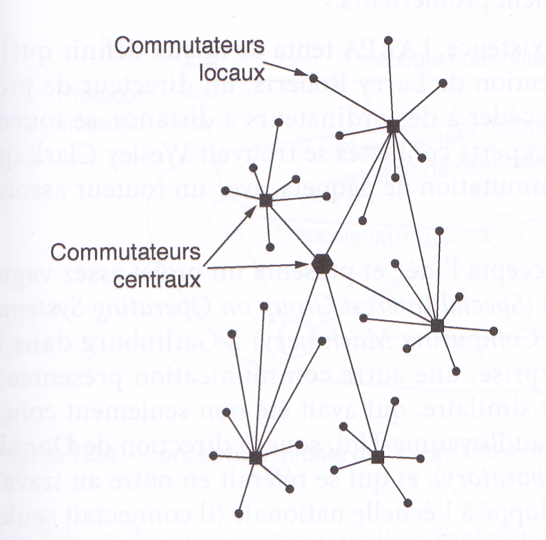
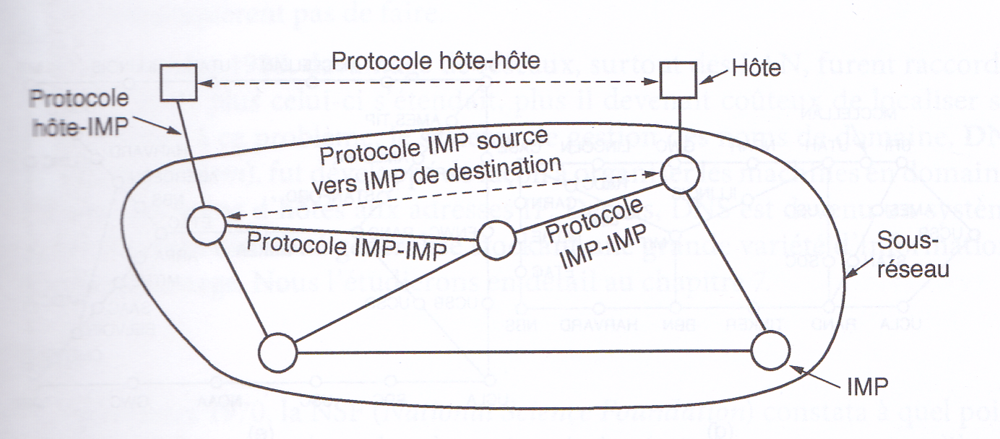
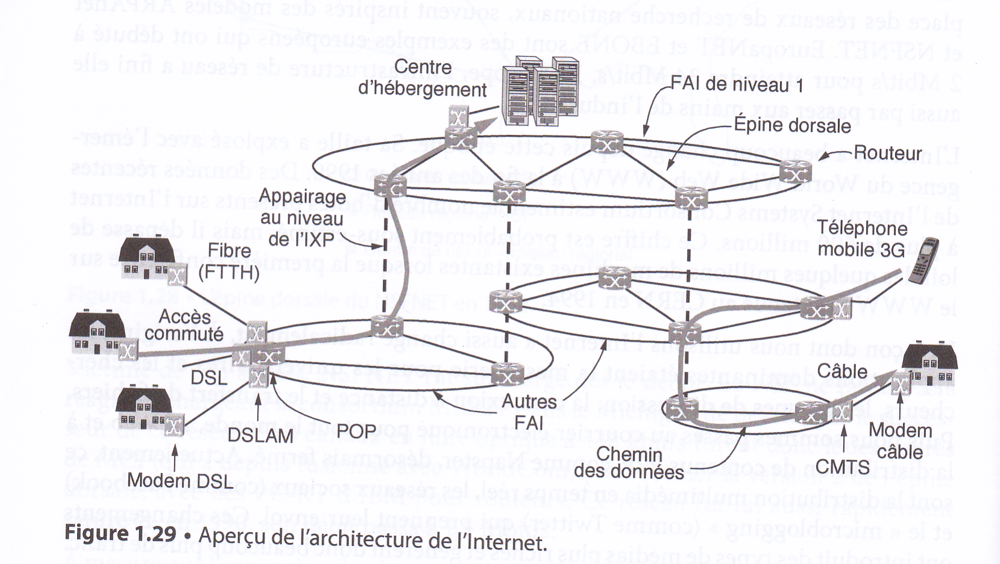

# Notions historiques : Arpanet et internet

Il existe beaucoup de réseaux dans le monde, souvent composés de matériels et de logiciels différents. Les personnes connectées à un réseau souhaitent fréquemment communiquer avec d'autres personnes reliées à d'autres réseaux. Pour satisfaire à cette demande, les divers réseaux, souvent incompatibles entre eux, doivent être **interconnectés**. Un ensemble de réseaux ainsi reliés s'appelle un interréseau (*inter-network*), l'Internet en étant l'exemple le plus connu aujourd'hui. Il utilise des réseaux
de **FAI** pour connecter des réseaux d'entreprise, des réseaux domestiques et bien d'autres réseaux.

L'Internet n'est donc pas véritablement un réseau mais un immense regroupement de différents réseaux qui ont en commun **différents protocoles** et offrent certains services similaires. C'est un système qui n'a pas été planifié par quiconque et que personne ne contrôle. Pour mieux le comprendre, voyons comment il s'est développé et pour quelles raisons.

*Les textes et illustrations ci-dessous sont extraits du livre *Réseaux*, Andrew Tanenbaum et David Wetherall, 5ème édition, Pearson*.

## AT&T et Paul Baran

Tout commence à la fin des années 1950, au plus fort de la Guerre Froide. Le ministère de la défense dse Etats-Unis (*DoD : Department of Defense*) souhaitait disposer d'un réseau de communication capable de résister à une attaque nucléaire. A l'époque, le réseau téléphonique des Etats-Unis était connecté comme sur le schéma ci-dessous.

{: style="width:30%; margin:auto;display:block;background-color: #d2dce0;" title="Réseaux, Andrew Tanenbaum et David Wetherall, 5ème édition, Pearson"}

Chaque point noir représente un **commutateur téléphonique**, auquel étaient reliés des milliers de téléphones. Ces commutateurs locaux étaient eux-mêmes connectés à des **commutateurs centraux** pour former une hiérarchie nationale, avec une redondance minimale (c'est-à-dire sans duplication de systèmes ou de matériels). Le problème était que la destruction de quelques-uns seulement de ces centres pouvait conduire à l'éclatement du système, qui serait alors fragmenté en de nombreux îlots isolés.

Vers 1960, le DoD passa un contrat avec la RAND Corporation pour trouver une solution. L'un de ses employés, [**Paul Baran**](https://www.zdnet.fr/blogs/infra-net/les-pionniers-de-l-it-paul-baran-leonard-kleinrock-et-donald-davies-inventeurs-de-la-commutation-de-paquets-39765390.htm){: target="_blank"}, alors âgé d'environ 35 ans, imagina une architecture hautement distribuée et tolérante aux pannes, illustrée ci-dessous. La distance entre deux commutateurs étant trop importante pour que les signaux analogiques puissent la parcourir sans distorsion, Baran proposa d'employer une technologie **numérique de commutation de paquets**. Il rédigea plusieurs rapports à l'intention du *DoD*, décrivant en détail son idée.

{: style="width:30%; margin:auto;display:block;background-color: #d2dce0;" title="Réseaux, Andrew Tanenbaum et David Wetherall, 5ème édition, Pearson"}

Le Pentagone la trouva intéressante et demanda à AT&T, entreprise qui détenait à l'époque le monopole des communications téléphoniques sur le territoire des États-Unis, de développer un prototype. AT&T rejeta d'emblée le concept de Baran. Ce n'était pas un jeune employé qui allait apprendre à l'entreprise la plus grande et la plus riche du monde à concevoir un système téléphonique. Baran s'entendit finalement dire que son idée de réseau n'était pas réalisable, et elle fut donc abandonnée.

## ARPA et ARPAnet

Parallèlement, en octobre 1957, l'Union Soviétique prend une avance considérable sur les Etats-Unis dans la course vers l'espace, avec le lancement du premier satellite artificiel, {==**Spoutnik**==}. Le président américain Eisenhower, en tentant de déterminer les causes de ce retard, fut consterné de constater que les armées de terre, de l'air et la marine américaine se disputaient le budget de la recherche du Pentagone. Il réagit immédiatement avec la création d'une seule unité de recherche de la Défense, l'{==**ARPA**==} (*Advanced Research Projects Agency*). Cette agence n'employait aucun scientifique et ne possédait pas non plus de laboratoires : en fait, elle ne disposait que d'un bureau et d'un budget modeste (selon les standards du Pentagone).

Sa tâche consistait à octroyer des subventions et des contrats aux universités et aux entreprises dont les projets lui semblaient prometteurs.

Au cours de ses premières années d'existence, l'ARPA tenta de mieux définir quelle devait être sa mission.En 1962 l'ARPA soutient le projet du professeur [**Licklider**](https://fr.wikipedia.org/wiki/Joseph_Carl_Robnett_Licklider){: target="_blank"} qui a pour but de mettre en réseau les ordinateurs des universités américaines afin que ces dernières puissent échanger des informations plus rapidement (même à des milliers de kilomètres de distance). En 1967, l'attention de **Larry Roberts**, un directeur de programme de l'ARPA, se tourna vers les réseaux. Parmi les différents experts contactés se trouvait **Wesley Clark** qui suggéra de créer un sous-réseau à commutation de paquets.

Après quelques hésitations, Roberts accepta l'idée et présenta un projet assez vague à ce sujet lors d'un colloque de l'**ACM** (*Association for Computing Machinery*) à Gatlinburg dans le Tennessee, fin 1967. À sa grande surprise, une autre communication présentée à cette conférence décrivait un système similaire, qui avait été non seulement conçu mais encore entièrement implémenté au Royaume-Uni, sous la direction de [**Donald Davies**](https://www.zdnet.fr/blogs/infra-net/les-pionniers-de-l-it-paul-baran-leonard-kleinrock-et-donald-davies-inventeurs-de-la-commutation-de-paquets-39765390.htm){: target="_blank"} du **NPL** (*National Physical Laboratory*), et qui se référait en outre au travail de Baran. Ce système n'était pas développé à l'échelle nationale (il connectait seulement quelques ordinateurs du campus du NPL), mais il démontrait la faisabilité d'un réseau à commutation de paquets. Roberts revint de Gatlinburg bien décidé à mettre en œuvre ce qui allait devenir l'**ARPAnet**.

Le sous-réseau serait formé de mini-ordinateurs appelés **IMP** (*Interface Message Processor*), reliés par des lignes de transmission à 56 kbit/s (ce qui était ce qui ce faisait de mieux à l'époque). Pour une fiabilité maximale, chaque IMP serait connecté au moins à deux autres IMP.

Chaque nœud du réseau consisterait en un IMP et un hôte, situés dans la même pièce et reliés par un câble court. L'hôte pourrait envoyer des messages de 8 063 bits maximum à son IMP, qui les diviserait alors en paquets de 1 008 bits maximum et les transmettrait indépendamment vers leur destination. Chaque paquet serait entièrement reçu par un nœud avant d'être retransmis.

{: style="width:60%; margin:auto;display:block;background-color: #d2dce0;" title="Réseaux, Andrew Tanenbaum et David Wetherall, 5ème édition, Pearson"}

Il s'avéra que la société désignée pour concevoir le système s'était bornée au niveau logiciel à ne concevoir que les liaisons IMP, et laissa de côté le protocole hôte.

Pour résoudre ce problème de logiciel du côté hôte, Larry Roberts (de l'ARPA) convia des chercheurs en réseau, pour la plupart des étudiants en troisième cycle, à se réunir durant l'été 1969. Ceux-ci s'attendaient à ce qu'un expert leur décrive la conception du réseau et de son logiciel puis demande à chacun d'en implémenter une partie. À leur grande surprise, ils constatèrent qu'il n'y avait ni expert ni conception pour les guider, et qu'il leur faudrait déterminer eux-mêmes comment procéder.

Le 29 octobre 1969, le premier message (le mot `login`) est envoyé depuis l'UCLA vers le SRI, les 2 universités étant environ distantes de 500 Km. C'est un demi-succès, puisque seules les lettres `l` et `o` arriveront à bon port.

C'est ainsi qu'un réseau expérimental vit le jour en décembre 1969, formé de quatre nœuds situés à l'université de Californie à Los Angeles (UCLA), à l'université de Californie à Santa Barbara (UCSB), au Stanford Research Institute (SRI) et à l'université d'Utah. Ces quatre institutions furent choisies en raison du grand nombre de contrats passés par chacune avec l'ARPA, mais aussi pour la diversité et l'incompatibilté de leurs ordinateurs respectifs (ce qui accentuait le défi). Le réseau se développa rapidement comme le montre le schéma suivant.

.png){: style="width:60%; margin:auto;display:block;background-color: #d2dce0;" title="Réseaux, Andrew Tanenbaum et David Wetherall, 5ème édition, Pearson"}

## D'ARPAnet à Internet

En plus de soutenir la croissance du tout jeune réseau ARPAnet, l'ARPA a aussi financé des recherches sur les réseaux satellitaires et les réseaux radio mobiles par paquets. Dans l'une de ses expériences devenue célèbre, un chercheur parcourant la Californie à bord d'un camion utilisait un réseau radio par paquets pour envoyer des messages au SRI, qui les transmettait à travers l'ARPAnet vers la côte est, après quoi ils étaient acheminés vers l'University College de Londres via un satellite. Le chercheur pouvait ainsi utiliser un ordinateur situé à Londres pendant que lui-même se déplaçait de l'autre côté de l'Atlantique.

Cette expérience a également démontré que les protocoles ARPAnet existants n'étaient pas adaptés aux transmissions entre réseaux différents. Cette observation a entraîné la poursuite des recherches sur les protocoles, conduisant notamment à l'invention du modèle TCP/IP et de ses protocoles par Vinton Cerf et Robert Elliot Kahn.  Ce modèle a été Conçu précisément pour gérer les communications sur des interréseaux, répondant à une nécessité croissante due au raccordement de réseaux toujours plus nombreux à l'ARPAnet.

Au cours des années 1980, davantage de réseaux, surtout des LAN, furent raccordés à l'ARPAnet. Mais plus celui-ci s'étendait, plus il devenait coûteux de localiser ses hôtes. En réponse à ce problème, le système de gestion des noms de domaine, **DNS** (*Domain Name System*), fut développé de façon à organiser les machines en domaines et à associer des noms d'hôtes aux adresses IP.

Parallèlement, à la fin des années 1970, la **NSF** (*National Science Foundation*) constata à quel point l'impact de l'ARPAnet sur la recherche universitaire était important, puisqu'il permettait aux scientifiques de partager des données et de travailler sur des projets communs à travers tout le pays. Toutefois, pour pouvoir participer à ce réseau, une université devait être sous contrat de recherche avec le DoD, ce qui n'était pas le cas pour beaucoup d'entre elles. La réponse initiale de la NSF fut de financer le CSNET (Computer Science Network) en 1981. Celui-ci connectait des départements d'informatique et des laboratoires de recherche appliquée à l'ARPAnet via des connexions par modem et des lignes louées. À la fin des années 1980, la NSF alla plus loin et décida de construire un successeur de l'ARPAnet qui serait ouvert à toutes les instances de recherche universitaire.

La NSF décida donc de créer un réseau fédérateur pour connecter ses six centres de calcul basés à San Diego, Boulder, Champaign, Pittsburgh, Ithaca et Princeton.

À chacun des six supercalculateurs était associé un micro-ordinateur surnommé **fuzzball**. Ces fuzzballs étaient reliés au moyen de lignes louées à 56 kbit/s et formaient le sous-réseau, à l'image de la technologie matérielle utilisée par l'ARPAnet. Toutefois, la technologie logicielle était différente : les fuzzballs supportaient dès le départ TCP/IP.

La NSF finança également plusieurs réseaux régionaux (une vingtaine au total), qui furent reliés à l'épine dorsale pour permettre aux utilisateurs de milliers d'universités, de laboratoires de recherche, de bibliothèques et de musées d'accéder à n'importe quel supercalculateur et de communiquer entre eux. Le réseau complet, incluant l'épine dorsale et les réseaux régionaux, fut nommé **NSFNET** et raccordé à l'ARPAnet au moyen d'une liaison entre un IMP et un fuzzball dans la salle des machines de l'université Carnegie-Mellon.

Victime de son succès, NSFNET fut surchargé dès le début, et du s'adapter en passant à la fibre optique. À mesure que l'expansion du réseau continuait, la NSF se rendit compte que le gouvernement ne pourrait pas la financer indéfiniment. En outre, les statuts de la fondation empêchaient les entreprises commerciales d'utiliser un réseau dont elle assurait seule le financement. En conséquence, elle encouragea ces entreprises à créer une organisation à but non lucratif, l'**ANS** (*Advanced Networks and Services*), qui serait la première étape sur la voie de la commercialisation.

Pour faciliter la transition et s'assurer que tous les réseaux régionaux pourraient communiquer entre eux, la NSF signa des contrats avec quatre opérateurs différents en vue d'établir des points d'accès au réseau ou NAP (Network Access Point).

Chaque opérateur devait se raccorder à tous les NAP pour pouvoir offrir des services d'épine dorsale aux réseaux régionaux. Cela signifiait qu'un paquet provenant de n'importe lequel de ces réseaux avait le choix entre plusieurs opérateurs pour aller du NAP source vers le NAP de destination. Les opérateurs se disputèrent donc les marchés régionaux à coups d'offres de services et de prix, ce qui était bien entendu l'effet recherché. Le concept d'une seule épine dorsale par défaut fut ainsi remplacé par une infrastructure commerciale où la concurrence était vive.

Au cours des années 1990, de nombreux autres pays et régions du monde mirent en place des réseaux de recherche nationaux, souvent inspirés des modèles ARPAnet et NSFNET. EuropaNET et EBONE sont des exemples européens. En Europe, l'infrastructure de réseau a fini elle aussi par passer aux mains de l'industrie.

Le schéma suivant donne une vision simplifiée de ce qu'est internet aujourd'hui :

{: style="width:60%; margin:auto;display:block;background-color: #d2dce0;" title="Réseaux, Andrew Tanenbaum et David Wetherall, 5ème édition, Pearson"}

