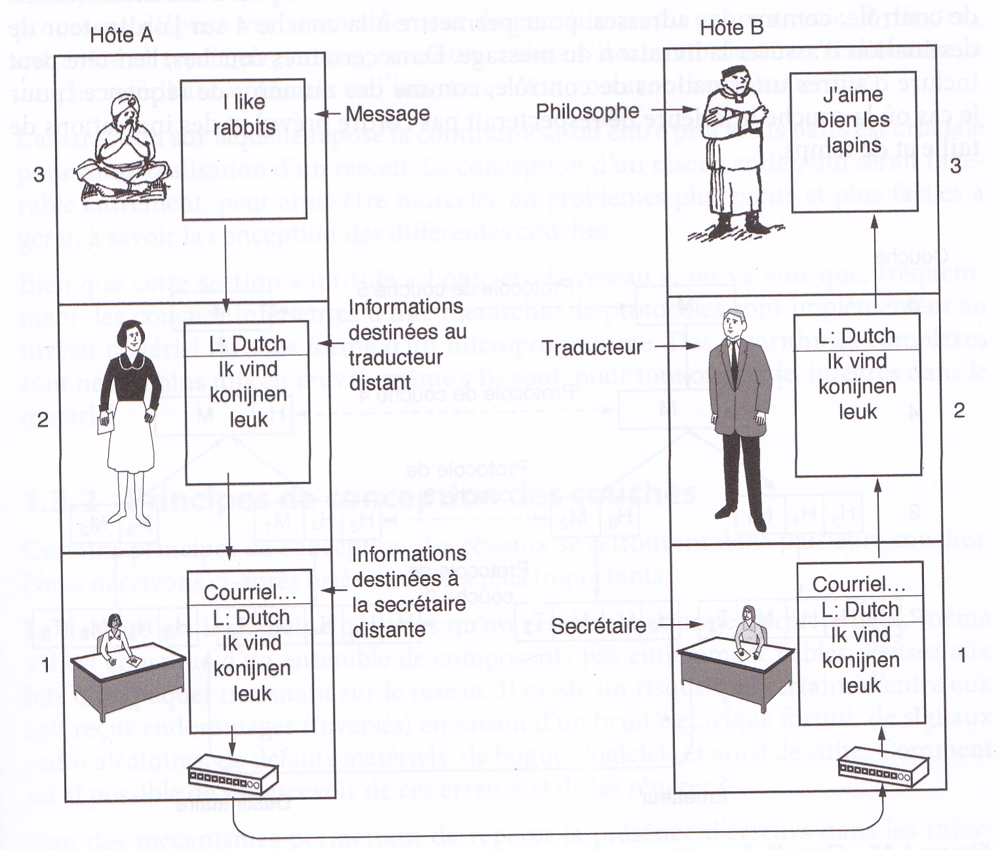
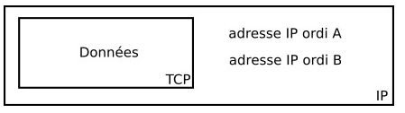
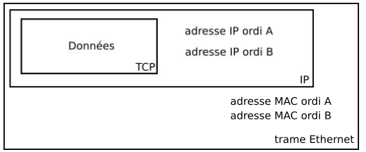
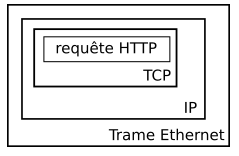
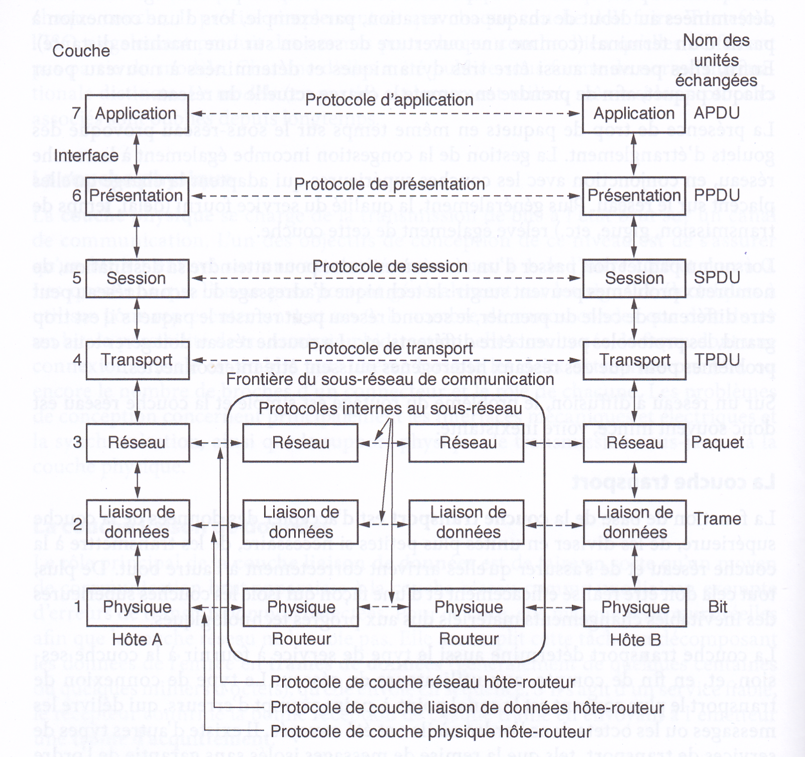
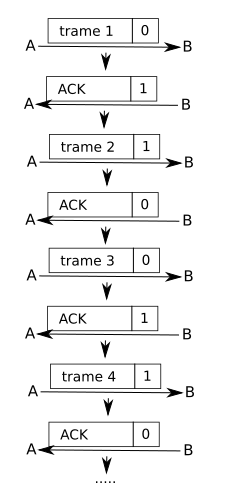
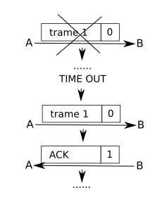
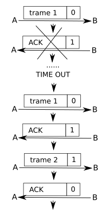

# Réseaux, Trames et Paquets

*Les textes et illustrations sont extraites de [pixees.fr](pixees.fr){: target="_blank"}*.

Un bon point de départ est de connaître le oprincipe de `TCP/IP` et le vocabulaire de base du réseau, qu'on peut retrouver, ainsi que la manipulation du logiciel `Filius`, dans la partie du site sur [le réseau en SNT](../../../SNT/Reseaux/TCP_IP.md){: target="_blank"}


## Le principe d'encapsulation

Nous avons eu l'occasion de voir avec les protocoles TCP et IP le processus d'encapsulation des données :  &laquo; IP encapsule TCP &raquo;. On parle alors de **communication en couches**.

Pour mieux comprendre ce que représente la communication en couches, imaginez la situation suivante. Deux philosophes (couche 3) souhaitent s'entretenir, mais l'un parle ourdou et anglais, et l'autre chinois et français. Faute de pouvoir partager une langue commune, ils engagent chacun un traducteur (couche 2), qui fait appel à son tour à une secrétaire (couche 1).

{: style="width:70%; margin:auto;display:block;background-color: #546d78;" title="Réseaux, Andrew Tanenbaum et David Wetherall, 5ème édition, Pearson"}

Le premier philosophe souhaite communiquer à son homologue distant sa passion pour *Oryctolagus cuniculus*. Il transmet un message (en anglais) à son traducteur de vive voix (interface 2/3), en indiquant &laquo; I like rabbits &raquo;. Comme les traducteurs se sont accordés sur une langue commune, en l'occurrence le néerlandais, le message est converti en &laquo; Ik vind konijnen leuk &raquo;.Le choix de cette langue fait partie du protocole de couche 2 et appartient aux seulement aux traducteurs.

Le traducteur écrit le message et le passe à sa secrétaire (interface 1/2) pour transmission. de la même manière les secrétaires se sont entendues pour correspondre par email (protocole de couche 1).

Quand le message parvient à l'autre secrétaire, il est transmis au traducteur local, qui le traduit en français et le transmet au deuxième philosophe.

Notez que les protocoles sont complètement indépendants les uns des autres tant que les interfaces ne sont pas changées. Les traducteurs pourraient passer au finnois, pourvu qu'ils soient tous les deux d'accord et qu'aucun ne change ses interfaces avec les couches 1 et 3. De même, les secrétaires pourraient choisir le téléphone ou les signaux de fumées, sans déranger, ni même aviser, les autres couches. Chaque processus peut ajouter certaines informations à l'intention du processus pair uniquement, et celles-ci ne seront pas transmises à la couche supérieure.

## Trames Ethernet

Les paquets IP ne peuvent pas transiter sur un réseau tel quel, ils vont eux aussi être encapsulés avant de pouvoir &laquo; voyager&raquo; sur le réseau. L'encapsulation des paquets IP produit ce que l'on appelle une trame. Il n'est pas question d'étudier en détail ce qu'est une trame, vous devez juste savoir qu'il existe de nombreux types de trames : ATM, token ring, PPP, Ethernet, Wifi... Nous allons uniquement évoquer la dernière : la trame Ethernet (en sachant que la trame Wifi ressemble beaucoup à la trame Ethernet).

Nous avons vu que le paquet IP contient les adresses IP de l'émetteur et du récepteur :

{: style="width:30%; margin:auto;display:block;background-color: #546d78;" title="Réseaux, Andrew Tanenbaum et David Wetherall, 5ème édition, Pearson"}

Le paquet IP étant encapsulé par la trame Ethernet, les adresses IP ne sont plus directement disponibles (il faut désencapsuler le paquet IP pour pouvoir lire ces adresses IP), nous allons donc trouver un autre type d'adresse qui permet d'identifier l'émetteur et le récepteur : l'adresse **MAC** (*Media Access Control*) aussi appelée adresse physique.

{: style="width:30%; margin:auto;display:block;background-color: #546d78;" title="Réseaux, Andrew Tanenbaum et David Wetherall, 5ème édition, Pearson"}


Une adresse MAC est codée sur 6 octets,et est écrite traditionnellement hexadécimal, chaque octet étant séparés par 2 points (exemple d'adresse MAC : `00:E0:4C:68:02:11`).

L'adresse MAC est liée au matériel, chaque carte réseau (Ethernet ou Wifi) possède sa propre adresse MAC, il n'existe pas dans le monde, 2 cartes réseau (Ethernet ou Wifi) qui possèdent la même adresse MAC. Les 3 premiers octets d'une adresse MAC (`00:E0:4C` dans l'exemple ci-dessus) désignent le constructeur du matériel, par exemple, `00:E0:4C` désigne le constructeur &laquo; Realtek semiconductor corp&raquo;.

Au moment de l'encapsulation d'un paquet IP, l'ordinateur émetteur va utiliser un protocole nommé **ARP** (*Address Resolution Protocol*) qui va permettre de déterminer l'adresse MAC de l'ordinateur destinataire, en effectuant une requête de type **broadcast** (requête destinée à tous les ordinateurs du réseau) du type :  &laquo; j'aimerais connaitre l'adresse MAC de l'ordinateur ayant pour IP `XXX.XXX.XXX.XXX` &raquo;. Une fois qu'il a obtenu une réponse à cette requête ARP, l'ordinateur émetteur encapsule le paquet IP dans une trame Ethernet et envoie cette trame sur le réseau. 

## L'encapsulation TCP

En fait, TCP effectue lui aussi une encapsulation, les données encapsulées par TCP peuvent être de plusieurs natures : requêtes et réponses HTTP, ou **FTP** (*File Transfer Protocol*), **SMTP** (*Send Message Transfert Protocol*), **DNS**, etc...

En conservant l'exemple d'une requête HTTP, on a donc :

{: style="width:30%; margin:auto;display:block;background-color: #546d78;" title="Réseaux, Andrew Tanenbaum et David Wetherall, 5ème édition, Pearson"}

### Le modèle des couches TCP/IP

Le modèle TCP/IP est donc un modèle en couches :

{: style="width:30%; margin:auto;display:block;background-color: #546d78;" title="Réseaux, Andrew Tanenbaum et David Wetherall, 5ème édition, Pearson"}

La couche du &laquo; dessous &raquo; encapsule la couche située &laquo; au dessus &raquo;.On nomme ce système de couche &laquo; **modèle de couches TCP/IP**&raquo; car ce modèle repose principalement sur TCP et IP.

Il existe aussi un modèle théorique, dit **modèle OSI** (*Open System Interconnectioon*), qui est un modèle conçu à la demande de l'ISO comme une première étape vers la normalisation internationale des protocoles utilisés dans les diverses couches. Une description en est donnée dans la figure ci-dessous :

{: style="width:50%; margin:auto;display:block;background-color: #546d78;" title="Réseaux, Andrew Tanenbaum et David Wetherall, 5ème édition, Pearson"}


### Une véritable trame

Le logiciel libre `Wireshark` permet la capture et l'analyse de toutes les trames pasant par les diverses interfaces réseau d'un ordinateur. Voici une copie d'écran d'une capture :

{: style="width:60%; margin:auto;display:block;background-color: #546d78;" title="Réseaux, Andrew Tanenbaum et David Wetherall, 5ème édition, Pearson"}

Voici les données présentes dans chaque onglet :

=== "Ethernet"
	```` bash
	Ethernet II, Src: FreeboxS_81:53:dc (68:a3:78:81:53:dc), Dst: Giga-Byt_dd:1c:1b (90:2b:34:dd:1c:1b)
		Destination: Giga-Byt_dd:1c:1b (90:2b:34:dd:1c:1b)
			Address: Giga-Byt_dd:1c:1b (90:2b:34:dd:1c:1b)
			.... ..0. .... .... .... .... = LG bit: Globally unique address (factory default)
			.... ...0 .... .... .... .... = IG bit: Individual address (unicast)
		Source: FreeboxS_81:53:dc (68:a3:78:81:53:dc)
			Address: FreeboxS_81:53:dc (68:a3:78:81:53:dc)
			.... ..0. .... .... .... .... = LG bit: Globally unique address (factory default)
			.... ...0 .... .... .... .... = IG bit: Individual address (unicast)
		Type: IPv4 (0x0800)
	````

=== "IP"
	```` bash
	Internet Protocol Version 4, Src: 195.221.67.112, Dst: 192.168.1.35
		0100 .... = Version: 4
		.... 0101 = Header Length: 20 bytes (5)
		Differentiated Services Field: 0x00 (DSCP: CS0, ECN: Not-ECT)
			0000 00.. = Differentiated Services Codepoint: Default (0)
			.... ..00 = Explicit Congestion Notification: Not ECN-Capable Transport (0)
		Total Length: 176
		Identification: 0x4f14 (20244)
		Flags: 0x40, Don't fragment
			0... .... = Reserved bit: Not set
			.1.. .... = Don't fragment: Set
			..0. .... = More fragments: Not set
		Fragment Offset: 0
		Time to Live: 247
		Protocol: TCP (6)
		Header Checksum: 0x6b1a [validation disabled]
		[Header checksum status: Unverified]
		Source Address: 195.221.67.112
		Destination Address: 192.168.1.35
	````
=== "TCP"
	```` bash
	Transmission Control Protocol, Src Port: 80, Dst Port: 59676, Seq: 1, Ack: 497, Len: 136
		Source Port: 80
		Destination Port: 59676
		[Stream index: 6]
		[TCP Segment Len: 136]
		Sequence Number: 1    (relative sequence number)
		Sequence Number (raw): 2717814275
		[Next Sequence Number: 137    (relative sequence number)]
		Acknowledgment Number: 497    (relative ack number)
		Acknowledgment number (raw): 3656933230
		0101 .... = Header Length: 20 bytes (5)
		Flags: 0x018 (PSH, ACK)
			000. .... .... = Reserved: Not set
			...0 .... .... = Nonce: Not set
			.... 0... .... = Congestion Window Reduced (CWR): Not set
			.... .0.. .... = ECN-Echo: Not set
			.... ..0. .... = Urgent: Not set
			.... ...1 .... = Acknowledgment: Set
			.... .... 1... = Push: Set
			.... .... .0.. = Reset: Not set
			.... .... ..0. = Syn: Not set
			.... .... ...0 = Fin: Not set
			[TCP Flags: ·······AP···]
		Window: 4380
		[Calculated window size: 4380]
		[Window size scaling factor: -2 (no window scaling used)]
		Checksum: 0x26e8 [unverified]
		[Checksum Status: Unverified]
		Urgent Pointer: 0
		[SEQ/ACK analysis]
			[This is an ACK to the segment in frame: 105]
			[The RTT to ACK the segment was: 0.025245000 seconds]
			[iRTT: 0.021163000 seconds]
			[Bytes in flight: 136]
			[Bytes sent since last PSH flag: 136]
		[Timestamps]
			[Time since first frame in this TCP stream: 0.049359000 seconds]
			[Time since previous frame in this TCP stream: 0.025245000 seconds]
		TCP payload (136 bytes)
	````
=== "HTTP"
	```` bash
	Hypertext Transfer Protocol
		HTTP/1.0 302 Moved Temporarily
			[Expert Info (Chat/Sequence): HTTP/1.0 302 Moved Temporarily]
				[HTTP/1.0 302 Moved Temporarily]
				[Severity level: Chat]
				[Group: Sequence]
			Response Version: HTTP/1.0
			Status Code: 302
			[Status Code Description: Found]
			Response Phrase: Moved Temporarily
		Location: https://www.toutatice.fr/portail
		Server: BigIP
		Connection: Keep-Alive
		Content-Length: 0
			[Content length: 0]
		
		[HTTP response 1/1]
		[Time since request: 0.025245000 seconds]
		[Request in frame: 105]
		[Request URI: http://www.toutatice.fr/portail]
	````


!!! question "Exercice"

	1. Identifier chacun des éléments par sa couche.
	1. Quel est l'émetteur de cette trame ?
	1. Qui est le récepteur de cette trame ?
	1. Quel protocole d'application a été utilisé ?
	1. Quand cette trame a-t-elle été émise ?


## Protocole du bit alterné

### Le principe

Nous avons vu que le protocole TCP propose un mécanisme {==**d'accusés de réception**==} afin de s'assurer qu'un paquet est bien arrivé à destination. On parle plus généralement de {==**processus d'acquittement**==}. Ces processus d'acquittement permettent de détecter les pertes de paquets au sein d'un réseau, l'idée étant qu'en cas de perte, l'émetteur du paquet renvoie le paquet perdu au destinataire. Nous allons ici étudier un protocole simple de récupération de perte de paquet : le **protocole de bit alterné**.

Le protocole de bit alterné est implémenté au niveau de la couche de liaison de données du modèle OSI (couche 2), il ne concerne donc pas les paquets, mais les **trames**.

Le principe de ce protocole est simple, considérons 2 ordinateurs en réseau : un ordinateur A qui sera l'émetteur des trames et un ordinateur B qui sera le destinataire des trames. Au moment d'émettre une trame, A va ajouter à cette trame un bit (1 ou 0) appelé drapeau (*flag* en anglais). B va envoyer un accusé de réception (*acknowledge* en anglais souvent noté **ACK**) à destination de A dès qu'il a reçu une trame en provenance de A. À cet accusé de réception on associe aussi un bit drapeau (1 ou 0).

La règle est relativement simple : la première trame envoyée par A aura pour drapeau 0, dès cette trame reçue par B, ce dernier va envoyer un accusé de réception avec le drapeau 1 (ce 1 signifie &laquo; la prochaine trame que A va m'envoyer devra avoir son drapeau à 1&raquo;). Dès que A reçoit l'accusé de réception avec le drapeau à 1, il envoie la 2ème trame avec un drapeau à 1, et ainsi de suite... 

{: style="width:50%; margin:auto;display:block;background-color: #546d78;}

Le système de drapeau est complété avec un système d'horloge côté émetteur. Un &laquo;chronomètre&raquo; est déclenché à chaque envoi de trame, si au bout d'un certain temps, l'émetteur n'a pas reçu un acquittement correct (avec le bon drapeau), la trame précédemment envoyée par l'émetteur est considérée comme perdue et est de nouveau envoyée. 

### Exemples d'erreur


* La trame est perdue :

	{: style="width:50%; margin:auto;display:block;background-color: #546d78;})

	Au bout d'un certain temps (`TIME OUT`) A n'a pas reçu d'accusé de réception, la trame est considérée comme perdue, elle est donc renvoyée. 

* L'accusé de réception est perdu :

	{: style="width:50%; margin:auto;display:block;background-color: #546d78;})

	A ne reçoit pas d'accusé de réception avec le drapeau à 1, il renvoie donc la trame 1 avec le drapeau 0. B reçoit donc cette trame avec un drapeau à 0 alors qu'il attend une trame avec un drapeau à 1 (puisqu'il a envoyé un accusé de réception avec un drapeau 1), il "en déduit" que l'accusé de réception précédent n'est pas arrivé à destination : il ne tient pas compte de la trame reçue et renvoie l'accusé de réception avec le drapeau à 1. Ensuite, le processus peut se poursuivre normalement. 


!!! question "Exercice"
	Dans certaines situations, le protocole de bit alterné ne permet pas de récupérer les trames perdues, c'est pour cela que ce protocole est aujourd'hui remplacé par des protocoles plus efficaces, mais aussi plus complexes.
	
	
	Essayez de déterminer une ou plusieurs situations où le protocole de bit alterné est inefficace. 


