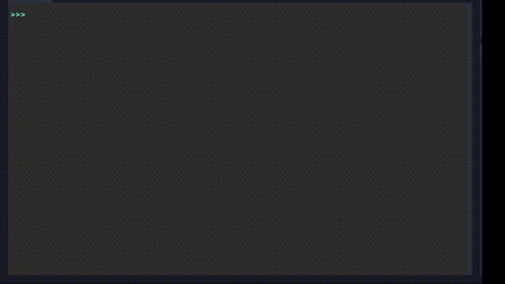

# Projet : Bandit Manchot

!!! warning "Principes du projet"

    * **LA NOTE MAXIMALE DE CE PROJET EST DE 18 SANS LA PARTIE FACULTATIVE !** 
	* Vous travaillerez par binomes sur ce projet (ou exceptionnellement par trinome).
	* Vous rendrez le code complet pour le 09 novembre 2022 au plus tard.
	* Vous aurez un temps en classe pour réaliser le projet, mais ce temps  ne sera pas suffisant ! Vous devrez vous coordonner pour arriver à vos fins !

## Description du projet

L'objectif est de simuler une partie de machine à sous de casino de type Bandit Manchot.

1. Le ou la joueur·euse commence la partie avec 500 €.
2. Il ou elle parie une somme comprise entre 10 € et son pot actuel.
3. Le bandit-manchot tire alors aléatoirement une série de trois symboles, qui donnent ou non un gain selon le tirage.
4. Si le pot n'est pas égal à zéro, le ou la joueur·euse peut rejouer si il ou elle le souhaite.
5. *Facultatif :* Le joueur/la joueuse peut se voir proposer de sauvegarder son nom et son score. Sule les 10 meilleusr scores sont sauvegardés.

!!! example "Exemple de réalisation"

    {: style="width:50%; margin:auto;display:block;background-color: #d2dce0;" }

!!! tips "Table des gains"

    Il existe de nombreuses tables de gains pour une machine à sous. Vous devrez cependant utiliser la table ci-dessous pour passer tous les tests :

    | Chaîne | Gain | Détails |
    | :---: | ---: | :--- |
    | `777` | 100 fois la mise | |
    | `ΩΩΩ` | 50 fois la mise | |
    | ``♥♥♥`` | 20 fois la mise | On aura de même pour les autres symboles ``♠``, ``♦`` et ``♣`` |
    | ``Ω7Ω`` | 10 fois la mise | On aura de même si l'ordre des symboles change |
    | ``♠♠7`` | 5 fois la mise | On aura de même si l'ordre des symboles change, et avec les symboles,`♥` ``♦`` et `♣` |
    | ``♠Ω7`` | 2 fois la mise | ou pour toute autre série de trois symboles différents |

## Les fonctions nécessaires

!!! tips "Base de travail"
    Vous trouverez [ici](./Bandit_Manchot_Eleve.py) une base de code à utiliser pour réaliser le jeu.

!!! warning "Fonctions `get_score` et `sauve_score`"
    Ces fonctions **ne sont pas à modifier**, ni même à comprendre... Elles sont nécessaires pour la partie facultative du projet !

## Plan de travail

Voii quelques éléments sur le code, dont un plan de travail :

1. Une variable globale ``symboles = "♠♥♦♣7Ω"`` donne les 6 symboles utilisés dans le bandit-manchot.
2. Vous devrez concevoir une fonction ``choisir_symbole`` qui prend en argument la chaîne de caractères ``symboles``, et renvoie une chaine de caractère contenant **un seul de ces symboles aléatoirement**.
3. La fonction `fabriquer_chaine` doit fournir une chaîne de caractères de taille `taille` (par défaut 3), dont tous les caractères sont aléatoirement choisis parmi une liste de caractères `symboles`. Inutile de réiçnventer l'eau chaude, puisque vous avez déjà fait la question précédente.
4. Vous implémenterez ensuite une fonction ``compte_symboles_identiques``, qui prend en argument un caractère `s`, et qui cherche le nombre d'occurence de ce caractère dans la chaine `chaine` passée en argument. Les exemples donnés dans la docstring doivent vous aider.
5. Vous pourrez ensuite implémenter la fonction ``presence_symboles_identiques_multiples`` (pénible à taper ce nom... mais ne le changez pas !) qui prend en argument une liste de symboles `symboles`, et une chaine de caractères `chaine`, et qui renvoie `True` si **un des symboles est présent plusieurs fois dans la chaine**, ou `False` si ce n'est pas le cas.
6. En parallèle (c'est-à-dire que vous pouvez faire cette fonction indépendamment des autres), vous pourrez implémenter la fonction ``table_gain`` qui renvoie le gain associé à la chaine passée en argument, en fonction de la mise de départ.
7. En parallèle, vous pourrez implémenter la fonction `saisir_mise` qui prend en argument une valeur (le pot actuel du joueur/de la joueuse), et renvoie la mise saisie par le joueur/la joueuse.
8. En parallèle, vous implémenterez la fonction ``demander_continuer``, qui demande à l'utilisateur·trice si il souhaite refaire une nouvelle manche de jeu, et renvoie un booléen correspondant à la réponse.
9. En parallèle, vous implémenterez une fonction ``afficher_bandit`` sans valeur de retour, qui affiche dans la console le bandit-manchot ainsi que le gain correspondant. Vous pouvez vous inspirer de la fonction `presentation` qui vous est fournie.
10. Une fois toutes les étapes précédentes terminées, vous implémenterez une fonction `main_game` qui représente la totalité du jeu d'un joueur/d'une joueuse, jusqu'à ce qu'il/elle abandonne ou qu'il/elle s'arrête. La fonction renverra **le gain réel du joueur/de la joueuse**, qui pourra servir à la phase suivante.
11. *Facultatif* : en utilisant les fonctions `sauve_score` et `get_score`, insérez à la fin du jeu la possibilté d'enregistrer son score, puis qui affiche les 10 meilleurs scores enregistrés.

## Grille de notation

| intitulé | barême | Détails |
| :---: | :---: | :--- |
| fonction `choisir_symbole` | 1 pt | assertions efficaces |
| fonction `fabriquer_chaine` | 1 pt | assertions efficaces  |
| fonction ``compte_symboles_identiques`` | 1 pt | passage de tous les tests unitaires |
| fonction ``presence_symboles_identiques_multiples`` | 2 pt |  |
| fonction ``table_gain`` | 1 pt | passage de tous les tests unitaires  |
| fonction `saisir_mise` | 1 pt | *dumbproof* |
| fonction ``demander_continuer`` | 1 pt | *dumbproof* |
| fonction ``afficher_bandit`` | 1 pt | Affichage correct |
| fonction `main_game` | 4 pts | On attend un jeu a minima fonctionnel |
| Noms des variables clairs | 2 pts | On proscrira les noms de variable d'un seul caractère, sauf compteurs précis |
| Code commenté et clair | 2 pts | Des explications minimales doivent être écrites pour expliquer votre code |
| Améliorations,   qualité du code, etc... | 1 pts | |
| Partie facultative | 2 pts | Avec un affichage correct et une bonne saisie |
