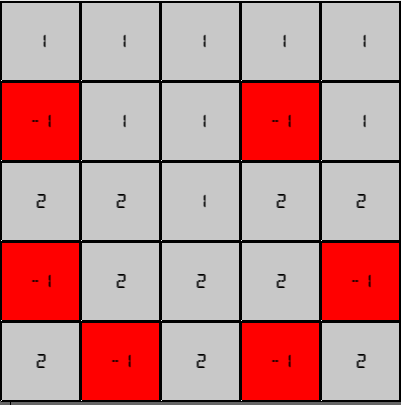
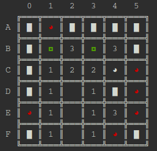

# Projet Démineur

## Présentation du jeu

Le jeu du démineur (*Minesweeper* en anglais) est un classique des jeux vidéo, dont les principes sont présentés ci-dessous :

{: style="width:40%; margin:auto;display:block;background-color: #d2dce0;"}]

* Une grille carrée de taille quelconque (en général 9 ou 10) est présentée, où toutes les cases sont couvertes (le contenu est caché).
* Dans cette grille, on trouve un certain nombre de bombes, ce nombre dépendant de la difficulté choisie :
    * `easy` : le nombre de bombes est `taille + 1` ;
    * `ǹormal` : le nombre de bombes est `taille + taille//4` ;
    * `hard`: le nombre de bombes est `taille + taille//2`.
* Une case peut-alors :
    * soit contenir une bombe ;
    * soit contenir un nombre qui correspond au nombre de bombes présentes dans les 8 cases qui lui sont adjacentes ;
    * soit être vide - ce qui signifie qu'elle ne contient pas de bombe et n'est adjacente à aucune.
* le/la joueur·euse doit découvrir (au sens d'enlever la couverture) toutes les cases ne contenant pas de bombes et perd dès qu'une bombe est découverte.
* le/la joueur·euse peut placer des drapeaux (*flags*) sur les cases qu'il soupçonne contenir une bombe (les cases bleues dans la capture d'écran).
* Lorsqu'il clique sur une case, le/la joueur·euse voit donc trois possibilités :
    * soit la case contient une bombe, et il a alors perdu ;
    * soit la case est adjacente à une bombe, et donc **seule cette case est découverte" ;
    * soit la case n'est pas adjacente à une bombe, et alors la case est découverte, ainsi que toutes ses voisines et leurs voisines etc..., comme si le/la joueur·euse avait cliqué dessus. La propagation s'arrête donc aux cases adjacentes à une bombe, qui sont découvertes, mais pas leurs voisines.

Ainsi sur la capture, le/la joueur·euse a perdu[^lost] ! Il a placé 8 drapeaux au bon endroit, mais a cliqué sur la case entièrement rouge qui contenait une bombe, et n'a pas vu les deux bombes restantes dans les cases ayant le petit carré rouge.

[^lost]: C'est fait exprès... Je suis bien meilleur que ça à ce jeu... Des années de pratique !


## Les fichiers et fonctions du projet

### Fichier `demineur.py`

#### Imports

On importe le module `random` pour gérer l'aléatoire, ainsi que la *classe* `Fore` du module `colorama` pour gérer la couleur dans la console.

#### Classe `Cell`

Sans rentrer dans les détails, il s'agit de *programmation orientée objet (POO)*, qui est au programme de terminale, mais vous n'aurez rien à changer dans cette partie du programme, qui est là pour vous simplifier le travail au sein du projet.

Cette classe permet « d'étendre » l'ensemble des objets possibles dans Python, en permettant de créer des objets de type `Cell`. De tels objets possèderont trois attributs :

* `value` : la valeur de la cellule (de type `int`), initialisée à `0` ;
* `flag` : un booléen prenant pour valeur `True` si la case possède un drapeau, et `False` sinon. Par défaut initialisée à `False` ;
* `covered` : un booléen prenant pour valeur `True`si la case est découverte, et `False`sinon. Par défaut initialisée à `False`.

On utilise un objet de type `Cell`de la manière suivante :

``` python
>>> c = Cell()
>>> c.value
0
>>> c.value = 20
>>> c.value
20
>>> c.flag = True
>>> c.flag
True
>>> c.covered
False
```
Pour créer un tableau de 5 cellules, on utilise la compréhension suivante :

```python
>>> t = [Cell() for _ in range(5)]
```
Pour ensuite modifier un des objets de type `Cell`, il faudra l'appeler : 

* soit grâce à son indice :

    ```python
    >>> t[2].value = 3
    ```

* soit en utilisant un parcours par éléments :
    
    ```python
    >>> for elem in t :
            elem.covered = True
    ```
valeur`

####  Fonction `init_grid(taille)`

Cette fonction doit créer et renvoyer une grille carrée de dimension `taille x taille`, contenant un objet de type `Cell` dans chaque case.

#### Fonction `compute_cell(grid, x, y)`

Cette fonction doit mettre à jour la valeur de la cellule de la ligne `x` et de la colonne `y` de la grille `grid`, en fonction du nombre de cases voisines contenant des bombes.

On utilisera le code suivant :

* une cellule ayant pour valeur `-1` représentera une bombe ;
* une cellule ayant pour valeur `0` représentera une case non-adjacente à une bombe ;
* une cellule adjacente à une ou des bombes portera une valeur égale au nombre de bombes à laquellle elle est adjacente.

Sur une grille `5x5`en mode `easy`, on pourra par exemple avoir la configuration suivante :

{: style="width:40%; margin:auto;display:block;background-color: #d2dce0;"}]

#### Fonction `make_grid(grid, nb_bombes)`

Cette fonction doit modifier *en place* la grille `grid` pour à la fois placer aléatoirement `nb_bombes` bombes (sans que deux bombes soient sur la même case), et mettre à jour l'ensemble des cases de la grille.

#### Fonction `affichegrid(grid, colors= False, detonate= False)` 

Cette fonction permet d'afficher dans la console la grille de jeu de la manière suivante :

* en jeu la grille est affichée ainsi :

    {: style="width:30%; margin:auto;display:block;background-color: #d2dce0;"}]

* à la fin de la partie, on utilise des couleurs (vert pour bon placement, rouge pour erreur) comme dans la capture ci-dessous :

    {: style="width:30%; margin:auto;display:block;background-color: #d2dce0;"}]

Afin de rendre l'interface agréable, vous **devrez utiliser une police `mono`dans la console** (comme `courrier`), et pourrez utiliser les caractères utf-8 suivants : 

* ═ et ║ ;

* ╔, ╦, et ╗ ;

* ╠, ╬, et ╣ ;

* ╚, ╩ et ╝

* █, ◕ et ◘

Les arguments `colors` et `detonate` sont des booléens signifiants respectivement que des couleurs doivent être utilisées, et qu'une bombe a explosée (= que la partie est perdue).


#### Fonction `ask_position(grid)`

Fonction demandant au joueur son prochain coup, sous la forme d'une chaine de caractères de la forme `B3`ou `fB3`, selon que le/la joueur·euse souhaite  découvrir ou *flaguer* une case, et qui renvoie un tuple sous la forme `(flag, indice_ligne, indice_colonne)`, où `flag` est un booléen donnant la nature du coup, `indice_ligne` est l'indice de la ligne de la grille correspondant au coup joué, et de même pour `indice_colonne`.

#### fonction `propagate(grid, x, y)`

Il s'agit d'une des fonctions essentielles du jeu. Si le/la joueur·euse clique sur une case vide(d'attribut `valeur`égal à `0`) de la grille `grid` d'indice de ligne `x`et de colonne `y`, il découvre toutes les cases qui lui sont adjacentes ayant pour valeur `0`, `1`, ou plus, ainsi que les voisines de celles de valeur `0`, et la découverte se propage ainsi de proche en proche.

L'algorithme à utiliser pour permettre cette propagation est le suivant :

* on crée deux listes `to_uncover`et `to_compute` qui contiennent respectivement les coordonnées des cellules à découvrir et de celles à traiter, qui sont toutes les deux initialisées avec le tuple `(x,y)` où `x` et `y` sont les arguments fournis à la fonction.
* tant que la liste `to_compute` n'est pas vide, on effectue alors es opérations suivantes :
    * on «pop» de la liste `to_compute` son dernier élément, qui donne les coordonnées de la cellule qui va être étudiée ;
    * si la cellule a pour valeur 0, alors on ajoute toutes ses voisines à la fois à la liste `to_compute` et à la liste `to_uncover`, **si elles n'y sont pas déjà présentes**.
* une fois la liste `to_compute`vide, on passe les attributs `covered`de chacune des cellules de la liste `to_uncover`à `False`.

#### Fonction `apply_position(grid, flag, x, y)`

Cette fonction applique l'effet d'un coup du joueur sur la grille :

* en plaçant un drapeau sur la cellule de coordonnées `(x, y)` si l'argument `flag`est `True`;
* en découvrant une bombe si le/la joueur·euse a joué sur une case en contenant une ;
* en appliquant la fonction `propagate` dans le cas où le/la joueur·euse joue sur une case ne contenant pas de bombes.

Cette fonction **renvoie un booléen** qui vaut `True`si le jeu se poursuit, et `False`si le/la joueur·euse a joué sur une bombe.

#### fonction `count_uncovered(grid)`

### Fichier `demineurP5.py`


### Barème du projet