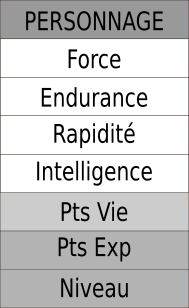
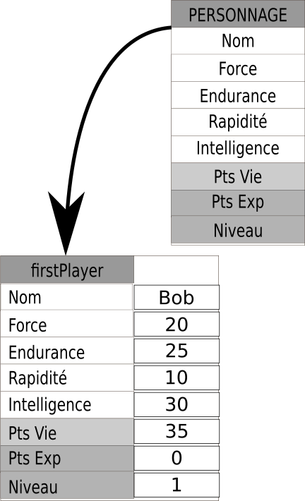
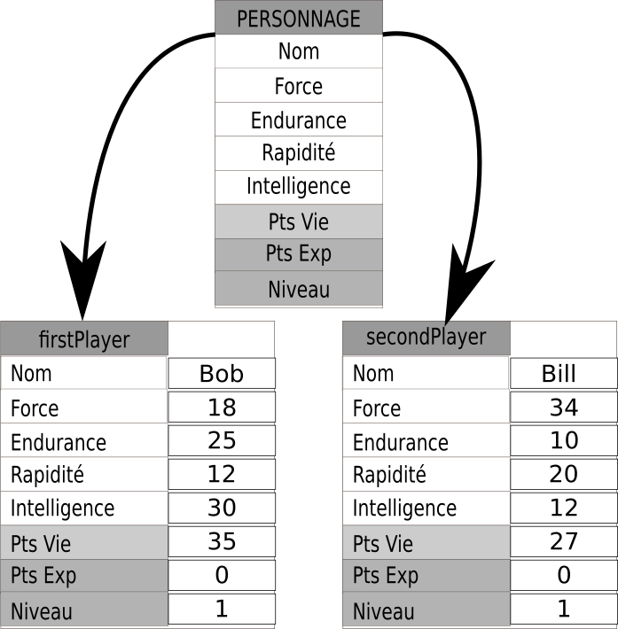

# Introduction à la promgrammation orientée objet

## Un premier exemple issu de Scratch

Observons ce jeu assez minable en Scratch (non, mais vraiment, allez-voir sur le site...).
<p align="center">
<iframe src="https://scratch.mit.edu/projects/568504906/embed" allowtransparency="true" width="485" height="402" frameborder="0" scrolling="no" allowfullscreen></iframe>
</p>

Ce jeu sommaire est construit autour de trois éléments :

* la chauve-souris ;
* l'éclair ;
* le chat.

Chacun de ces trois éléments possède : 

* sa propre zone de script;
* ses propres caractéristiques (nom, taille, costumes, position de départ, orientation...).

Et ces trois éléments réagissent en fonction {==**d'événements**==} liés soit à l'action du joueur, soit à leurs propres interactions.

L'éclair et le chat ont la possibilité d'exister sous la forme de {==**clones**==}, chacun des clones ayant {==**ses propres caractéristiques**==} bien que {==**partageant le même comportement**==}.

Aussi simpliste que Scratch paraisse, il n'en est néanmoins pas un **véritable langage de programmation**, qui plus est {==**multiparadigme**==} : il est en effet conçu pour gérer la programmation {==**impérative**==}, la programmation {==**orientée objet**==} ainsi que la programmation {==**événementielle**==}.

!!! tips "Paradigmes de programmation"

	Un paradigme est * "une représentation du monde, une manière de voir les choses, un modèle cohérent du monde qui repose sur un fondement défini" *.[Wkipedia](https://fr.wikipedia.org/wiki/Paradigme#Paradigme_en_linguistique).
	
	En programmation, plus précisemment, on parle de {==**paradigmes de programmation**==} pour exprimer lma mabière dont sont conçu et envisagés les programmes.
	On distingue entre autres :
	
	* le paradigme de la {==**programmation impérative**==}, qui est celui que nous avons utilisé jusqu'ici : on décrit les opérations en séquences d'instructions exécutées par l'ordinateur dans un ordre précis (que le langage soit compilé ou interprété). C'est le paradigme classique, celui auquel tout le monde pense quand on parle de programme informatique.
	* le paradigme de la {==**programmation orienté objet**==}, qui "consiste en la définition et l'interaction de briques logicielles appelées objets ; un objet représente un concept, une idée ou toute entité du monde physique, comme une voiture, une personne ou encore une page d'un livre. Il possède une structure interne et un comportement, et il sait interagir avec ses pairs. Il s'agit donc de représenter ces objets et leurs relation[...]". [Wikipedia](https://fr.wikipedia.org/wiki/Programmation_orient%C3%A9e_objet).	
	* le paradigme de la {==**programmation fonctionnelle**==}, qui considère le calcul en tant qu'évaluation de fonctions mathématiques.
	* le paradigme de la {==**programmation événementielle**==}, qui est fondé sur la notion d'événements. Le programme sera principalement défini par ses réactions aux différents événements qui peuvent se produire, c'est-à-dire des changements d'état de variable, par exemple l'incrémentation d'une liste, un déplacement ou un click de souris, une saisie au clavier... 
	* et [bien d'autres](https://fr.wikipedia.org/wiki/Paradigme_(programmation))...
	
Les différents langages de programmation peuvent être plus ou moins spécialisé selon un certain nombre de paradigmes. Quasimùent tous respectent le {==**paradigme originel impératif**==}. Certains langages ne dépassent pas ce paradigme (assembleur, Fortran, Algol, BASIC,... ). D'autres sont spécialisés sur un paradigme spécifique ( comme Lisp, ML, OCaml en programmation fonctionnelle, Ada, Smalltalk, C++, Ruby, C# Swift... en POO). Mais en général tous les langages cités possèdent des composantes {==**multiparadigmes**==}.

C'est le cas de Python, qui supporte la programmation :

* impérative ;
* fonctionnelle ;
* procédurale ;
* orientée objet ;
* et en partie événementielle.


## Principes	
	
Le concept principal de la **programmation orientée objet** (POO) est celui d' **{==objet==}**.
Nous avons déjà rencontré un certain nombres d'objets prédéfinis dans Python :

* la classe `int`, pour représenter les entiers relatifs ;
* la classe `float`, pour représenter les nombre à virgule flottante (une partie des décimaux) ;
* la classe `str` pour représenter les chaînes de caractères ;
* la classe `list`, pour représenter un ensemble *ordonné* et *mutable* de toute autre collection d'objets ;
* la classe `tuple`, pour représenter un ensemble *ordonné* et *non-mutable* de toute autre collection d'objets ;
* la classe `set`, pour représenter un ensemble *non ordonné* et *sans doublons* ;
* la classe `dict`, pour représenter une collection *non ordonnée* indexée par des clés.


Chacun de ces types précédents possède ses propres **attributs** et ses propres **méthodes** :

* un objet de la classe `str` possède une longueur, donné par la fonction built-in `len()`,
 et plusieurs **méthodes** associées comme `lower()`, `upper()`, etc...
*  un objet de la classe `list` possède lui aussi une longueur, et ses propres **méthodes**
 comme  `append()`, `pop()`, etc...

!!! tips "Classes et constructeurs d'objets"
	En Programmation Orientée Objet, on va construire de nouvelles classes d'objets
	plus ou moins complexes, possédant :
	
	* des {==**attributs**==}, c'est-à-dire des variables spécifiques qui lui sont directement associées ;
	* des {==**méthodes**==}, c'est-à-dire des fonctions modifiant l'objet, ou interagissant avec l'environnement
	extérieur à cet objet.

## Application à un exemple
	
!!! example "Personnages de JDR/MMORPG"
	
	Prenons un JDR ou MMORPG lambda, dont les personnages sont constitués ainsi :
	
	* ils ont 4 caractéristiques numériques entre $1$ et $40$, à savoir `force, endurance, rapidité, intelligence` ;
	* ils ont un nombre de points de vie de départ calculé à partir des caractéristiques `endurance + force//2` ;
	* ils possèdent bien sûr un `nom` ;
	* leur nombre de `points d'expérience` au départ est de $0$, et leur `niveau` est de $1$ ;
	* Chaque personnage peut **mener une attaque**, qui consiste à ajouter un nombre aléatoire entre 1 et 20 à sa force ;
	* Chaque personnage peut **se défendre d'une attaque** qui lui est lancée
	en ajoutant un nombre aléatoire de 1 à 20 à son endurance. Si ce résultat est supérieur ou égal au 
	niveau d'attaque, l'attaque a échouée, sinon le personnage perd un nombre de points 
	de vie  égal à la différence entre le niveau d'attaque et le niveau de défense.
		
	

Pour construire un tel personnage, on va devoir renseigner son nom, 
et ses 4 caractéristiques. Ses PV, Pex et son niveau sont automatiquement calculés.
 Tous sont cependant des {==**attributs**==} du personnage.
 
On va donc décrire un personnage par l'intermédiaire de l'interface suivante :
 

{width=10% : .imagepng}

### Création de la classe et des attributs

!!! info  inline end
	Nous détaillerons beaucoup plus dans un chapitre spécifique le fonctionnement de la POO.
	 Pour l'instant vous devrez vous contenter des explications ci-dessus.


!!! tips "Décrire une classe en Python"
	Le code suivant permet de définir une nouvelle classe d'objets de type  `Personnage` :
	
	``` python
	class Personnage :
		""" une classe pour représenter un personnage générique du MMORPG """
		def __init__(self, nom, force, endurance, rapidite, intelligence) :
			self.nom = nom
			self.force = force
			self.endurance = endurance
			self.rapidite = rapidite
			self.intelligence = intelligence
			self.pv = self.endurance + self.force//2
			self.pex = 0
			self.niveau = 1
	```
	
	La définition d'une classe d'objet est effectuée par lee mot-clé `class`,
	 suivi du nom de la classe (commençant par une majuscule par convention) et du symbole `:`.
	 Comme toujours en Python le symbole `:` déclenche l'attente d'un bloc indenté, qui 
	 correspondra à la définition de l'objet.
	 
	On trouve ensuite une `docstring` décrivant la classe, puis la définition 
	d'une `méthode` de la classe, la méthode `__init__()`, appelée {==**méthode constructeur de la classe**==}.
	 
	Cette méthode prend plusieurs paramètres :
	 
	1. le paramètre `self`, **obligatoire**, qui représente *'l'instance* de l'objet créé.
	2. une série de paramètres qui correspondent aux paramètres définis dans l'interface
	de l'objet `Personnage`.
	
	Puis dans cette méthode, on affecte aux {==**attributs de l'objet**==} les valeurs passées
	en argument, puis on calcule l'{==**attribut**==} `pv` à partir des valeurs déjà connues. 
	Enfin on défini les deux {==**attributs**==} de valeurs fixes.
	
!!! info "Un oubli ?"
	Attention ! Ici nous ne respectons pas vraiment l'interface, puisque nous ne vérifions
	pas que les attributs passés en argument sont bien des entiers entre 1 et 40 ! Ce problème sera réglé
	plus tard.

	
### Instanciation d'objets

Pour créer des personnages, il suffit maintenant d'utiliser une expression de la forme :`Personnage( nom, f, e, r, i)`.
 Vous noterez que l'argument `self` n'est pas renseigné ! On appelle cet argument un {==argument implicite==}.
 
 Ainsi pour créer un objet de type `Personnage` nommé Bob, et ayant les attributs
 20 en force, 25 en endurance, 10 en rapidité et 30 en intelligence, on utilise l'instruction suivante :
 
	>>> Personnage("Bob", 20, 25, 10, 30)
	<__main__.Personnage object at 0x7fb674844e48>
	
 On constate donc bien qu'un objet de type `Personnage` est crée. Bien sûr, l'objet n'étant pas affecté à un nom, il est immédiatement nettoyé
  par le *garbage collector*. On crée donc une variable `firstPlayer` comme référence à l'objet :
  

	>>> firstPlayer = Personnage("Bob", 20, 25, 10, 30)
	
On peut schématiser avec le dessin suivant : 


{width=30% : .imagepng}


L'appel au nom de la classe `Personnage` fait en réalité appel à la **méthode constructeur**, qui va permettre de créer un
nouvel objet de type `Personnage`. On peut le vérifier avec la ligne suivante :

	>>> type(firstPlayer)
	<class '__main__.Personnage'>
	
### Accéder aux attributs et les modifier

Pour accéder à l'attribut `pv` de l'objet `firstPlayer`, il suffit d'utiliser la notation

	>>> firstPlayer.pv
	35
	
Il devient dès lors possible de modifier la valeur d'un attribut comme lors de toute modification classique des variables :

	>>> firstPlayer.force = 18
	>>> firstPlayer.force
	18
	>>> firstPlayer.rapidite = firstPlayer.rapidite + 2
	>>> firstPlayer.rapidite
	12
	
### Deux objets 

Nous souhaitons maintenant créer un deuxième personnage du nom de Bill :

	>>> secondPlayer = Personnage('Bill', 34, 10, 20, 12)

Cette seconde {==**instance	**==} de type `Personnage` possède aussi ses propres attributs, comme montré dans le schéma suivant :

{width=30% : .imagepng}


!!! tips "Espace de nommage"

	Chaque {==**instance**==} d'objet possède son propre espace de nommage. 
	
	Ici même si les deux objets de type `Personnage` ont le même nom d'attribut `force`, ils ne 
	représentent pas le même objet.
	

### Définitions de méthodes

!!!abstract "Afficher les personnage"
	Essayons maintenant d'afficher une chaîne de caractères nous donne toutes les caractéristiques d'un personnage.
	
	=== "Test de `print`"
		Essayons d'abord avec la fonction *built-in* `print()` :
		
			>>> print(firstPlayer)

	=== "Sortie et commentaires" 
		
		La sortie sur la console Python  est :
		
			<__main__.Personnage object at 0x7fb6748590f0>
			
		C'est peu parlant !  La fonction `print` ne renvoie que l'adresse
		mémoire et le type de l'objet que nous venons de lui passer.
		

Nous allons donc devoir améliorer cet affichage, en construisant notre propre {==**méthode**}, que nous nommerons
`affiche`. Cette méthode devra avoir le comportement suivant :

	>>> firstPlayer.affiche()
		"Bonjour, je suis Bob, de niveau 1. J'ai 18 en force, 25 en endurance, 12 en rapidité et 30
		en intelligence. J'ai 35 Points de Vie"
		
!!! tips "Méthodes et attributs"

	Si les {==**attributs**==} d'une classe sont comme des **variables** spécifiques à une classe, les {==**méthodes**==}
	sont des **fonctions** : elles peuvent prendre ou non des arguments, et ont des valeurs de retour (qui peuvent être
	parfois implicites : la méthode `__init__` renvoie le nouvel objet créé.)


Pour créer cette méthode, nous allons compléter la classe `Personnage` de la manière suivante :

``` python

class Personnage :
	""" une classe pour représenter un personnage générique du MMORPG """
	def __init__(self, nom, force, endurance, rapidite, intelligence) :
		self.nom = nom
		...
		
		
	def affiche(self) :
		return f"Bonjour, je suis {self.nom}, de niveau {self.niveau}."
		 f"J'ai {self.force} en force, {self.endurance} en endurance, {self.rapidite}"
		  f" en rapidité et {self.intelligence} en intelligence. J'ai {self.pv} Points de Vie"
		 
```

Vous constatez que :

1. Dans la construction de la méthode `affiche`, apparaît l'{==**argument implicite**==} `self`, qu'il
est impératif d'utiliser pour avoir accès aux **attributs** de l'objet.
2. Dans l'appel de la méthode {==**aucun argument n'est passé**==}.

En rechargeant le module, puis en recréant les objets `firstPlayer` puis `secondPlayer`, on obtient alors les affichages suivants :

	>>> firstPlayer.affiche()
	Bonjour, je suis Bob, de niveau 1.J'ai 18 en force, 25 en endurance, 12 en rapidité et 30 en intelligence. J'ai 34 Points de Vie
	>>> secondPlayer.affiche()
	Bonjour, je suis Bill, de niveau 1.J'ai 34 en force, 10 en endurance, 20 en rapidité et 12 en intelligence. J'ai 27 Points de Vie

!!! question "Implémenter la méthode `attaque`"

	Dans notre interface de départ, nous avions prévu une méthode `attaque()` qui renvoie un entier égal à la valeur 
	de force du personnage auquel on ajoute un nombre aléatoire entre 1 et 20.
	
	Comment implémenter une telle méthode ?
	
??? done "Une implémentation possible"

	``` python

	from random import randint 

	class Personnage :
		""" une classe pour représenter un personnage générique du MMORPG """
		def __init__(self, nom, force, endurance, rapidite, intelligence) :
			self.nom = nom
			...
			
			
		def affiche(self) :
			...
			 
		def attaque(self) :
			return self.force + randint(1,20)
			 
	```

!!! question "Implémenter la méthode `defense(valeurAttaque)`"

	Dans notre interface de départ, nous avions prévu une méthode `defense(valeurAttaque)` 
	qui ajoute un nombre aléatoire de 1 à 20 à l'endurance du personnage. Si ce résultat est supérieur ou égal au 
	niveau d'attaque, l'attaque a échouée et la méthode renvoie `True`. Sinon le personnage perd un nombre de points 
	de vie  égal à la différence entre le niveau d'attaque et le niveau de défense, et la méthode renvoie `False`.
	
	Comment implémenter une telle méthode ?
	
??? done "Une implémentation possible"

	``` python

	from random import randint 

	class Personnage :
		""" une classe pour représenter un personnage générique du MMORPG """
		def __init__(self, nom, force, endurance, rapidite, intelligence) :
			self.nom = nom
			...
			
			
		def affiche(self) :
			...
			 
		def attaque(self) :
			return self.force + randint(1,20)
			 
		def defense(self, valeurAttaque) :
			valeurDefense = self.endurance + randint(1,20)
			if valeurAttaque> valeurDefense :
				self.pv -=  valeurAttaque-valeurDefense
				return False
			return True
	```

