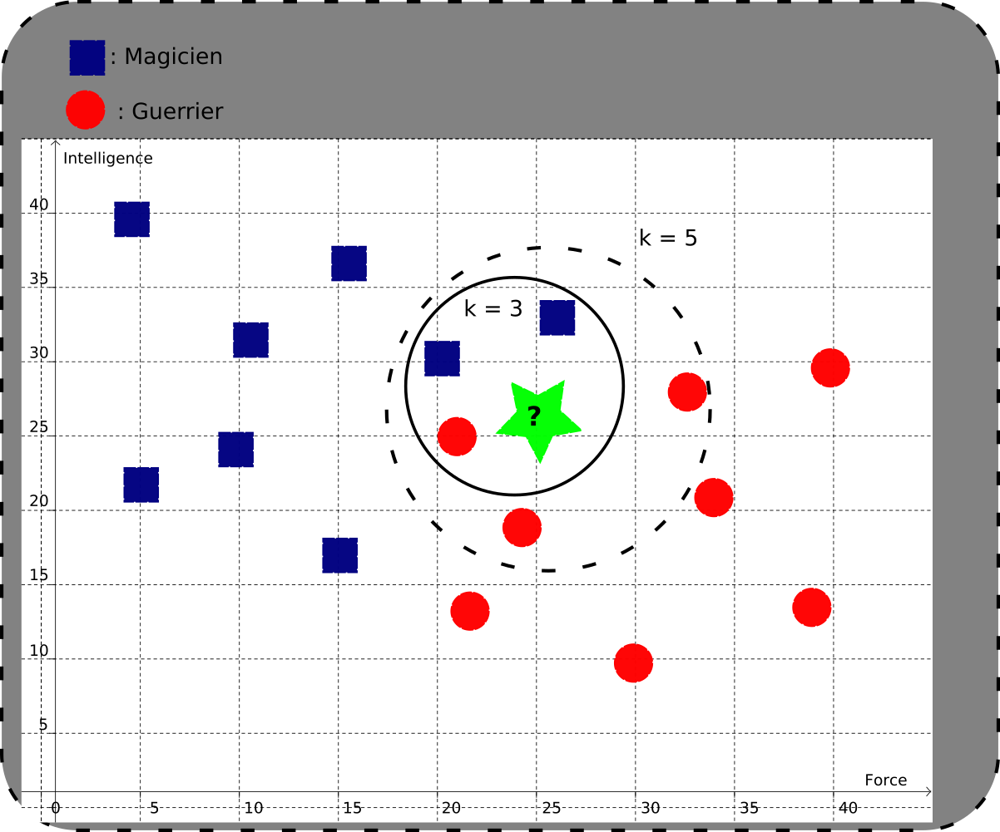

# Application : POO et KNN

## Algorithme des $K$ Plus Proches Voisins

!!! info "Algorithme KNN"

    L'algorithme dit des {==**$k$ plus proches voisins**==} (*$k$ nearest neighbours*), abrégé en algorithme `KNN`, est un algorithme utilisé en intelligence artificielle, plus particulièrement en apprentissage supervisé. C'est un algorithme utilisé entre autres pour *classifier* des données connaissant des exemples déjà classés.
    
    Le principe est le suivant :

    * un jeu des données d'apprentissage est fourni, c'est-à-dire un ensemble de couples `(Données, Classe)` ;
    * Pour déterminer la *classe* d'une nouvelle d'un nouvel objet à partir de ses données, on va utiliser une formule de distance, et calculer la distance entre l'objet à classer et tous les objets du jeu de données. Une fois ces calculs effectués, on classera l'objet comme ayant la **classe majoritaire** parmi ses $k$ plus proches voisins, où $k$ est un entier déterminé à l'avance.

!!! example "Classement d'un personnage de MMORPG"
    On dispose dans un jeu de deux classes de personnages : Magicien et Guerrier.
    les personnages sont représentés par deux caractéristiques : la force et l'intelligence. On représente dans un repère les personnages de la manière suivante :
    
    * un Magicien par un carré bleu ;
    * un Guerrier par un rond rouge.

    On souhaiterait attribuer automatiquement une classe à un nouveau personnage dont la force est de 25 et l'intelligence de 26, représenté par une étoile verte sur le schéma ci-dessous, en utilisant la distance euclidienne classique :

    {: style="width:50%; margin:auto;display:block;background-color: #d2dce0;"}

    Dans l'exemple ci-dessus, on constate que La valeur de $k$ influence grandement la classe obtenue :

    * Avec $k=3$, c'est-à-dire les trois plus proche voisins, on obtiens deux carrés et un rond, donc la classe obtenue est **Magicien**.
    * Avec $k=5$, on obtient 2 carrés et trois ronds, donc la classe obtenue est Guerrier.

!!! warning "Importance des paramètres"

    En tant qu'algorithme d'apprentissage supervisé, l'algorithme des KNN peut -être particulièrement efficace, mais il faut prendre conscience de l'impact de certains paramètres :


    * la taille et la pertinence du {==**dataset**==} (jeu de données) est un facteur primordial ;
    * la formule de la distance utilisée importe aussi beaucoup. C'est elle qui au final détermine les voisins les plus proches, et il faut parfois pondérer certains éléments pour obtenir une distance significative ;
    *  la valeur de $k$ doit être choisie avec soin : trop petite, elle ne permet pas une prise en compte de variations, mal choisie elle peut amener à des indécisions (avec $k=4$ dans l'exemple précédent, il était impossible de décider), trop grande et le choix est alors seulement liée à la taille du dataset.

    Il est donc souvent nécessaire d'ajuster ces différents paramètres pour obtenir une classification qui soit efficace.


## Application : Risque d'AVC

*{==Les données utilisées ici sont fictives et ne permettent pas d'établir une réelle classification==}. Il ne s'agit que d'un exemple d'utilisation de l'algorithme KNN.*


### Présentation du problème

On veut créer une application de diagnostic automatique de risque d'AVC pour des patient×e×s dont on connait plusieurs données :

* le prénom ;
* l'âge ;
* le sexe biologique ;
* la pression artérielle systolique (maximale), mesurée en « millimètre de mercure »
* le taux global de cholestérol, en mg/dL
* le statut par rapport au Tabac

L'objectif est de classer les patient×e×s en deux catégories : les patient×e×s à profil « sain », et celles/ceux à profil « à risque ».

On dispose des informations suivantes, qui constitueront les données d'apprentissage :

| Prénom     | Sexe | Âge  | Pression systolique (mmHg) | Cholestérol total (mg/dL) | Fumeur | Diagnostic  |
| :--- | :---: | :---: | :---: | :---: | :---: | :--- |
| Paul    | Homme | 45   | 130                        | 210                        | Oui    | À risque      |
| Jean    | Homme | 50   | 145                        | 240                        | Non    | Sain          |
| Robert  | Homme | 55   | 160                        | 260                        | Oui    | À risque      |
| David   | Homme | 35   | 120                        | 180                        | Non    | Sain          |
| Marc    | Homme | 60   | 170                        | 280                        | Oui    | À risque      |
| Luc     | Homme | 40   | 135                        | 220                        | Non    | Sain          |
| Claire  | Femme | 30   | 115                        | 190                        | Non    | Sain          |
| Marie   | Femme | 55   | 150                        | 240                        | Oui    | À risque      |
| Sophie  | Femme | 50   | 140                        | 230                        | Oui    | À risque      |
| Julie   | Femme | 45   | 130                        | 210                        | Non    | Sain          |


### Code

!!! question "Modélisation des patients"

    1. Créer une classe `Patient` permettant de modéliser les éléments présents dans le tableau ci-dessus, et utilisant 7 attributs : `prenom`, `sexe`, `age`, `pression`, `cholesterol`, `fumeur`, `diagnostic`, tous fournis dans cette ordre à la méthode constructeur, sachant que par défaut `diagnostic` doit être passé à `None`.
    2. Ajouter une méthode `__repr___` à la classe `Patient` permettant d'afficher les attributs d'une instance.
    
Dans la suite, vous pourrez utiliser la variable `patients_connus` suivante :

``` python

patients_connus = [
    Patient("Paul", "Homme", 45, 130, 210, True, "À risque"),
    Patient("Jean", "Homme", 50, 145, 240, False, "Sain"),
    Patient("Robert", "Homme", 55, 160, 260, True, "À risque"),
    Patient("David", "Homme", 35, 120, 180, False, "Sain"),
    Patient("Marc", "Homme", 60, 170, 280, True, "À risque"),
    Patient("Luc", "Homme", 40, 135, 220, False, "Sain"),
    Patient("Claire", "Femme", 30, 115, 190, False, "Sain"),
    Patient("Marie", "Femme", 55, 150, 240, True, "À risque"),
    Patient("Sophie", "Femme", 50, 140, 230, True, "À risque"),
    Patient("Julie", "Femme", 45, 130, 210, False, "Sain")
]
```

!!! question "Premier diagnostique"

    1. Créer une classe `DiagnostiqueurKNN` telle que :
        * sa méthode constructeur prend deux paramètres : une liste `patients_connus` d'objets de classe `Patient`, et une valeur entière `k`, valant par défaut 3.
        * elle possède deux attributs `patients_connus` et `k`.
    2. Ajouter une méthode `distance` prenant deux paramètres `patient_1`et `patient_2`, qui renvoie une valeur entière égale à 

        $$
        d = (P_1-P_2)^2 + (C_1 - C_2)^2
        $$

        où $P_i$ est la pression artérielle du patient $i$, et $C_i$ est le taux de cholestérol du patient $i$.
    3. Ajouter une méthode `classer_patient`, qui prend en paramètre un `patient` de classe `Patient` et renvoie la chaine de caractère correspondant au classement du patient après avoir utilisé l'algorithme KNN avec l'ensemble des patients connus. Dans le cas d'une indétermination, on devra lever une erreur de type `ValueError` précisant que la valeur de `k`doit être modifiée.
    4. Tester ensuite le classement des patients avec les exemples ci-dessous, enj changeant la valeur de `k` :

        | Nom     | Sexe  | Âge  | Pression systolique (mmHg) | Cholestérol total (mg/dL) | Fumeur |
        | :--- | :---: | :---: | :---: | :---: | :---: |
        | Thomas  | Homme | 48   | 140                        | 230                        | Non    |
        | Emma    | Femme | 37   | 125                        | 200                        | Non    |
        | Antoine | Homme | 62   | 175                        | 290                        | Oui    |
        | Léa     | Femme | 28   | 120                        | 250                        | Oui    |


!!! question "Amélioration des prédictions"

    Les études montrent que chez les jeunes et les femmes, les risques d'AVC sont moins accrus. On propose d'utiliser une formule de distance différente afin d'améliorer nos prévisions.

    Dans cette formule, nous introduisons des facteurs de pondération qui réduisent la contribution de l'âge pour les jeunes et du sexe pour les femmes, en utilisant des coefficients inverses ou adaptatifs.
        
    $$
    d_2=w_P⋅(\dfrac{P_1−P_2}{max(P1,P2)})^2+w_C⋅(\dfrac{C_1−C_2}{max(C_1, C2)})^2+w_A⋅(\dfrac{A_1−A_2}{max⁡(A1,A2)})^2 + w_S(S_1-S_2)^2
    $$

    où $P_i$ et $C_i$ sont définis à l'identique de la 1ère formule, et :

    * $A_i$ est l'age du patient $i$ ;
    * $S_i$ est $1$ si le sexe biologique est « homme », 0 si le sexe biologique est « femme ».

    Des valeurs possibles pour les coefficients seront les suivantes :

    * $w_P​=1.0$ pour la pression artérielle (toujours importante),
    * $w_C​=0.8$ pour le cholestérol (important mais un peu moins),
    * $w_A​=0.5$ pour l'âge (l'âge est pris en compte mais avec une réduction pour les jeunes),
    * $w_S​=0.3$ pour le sexe (les femmes sont favorisées car la distance entre femmes est réduite).

    Créer une méthode `distance_2` permettant d'utiliser cette formule, et qui prend en paramètre les coefficients `wP`, `wC`, `wA`, `wS`, ayant pour valeur par défaut celles données ci-dessus. Tester ensuite avec les même données que l'exercice précédent, en variant aussi la valeur de $k$.


!!! question "Prise en compte du facteur fumeur"

    Le fait pour une femme de fumer enlève les avantages en terme de risque d'AVC. On va donc encore modifier notre méthode `distance` pour prendre en compte le « facteur fumeur ». On utilisera alors la fonction suivante :


    $$
    d_3 = w_P⋅(\dfrac{P_1−P_2}{max(P1,P2)})^2+w_C⋅(\dfrac{C_1−C_2}{max(C_1, C2)})^2+w_A⋅(\dfrac{A_1−A_2}{max⁡(A1,A2)})^2 + w_S \cdot (S_1 - S_2)^2 \cdot \text{facteur_fumeur}(S_1, F_1)
    $$

    où `facteur_fumeur` est défini par :

    $$
    \text{facteur_fumeur}(S_1, F_1) = 
    \begin{cases} 
    1 & \text{si } S_1 = 1 \text{ (homme)} \\
    1 & \text{si } S_1 = 0 \text{ et } F_1 = False \text{ (femme non-fumeuse)} \\
    2 & \text{si } S_1 = 0 \text{ et } F_1 = True \text{ (femme fumeuse)} \\
    \end{cases}
    $$

    Recommencer les tests avec cette fonction de distance et commenter.
