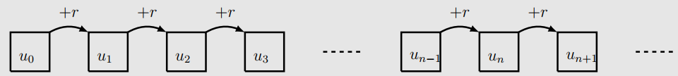

# Notion de fonctions récursive

## Activité d'introduction : de l'itératif au récursif


!!! abstract "Un peu de maths :  les suites arithmétiques"
	
	On rappelle qu'une suite $(u_n)$, de premier terme $u_0$ est dite {==**arithmétique**==} si et seulement si
	
	$$
	u_{n+1} = u_n +r
	$$

	où $r \in \mathbb{R}$.
	
	La définition donnée ci-dessus est une définition dite par {==**récurrence**==}, c'est-à-dire qu'on définit le terme de rang
	$n+1$ à partir du terme de rang $n$.
	
	<p align ="center">
	
	</p>
	
	Cette suite peut-être définie par une {==**formule explicite**==} :
	
	$$
	u_n = u_0 + n \times r
	$$
	
!!! question "Exercice"

	=== "Enoncé"
		Construire une fonction `suiteArithmetique(n)` qui  calcule le $n$-ième terme de la suite arithmétique de premier terme `3` et de raison `7`.
		Quelle formule avez-vous utilisée ?
		
	===  "Une solution"
		Au vu de l'énoncé, je prends le pari que la majorité d'entre vous avez utilisé la {==**formule explicite**==} avec un code de la forme suivante :
		
		``` python
		def maSuiteArithmetique(n) :
			return 3 + n*7
		```
		C'est évidemment la solution la plus simple. Dans ce cas, tout comme pour les *suites  géométrique*, il est inutile de compliquer le code, nous obtenons directement la solution par un simple calcul algébrique.
		
!!! abstract "Encore des maths :  les suites arithmético-géométriques"
	
	Une suite $(u_n)$, de premier terme $u_0$ est dite {==**arithmético-géométrique**==} si et seulement si
	
	$$
	u_{n+1} = a\times u_n +b
	$$

	où $a,b \in \mathbb{R}$.
	
	Encore une fois, la définition donnée ci-dessus est une définition dite par {==**récurrence**==}, c'est-à-dire qu'on définit le terme de rang
	$n+1$ à partir du terme de rang $n$. 
	
!!! question "Exercice"
	=== "Enoncé"
		Construire une fonction `maSuiteAG(n)` qui  calcule le $n$-ième terme de la suite arithmético-géométriqueq de premier terme `7` et définie par :
		
		$$
		u_{n+1} = -2\times u_n +5
		$$
		
		Quelle formule avez-vous utilisée ?
		
	=== "Une solution probable"
		Ici nous n'avons qu'une formule - sauf pour les petits malins qui seront allé voir sur [wikipedia](https://fr.wikipedia.org/wiki/Suite_arithm%C3%A9tico-g%C3%A9om%C3%A9trique#Cas_o%C3%B9_a_%E2%89%A0_1) - donc on doit utiliser un processus de répétition des opérations à partir de `7`.
		
		On peut bien sûr appliquer une  boucle `pour` dans notre fonction :
		
		``` python
		def maSuiteAG(n) :
			u = 7 
			for i in range(1,n+1) : # j'utilise ce range plutôt que range(n) car le i utilisé correspond au terme du rang calculé.
				u = -2*u + 5
			return u
		```
		Deux remarques :
		
		* dans ce code, je ne vérifie pas que $n \in \mathbb{N}$, et il faudrait... ;
		* dans le cas où $n=0$, la boucle `for` n'est pas effectuée.
		
		Une telle fonction est dite {==**itérative**==}, car elle utilise une boucle de répétitions pour parvenir au résultat souhaité.
		
		
C'est vraiment dommage, dans le premier exercice, on utilise simplement {==**la formule explicite**==}, alors que dans le deuxième cas, on est obligé de réfléchir à l'algorithme. Ce serait si simple de pouvoir utiliser *directement* la {==**formule récursive**==}, comme dans le code ci-dessous :

``` python
def maSuiteAGR(n) :
	return -2*maSuiteAGR(n-1) + 5
```
Ca vaudrait peut-être le coup de tester, en prenant $n=3$ par exemple...

??? bug "Késako ?"
	Quand on teste la fonction `maSuiteAGR(3)`, python ... calcule... puis nous renvoie une erreur :
	
	`RecursionError: maximum recursion depth exceeded`
	
	Le mot important dans la phrase précédente, c'est que python **CALCULE** ! Donc il doit a minima comprendre la fonction `maSuiteAGR` !
	

## Principe de récursivité

!!! tips "Fonction récursive"

	Une fonction est dite **récursive** quand elle s'appelle elle-même, une ou plusieurs fois.
	
!!! bug "Des problèmes"
	
	Décomposons l'instruction l'appel à `maSuiteAGR(3)`  : 
	
	* `maSuiteAGR(3)` doit calculer `-2*maSuiteAGR(2) +5`, et donc doit calculer :
		* `maSuiteAGR(2)`, qui doit calculer `-2*maSuiteAGR(1) +5`, et donc doit calculer :
			* `maSuiteAGR(1)`, qui doit calculer `-2*maSuiteAGR(0) +5`, et donc doit calculer :
				* `maSuiteAGR(0)`, qui doit calculer `-2*maSuiteAGR(-1) +5`, et donc doit calculer :
					* `maSuiteAGR(-1)`, qui doit calculer `-2*maSuiteAGR(-2) +5`, et donc doit calculer :
						* ...

	**"HELP ! Mais ça s'arrête quand !"** me direz-vous !
	
	Et bien jamais, en théorie.

	Mais en réalité cette instruction s'arrêtera quand python aura levé une erreur de type `RecursionError`, 
	qui signifie qu'une limite aura été atteinte (nous en parlerons plus tard pour lever toute ambiguité).
	
!!! done "Supprimer le problème : le cas d'arrêt"
	
	Pour supprimer le problème précédent, revenons aux maths : dans une définition par récurrence de suite, on signale toujours la valeur du premier terme (qui peut être $u_0$, ou $u_1$, ou même $u_{42}$ selon le problème et la définition de l'indice). Or dans notre fonction `maSuiteAGR`, jamais nous ne précisons ce cas, c'est-à-dire que quand $n=0$, alors la suite vaut $7$. Rajoutons-donc cette condition dans la fonction :
	
	``` python
	def maSuiteAGR(n) :
		if n== 0 :
			return 7
		else :
			return -2* maSuiteAGR(n-1) + 5
	```
	
	Et testons de nouveau `maSuiteAGR(3)` :
	
	* `maSuiteAGR(3)` doit calculer `-2*maSuiteAGR(2) +5`, et donc doit calculer :
		* `maSuiteAGR(2)`, qui doit calculer `-2*maSuiteAGR(1) +5`, et donc doit calculer :
			* `maSuiteAGR(1)`, qui doit calculer `-2*maSuiteAGR(0) +5`, et donc doit calculer :
				* `maSuiteAGR(0)`, qui {==**maintenant renvoie 7**==} !
			* donc `maSuiteAGR(1)` renvoie `-2*7+5` soit `-9` ;
		* donc `maSuiteAGR(2)` renvoie `-2*(-9)+5` soit `23` ;
	* donc `maSuiteAGR(3)` renvoie `-2*23+5` soit `-41`.
	
	Non seulement la fonction s'arrête, mais en plus elle renvoie la bonne valeur, c'est-à-dire $u_3 = -41$.
	
!!! tips "Récapitulons"
	
	Pour utiliser une {==**fonction récursive**==} correctement, il faudra distinguer :
	
	* le ou les {==**cas d'arrêts**==} (ou {==**cas de base**==}), c'est-à-dire des cas particuliers pour lesquels la valeur (ou l'objet) renvoyé par la fonction est connu ;
	* le {==**cas récursif**==}, pour lequel la fonction s'appelle elle-même, une ou plusieurs fois.
	
!!! Example "Exemple commenté"

	La somme des $n$ premiers entiers est la somme :
	
	$$
	0+1+2+3+...+n
	$$
	
	Comment faire pour construire une fonction récursive `sommeR(n)` qui effectue la somme des $n$ premiers entiers, avec $n$ passé en argument.
	
	* Quel est le {==**cas récursif**==} ?	
		On a $0+1+2+3+...+n = (0+1+2+3+ ...+ (n-1) ) + n$,
		
		donc le cas récursif est `sommeR(n) = sommeR(n-1) + n`
		
	* Quel est le cas de base ?		
		Il y a plusieurs possibilités, soit en partant de l'indice 0 car `sommeR(0)=0`, soit en partant de l'indice 1, car `sommeR(1) = 1`.
		
	Une implémentation récursive possible est alors :
	
	``` python
	def sommeR(n) :
		if n== 0 :
			return 0
		else :
			return sommeR(n-1) + n
	```
## Applications directes

!!! question "Exercice : factorielle"

	=== "Enoncé"
	
		On rappelle que la factorielle d'un entier naturel $n$ est donné par :
		
		$$
		\left\lbrace \begin{array}{rcl}
		n! &=& n \times (n-1) \times ... \times 3 \times 2 \times 1\\
		1! &=& 1\\
		0! &=& 1
		\end{array}\right.
		$$
		
		1. Ecrire une fonction **itérative** `factorielle(n)` qui renvoie la factorielle d'un entier naturel $n$ donné, et lève une `ValueError` si $n$ n'est pas entier ou est négatif.
		2. Ecrire une fonction **récursive** `factorielleR(n)` qui renvoie la factorielle d'un entier naturel $n$ donné, et lève une `ValueError` si $n$ n'est pas entier ou est négatif.
		
	=== "Solution Itérative"
		A venir
		
	=== "Solution récursive"
		A venir

!!! question "Exercice : étoiles"
	
	=== "Enoncé"
		
		1. Implémenter une fonction **itérative** `etoile(n)` qui écrit dans le Shell Python un triangle formé de caractères `*` tels que dans l'exemple suivant :
		
		``` python
		>>> etoileR(5)
		*
		**
		***
		****
		*****
		```
		2. Impélmenter une fonction **récursive** `etoileR(n)` qui effectue le même travail.
		
	=== "Solution Itérative"
		A venir
		
	=== "Solution récursive"
		A venir
		
!!! question "Coefficients binomiaux et triangle de Pascal"

	1. Soient $a$ et $b$ deux réels quelconques.

		Développez les expressions suivantes :
		
		1. $A = (a+b)^1$
		2. $B = (a+b)^2$
		3. $C = (a+b)^3$
		4. $D = (a+b)^4$
		
		??? done "Solution"
			A venir
		
	2. Complétez deux lignes supplémentaires du tableau suivant, nommé [{==**Triangle de Pascal**==}](https://fr.wikipedia.org/wiki/Triangle_de_Pascal):
	
		$$
		\begin{array}{|c|c|c|c|c|c|}
		\hline
		1&1&&&&\\\hline
		1&2&1&&&\\\hline
		1&3&3&1&&\\\hline
		1&4&6&4&1&\\\hline
		1&5&10&10&5&1\\\hline
		\end{array}
		$$
		
		??? done "Solution"
			A venir
	
	3. On appelle coefficient binomial de rang $p$ et de degré $n$ le nombre du **Triangle de Pascal** correspondant à la $n$-ième ligne et à la $p$_ième colonne.
	Ce nombre est noté $\left(\begin{array}{c}
	n\\
	p\\
	\end{array}\right)$.
	
		Comment exprimer récursivemment ce coefficient ?
	
		??? done "Solution"
			A venir
	4. Implémenter une fonction `binomeR(n, p)` qui renvoie la valeur du coefficient binomial $\left(\begin{array}{c}
	n\\
	p\\
	\end{array}\right)$ du triangle de Pascal.
	
		??? done "Solution"
			A venir
			
	5. *Facultatif : *  Implémenter une fonction `developpe(n)` qui renvoie la chaîne de caractères correspondant au développement de $(a+b)^n$.
	
		??? done "Solution"
			A venir
		