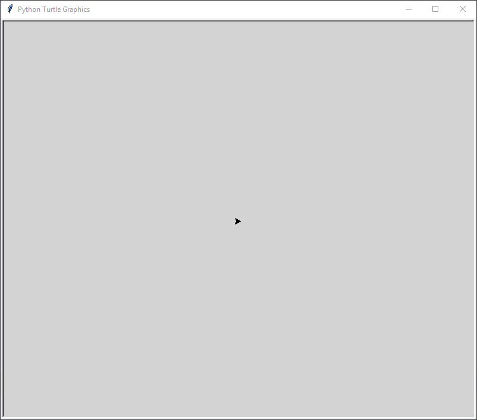
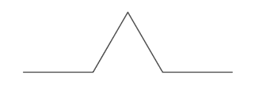
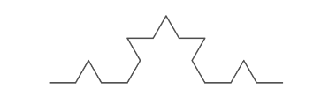
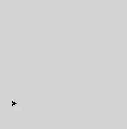

# Applications de la récursivité :  Dessiner des fractales avec `turtle`

Commençons par créer un fichier `fractales.py` qui nous servira pour la totalité des exercices.

## Présentation de `turtle`

!!! tips "Le module `turtle`"
	Le module `turtle` est un module faisant partie de toute distribution `python`. 
	Son intérêt repose sur la simplicité (relative) des commandes utilisées pour dessiner.
	
	Un objet de classe {==**`Turtle`**=} se comporte comme un **crayon de table traçante**
	sur une feuille de papier munie d'un repère orthonormé.
	<div style="display :flex;">
	<div style="display:inline;width:50%;text-align:center;padding-left: 10px;padding-bottom : 1em">
	<p align="center">
	{: style="width:100%"}
	</p>
	</div>
	<div style="display:inline;width:50%;text-align:center;padding-left: 10px;padding-bottom : 1em">
	<p align="center">
	<iframe width="560" height="315" src="https://www.youtube.com/embed/PHcJLGci-Es" title="YouTube video player" frameborder="0" allow="accelerometer; autoplay; clipboard-write; encrypted-media; gyroscope; picture-in-picture" allowfullscreen></iframe>
	</p>
	</div>
	</div>
	
	
!!! example "Exemple : première fenêtre et première tortue"

	Considérons le code suivant , ainsi que le résultat de son exécution :
	<div style="display :flex;">
	<div style="display:inline;width:50%;text-align:left;padding-left: 10px;padding-bottom : 1em">
	``` python linenums="1"
	import turtle

	def testTurtle() :
		screen = turtle.Screen()
		screen.bgcolor('lightgray')
		donatello = turtle.Turtle()
		


	if __name__ == "__main__" :
	   testTurtle()
	```
	
	*  en ligne 1 on importe le module `turtle` complètement ;
	* en ligne 4, on crée un objet `Screen()` sur lequel la tortue dessinera, cet objet étant affecté au nom `screen` ;
	* en ligne 5, on fait appel à la méthode `bgcolor` des objets `Screen` afin de basculer la couleur de fond sur `lightgray` ;
	* en ligne 6, on crée un objet `Turtle` affecté au nom `donatello`.
	</div>
	<div style="display:inline;width:50%;text-align:center;padding-left: 10px;padding-bottom : 1em">
	{: style="width : 100%;"}
	</div>
	</div>
	Vous observerez que la tortue est représentée par une {==**pointe de flèche**==}, pointant vers la droite.
	
	Par défaut, la tortue apparaît au centre du repère, c'est-à-dire au centre de la fenêtre de dessin, donc aux coordonnées $(0; 0)$.
	
	Nous allons maintenant rajouter au code les instructions suivantes en lignes 7 à 11, puis exécuter le code :
	<div style="display :flex;">
	<div style="display:inline;width:50%;text-align:left;padding-left: 10px;padding-bottom : 1em">
	``` python linenums="7"
	donatello.forward(100)
    donatello.left(90)
    donatello.forward(50)
    donatello.right(45)
    donatello.backward(80)
	```
	Avec ces lignes :
	
	* la tortue avance de 100 pixels dans la direction où elle pointe ;
	* elle tourne vers sa gauche de 90° ;
	* elle avance de 50 pixels dans la nouvelle direction ;
	* elle tourne vers sa droite de 45° ;
	* et enfin elle recule de 80 pixels.
	
	</div>
	<div style="display:inline;width:50%;text-align:center;padding-left: 10px;padding-bottom : 1em">
	
	</div>
	</div>
	

!!! tips "Méthodes de la classe `Turtle`"
	Comme toujours, la [doc python](https://docs.python.org/fr/3/library/turtle.html) est très claire sur le module `turtle`,
	mais voici {==**quelques méthodes**==} des objets de classe `Turle` :
	
	* `forward(d)` : déplace l'objet `Turtle` de $d$ pixels dans la direction où pointe la tête de la tortue. A mettre en parallèle avec la méthode `backward(d)`.
	* `left(a)` : tourne la tête de la tortue vers sa gauche de $a$°. A mettre en parallèle avec la méthode `right(a)`.
	* `goto(x,y)` ou `setx(v)` ou `sety(v)` : déplace la tortue vers une position donnée dans le repère.
	* `setheading(a)` : tourne la tête de la tortue à un angle de $a$° par rapport à l'horizontale, dans le sens trigonométrique.
	* `circle(r)` : trace à partir de la position courante un cercle de rayon $r$, le centre étant situé sur la gauche de la tête de la tortue.
	* `speed(v)` : change la vitesse de déplacement de la tortue. L'argument est un entier de 0 à 10 tel que :
		* « le plus rapide » : 0
		* « rapide » : 10
		* « vitesse normale » : 6
		* « lent » : 3
		* « le plus lent » : 1
	* `pendown()` et `penup()` : respectivement baisse ou lève le crayon. Si le crayon est levé, rien n'est tracé
	à l'écran.
	* `pensize(t)` :  règle l'épaisseur de tracé à $t$ pixels.
	* `pencolor(*args)` :  règle la couleur du stylo. L'argument peut-être :
		* une chaîne de caractères : `red`, `gray`, ou `#33cc8c`, etc...
		* un triplet RGB : `(255, 100, 50)`,...
	* `fillcolor(*args)` : définit la couleur de remplissage.
	* `begin_fill()` et `end_fill()` : début et fin de la définition d'une zone de remplissage.
	
	Je ne détaillerai pas ici les méthodes des objets `Screen`.
	
!!! question "Prise en main de `turtle`"
	
	=== "Énoncé"
		1. Créer une fonction `triangleEquilateral(c)` qui trace un triangle équilatéral de longueur $c$ à partir de 
		la position courante.
		2. Créer une fonction `pentagramme(c, color="red")` qui trace un pentagramme (une étoile à 5 branches) et le remplit 
		avec la couleur passée en argument.
		3. Créer une fonction `hexagone(c, diag = False)` qui trace un hexagone de côté $c$ et qui trace en outre ses diagonales
		si le paramètre optionnel `diag` est passé à `True`.

	=== "Solutions"
		Toutes les solutions suivantes supposent qu'un écran et qu'une tortue nommée `t` existent dans l'espace de nom général.
		
		=== "`triangleEquilateral(c)`"
		
			``` python
			def triangleEquilateral(c) :
				for _ in range(3):
					t.forward(c)
					t.left(120)
			```
			
		=== "`pentagramme(c, color="red")`"
		
			``` python
			def pentagramme(t, c, color="red") :
				t.fillcolor(color)
				t.begin_fill()
				for _ in range(5):
					t.forward(c)
					t.right(144)
				t.end_fill()
			```
			
		=== "`hexagone(c, diag = False)`"
		
			``` python
			def hexagone(t, c, diag = False) :
				for _ in range(6):
					t.forward(c)
					t.right(60)
				if diag :
					for _ in range(3) :
						t.right(60)
						t.forward(2*c)
						t.right(120)
						t.forward(c)
						t.right(60)
			```

## Flocon de Von Koch

!!! abstract "Le Flocon de Von Koch"
	
	Le flocon de Von Koch, inventée en 1904 par le mathématicien suédois Helge von Koch, est une des premières
	courbes fractales décrites, avant même l'invention du terme [{==**fractale**==}](https://fr.wikipedia.org/wiki/Fractale) par Benoit Mandelbrot en 1967.
	
	<p align="center">
	{: style="width:25%;"}
	</p>
	
	
	Cette courbe est obtenue par la décomposition récursive d'un segment en une ligne brisée :
	<div style="display :flex;">
	<div style="display:inline;width:50%;text-align:center;padding-left: 10px;padding-bottom : 1em">
	{: style="width:50%;"}
	</div>
	<div style="display:inline;width:50%;text-align:center;padding-left: 10px;padding-bottom : 1em">
	<p align="center">
	{: style="width:50%;"}
	</p>
	</div>
	</div>
	
!!! question "Construction du flocon"

	1. Avant de passer à une définition récursive de la construction, essayons de faire une étape de cette construction.
	=== "Énoncé"
	
		a. Créer une fonction `segment(long)` qui trace une itération de la construction du segment de Von Koch (c'est-à-dire  traçant l'étape 3 de l'image ci-dessus.).
		
		b. Tester cette fonction en plaçant la tortue dans différentes positions de départ.
		
	=== "Solution"
		
		``` python
		def segment(long) :
			t.forward(long//3)
			t.left(60)
			t.forward(long//3)
			t.right(120)
			t.forward(long//3)
			t.left(60)
			t.forward(long//3)
    
		```
		
	2. Passons à la construction récursive d'un segment :
	
	=== "Énoncé"
	
		En se basant sur la fonction précédente, implémenter une fonction `segmentR(long, n)` qui tracera
		le résultat de $n$ itérations de la méthode sur un segment de longueur `long`.
		
		* Pour $n=0$, on obtiendra
		<p align="center">
		{: style="width:25%;"}
		</p>
		* Pour $n=1$, on obtiendra
		<p align="center">
		{: style="width:25%;"}
		</p>
		* Pour $n=2$, on obtiendra
		<p align="center">
		{: style="width:25%;"}
		</p>
		
	=== "Solution"
		
		``` python
		def segmentR( long, n) :
			if n == 0 :
				t.forward(long)
			else :
				segmentR(long/3, n-1)
				t.left(60)
				segmentR(long/3, n-1)
				t.right(120)
				segmentR(long/3, n-1)
				t.left(60)
				segmentR(long/3, n-1)
		```
		
	3. Terminer la construction en traçant le flocon sur une base de triangle équilatéral.
	
		??? done "Solution"
		
			Avec changement de couleurs :
			``` python
			def floconVK(long,n) :
				t.pencolor(random.choice(couleurs))
				t.begin_fill()
				for _ in range(3) :
					segmentR(long, n)
					t.right(120)
				t.end_fill()
			```
			où 
			``` python
			couleurs=["black","white","grey","red","orange","green",
              "blue","navy","yellow","gold","tan","brown",
              "sienna","wheat","cyan","pink","salmon","violet","purple"]
			```
	
## Le triangle de Sierpinski

!!! abstract "Triangle de Sierpinski"
	
	Le {==**Triangle (ou napperon) de Sierpinski**==}, aussi connu sous le nom de *joint de culasse* (nom donné par Mandelbrot), est une autre figure fractale décrite au début du XXème siècle.
	
	Il peut s'obtenir à partir d'un triangle « plein », par une infinité de répétitions consistant à diviser par deux la taille du triangle puis à les accoler en trois exemplaires par leurs sommets pour former un nouveau triangle.
	<p align="center">
	
	</p>
	À chaque répétition le triangle est donc de même taille, mais « de moins en moins plein ». 
	
!!! question "A coder"
	En partant du principe de l'exercice sur le flocon de Von Koch, implémenter une fonction `Sierpinski(long, n)` qui trace
	le résultat de $n$ itérations sur un triangle de côté $n$.

??? done "Solution"

	A venir !
	
	
!!! tips "Remarque" 

	Le triangle de Sierpinski correspond à une propriété particulière du triangle de Pascal. En effet, le triangle de Sierpinski apparaît dans le triangle de Pascal lorsque'on supprime tous les coefficients pairs. Vous pouvez en voir plus [ici](https://blogdemaths.wordpress.com/2013/07/16/sierpinski-et-pascal-sont-dans-un-triangle/)
