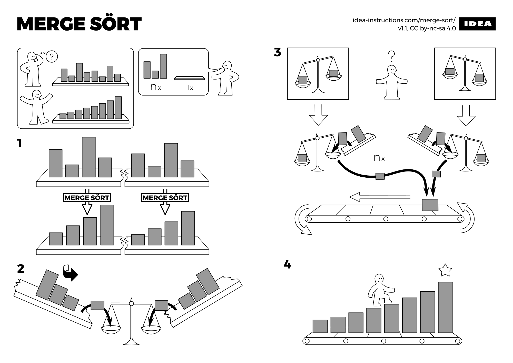
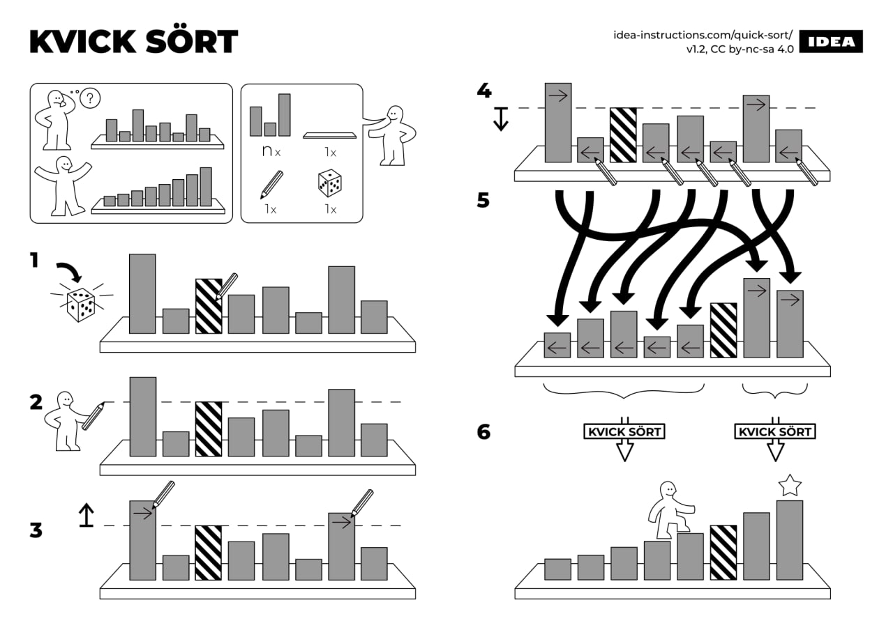

# Applications de la récursivité :  Tris de tableaux


## Rappels sur les algorithmes de tris vus en classe de première

!!! abstract "Principe du tri par insertion"
	
	Le principe du tri par insertion est le suivant : au moment où on considère un élément du tableau à trier, les éléments qui le précèdent sont déjà triés, tandis que les éléments qui le suivent ne sont pas encore triés. Il faut donc prendre le premier élément de la partie non triée et de l'insérer à la bonne place dans le tableau trié.
	
	On peut voir sur l'animation suivante extraite de wikipedia :
	
	<p align = "center">
	{: style ="width:30%;"}
	</p>
	
	La complexité du tri par insertion est quadratique (en $\mathbb{O}(n^2)$) dans le pire des cas et en moyenne, et linéaire (en $\mathbb{O}(n)$)dans le meilleur des cas (tableau presque trié). C'est donc un tri dont la vitesse d'exécution dépendra fortement de la situation initiale.
	

	??? quote "Le code en Python"
		``` python linenums="1"
		def tri_insertion(L):
			N = len(L)
			for n in range(1,N):
				cle = L[n]
				j = n-1
				while j>=0 and L[j] > cle:
					L[j+1] = L[j] # decalage
					j = j-1
				L[j+1] = cle
		
		```
	
	
!!! abstract "Principe du tri par sélection"
	
	Sur un tableau de $n$ éléments, le principe du tri par sélection est le suivant : à chaque étape, on **sélectionne** le plus petit élément du tableau, et on le place à la première position du tableau. A l'étape suivante, on ne s'intéresse plus qu'au sous-tableau qui commence après le dernier élément sélectionné.
    
	
	On peut voir sur l'animation suivante extraite de [wikipedia](https://fr.wikipedia.org/wiki/Tri_par_s%C3%A9lection) :
	
	<p align = "center">
	{: style ="width:30%;"}
	</p>
	
	Cet algorithme de tri, simple à comprendre, est considéré comme mauvais car sa complexité en temps est en $\mathbb{O}(n^2)$, que ce soit dans le pire des cas ou bien le meilleur des cas (même pour un tableau déjà trié il faudra faire toutes les comparaisons).
	
	??? quote "Le code en Python"
		``` python
			def tri_selection(tab):
				for i in range(len(tab)):
					# Trouver le min du sous-tableau commençant à
					# l'indice i
					indice_min = i
					for j in range(i+1, len(tab)):
						if tab[indice_min] > tab[j]:
							indice_min = j
					# échange de place entre l'élément minimal
					# et l'élément d'indice i
					tmp = tab[i]
					tab[i] = tab[indice_min]
					tab[indice_min] = tmp
		```
		
!!! warning "Tri en place"
	Dans les deux algorithmes, le tri est dit {==**en place**==}, car c'est le tableau original qui est trié. Il n'est pas nécessaire de créer de tableau supplémentaire, ce qui explique l'absence de `return` dans les deux fonctions Python.

## Le tri fusion

<p align ="center">

</p>

!!! abstract "Principe du Tri Fusion (Merge Sort)"
	
	Le principe du {==**tri fusion**==}, est de séparer un tableau à trier en **deux sous-tableaux** qu'on triera récursivement (ou itérativement 
	mais ce ne sera pas le cas dans ce cours) de nouveau par tri fusion.
	
	Une fois les sous-tableaux triés, il faudra {==**fusionner**==} ces deux sous-tableaux en une seule entité.
	
	Cet algorithme est du type {==**diviser pour régner**==} (*Divide and Conquer*) : on sépare la tâche à priori difficile en deux tâches plus simples (ici, il s'agit de diminuer la taille des tableaux). Il a été inventé par {==**John Von Neumann en 1945**==}.
		
	<p align="center">
	{: style="width : 50%";}
	</p>


	
	

!!! question "Fonction de fusion"


	La principale difficulté dans cet algorithme est de créer une fonction fusionnant les deux tableaux triés. 
	
	1. Avant commencer, regardez la vidéo suivante :
	<p align="center">
	<iframe src="//video.toutatice.fr/video/24064-fusion-de-deux-tableaux-tries/?is_iframe=true" size="240" width="1280" height="720" style="padding: 0; margin: 0; border:0" allowfullscreen ></iframe>
	</p>
	2. Quels sont les liens entre $i$, $j$ et $k$ ? Quelles conditions ces variables compteur doivent-elles respecter ?
	3. Quel type de boucle allons nous utiliser ?
	4. Que se passe-t-il dans la vidéo quand $j$ atteint la valeur $3$ ?
	5. Implémenter une fonction `fusion(t1 : list, t2 : list)-> list` qui prend en argument deux tableaux supposés triés (on ne vérifiera pas), et qui renvoie le tableau trié contenant tous les éléments des deux tableaux `t1` et `t2`.
	On pourra utiliser les tests suivants pour vérifier que la fonction est correcte :
	??? quote "Les tests"
		``` python
		assert fusion([12,35,45],[4,42,63]) == [4, 12, 35, 42, 45, 63]
		assert fusion([12,35], [57]) == [12, 35, 57]
		assert fusion([12,35], [42,57]) == [12, 35, 42, 57]
		assert fusion([12,35], []) == [12, 35]
		assert fusion([], [12,35]) == [12, 35]
		assert fusion([42,57,67,75], [12,35]) == [12, 35, 42, 57, 67, 75]
		assert fusion([], []) == []
		```
	
	
	
		
!!! question "Tri Fusion Récursif"

	Une fois la fonction `fusion` codée, l'algorithme de tri par fusion est simple :
	
	1. Regardez la vidéo suivante :
	<p align="center">
	<iframe src="//video.toutatice.fr/video/24034-tri-fusion-recursif/?is_iframe=true" size="240" width="1280" height="720" style="padding: 0; margin: 0; border:0" allowfullscreen ></iframe>
	</p>
	2. Quel est le cas de base ?
	3. Quel est le cas récursif ?
	4. Implémenter une fonction `triFusion(t)` qui prend en argument un tableau et renvoie une copie triée de ce tableau.
	

		
!!! question "Complexité en temps"
	

	
	1. Copiez-collez le code ci-dessous permettant d'utiliser le décorateur `@timeit` :
		``` python 
		import time                                                

		def timeit(method):

			def timed(*args, **kw):
				ts = time.time()
				result = method(*args, **kw)
				te = time.time()
				print(f" {method.__name__} ({args},{kw}) {te-ts}" )
				return result

			return timed
		```
		
		!!! warning "Décorateur `@timeit`"
			pour utiliser le décorateur, on le place dans la ligne précédant la définition
			de la fonction qu'on veut décorer. Par exemple :
			``` python
			@timeit
			def tri_insertion(tab : list) :
				...
			```
			Chaque fois que la fonction `tri_insertion` sera appelée, le décorateur sera appliqué
			et exécutera la fonction `timed`, qui calcule le temps d'exécution de la fonction décorée.
			
			Il faudra être attentif à son utilisation **dans le cas des fonctions récursives !** (Je vous laisse constater par vous même le problème rencontré)

			!!! tips "Fonction englobante"

				Parfois il est nécessaire d'englober la fonction que l'on souhaite étudier au sein d'une autre fonction. Par exemple, pour éviter un appel à `timeit` à chaque appel récursif, il faut placer le décorateur sur une fonction qui englobera la fonction récursive. Par habitude de programmation, on appelera la fonction englobante du nom de la fonction récursive originale, et on renommera la fonction originale en `compute` :

				``` python
				@timeit
				def tri_fusion(t : list) -> list :
					def compute(t : list) -> list :
						if len(t) == 0 or len(t) == 1:
							return t
						else :
							return fusion(compute(t[:len(t)//2]), compute(t[len(t)//2:]))
					return compute(t)
				```
				Ainsi, le décorateur `timeit ne s'applique pas à chaque appel récursif, puisque la fonction `tri_fusion` n'est appelée qu'une seule fois.

	
	2. Créer une fonction `genere_list_alea(n : int) -> list[int]` qui crée un tableau de taille $n$ d'entiers aléatoires compris entre $0$ et $n^2$.
	3. Créer à l'aide de toutes les fonctions précédentes une fonction `teste_temps(n : int)` qui compare les temps d'exécution des différents tris. Tester cette fonction pour $n$ valant $100$, $1~000$, $10~000$. 
	**Attention**, il faudra effectuer à chaque fois les tests sur le même tableau, et donc 
	!!! warning "Un risque"
		Attention, il faut créer des copies du tableau original pour chaque tri avant de lutiliser (on peut utiliser la fonction `deepcopy` du module `copy`).
		
	
	4. Que peut-on en conclure quand à la complexité en temps du tri fusion ?
	
	
		
!!! info "Complexités du tri fusion"
	La version la plus simple du tri fusion sur les tableaux a une efficacité comparable au tri rapide, mais elle n'opère pas en place : une zone temporaire de données supplémentaire de taille égale à celle de l'entrée est nécessaire (des versions plus complexes peuvent être effectuées sur place mais sont moins rapides).
	La complexité en temps est en $\mathbb{O}(n log(n))$ dans tous les cas et la complexité en espace est en général en $\mathbb{O}(n)$.

	
## Plus vite ! QuickSort ! (Hors programme)

Un algorithme plus rapide, mais hors programme, est le QuickSort, dont le détail est présenté ci-dessous. C'est celui utilisé (plus ou moins), par la fonction native `sorted` ou la méthode `sort` des listes en Python.

!!! abstract "Principe du QuickSort"
	
	<p align="center">
	{: style="width : 50%";}
	</p>

