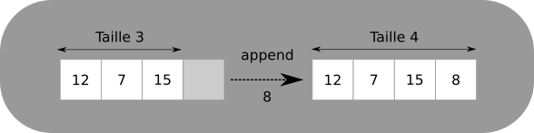

# Listes Chaînées

## Le problème de la structure tableau

La structure de type **tableau** permet de stocker des séquences d'éléments dans des zones contigües de la mémoire, mais n'est pas forcément adaptée à toutes les opérations possibles sur ces séquences.

Par exemple, la structure de tableau de Python permet grâce aux méthodes `append` et `pop` d'ajouter et de supprimer relativement efficacement un élément en **dernière position** dans un tableau déjà existant (ce n'est pas le cas dans d'autres langages, *où de telles méthodes n'existent pas forcément*). 
 
Lorsqu'on veut insérer un élément à une autre position on peut, toujours en Python, utiliser la méthode `insert` qui insère un élément à une position donnée. Mais cette méthode *cache un certain nombre de problèmes*, dont le **coût en temps**.

!!! example "Que fait `insert` lorsqu'on veut ajouter un élément en position 0"
	
	Imaginons que nous avons un tableau `tab`, pour lequel nous voulons insérer la valeur $8$ en première position :
	
	<p align="center">
	{: style="width:50%;"}
	</p>
	
	Au total, nous avons réalisé un nombre d'opérations qui est **proportionnel à la taille du tableau !**Sur un petit, tel que celui-ci, il n'y a pas trop de problèmes, 
	mais sur un tableau contenant *plusieurs millions* d'entrées, le nombre d'opérations devient bien trop important.
	
	Heureusement, il existe d'autres manières de stocker des informations, qui permettent une modification bien plus rapide des différents éléments.	

	??? warning "La face cachée de Python"

		Lorsqu'un objet de type `list` est crée en Python, l'interpréteur réserve une taille en mémoire proportionnelle à une puissances de 2 nécessaire pour stocker le tableau. Cela signifie qu'un tableau de taille 3 occuper une taille mémoire égale à celle d'un tableau de taille 4, mais dont la dernière cellule n'est pas utilisée. De même un tableau de taille 5 est en fait stocké comme un tableau de taille 8 dont les trois dernières cellules ne sont pas utilisées. Un tableau de taille 16 sera stocké dans une structure dont toutes les cases sont occupées.

		La méthode `append` va donc fonctionner de deux manières différentes selon la situation envisagée :

		* il **reste des cases de libres** dans la réservation mémoire, alors la valeur ajoutée par `append` sera simplement stockée dans la première case libre :

			{: style="width:50%; margin:auto;display:block;background-color: #d2dce0;" }

		* si la **réservation mémoire est pleine**, il faudra alors **créer une nouvelle réservation mémoire d'une taille 2 fois supérieure à la précédente**, copier chaque élément de l'ancienne liste dans la nouvelle, puis enfin la valeur ajoutée par `append` sera simplement stockée dans la première case libre :

			{: style="width:50%; margin:auto;display:block;background-color: #d2dce0;" }

		On constate une utilisation mémoire très important pour juste un élément supplémentaire ajouté...
	

## Les listes chainées

### Construction d'une liste chainée

!!! abstract "Liste chainée"
	Une {==**liste chainée**==} est une structure permettant d'implémenter une liste, c'est-à-dire une séquence finie de valeurs (de même type ou non). Les éléments sont dits **chainés** car {==**à chaque élément est associé l'adresse mémoire de l'élément suivant**==} de la liste.
	
!!! example "Exemple"
	
	<p align="center">
	{: style="width : 30%;"}
	</p>
	
	On a représenté ici une liste chainée de trois éléments :
	
	* Le premier est $21$, et il pointe vers l'adresse mémoire du second ;
	* Le deuxième élément est $15$ et il pointe vers l'adresse mémoire du troisième ;
	* Le troisième élément est $45$. Il ne pointe vers rien (l'adresse du suivant est `None`). On a atteint la fin de la liste.
	
!!! tips "Implémentation d'une liste chainée en Python"

	La méthode classique pour implémenter une liste chainée est de construire une **classe d'objets** possédant deux attributs : un pour la {==**valeur**==} et un pour l'{==**adresse**==} du chainon suivant :
	
	``` python linenums="1"
	
	class Chainon :
		"""Chainon d'une liste chainée"""
		def __init__(self, valeur, suivant) :
			self.valeur = valeur
			self.suivant = suivant
	```
	
	
	Une fois cette classe définie, la construction de la liste s'effectue de la manière suivante :

	* pour une liste chainée contenant un unique chainon :

		``` python
		chaine = Chainon(35, None)
		```

	* pour une liste chainée contenant plusieurs chainons :
	
		``` python
		chaine = Chainon(21, Chainon(15, Chainon( 45, None)))
		```
		
		
		Ici, on a créé une liste nommée `chaine` à partir de trois objets de classe `Chainon` qu'on peut visualiser ainsi :
		
		<p align="center">
		{: style="width : 70%;"}
		</p>

!!! info "Remarque"

	Cette construction est une construction récursive basée sur des objets. Il aurait été possible d'utiliser des tuples ou des listes python, mais l'utilisation serait moins pratique :

	``` python
	(21,(15, (45, (None))))
	```
	En particulier avec des tuples, il aurait été impossible de modifier la liste une fois celle-ci créée.

!!! tips "Affichage d'un objet `Chainon`" 
	
	Afin de représenter à l'écran notre objet `Chainon`, on implémente la méthode `__str__` ainsi :
	``` python linenums="1"
	class Chainon :
		"""Chainon d'une liste chainée"""
		def __init__(self, valeur, suivant) :
			self.valeur = valeur
			self.suivant = suivant
			
		def __str__(self):
			if self.suivant == None :
				return f"{self.valeur} -> None"
			else :
				return f"{self.valeur} -> {str(self.suivant)}"
	```
	
	Ainsi l'instruction `print(chaine)` affichera `21 -> 15 -> 45 -> None`.
	
### Opérations sur les listes chainées.

!!! exemple "Longueur d'une liste chainée"

	Nous allons créer maintenant une fonction `longueur` qui calcule la longueur d'une liste chainée telle que nous l'avons implémentée.
	
	Cette fonction devra :
	
	* renvoyer 0 si la liste est vide ;
	* renvoyer le nombre d'éléments de la chaine sinon.
	
	
	Le plus simple est d'utiliser la récursivité :
	
	``` python
	def longueur(chaine) :
		if chaine == None :
			return 0
		else :
			return 1 + longueur(chaine.suivant)
	```
	
	La **complexité** de cette fonction est directement proportionnelle à la longueur de la liste : pour une liste de $1~000$ éléments,
	la fonction effectuera :
	
	* $1~000$ comparaisons ;
	* $1~000$ additions ;
	* $1~000$ appels récursifs.
	
	On en conclut que la complexité en temps de cette fonction est en $\mathbb{O}(n)$.
	
	??? question "Et en itératif ?"
	
		``` python
		def longueur(chaine) :
			n = 0
			chainon = chaine
			while chainon is not None :
				n+=1
				chainon = chainon.suivant
			return n
		```
!!! question "Exercice 1 : n-ième élément"

	=== "Enoncé" 
		
		Créer une fonction `n_ieme_element(chaine, n)` qui renvoie la valeur du $n$-ième élément de la liste chainée passée en argument.
		
	=== "Solution récursive"
	
		``` python
		def n_ieme_element(chaine, n) :
			if chaine == None :
				raise IndexError("Invalid index")
			if n == 0 :
				return chaine.valeur
			else :
				return n_ieme_element(chaine.suivant, n-1)
		```
		
		La question de la complexité est un peu plus subtile :
		
		* dans un cas correct (l'indice `n` fourni corresond bien à un élément de la liste), le nombre d'opérations est bien proportionnel à `n` ;
		* dans le cas où `n` est supérieur à la longueur de la liste, par contre, on va parcourir la totalité de la liste avant de pouvoir signaler une erreur.
		Ce serait cependant une très mauvaise idée de calculer la longueur de la liste pour le comparer à $n$, car le calcul de la longueur parcoure déjà toute la liste.
		Faire ce calcul en appel récursif générerait donc une complexité **quadratique**. On pourrait cependant encapsuler la fonction récursive dans une fonction dont l'objectif serait
		de vérifier la valeur de l'indice avant d'effectuer les appels récursifs.
		* Pire, dans le cas où l'indice passé est négatif, la liste chainée sera elle aussi parcourue intégralement avant de renvoyer une erreur d'indice. On peut cependant corriger celà par la ligne :
		
		``` python
		if chaine == None or i<0 :
		...
		```
		
		
	=== "Solution Itérative"
	
		``` python
		def n_ieme_elementI(chaine, n) :
			if n < 0 :
				raise IndexError("Invalid index")
			ni = 0
			chainon = chaine
			while  chainon != None and ni != n :
				ni += 1
				chainon = chainon.suivant
			if chainon != None :
				return chainon.valeur
			else :
				raise IndexError("Invalid index")
		```
		 On retrouve en terme de complexité les mêmes éléments que pour la fonction récursive. Cependant les erreurs ainsi que les conditions de sorties sont plus complexes à prendre en compte.
		
		
!!! question "Exercice 2 :  Concaténation de deux listes"

	=== "Enoncé" 
		
		Créer une fonction `concatener(c1, c2)` qui renvoie une liste chainée obtenue par concaténation de `c1` et `c2`.
		
	=== "Solution récursive"
	
		``` python
		def concatener(c1, c2) :
			if c1 == None :
				return c2
			else :
				return Chainon(c1.valeur,concatener(c1.suivant, c2))
		```
		
		La complexité dépend fortement de la longueur de la liste `c1`. par contre elle ne dépend pas de celle de `c2`.
		Dans cette version, les chaines `c1` et `c2` ne sont pas modifiée ! `concatener` renvoie 
		une nouvelle liste chainée qui a copié les valeurs de `c1` avant de les lier à celles de `c2`.
		
		<p align="center">
		{: style="width : 60%;"}
		</p>
		
	=== "Solution Itérative"
		
		``` python 
		def concatenerI(c1, c2) :
			chainon = c1
			while chainon.suivant != None :
				chainon = chainon.suivant
			chainon.suivant = c2
			return c1
			
		```
		Attention ! Dans cette solution, `c1` est modifiée ! 
		<p align="center">
		{: style="width : 60%;"}
		</p>
		
		{==**ET C'EST UNE TRES MAUVAISE IDEE**==}
		
		Imaginons qu'on exécute deux fois la concaténation `concatenerI(c1, c2)`, puis qu'on demande un affichage de `c1`.
		
		La première concaténation va donner le schéma ci-dessus, la chaine `c1` ayant pour dernier chainon le dernier chainon de `c2`.
		A l'exécution de la deuxième concaténation, il n'y aura pas de création de nouvelle chaine, mais simplement la modification du dernier
		chainon de l'actuel `c1` vers le premier élément de `c2`, soit... une boucle menant du dernier élément de `c2` vers le premier de `c2` :
		
		<p align="center">
		{: style="width : 60%;"}
		</p>
		
		La chaine obtenue ne possède plus de fin (jamais elle ne pointe vers `None`). La méthode `__str__` effectuant un appel récursif dont le cas de base correspond au fait de pointer vers `None`, on aura alors une erreur de type `RecursionError: maximum recursion depth exceeded`, puisqu'il est devenu impossible de passer par le cas de base.
		
		
		
??? bug "Un cas limite : renverser la liste"
	
	Comment faire pour renverser une liste chainée ? Sachant que nous avons vu des procédés récursif pour les questions précédentes, nous sommes tenter d'en utiliser un aussi pour ce cas, par exemple en sélectionnant le premier chainon et en le concaténant à la liste renversée de la suite de la chaine, le cas de base étant celui d'une liste vide, auquel cas on renvoie cette liste :
	
	``` python
	def renverser(chaine) :
		if chaine == None :
			return None
		else :
			return concatener(renverser(chaine.suivant), Chainon(chaine.valeur, None))
	```
	
	Cependant cette solution n'est pas efficace ! En effet, à chaque appel de `renverser`, on fait aussi appel à la fonction `concatener` qui parcoure la totalité de la chaine, à part un élément. La complexité devient alors {==**quadratique**==} ! 
	
	{==**La récursivité n'est pas toujours la meilleure solution !**==} *Mais parfois elle l'est quand même !*
	
	On va don passer en itératif, surtout qu'il est facile d'attacher un chainon en tête d'une chaine déjà constituée :
	
	``` python
	def renverser(chaine) :
		reverse = None
		c= chaine
		while c != None :
			reverse = Chainon(c.valeur, reverse)
			c = c.suivant
		return reverse
	```
	
	La complexité est celle du parcours d'une chaine complète, donc en $\mathbb{O}(n)$.
	
		
### Modification de listes chainées

!!! warning "Pourquoi se casser la tête ?"
	Éliminons tout de suite une possibilité : bien entendu, **en Python**, il est possible de modifier *directement* un attribut, donc la modification d'une valeur d'une liste chainée est assez évidente.
	Par exemple, les lignes suivantes :
	``` python
	chaine = Chainon(21, Chainon(15, Chainon( 45, None)))
	chaine.suivant.valeur = 33
	```
	modifient la valeur du deuxième élément de la chaine, qui devient `21 -> 33 -> 45 -> None`.
	
	Cependant, **cette possibilité n'est pas toujours possible dans tous les langages**, et de toutes façons cette manière de modifier ne correspond pas à la logique de construction d'une liste chainée.
	
	On va donc préférer passer à des modifications directe des chainons.
	
	
		
!!! question "Exercice 3 : Insertion d'un chainon"

	=== "Énoncé" 
		
		Créer une fonction `inserer(v, n, chaine)` qui renvoie la liste chainée dans laquelle on a inséré insère l'élément `v` à la position `n` dans la liste `chaine` passée en argument.
		
		Le schéma suivant doit pouvoir vous aider çà construire l'algorithme de cette fonction :
		
		<p align="center">
		{: style="width : 50%;"}
		</p>
		
	=== "Solution"
	
		``` python
		def inserer(v, n, chaine) :
			""" Insere un chainon de valeur v en position n dans 
			la liste chainée chaine.
			"""
			if n<0 :
				raise IndexError("Invalid index")
			if n == 0 or chaine == None:
				return Chainon(v, chaine)
			else :
				return Chainon(chaine.valeur, inserer(v, n-1, chaine.suivant))
		```
	
!!! question "Exercice 4 : Suppression d'un chainon"

	=== "Énoncé" 
		
		Créer une fonction `supprime(n, chaine)` qui supprime l'élément à la position `n` dans la liste passée en argument.
		
		Le schéma suivant doit pouvoir vous aider çà construire l'algorithme de cette fonction :
		
		<p align="center">
		{: style="width : 50%;"}
		</p>
		
	=== "Solution"
	
		``` python
		def supprimer(n, chaine) :
			""" Supprime le chainon en position n de la liste
			chainée chaine."""
			if chaine == None or n<0:
				raise IndexError("Invalid index")
			if n == 0  :
				return chaine.suivant
			else :
				return Chainon(chaine.valeur, supprimer(n-1, chaine.suivant))
		```
		
## Quelques exercices supplémentaires 

Nous voici avec une structure correcte, permettant de travailler sur des listes chainées. Nous allons maintenant augmenter notre potentiel d'action avec de telles listes :

!!! question "Exercice 5 : Création à partir d'une liste Python"

	=== "Énoncé" 
		
		Créer une fonction `creer_depuis_tab(tab)` qui crée une liste chainée depuis un tableau donné en argument.
		
		Par exemple :
		
		* `creer_depuis_tab([12, 15, 17])` crée la liste chainée `12 -> 15 -> 17 -> None` ;
		* `creer_depuis_tab([])` crée un objet `None` ;
		* `creer_depuis_tab([42])` crée une liste chainée `42 -> None`.
		
	=== "Solutions"
	
		Il existe de nombreuses possibilités, et toutes ne sont pas équivalentes en terme de complexité (la V4 ci-dessous est beaucoup moins efficace).
		
		=== "Itérative Pythonesque avec `reversed`"
			``` python
			def creer_depuis_tab(tab) :
				"""Version pythonesque avec reversed"""
				LC = None
				for e in reversed(tab) :
					LC = Chainon(e, LC)
				return LC
			```
		
		=== "Itérative avec indices"
			``` python
			def creer_depuis_tab(tab) :
				"""Version avec calcul de l'indice"""
				LC = None
				l = len(tab)
				for i in range(len(tab)):
					LC = Chainon(tab[l-1-i], LC)
				return LC
			```

		=== "Récursive avec slices"
			``` python
			def creer_depuis_tab(tab) :
			 """Version récursive"""
				if  tab == [] :
					return None
				else :
					return Chainon(tab[0], creer_depuis_tabV3(tab[1:]))
			```
			
!!! question "Exercice 6 :  Chercher le nombre d'occurrences"

	=== "Énoncé" 
		
		Créer une fonction `occurrences(valeur, chaine)` qui renvoie le nombre d’occurrence de `valeur` dans la liste chainée `chaine`.
		
		Par exemple :
		
		* `occurrences(12, chaine)` devra renvoyer 3 si la chaine est `12 -> 35 -> 12 ->42 -> 12 ->35 -> None`;
		* `occurrences(27,chaine)` devra renvoyer 0 si la chaine est `12 -> 35 -> 12 ->42 -> 12 ->35 -> None`;
		* `occurrences(42,chaine)` devra renvoyer 1 si la chaine est `12 -> 35 -> 12 ->42 -> 12 ->35 -> None`.
		
	=== "Solution"
	
		A venir !


!!! question "Exercice 7 : Trouver la première occurrence"

	=== "Énoncé" 
		
		Créer une fonction `premiere_occurrence(valeur, chaine)` qui renvoie *l'indice de la première occurrence* de `valeur` dans la liste chainée `chaine`. Si `valeur`n'est pas dans `chaine`, la fonction devra renvoyer `-1`. 
		
		Par exemple :
		
		* `premiere_occurrence(12, chaine)` devra renvoyer 0 si la chaine est `12 -> 35 -> 12 ->42 -> 12 ->35 -> None`;
		* `premiere_occurrence(27,chaine)` devra renvoyer -1 si la chaine est `12 -> 35 -> 12 ->42 -> 12 ->35 -> None`;
		* `premiere_occurrence(42,chaine)` devra renvoyer 3 si la chaine est `12 -> 35 -> 12 ->42 -> 12 ->35 -> None`.
		
	=== "Solution"
	
		A venir !
		
!!! question "Exercice 8 : chaines identiques"

	=== "Enoncé" 
		
		Créer une fonction `identique(c1, c2)` qui renvoie `True` si les deux chaines contiennent les mêmes valeurs dans le même ordre, et `False` sinon.
				
		
	=== "Solution"
	
		A venir !

## Encapsulation

On va désormais **encapsuler** l'implémentation précédente dans une autre classe, nommée `ListeC` dont l'interface est la suivante :

1. la construction d'un objet `ListeC` vide correspondre à un objet `None`;
2. une méthode `is_empty` doit renvoyer un booléen correspondant au statut vide ou non vide de la liste ;
3. une méthode `push` permet d'ajouter une valeur en tête de la liste ;
4. la méthode `__str__` doit renvoyer une chaine correcte (telle que celle de la classe `Chainon`) ;
5. l'appel à la fonction `len` doit renvoyer la longueur de la liste ;
6. on doit pouvoir atteindre le i-ème élément d'un objet `lc`par l'intermédiaire de `lc[i]` ;
7. l'opérateur `+` utilisé entre deux objets de type `ListeC` doit renvoyer un nouvel objet crée par concaténation.


Ainsi, un utilisateur du module crée n'aura pas à se préoccuper des différences d'implémentations présentées dans la partie précédente :

!!! question "Méthode constructeur `__init__` :"
	=== "Analyse"
		Un objet `ListeC` ne contient qu'un seul attribut : la tête de la liste. Soit c'est un objet de type `Chainon`, soit c'est l'objet `None`. La méthode `__init__` ne doit
		donc qu'initialiser un attribut `head` à la valeur `None`.
		
	=== "Code"
	
		``` python linenums="1"
		class ListeC :
			"""Classe permettant de représenter une liste chainée, ou chaque chainon est un objet de classe Chainon"""
			
			def __init__(self) :
				self.head = None
		```

!!! question "Méthode `is_empty` :"

	=== "Analyse"
		si la tête est de type `None`, on renvoie `True`, sinon `False`
		
	=== "Code"
		``` python linenums="1"
		class ListeC :
			"""Classe permettant de représenter une liste chainée, ou chaque chainon est un objet de classe Chainon"""
			
			def __init__(self) :
				self.head = None
				
			def is_empty(self) :
				return self.head == None
		```

!!! question "Méthode `push` :"

	=== "Analyse"
		Comme on l'a vu plusieurs fois, une liste chainée se construit par ajouts successifs d'éléments en tête de la liste.
		
	=== "Code"
		``` python linenums="1"
		class ListeC :
			"""Classe permettant de représenter une liste chainée, ou chaque chainon est un objet de classe Chainon"""
			
			def __init__(self) :
				self.head = None
				
			def is_empty(self) :
				return self.head == None
				
			def push(self, v) :
				self.head = Chainon(v, self.head)
		```

!!! question "Méthode `__str__` :"

	=== "Analyse"
		Rien de particulier, il suffit de renvoyer la chaine de caractères correspondant à la tête.
		
	=== "Code"
		``` python linenums="1"
		class ListeC :
			"""Classe permettant de représenter une liste chainée, ou chaque chainon est un objet de classe Chainon"""
			
			def __init__(self) :
				self.head = None
				
			def is_empty(self) :
				return self.head == None
				
			def push(self, v) :
				self.head = Chainon(v, self.head)
				
			def __str__(self) :
				return str(self.head)
		```
		
!!! question "Méthode `__len__` :"

	=== "Analyse"
		La fonction built-in `len` fait appel à la méthode `__len__` de l'objet passé en argument. Il suffit donc de créer une telle méthode, en réutilisant la fonction `longueur` déjà crée.
		
	=== "Code"
		``` python linenums="1"
		class ListeC :
			"""Classe permettant de représenter une liste chainée, ou chaque chainon est un objet de classe Chainon"""
			
			def __init__(self) :
				self.head = None
				
			def is_empty(self) :
				return self.head == None
				
			def push(self, v) :
				self.head = Chainon(v, self.head)
				
			def __str__(self) :
				return str(self.head)
			
			def __len__(self) :
				if self.head == None :
					return 0
				else :
					return longueur(self.head)
		```

!!! question "Accès direct au i-ème élément :"

	=== "Analyse"
		Lorsqu'on veut faire appel aux opérateurs `[i]` pour accéder au i-ème élément d'un objet déjà construit, python regarde si une méthode `__getitem__` a été définie pour ce type d'objet.
		
	=== "Code"
		``` python linenums="1"
		class ListeC :
			"""Classe permettant de représenter une liste chainée, ou chaque chainon est un objet de classe Chainon"""
			
			def __init__(self) :
				self.head = None
				
			def is_empty(self) :
				return self.head == None
				
			def push(self, v) :
				self.head = Chainon(v, self.head)
				
			def __str__(self) :
				return str(self.head)
			
			def __len__(self) :
				if self.head == None :
					return 0
				else :
					return longueur(self.head)
					
			def __getitem__(self, i) :
				return n_ieme_element(self.head, i)
		```
!!! question "Utilisation de `+`"
	=== "Analyse"
		Pour utiliser l'opérateur `+`, il faut implémenter une méthode `__add__`. Cette méthode doit renvoyer un nouvel objet, donc son implémentation est un peu plus complexe.
		Par ailleurs, il faut lever une erreur dans le cas où l'objet passé en argument n'est pas de type `ListeC`.
		
	=== "Code"
		``` python linenums="1"
		class ListeC :
			"""Classe permettant de représenter une liste chainée, ou chaque chainon est un objet de classe Chainon"""
			
			def __init__(self) :
				self.head = None
				
			def is_empty(self) :
				return self.head == None
				
			def push(self, v) :
				self.head = Chainon(v, self.head)
				
			def __str__(self) :
				return str(self.head)
			
			def __len__(self) :
				if self.head == None :
					return 0
				else :
					return longueur(self.head)
					
			def __getitem__(self, i) :
				return n_ieme_element(self.head, i)
				
			def __add__(self, other) :
				if not isinstance(other, ListeC) :
					raise TypeError(f"Unable to add ListeC object with {type(other)} object")
				result = ListeC()
				result.head = concatener(self.head, other.head)
				return result
		```
		
Une fois cette classe implémentée, on peut l'utiliser aussi simplement qu'un objet de type `list` de python :

``` python
>>> l1 = ListeC()
>>> l1
<__main__.ListeC object at 0x033A8690>
>>> l1.push(12)
>>> l1.push(15)
>>> l1.push(42)
>>> print(l1)
42->15->12->None
>>> len(l1)
3
>>> l1.is_empty()
False
>>> l2 = ListeC()
>>> l2.push (43)
>>> l2.push (27)
>>> l2.push (-5)
>>> print(l1+l2)
42->15->12->-5->27->43->None
>>> print(l2+l1)
-5->27->43->42->15->12->None
>>> l1[2]
12
>>> l2[0]
-5
```

??? question "Prolonger le travail"
	
	=== "Énoncé"
		Ajouter à la classe `ListeC` les méthodes suivantes

		* `pop` : qui supprime soit la tête de la liste si aucun argument n'est passé (`l1.pop()`, soit l'élément d'indice donné si un indice est passé en argument (`l1.pop(2)`) ;
		* `insert(v,i)` qui insère dans la liste la valeur `v` à la position `i`.
	
	=== "Solution"
		A venir !