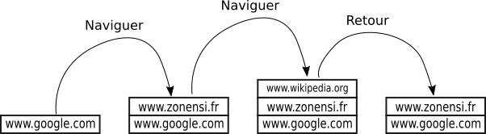

# Piles et files

## Définitions et exemples

### Piles

!!! abstract "Définition"

	Une {==**pile**==} (*stack* en anglais) est une structure de donnée permettant de stocker un ensemble d'objets tout en respectant certaines règles d'insertion et de délétion :
	
	* un objet est ajouté toujours en haut de la pile (**empiler**);
	* quand on supprime un objet, il s'agit toujours du **dernier objet ajouté** (**dépiler**).
	
	On associe à cette structure l'image d'une *pile d'assiettes* :
	
	

	{: style="width : 50%;"}
	

	
	Un tel type de structure est souvent appelé :
	
	* *Dernier entré, premier sorti* (*DEPS*) en français ;
	* *Last in, first out* (*LIFO*) en anglais.
	
!!! abstract "Interface"
	Pour définir l'interface d'un objet de type **pile**, nous supposerons d'abord que les éléments de la pile sont tous du même type (la pile est **homogène**).
	
	Pour parler d'une pile d'éléments de type `T`, on utilisera la notation `Pile[T]`.
	
	L'interface sera simple puisque seulement 4 fonctions sont nécessaires : création d'une pile vide, empiler (*push* en anglais), dépiler (*pop* en anglais), et tester la *vacuité* d'une pile.
	
	| fonction|  description|
	|:---:| :--- |
	| `créer_pile() -> Pile[T]` | crée une pile vide |
	| `est_vide(p : Pile[T]) -> bool` | renvoie `True si l'objet `p` de`type `Pile[T]` est vide, `False` sinon. |
	| `empiler(e : T, p : Pile[T]) -> None` | ajoute l'élément `e` de type `T` au sommet de la pile `p`. |
	| `dépiler(p : Pile[T]) -> e : T` | retire et renvoie l'élément `e` de type `T` situé au sommet de la pile `p`. |
	
		
!!! example "Situations utilisant des piles"

	=== "Bouton retour dans un navigateur"
	
		Lors d'une navigation web, on utilise une pile pour stocker les différentes pages visitées les unes après les autres. Le bouton de retour a pour fonction de **dépiler** la pile ainsi constituée.
		
		Par exemple :
		

		{: style="width : 50%;"}
		

	
	
	=== "Pile d'appels d'une fonction récursive"
	
		Une pile est crée lors des différents appels récursifs d'une fonction, et cette pile est dépilée à chaque retour de fonction.
		
		Par exemple, avec la fonction factorielle :
		

		{: style="width : 90%;"}
		

	
		
	
	
	=== "Fonction « Annuler la frappe » d'un traitement de texte"
	
		De la même manière que pour le bouton retour d'une page web, les modifications apportées dans un traitement de texte sont stockées dans une pile. L'appui sur ++ctrl++ + Z a pour effet de dépiler, 
		et donc de rétablir le texte à la situation précédente sauvegardée dans la pile.
		
### Files

!!! abstract "Définition"
	
	Une {==**file**==} (*queue* en anglais) est une structure de donnée permettant de stocker un ensemble d'objets tout en respectant certaines règles d'insertion et de délétion :
	
	* un objet est ajouté toujours au début de la file (**enfiler**);
	* quand on supprime un objet, il s'agit toujours du **dernier objet de la file** (**défiler**).
	
	On associe à cette structure l'image d'une *file de personnes faisant la queue* :	

	

	{: style="width : 70%;"}
	

	
	
	Une filer est particulièrement adaptée aux *traitements séquentiels*.
	
	Un tel type de structure est souvent appelé :
	
	* *Premier entré, premier sorti* (*PEPS*) en français ;
	* *First in, first out* (*FIFO*) en anglais.
	
!!! abstract "Interface"

	Pour définir l'interface d'un objet de type **file**, nous supposerons d'abord que les éléments de la file sont tous du même type (la file est **homogène**).
	
	Pour parler d'une file d'éléments de type `T`, on utilisera la notation `File[T]`.
	
	L'interface sera simple puisque seulement 4 fonctions sont nécessaires : création d'une file vide, enfiler (*enqueue* en anglais), défiler (*dequeue* nen aglais), et tester la *vacuité* d'une file.
	
	| fonction|  description|
	|:---:| :--- |
	| `créer_file() -> File[T]` | crée une pile vide |
	| `est_vide(f : File[T]) -> bool` | renvoie `True si l'objet `f` de`type `File[T]` est vide, `False` sinon. |
	| `enfiler(e : T, f : File[T]) -> None` | ajoute l'élément `e` de type `T` à la fin de la file `f`. |
	| `defiler(f : File[T]) -> e : T` | retire et renvoie l'élément `e` de type `T` situé au début de la file `f`. |
	
!!! example "Situations utilisants une file"

	=== "Jeu de Bataille"
	
		Dans un jeu de bataille, chaque joueur possède une file de carte. On *défile* chaque paquet, compare les cartes, et le vainqueur *enfile* les cartes récoltyées dans son paquet, jusqu'à ce qu'un des joueurs ait une file vide.
		
	=== "Serveurs d'impressions"
	
		Les serveurs d'impression traitent les requêtes dans l'ordre dans lequel elles arrivent, et les insèrent dans une file d'attente (dite aussi queue ou spool), lorsque d'autres travaux sont en exécution.
	
	=== "Mémoire tampon (*buffers*)"
	
		
	
	

## Implémentation d'une Pile

## Implémentation d'une File

## Exercices