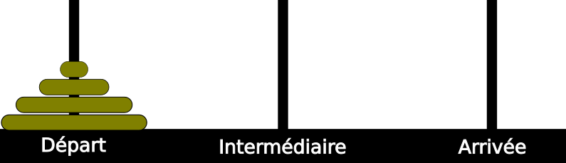

# TP : Tour de Hanoï

## Présentation du jeu 

**Les tours de Hanoï** est un jeu de réflexion imaginé par le mathématicien français [Édouard Lucas](https://fr.wikipedia.org/wiki/Édouard_Lucas){:target = "_blank"}.

Il consiste à déplacer des disques de différents diamètres d'une « tour de départ » à une « tour d'arrivée » en passant par une « tour intermédiaire », et ce en un minimum de coups, en respectant les deux règles suivantes :

* on ne peut déplacer qu'un disque à la fois ;
* on ne peut pas placer un disque sur un disque de diamètre inférieur.

{: style="width:50%; margin:auto;display:block;background-color: #d2dce0;"}