# TP : Tour de Hanoï

## Présentation du jeu 

**Les tours de Hanoï** est un jeu de réflexion imaginé par le mathématicien français [Édouard Lucas](https://fr.wikipedia.org/wiki/Édouard_Lucas){:target = "_blank"}.

Il consiste à déplacer des disques de différents diamètres d'une « tour de départ » à une « tour d'arrivée » en passant par une « tour intermédiaire », et ce en un minimum de coups, en respectant les deux règles suivantes :

* on ne peut déplacer qu'un disque à la fois ;
* on ne peut pas placer un disque sur un disque de diamètre inférieur.

{: style="width:50%; margin:auto;display:block;background-color: #d2dce0;"}

On souhaite écrire un programme python non-récursif qui utilise une classe `Pile` telle que définie dans le cours précédent (avec les listes chainées), et qui devra :

1. Permettre de saisir un nombre `n` de disques.
2. Afficher à l'écran les différentes étapes pour résoudre le problème avec `n` disques, en précisant à chaque fois le nombre d'étapes nécessaires.

## Algorithme de résolution non-récursif

Si on observe de près le jeu pour un nombre de disques supérieur à 1, on s'aperçoit qu'il n'y a que 1 ou 2 déplacements possibles :

* le petit disque peut **toujours** se déplacer sur les deux autres tours.
* si un disque différent du plus petit peut-être déplacé, il n'y a qu'une seule possibilité, c'est-à-dire sur la tour **où n'est pas le petit disque**.

Un algorithme itératif est donc le suivant :

```
Tant qu'il reste un disque sur la tour de départ ou sur la tour intermédiaire :
    Déplacer le petit disque d'une tour dans le sens D->A->I->D
    Si on peut déplacer un disque autre que le plus petit, alors le déplacer
```

!!! example "Exemple avec 3 disques"

    === "Etape 0"

        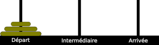{: style="width:30%; margin:auto;display:block;background-color: #d2dce0;"}

        Les trois disques sont sur la tour de départ.

    === "Etape 1"

        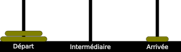{: style="width:30%; margin:auto;display:block;background-color: #d2dce0;"}

        On déplace le petit disque sur la tour d'arrivée (`D->A`).

    === "Etape 2"

        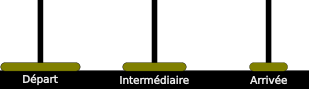{: style="width:30%; margin:auto;display:block;background-color: #d2dce0;"}

        On déplace le disque moyen sur la tour intermédiaire.

    === "Etape 3"

        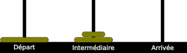{: style="width:30%; margin:auto;display:block;background-color: #d2dce0;"}

        On déplace le petit disque sur la tour intermédiaire (`A->I`).

    === "Etape 4"

        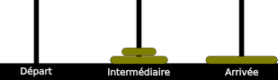{: style="width:30%; margin:auto;display:block;background-color: #d2dce0;"}

        On déplace le grand disque sur la tour d'arrivée.

    === "Etape 5"

        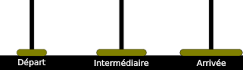{: style="width:30%; margin:auto;display:block;background-color: #d2dce0;"}

        On déplace le petit disque sur la tour de départ (`I->D`).

    === "Etape 6"

        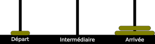{: style="width:30%; margin:auto;display:block;background-color: #d2dce0;"}

        On déplace le disque moyen sur la tour d'arrivée.

    === "Etape 7"

        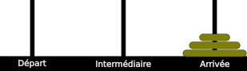{: style="width:30%; margin:auto;display:block;background-color: #d2dce0;"}

        On déplace le petit disque sur la tour d'arrivée (`D->A`). L'algorithme s'arrête.

## Codage de Python

Vous créerez un fichier python vide nommé `tour_de_hanoi.py`, dans lequel vous effectuerez toutes les étapes suivantes :

### Création de la classe Chainon

Créer une classe `Chainon` représentant un chainon de liste chainée.
Cette classe devra :

* avoir comme attributs `valeur`, représentant la valeur stockée dans le chainon, et `suivant`, représentant l'objet auquel le chainon est attaché, objet qui est soit de type `Chainon`, soit `None`.
* avoir comme méthode le DUNDERS `__str__`, renvoyant une chaine de caractère définie de la manière suivante, en considérant la liste chainée suivante :

    {: style="width:30%; margin:auto;display:block;background-color: #d2dce0;"}

    * pour le chainon `1` de la liste, l'affichage devra être :

        ```
        1 <- 2 <- 3
        ```

    * pour le chainon `3` de la liste, l'affichage devra être simplement :

        ```
        3
        ```

### Classe Pile

Vous devrez créer une classe `Pile`, qui implémente une pile selon l'interface suivante :

| Méthode | Arguments | Valeur de retour | Explication |
| :--- | :---: | :---: | :--- |
| `__init__` | aucun | aucune | Initialise une Pile vide (la tête est `None`) |
| `est_vide` | aucun | un `bool` | renvoie `True si la pile est vide, `False`sinon |
| `empiler` | un `int` | aucune | ajoute l'élément à la pile |
| `depiler` | aucun | un `int` | enlève l'élément du haut de la pile et le renvoie |
| `consulter` | aucun | un `int` | renvoie la valeur de l'élément en haut de la pile, **sans le dépiler**. Si la pile est vide renvoie `float(inf)`. |
| `__str__` | aucun | un `str` | Utilise la méthode de la classe `Chainon`. Si la pile est vide renvoie une chaine vide. |

On ajoutera par ailleurs un attribut privé `_taille`, qui devra contenir le nombre d'éléments actuels de la pile, et être modifié en conséquence lors des insertions et délétions d'éléments.

### Classe HanoiGame

Cette classe est la classe principale du fichier. Elle devra posséder les attributs suivants :

* `n` : le nombre de disques total
* `piles` : une liste contenant 3 piles :
    * celle d'indice `0` représente la tour de départ ;
    * celle d'indice `1` représente la tour intermédiaire ;
    * celle d'indice `2` représente la tour d'arrivée.
* `petit_a_bouge` : un booléen qui changera d'état si le plus petit disque a bougé au mouvement précédent
* `position_petit` : qui contient l'indice correspondant à la tour où se trouve le plus petit des disques.

Les différents disques seront représentés par des entiers entre `0` et `n-1`, où `n` est le nombre total de disques, avec la convention suivante :

* `0` est le plus petit disque
* `n-1` est le plus grand disque.

L'interface de la classe `HanoiGame` et la suivante :

| Méthode | Arguments | Valeur de retour | Explication |
| :--- | :---: | :---: | :--- |
| `__init__` | un `int` `n` strictement positif | aucune | Initialise le jeu en plaçant les `n` disques sur la tour de départ |
| `show` | aucun | aucun | voir le descriptif précis ci-dessous |
| `next_move` | aucun | aucun | Effectue le mouvement suivant selon l'état des disques sur les tours (et la valeur de `petit_a_bouge`) |
| `solve` | un `bool` `verbose` initialisé à `True` | un `int` | Voir le descriptif précis ci-dessous |

* {==**méthode `show`**==} :

    Cette méthode doit afficher l'état actuel des trois piles comme l'exemple ci-dessous, pour un jeu à 3 disques :

    ``` 
    D : 
    I :  1  <-   2  
    F : 3
    ```
    Cet affichage correspond à la situation suivante :

    {: style="width:30%; margin:auto;display:block;background-color: #d2dce0;"}    
    

* {==**méthode `solve`**==} :

    La méthode `next_move` prend en argument optionnel un booléen `verbose` initialisé à `True`.
    Cette méthode doit renvoyer un entier correspondant au nombre de déplacements nécessaire pour terminer le jeu (c'est-à-dire déplacer l'intégralité des disques de la tour de départ vers la tour d'arrivée).

    Dans le cas où l'argument `verbose` est `True` (ce qui est le cas par défaut), cette méthode doit en outre afficher l'état des trois tours à chaque étape de la résolution, par exemple comme ci-dessous pour un jeu à 3 disques :


    ```
    ...
    Etape 4
    D :
    I :  1  <-   2  
    F : 3

    Etape 5
    D : 1
    I : 2
    F : 3

    Etape 6
    D : 1
    I :
    F :  2  <-   3
    ...
    ```
    Si l'argument `verbose` est `False`, la méthode n'affiche rien.


## Résolution récursive

### Algorithme récursif

Pour déplacer une tour de `n` disques de la tour `D` à la tour `A`, il faut :

=== "Etape 1"

    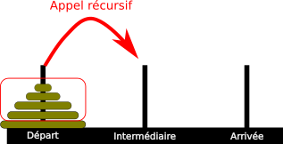{: style="width:30%; margin:auto;display:block;background-color: #d2dce0;"}


     Déplacer `n-1` disques de la tour `D` à la tour `I` ;


=== "Etape 2"

    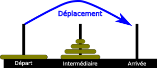{: style="width:30%; margin:auto;display:block;background-color: #d2dce0;"}

    Déplacer le dernier disque de la tour `D` à la tour `A` ;

=== "Etape 3"

    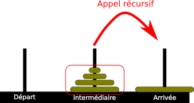{: style="width:30%; margin:auto;display:block;background-color: #d2dce0;"}

    Déplacer les `n-1` disques de la tour `I` à la tour `A`.

=== "Final"

    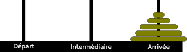{: style="width:30%; margin:auto;display:block;background-color: #d2dce0;"}

    Les disques sont bien sur la tour d'arrivée.

Le cas de base est simple : si le jeu ne possède qu'un disque, il suffit de le déplacer.


### Code en Python

On rajoute à la classe `HanoiGame` la méthode suivante :


```python

def solve_rec(self) :
        def solve_r(n, d, i, a, nb_move) :
            if n == 1 :
                self.piles[a].empiler(...)
                return 1
            else :
                nb_move += solve_r(n-1, d, a, i, 0)
                self.piles[...].empiler(self.piles[...].depiler())
                nb_move +=1
                nb_move += solve_r(...,...,..., ..., 0)
                return nb_move
        return solve_r(self.n, 0, 1, 2, 0)
```

On a ici une **fonction auxilliaire récursive** `solve` qui prend en argument :

* `n` le nombre de disques à déplacer ;
* `d` l'indice de la tour de départ du déplacement ;
* `d` l'indice de la tour intermédiaire du déplacement ;
* `a` l'indice de la tour d'arrivée' du déplacement ;
* `nb_move` le nombre de déplacements actuels.

La méthode `solve_rec` ne fait qu'appeler la fonction `solve_r` avec les arguments correspondant à un déplacement complet de la tour d'indice `0` vers la tour d'indice `2`.

!!! question "A faire"

    1. Compléter les pointillés du code précédent.
    2. Comparer le nombre de déplacement nécessaires avec les méthodes itératives et récursives.