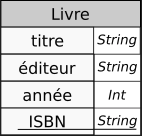

# Commandes de base en SQL : créations de tables et types de données

Une utilisation efficace des bases de données relationnelles n'est réalisable qu'avec un SGBDR (Système de Gestion de Bases d Données Relationnelles), c'esst-à-dire un logiciel offrant :

* la définition des données sous forme de relations ;
* la manipulation des données par un langage déclaratif ;
* l’administration des données.

Dans ce chapitre, nous nous contenterons d'utiliser de manière sommaire des fonctionnalités de SGBDR offertes :

* soit par les notebooks [Capytale](https://capytale2.ac-paris.fr/web/accueil){target=_blank} ;
* soit par le logiciel portable [DB Browser for SQLite](https://sqlitebrowser.org/dl/){target=_blank} ;
* soit par l'intermédiaire de modules python.

Nous verrons dans un chapitre post-épreuve les SGBDR un peu  plus en détail. Pour l'instant nous nous contenterons des fonctionnalités de base du langage SQL


## Du modèle relationnel à la base de donnée : une première approche

SQL (*Structured Query Language*) est directement inspiré du modèle relationnel défini dans la [partie précédente](ModeleRelationnel.html). Ce langage est standardisé par la norme `ISO/IEC 9075`, dont la dernière version date de [2016](https://www.iso.org/fr/standard/63555.html){target=_blank}.

La syntaxe du SQL est volontairement *verbeuse* et proche de l'anglais standard.  Nous allons montrer dans les exemples suivants la création d'une table, l'insertion d'éléments, et quelques requêtes simples sur cette base de donnée.

!!! example "Exemple : Création de la table `usager`"
	Les lignes de code SQL suivantes permettent la création d'une {==**table**==} `usager`, qui correspond globalement à la **relation** `usager` telle que définie par le schéma :
	
	usager(nom *String*, prénom *String*, email *String*, cp *String*, adresse *String*, inscription *Date*, <span style="border-bottom-width: 1px;border-bottom-style: solid;">code_barre *String*</span>)
	
	```` SQL
	CREATE TABLE usager (nom VARCHAR(90),
						 prenom VARCHAR(90),
						 email VARCHAR(60),
						 cp VARCHAR(5),
						 adresse VARCHAR(90),
						 inscription DATE,
						 code_barre CHAR(15) PRIMARY KEY);
	````
	On envoie ici au SGBD un ordre SQL de création de table, par l'intermédiare de  la commande `CREATE TABLE`.
	Le nom de la table sera `usager`. Cette table contiendra des {==**colonnes**==} (ou {==**champs**==} qui correspondent aux **attributs** de la relation.
	La première colonne `nom` est définie comme étant du type `VARCHAR`, c'est-à-dire chaîne de caractère, avec une contrainte de longueur maximale de 90 caractères. Il en est de même pour les 5 premières colonnes, avec différentes contraintes de longueur.
	La colonne `inscription` est définie comme étant du type `DATE`.
	La dernière colonne `code_barre` est définie comme étant du type `VARCHAR` de longueur maximale 15, auquel on adjoint la contrainte `PRIMARY KEY`, qui indique simplement qu'il s'agit bien de la **clé primaire** de la relation.
	
	L'ordre se termine par un `;`.
	
!!! tips "SQL et case des caractères"
	SQL est **insensible à la casse**. Il aurait été tout aussi efficace d'écrire `create table` ou `CrEaTE tABlE`.
	
	De fait certaines règles de bonnes pratiques sont à suivre :
	
	* les mots réservés de SQL sont écrits en  **majuscule** ;
	* les attributs sont écrits en **minuscules**, ainsi que les noms de tables[^nomTables] ;
	[^nomTables]: tout le monde n'est pas forcément d'accord sur ce point. Certains mettent une majuscule à la première lettre du nom de la table...
	* les noms d'attributs et de tables ne pouvant contenir d'espaces, ceux-ci sont remplacés par le caractère `_` (*underscore*).
	* les noms de table sont écrits au singulier.
	
!!! example "Exemple : insertions de lignes"
	Les lignes SQL suivantes permettent l'insertion de trois {==**lignes**==}  dans la table `usager`, qui correspondent à trois **entités** de la relation `Usager`.
	
	```` SQL
	INSERT INTO usager VALUES
	('Pavie', 'Auguste', 'auguste.pavie@ggp.fr', '22200', '13 rue Anatole Le Braz, Guingamp', '2021-11-09', '012345678910111'),
	('Prevert', 'Jacques', 'jacques.prevert@ggp.fr', '22200', '58 Rue de la Trinité, Guingamp', '2021-11-10', '012345678910112'),
	('Camus', 'Albert', 'albert.camus@grace', '22205', '2 Rue de Kerpaour, Grâces', '2021-10-09', '012345678910113')
	;

	````
	
	Chacune des **lignes** est un tuple, chaque composante correspondant à la **colonne** définie dans l'ordre de création de table, **dans l'ordre de définition** (il existe un moyen d'être plus explicite et de s'affranchir de l'ordre, que nous verrons plus tard).
	Vous pouvez constater que dans la troisième ligne, l'email n'est pas correctement écrit. Nous n'avons pour l'instant pas mis de contraintes supplémentaires sur le {==**champ**==} `email`, donc le SGBD acceptera cette entrée comme correcte.
	
!!! example "Exemple : Première requête"

	Nous allons maintenant interroger cette table par l'intermédiaire d'une {==**requête**==} (*query* en anglais) : 
	
	```` SQL
	SELECT 
    nom, prenom
	FROM
    usager;    
	````
	Cette requête renvoie le résultat suivant :
		
	| nom | prenom |
	| --- | --- | 
	| Pavie | Auguste |
	| Prevert | Jacques |
	| Camus | Albert |
	
	c'est-à-dire une {==**table**==} avec les attributs `nom` et `prenom`.
	
!!! warning "Différences entre modèle relationnel et SQL"
	
	Formellement, SQL n'est pas aussi strict que le modèle relationnel. En effet une table ne doit pas obligatoirement posséder une **clé primaire**.

	La conséquence directe de ce choix est une violation de la contrainte de relation, et il est tout à fait possible d'avoir des doublons dans une table, ce qui sera toléré par SQL. Mais c'est une mauvaise pratique !
	
!!! question "Manipuler SQL"

	Rendez-vous dans le [bac-à-sable SQL](https://capytale2.ac-paris.fr/web/c-auth/list?returnto=/web/code/b1c9-152465){target=_blank} sur Capytale.
	
	1. Exécutez les 4 premières cellules.
	2. Exécutez la cinquième. Quel est le résultat fournit par cette requête ?
	3. Exécutez la sixième. Quel est le résultat fournit par cette requête ?
	4. Ajoutez à la base de données l'entité suivante :	
	`('Brochen', 'Charles', 'charles.brochen@pontrieux.fr', '22260', '13 Rue de Pen Fantan, Pontrieux', '2021-10-11', '012345678910113')`
	Que se passe-t-il ? Pourquoi ?
	
	5. Ajoutez à la base de données l'entité suivante :	
	`('Pavie', 'Auguste', 'auguste.pavie@ggp.fr', '22200', '13 rue Anatole Le Braz, Guingamp', '2021-11-09', '012345678910110')`	
	Que se passe-t-il ? Pourquoi ?
	
	6. Exécutez maintenant une requête afin de récupérer une table contenant les emails et code postaux des usagers dont la date d'inscription est le 10 Novembre 2021.
	
## Types de données en SQL

Selon le SGBD utilisé, certaines libertés sont prises par rapport aux standards édictés par l'ISO. On peut néanmoins dégager des constantes  dans les différents types utilisés 

### Types numériques

!!! abstract "Types numériques"

	De manière générale, le standard SQL définit des types numériques représentants de manière *exacte* ou *approchée*.

	| nom du type | exact/approché | description |
	| :---: | :---: | :--- |
	| `SMALLINT` | exact | Entiers signés sur 16 bits ($-32~768$ à $32~768$) |
	| `INT` ou `INTEGER` | exact | Entiers signés sur 32 bits ($-2~147~483~647$ à $2~147~483~647$) |
	| `BIGINT` | exact | Entiers signés sur 64 bits ($\simeq -9\times 10^{18}$ à $\simeq 9\times 10^{18}) |
	| `DECIMAL(t,f)` | exact | Décimal signé de $t$ chiffres dont $f$ après la virgule |
	| `REAL` | approché | Flottant sur 32 bits ($-3,40\times 10^{38}$ à $3,40\times 10^{38}$)  |
	| `DOUBLE PRECISION` | approché | Flottant sur 64 bits ($-1,79\times 10^{308}$ à $1,79\times 10^{308}$)  |

	On peut noter le cas particulier du type `DECIMAL(t,f)`, qui permet du calcul en valeur exacte, par exemple sur des sommes d'argent. Par exemple, l'utilisation du type `DECIMAL(5,2` permettra de travailler avec des sommes de $-999,99$ € à $999,99$ €.


### Types textes
	
!!! abstract "Types textes"
	
	En SQL, les chaînes de carcatères sont délimitées par des guillemets simples `'`. Il est possible d'*échapper* un guillemet simple en le doublant, comme par exemple dans `'n''oubliez pas d''échapper'`.
	Il est possible  d'insérer un caractère *retour chariot* dans une chaîne pour avoir des chaînes multilignes.

	| nom du type | description |
	| :---: | :--- |
	| `CHAR(n)` | Chaîne d'exactement $n$ caractères |
	| `VARCHAR(n)` | Chaîne d'au plus $n$ caractères |
	| `TEXT` | Chaîne de taille quelconque |
	
	
	* La taille maximale dépend du SGBD, mais tous supportent au moins $8~000$ caractères. La valeur minimale pour $n$ est 1.
	* Pour le type `CHAR(n)`, si la chaîne stockée est de longueur inférieure à $n$, on complète la chaîne **à droite** par le nombre d'espaces nécesaires.
	* Le type `TEXT` est en fait un type `VARCHAR` de la dimension maximale supportée par le SGBD.
	
### Types booléens
	
!!!abstract "Type Booléen"
	Selon les SGBD, le type booléen est in,également supporté. Dans notre cas cette année, on supposera qu'il l'est correctement (mais il existe de nombreuses possibilités pour le simuler, par exemple avec un type `SMALLINT` où $0$ représente `False` et le reste `True`).
	
### Types temporels

!!! abstract "Types temporels"
	Comme déjà évoqué dans la partie précédente, les types temporels représentent parfois un cauchemar pour les programmeurs...
	
	Nous nous contenterons ici d'aborder de manière très superficielle ces types :
	
	| nom du type | description |
	| :---: | :--- |
	| `DATE` | Une date au format `'AAAA-MM-JJ'` |
	| `TIME` | Une heure au format `'hh:mm:ss'` |
	| `TIMESTAMP` | Un instant au format `'AAAA-MM-JJ hh:mm:ss'`  |
	
	Une propriété intéressante du type `DATE` est qu'il supporte l'addition correctement. si `d` est du type `DATE`, `d+7` produira une date corerspondante à 7 jours après `d`, en changeant jours, mois et années correctement.
	
### Type `NULL`

Une valeur `NULL` existe en SQL, et correspond à l'absence de donnée. Elle s'utilise comme la valeur `None` en Python. Elle est juste **interdite pour les clés primaires**.

Il est possible de tester si une valeur est nulle ou non grâce aux commandes `IS NULL` ou `IS NOT NULL`.

## Créations et suppressions de tables

### Création de tables

!!! abstract "Création de tables"
	La création d'une table se fait par l'intermédiaire de la commande suivante :
	
	```` SQL
	CREATE TABLE nom_table (attribut_1 domaine_1 contrainte_1_1 contrainte_1_2 ...,
							attribut_2 domaine_2 contrainte_2_1 contrainte_2_2 ...,
							...,
							attribut_n domaine_n contrainte_n_1...,
							contrainte_globale_1,
							...,
							contrainte_globale_n);
	````
	
	Une définition d'attributs consiste en :
	
	* la donnée d'un *nom* d'attribut (obigatoire) ;
	* la donnée d'un *domaine* (obligatoire) ;
	* la donnée de contraintes sur cet attribut (optionnel).
	
	Une contrainte qui porterait sur plusieurs attributs (par exemple une définition de clé primaire sur plusieurs attributs) est reportée en fin de déinition, avant la parenthèse fermante.
	
!!! example "Exemple avec clé primaire simple" 
	La relation `Livre`  suivante {: style="width:15%;"} peut être crée en SQL par la commande suivante :
	
	```` SQL
	CREATE TABLE Livre (titre VARCHAR(200),
						editeur VARCHAR(50),
						annee SMALLINT,
						ISBN CHAR(14) PRIMARY KEY);						
	````
	On remarque l'utilisation de 14 caractères exactement pour l'ISBN.
	
!!! question "Exécution de code"

	Dans le bac à sable SQL, créer la table `Livre`.
	
!!! example "Exemple avec clé primaire et clés étrangères"
	Maintenant que nous avopns crée les tables `Usager` et `Livre`, nous pouvons créer la table `Emprunt` telle que définie dans le schéma {: style="width:15%;"}
	
	```` SQL
	CREATE TABLE Emprunt (	code_barre CHAR(15) REFERENCES usager(code_barre),
							ISBN CHAR(14) PRIMARY KEY REFERENCES Livre(ISBN),
							retour DATE);
	````
	
!!! question "Création de code"

	Créer le code SQL nécessaire pour obtenir la table `Auteur` correspondant  à la relation {: style="width:15%;"}
	
!!! example "Exemple de création de clé primaire avec de multiples attributs"

	Pour la table `Auteur_de` définie par {: style="width:15%;"}, on peut utiliser le code suivant :
	
	```` SQL
	CREATE TABLE Auteur_de ( idA INT REFERENCES Auteur(idA),
							ISBN REFERENCES Livre(ISBN),
							PRIMARY KEY(ida, ISBN));
	````
	
### Suppressions de tables

!!! abstract "Suprression de tables"

	Pour supprimer une table, il suffit d'utiliser :
	
	```` SQL
	DROP TABLE nom_de_la_table;
	````
	
	Attention toutefois, **il n'est pas possible de supprimer une table si elle sert de référence pour une clé étrangère !** Cela violerait une **contrainte de référence**.
	
### Nouvelles Contraintes d'intégrités


Nous avons vu l'utilisation de `PRIMARY KEY` et `REFERENCES`, qui permettent de définir les contraintes de relation et de références. Il est possible de rajouter en SQL d'autres types de contraintes.


#### Contraintes d'unicité et de non-nullité

Entre autres :
	
* il est possible de préciser qu'un attribut (une colonne en langage SQL) ne peut être vbide, en ajoutant la contrainte `NOT NULL`;
* de même il est possible de préciser qu'un attribut ne peut exister en doublon, en ajoutant la contrainte `UNIQUE`.

Ainsi, la table `Usager` peut être redéfinie par :

```` SQL
CREATE TABLE usager (nom VARCHAR(90) NOT NULL,
					 prenom VARCHAR(90) NOT NULL,
					 email VARCHAR(60) NOT NULL UNIQUE,
					 cp VARCHAR(5) NOT NULL,
					 adresse VARCHAR(90),
					 inscription DATE NOT NULL,
					 code_barre CHAR(15) PRIMARY KEY);
````

Ainsi redéfinie, tous les attributs sauf l'adresse doivent être renseignés (la clé primaire ne devant pâs être vide par nature). De plus l'email ne peut être qu'unique (ce qui risque de poser des problèmes pour certains couples ou pour des inscriptions d'enfants avec le email de leur parent).

### Auto-incrément

Pour les {==**clé primaires numériques**==}, il est possible d'ajouter la contrainte d'{==**auto-incrémentation**==} de cet identifiant. Ainsi, à chaque ajout d'une ligne (donc d'une **entité**)  dans la table, une nouvelle valeur de clé sera automatiquement fournie. Par exemple pour la table `Auteur` :

```` SQL
CREATE TABLE Auteur (nom VARCHAR(90) NOT NULL,
					 prenom VARCHAR(90) NOT NULL,
					 idA INT PRIMARY KEY AUTO_INCREMENT);
````

Par défaut l'incrémentation commence à 1.

#### Contraintes spécifiques

Il est aussi possible de placer certaines contraintes spécifiques lors de la création d'une table, grâce au mot clé `CHECK` suivi d'une formule booléenne. Par exemple, si on souhaite introduire les années de naissance et de décès des auteurs, il est possible d'utiliser l'instruction suivante :

```` SQL
CREATE TABLE Auteur (nom VARCHAR(90) NOT NULL,
					 prenom VARCHAR(90) NOT NULL,
					 idA INT PRIMARY KEY AUTO_INCREMENT,
					 naissance SMALLINT,
					 deces SMALLINT,
					 CHECK (naissance IS NULL OR deces IS NULL OR naissance < deces) );
````

Ainsi, on vérifie qu'il n'y a pas d'erreurs sur une date de naissance postérieure à une date de décès.

On notera que cette contrainte s'écrit **directement après la dernière définition d'attributs** et que l'expression booléenne est entre parenthèses.	

!!! question "Mise à jour des tables"
	Dans le bac à sable, mettre à jour les tables afin qu'elles correspondent aux dernières instructions données.
	
	
## Insertions de données dans une table existante.

!!! abstract "Insertion de données"
	
	Pour insérer des données dans une table existante, on utilise l'instruction `ÌNSERT INTO`. Il existe deux possibilités pour insérer des données :
	
	* En insérant les valeurs sans préciser le nom des colonnes :
	
		`````SQL
		INSERT INTO nom_table VALUES (valeur1, valeur2, ..., valeurn);
		````
		les valeurs seront insérées dans l'ordre défini lors de la création de la table.
	
	* En insérant les valeurs en précisant les colonnes concernées :
	
		```` SQL
		INSERT INTO nom_table(attribut1, attribut3) VALUES (valeur1, valeur3);
		````
		Ici les valeurs ne seront insérées que dans les colonnes qui correspondent au nom donné.
		
!!! example "Exemple d'insertions"
	
	* Insertion complète :
		```` SQL
		INSERT INTO Livre VALUES("Dune", "Pocket", 2021, "978-2266320542");
		````
		Les informations fournies seront insérées dans l'ordre `titre`, `éditeur`, `année` et `ÌSBN`.
	* Insertion selon les colonnes :
		```` SQL
		INSERT INTO Livre(ISBN, titre) VALUES("978-2070319015", "H2G2, tome 1 : Le Guide du voyageur galactique ");
		````
		Seules les colonnes `ISBN` et `titre` sont renseignées. les autres seront mises à une valeur `NULL`.

!!! warning 
	Il est à noter que les contraintes d'intégrités sont vérifiées lors de l'insertion. Une instruction du type :

	````SQL
	INSERT INTO Auteur(nom, prenom, naissance, deces) VALUES ("ADAMS", "Douglas", 2001, 1952);
	````

	donnera une erreur par violation d'intégrité[^Baleine], la date de naissance étant supérieure à la date de décès.

[^Baleine]: Pauvre [Marvin](https://fr.wikipedia.org/wiki/Marvin_(Le_Guide_du_voyageur_galactique)){target=_blank}... 
	
## Exercices

!!! question "Exercice 1"
	=== "Enoncé"
		Reprendre l'énooncé de l'exercice 1 de la fiche [modèle relationnel](../ModeleRelationnel/#exercices){target=_blank} et donner l'instruction SQL permettant de créer la table correspondante.
		
	=== "Solution"
		A venir !
		
!!! question "Exercice 2"
	=== "Enoncé"
		Reprendre l'énooncé de l'exercice 2 de la fiche [modèle relationnel](../ModeleRelationnel/#exercices){target=_blank} et donner l'instruction SQL permettant de créer les tables correspondantes.
		
	=== "Solution"
		A venir !

!!! question "Exercice 2"
	=== "Enoncé"
		Reprendre l'énooncé de l'exercice 3 de la fiche [modèle relationnel](../ModeleRelationnel/#exercices){target=_blank} et donner l'instruction SQL permettant de créer les tables correspondantes.
		
	=== "Solution"
		A venir !

