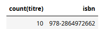
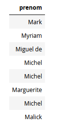
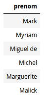

# Requêtes SQL 

*Les exemples et exercices donnés ci-dessous sont, sauf mention contraire, disponibles directement dans un [notebook Capytale](https://capytale2.ac-paris.fr/web/c/c156-162763){target=_blank} (Code `c156-162763`).*


## Projections

!!! abstract "Projection"
	L'opération de {==**projection**==} consiste à ne récupérer que certains **champs** (c'est-à-dire les **colonnes**) d'une table donnée.

	{: style="width:10%; margin:auto;display:block;background-color: #d2dce0;"}

	En `SQL`, on l'obtient par l'instruction :
	
	```` SQL
	SELECT
		colonne1, colonne2,...
	FROM
		nom_table;
	````

	`SQL` renvoie alors *une table temporaire* contenant les données demandées.
	
!!!example "Exemple 1 : Projection"
	Pour récupérer les colonnes `titre` et `isbn` de la table `livre` :
	```` SQL
	SELECT 
		titre, isbn
	FROM
		livre;
	````
	Pour récupérer l'intégralité des colonnes, on peut utiliser l'opérateur {==**joker**==}`*` :
	```` SQL
	SELECT 
		*
	FROM
		auteur;
	````
	
!!! tips "Renommer les colonnes"
	Il est possible dans une opération de projection de renommer les colonnes obtenues, grâce à l'opérateur `AS` :
	```` SQL
	SELECT 
		titre, isbn, annee AS annee_publication
	FROM
		livre;
	````

## Sélections

!!! abstract "Sélection (ou restriction)"
	L'opération de {==**sélection**==} consiste à interroger une base de données pour ne récupérer que **les lignes d'une table correspondant à une ou des conditions spécifiées** (exprimées sous la forme d'expressions booléennes).

	{: style="width:10%; margin:auto;display:block;background-color: #d2dce0;"}
	
	En SQL, on rajoute la {==**clause**==} `WHERE` suivie des conditions exprimées sous la forme d'une **expression booléenne**, utilisant les mots clés `AND` et `OR` par exemple :
	
	```` SQL
		SELECT
			colonne1, colonne2,...
		FROM
			nom_table
		WHERE
			conditions;
	````
	
!!! example "Exemple 2 : Sélection"

	* Sélection avec condition unique :
	
		```` SQL
			SELECT 
				titre
			FROM
				livre
			WHERE
				annee >= 2020;
		````
	* Sélection avec conditions multiples :
	
		```` SQL
		SELECT 
			titre
		FROM
			livre
		WHERE
			annee >= 1970 AND
			annee <= 2000 AND
			editeur='Dargaud';
		````
		
!!! tips "Requête sur les chaines de caractères"
	Si on veut chercher tous les livres dont le titre contient la chaine `Astérix`, il faudra utiliser une clause comme la suivante :
	
	```` SQL
		SELECT 
			titre
		FROM
			livre
		WHERE
			titre LIKE '%Astérix%';
	````
	
	La chaine de caractères `'%Astérix%'` s'appelle un {==**motif**==}. L'opération `s LIKE m` renverra `True` si la chaine de caractères `s` correspond au motif `m`.
	Le caractère `%` est un {==**joker**==} qui peut-être substitué par **n'importe quelle chaine**. Il existe aussi l'opérateur `_` (underscore) qui lui représente **n'importe quel caractère**. Ainsi, pour chercher tous les auteurs dont le nom commence par F, se termine par R et fait 6 caractères de long :	
	
	````SQL
		SELECT
			nom, prenom
		FROM
			auteur
		WHERE
			nom LIKE 'F____R';
	````

	Bien entendu, si on cherche une correspondance exacte, il n'est pas nécessaire d'utiliser la clause `LIKE`. Une simple requête d'égalité sera suffisante :

	````SQL
		SELECT
			titre
		FROM
			livre
		WHERE
			editeur= "Dargaud";
	````
	
## Fonctions d'agrégations

Il existe un certain nombre de fonctions permettant d'effectuer des opérations sur des colonnes. Ces fonctions s'appellent {==**fonctions d'agrégations**==}, et renvoie un résultat sous la forme d'une table d'une ligne et d'une colonne. Voici les plus utiles :

### Fonction `COUNT`

!!! abstract "Compter des lignes"
	La fonction SQL `COUNT` permet de compter le nombre de lignes que possède une table, éventuellement après sélection. Sa syntaxe est :
	
	```` SQL
	SELECT 
		COUNT(colonne)
	FROM
		table
	WHERE conditions;
	````
	
!!! example "Exemples"
	
	* Compter le nombre de lignes dans la table auteur :
		```` SQL
		SELECT 
			COUNT(*)
		FROM
			auteur;
		````
	* Compter le nombre de titres contenant le chaîne `Astérix`
		```` SQL
		SELECT 
			count(titre)
		FROM 
			livre
		WHERE titre LIKE '%Astérix%';
		````

!!! warning "Un piège"
	L'ordre SQL suivant 
	```` SQL
	SELECT 
		count(titre), isbn
	FROM 
		livre
	WHERE titre LIKE '%Astérix%';
	````
	renvoie une table avec une ligne et deux colonnes : {: style="width:15vw;"}
	
	L'isbn renvoyé ne correspond qu'au premier titre trouvé contenant la chaîne `Astérix` :
	```` SQL
	SELECT 
		titre, isbn
	FROM 
		livre
	WHERE isbn = '978-2864972662';
	````
	
!!! tips "Alias de colonne"
	Avec la fonction `COUNT`, les titres des colonnes renvoyés ne sont pas forcément parlant. Il est possible de les changer en leur fournissant un **alias** par l'intermédiaire de `AS` :

	```` SQL
	SELECT 
		count(titre) AS nombre_asterix
	FROM 
		livre
	WHERE titre LIKE '%Astérix%';
	````

### Fonctions numériques

Les fonctions suivantes ne peuvent s'appliquer que sur des colonnes dont le type est numérique :

* `SUM` : effectue la {==**somme**==} de toutes les valeurs de la colonne sélectionnée correspondant aux conditions données
* `AVG` (*average*) :  effectue la {==**moyenne**==} de toutes les valeurs de la colonne sélectionnée correspondant aux conditions données.

```` SQL
SELECT SUM(annee) as somme FROM livre ;
SELECT AVG(annee) as moyenne FROM livre ;
````

### Fonctions `MIN` et `MAX`

Ces deux fonctions s'appliquent sur n'importe quel type, l'ordre sur les chaines de caractères étant l'ordre lexicographique. :

```` SQL
SELECT MIN(nom) FROM auteur ;
SELECT MAX(nom) FROM auteur ;
SELECT MIN(annee) FROM livre; 
SELECT MAX(annee) FROM livre; 
````

## Tri et suppression des doublons

### Tri des colonnes 
Les résultats d'une requête SQL sont en général fournis dans l'ordre dans lequel ils sont trouvés. Il est cependant possible d'**ordonner** les colonnes grâce à la clause `ORDER BY` et les mots clés `ASC`(*ascending*) et `DESC`(*descending*):

* par ordre croissant :

	```` SQL
	SELECT 
		titre
	FROM	
		livre
	WHERE annee >=1990 
	ORDER BY titre ASC;
	````
	
* par ordre décroissant :

	```` SQL
	SELECT 
		nom
	FROM	
		auteur
	ORDER BY nom DESC;
	````
### Elimination des doublons

Effectuons la requête suivante :

```` SQL
SELECT prenom FROM auteur WHERE prenom LIKE 'M%';
````
Le résultat est la table suivante : {: style="width:7vw;"}

Nous constatons la présence de 3 prénoms `Michel` dans la table résultat.
 Il est possible d'éliminer de tels doublons dans une table en utilisant la clause `DISTINCT` :

```` SQL
SELECT DISTINCT prenom FROM auteur WHERE prenom LIKE 'M%';
````
On récupère alors en résultat la table suivante : {: style="width:7vw;"}

!!! warning "Attention"

	Attention toutefois ! Une requête telle que la suivante n'élimineras pas les doublons de prénom :
	
	```` SQL
	SELECT DISTINCT prenom, nom FROM auteur WHERE prenom LIKE 'M%';
	````
	En effet la clause `DISTINCT` élimine les lignes exactement identiques. Ici les couples `(prenom, nom)` sont bien tous différents.
	
## Application

!!! question "Exercice"
	Effectuer la première partie ainsi que les requêtes **sans jointures** du notebook [jeux olympiques](https://capytale2.ac-paris.fr/web/c/062e-4748066){target="_blank"}(Code `062e-4748066`) (merci M. Leleu).


	
	

		