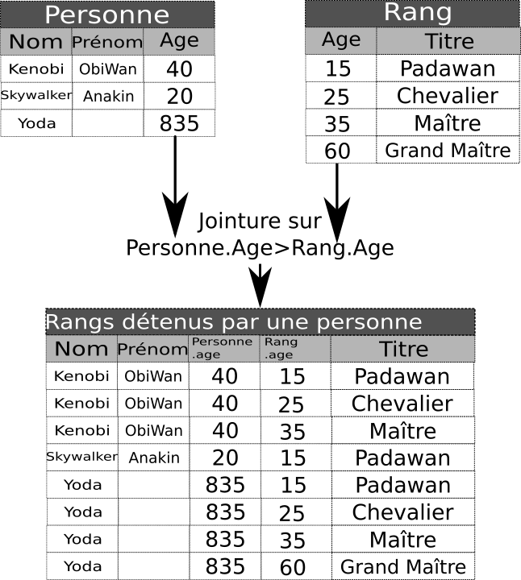

# Modification des bases de données et requêtes complexes

*Les exemples et exercices donnés ci-dessous sont, sauf mention contraire, disponibles directement dans un [notebook Capytale](https://capytale2.ac-paris.fr/web/c/c156-162763){target=_blank} (Code `C156-162763`).*

##Modification des bases de données

### Suppression de lignes

Pour supprimer des lignes selon une condition donnée, on utilise l'ordre :

```` SQL
DELETE FROM table WHERE conditions;
````

!!! example "Exemple" 
	
	La requête suivante :
	
	````SQL
	SELECT * FROM emprunt WHERE code_barre='934701281931582';
	````
	
	donne la table suivante en réponse :
	
	<table class="dataframe" border="1"><thead><tr style="text-align: right;"><th>code_barre</th><th>isbn</th><th>retour</th></tr></thead><tbody><tr><td>934701281931582</td><td>978-2260019183</td><td>2020-01-01</td></tr><tr><td>934701281931582</td><td>978-2371240087</td><td>2020-01-01</td></tr></tbody></table>
	
	Pour supprimer la ligne référençant l'isbn `978-2260019183` :
	
	````SQL
	DELETE FROM emprunt WHERE code_barre='934701281931582' AND isbn='978-2260019183';
	````
	On vérifie ensuite :
	
	````SQL
	SELECT * FROM emprunt WHERE code_barre='934701281931582';
	````
	
	<table class="dataframe" border="1"><thead><tr style="text-align: right;"><th>code_barre</th><th>isbn</th><th>retour</th></tr></thead><tbody><tr><td>934701281931582</td><td>978-2371240087</td><td>2020-01-01</td></tr></tbody></table>
	
	
!!! warning "Quelques points de remarques"

	* L'**oubli** de la clause `WHERE` **supprime toutes les données** de la table ! Cependant la table existe encore et il est possible d'insérer de nouvelles données. Pour supprimer complètement une table, il faut utiliser l'instruction :
	
		```` SQL
		DROP TABLE nom_table;
		````
		
	* Il est impossible de supprimer une ligne dont l'absence violerait la contrainte de références (clé étrangère). Par exemple l'ordre suivant ne fonctionnera pas, car l'isbn donné est présent dans la table `emprunt` :
	
		```` SQL
		DELETE FROM livre WHERE isbn='934701281931582';
		````

!!! info "Tout ou rien"

	Si un ordre passé devant supprimer plusieurs lignes rencontre à un moment une erreur, alors **toutes les suppressions effectuées par cet ordre sont annulées** ! On parle d’exécution de type &laquo; tout ou rien &raquo;.
	
### Mise à jour de lignes

Pour mettre à jour des lignes, on utilise un ordre SQL de type :

```` SQL
UPDATE nom_table
SET attribut1 = nouvelle_valeur1,
	attribut2 = nouvelle_valeur2,
	...
WHERE conditions;	
````

!!! example "Exemple"

	La requête suivante :
	
	```` SQL
	SELECT * FROM usager WHERE prenom='ALAIN';
	````
	
	donne comme table résultat :
	
	<table class="dataframe" border="1"><thead><tr style="text-align: right;"><th>nom</th><th>prenom</th><th>adresse</th><th>cp</th><th>ville</th><th>email</th><th>code_barre</th></tr></thead><tbody><tr><td>MOREAU</td><td>ALAIN</td><td>48, Rue du Château</td><td>75005</td><td>Paris</td><td>amoreau1@abc.de</td><td>421921003090881</td></tr></tbody></table>
	
	Pour changer l'email de cet utilisateur, on peut utiliser l'ordre suivant :
	
	```` SQL
	UPDATE usager
	SET email = 'alain.moreau@truc.com'
	WHERE code_barre ='421921003090881';
	````
	et une nouvelle requête de recherche renvoie bien comme table :
	
	<table class="dataframe" border="1"><thead><tr style="text-align: right;"><th>nom</th><th>prenom</th><th>adresse</th><th>cp</th><th>ville</th><th>email</th><th>code_barre</th></tr></thead><tbody><tr><td>MOREAU</td><td>ALAIN</td><td>48, Rue du Château</td><td>75005</td><td>Paris</td><td>alain.moreau@truc.com</td><td>421921003090881</td></tr></tbody></table>

## Requêtes complexes

### Jointures

Jusqu'à présent, les requêtes que nous avons écrites ne nécessitent que l'utilisation d'une seule et unique table. Mais bien souvent, nous avons à effectuer des requêtes récupérant des données de plusieurs tables simultanément.
Pour effectuer une telle requête, il faudra utiliser une ou des {==**jointures de tables**==}.


#### Jointure sur deux tables

!!! abstract "Jointure naturelle de deux tables"

	Prenons l'exemple de deux tables, l'une nommée `Personne` contient les noms, prénoms et âge de membres de l'ordre Jedi, et la seconde nommée `Rang` les rangs Jedi ainsi que l'âge minimum requis pour l'atteindre.
	
	Nous pouvons effectuer une {==**jointure**==} sur le critère de l'age, en créant une table contenant toutes les lignes des rangs ayant pu être atteints par une personne, sur le critère `Personne.Age>Rang.age` :
	
	<p align="center">
	{: style="width:30vw;"}
	</p>
	
	On notera que pour éviter toute confusion, les deux colonnes `Age` originelles ont vu leurs noms **préfixés** par leur table d'origine, avec la notation `table.colonne`.
	
	Une table de jointure telle que celle-ci sera construite grâce à la clause suivante :
	
	```` SQL
	Personne JOIN Rang ON Personne.Age > Rang.Age
	````
	
	Il sera ensuite possible d'utiliser cette table au sein d'une clause `SELECT`.
	
!!! example "Exemples"
	
	* Pour connaitre la liste des livres empruntés, on utilisera l'ordre SQL suivant :
	
		```` SQL
		SELECT *
		FROM
			emprunt JOIN livre ON emprunt.isbn=livre.isbn;
		````
	
	* Il est bien sûr possible de projeter le résultat de la requête et d'effectuer une sélection. Par exemple pour connaitre la liste des personnes devant rendre au moins un livre avant le 01 février 2020 :
	
		```` SQL
		SELECT DISTINCT usager.nom, usager.prenom, emprunt.retour
		FROM 
			usager JOIN emprunt ON usager.code_barre=emprunt.code_barre
		WHERE 
			emprunt.retour<'2020-02-01';
		````
		
#### Jointures sur plusieurs tables

!!! example "Exemple"

	On souhaite connaitre les titre et les auteurs correspondant aux livres actuellement empruntés. Il faut donc faire une jointure sur les 4 tables `livre`, `auteur`, `auteur_de` et `emprunt`. La requête a écrire va donc être plus longue que celles vues jusqu'alors :
	
	```` SQL
	SELECT livre.titre, auteur.nom, auteur.prenom
	FROM
		emprunt JOIN livre ON emprunt.isbn=livre.isbn
		JOIN auteur_de ON livre.isbn = auteur_de.isbn
		JOIN auteur ON auteur_de.a_id = auteur.a_id;
	````
	
!!! tips "Alias des tables"

	Certaines requêtes deviennent rapidement pénibles à écrire. Pour simplifier un peu cette écriture, il est possible d'utiliser un alias pour les tables à l'aide du mot-clé `AS`. Ainsi l'ordre précédent peut-être écrit :
	
	```` SQL
	SELECT l.titre, a.nom, a.prenom
	FROM
		emprunt AS e JOIN livre AS l ON e.isbn=l.isbn
		JOIN auteur_de AS ad ON l.isbn = ad.isbn
		JOIN auteur AS a ON ad.a_id = a.a_id;
	````
	
	
	

### Requêtes imbriquées

Il est tout à fait possible d'imbriquer des requêtes les unes dans les autres, puisque le résultat d'une requête est lui-même une *table temporaire* :

```` SQL
SELECT * FROM (
	SELECT * FROM livre
		WHERE annee >= 1990) AS tmp
WHERE tmp.annee<=2000;
````

Ici on crée une table temporaire d'alias `tmp`, dans laquelle on stocke toutes les lignes dont l'année de publication est supérieure ou égale à 1990, puis on effectue une nouvelle sélection sur cette table temporaire en ne gardant que les lignes dont l'année de publication est inférieure ou égale à 2000.

!!! tips "Analyse par un SGBD"
	UN SGBD analysera cette requête exactement de la même manière qu'il analysera la suivante :
	
	```` SQL
	SELECT * FROM livre WHERE annee>=1990 AND annee<=2000;
	````
	
	Il n'y aura aucune différence entre les deux en terme de vitesse de traitement.
	
Il est aussi possible d'imbriquer des requêtes **dans la clause `WHERE`**, en respectant certaines conditions. Par exemple pour connaitre la liste des livres dont l'année est la plus ancienne dans la base, on va utiliser :

```` SQL
SELECT titre, annee 
FROM livre 
WHERE annee = (SELECT MIN(annee) FROM livre);
````

!!! question "Écrire une requête imbriquée"
	=== "Énonce"
	
		Écrire une requête SQL donnant la liste des livres publiés la même année que le livre dont le titre contient la chaine de caractère `'Jack Barron'`.
		
	=== "Solution"
		```` SQL
		SELECT titre
		FROM livre
		WHERE annee = (SELECT annee FROM livre WHERE titre LIKE '%Jack Barron%');
		````


## Exercices

Effectuer les requêtes **avec jointures** du notebook [jeux olympiques](https://capytale2.ac-paris.fr/web/c/917a-165474){target="_blank"}(Code `917a-165474`) (merci M. Leleu).

		