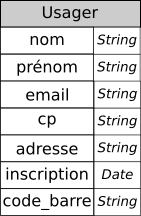

# Bases de données et modèle relationnel

*L'ensemble du chapitre est fortement influencé par :*

* *Numérique et Sciences Informatique Tle : 24 leçons avec exercices corrigés*, Balabonski, Conchon, Filliâtre, Nguyen, éditions Ellipses
* *Bases de données, de la modélisation au SQL*, Laurent Audibert, éditions Ellipses


[^BCFN]: *Numérique et Sciences Informatique Tle : 24 leçons avec exercices corrigés*, Balabonski, Conchon, Filliâtre, Nguyen, éditions Ellipses
[^LA]: *Bases de données, de la modélisation au SQL*, Laurent Audibert, éditions Ellipses

## Introduction aux bases de données, types de modèles

### Les bases de données

Il est difficile de proposer une définition exacte des bases de données. *Laurent Audibert*[^LA] propose :

!!! abstract "Définition générale"
	
	Un ensemble organisé d'informations avec un objectif commun.
	
La définition est vague, mais dès lors que des informations sont {==**rassemblées**==} et {==**stockées**==} d'une manière {==**organisée**==}, on peut parler de *bases de données*, quel que soit le support utilisé (tablettes d'argile, papiers, fichiers, etc)

Bien entendu l'informatique, c'est-à-dire la science du traitement automatique de l'information, permet le traitement de grandes quantités d'informations, et surtout leur exploitation (ajout, suppression, mise à jour, recherches, ...). Dans le cadre informatique, *Laurent Audibert*[^LA] propose :

!!! abstract "Base de données informatisées"
	Une base de données (**BDD**, en anglais *DataBase* soit **DB**) informatisée est un ensemble structuré de données enregistrées sur des supports accessibles par l'ordinateur, représentant des informations du monde réel et pouvant être interrogées et mise à jour par une communauté d'utilisateurs.
	
Nous verrons que cette définition impose un certain nombre de contraintes à la mise en place des BDD informatisées. La première est la question de la {==**cohérence des données**==}.


!!! example "Exemple : Bases de données musicale[^LA]"
	Prenons l'exemple d'une base de données contenant des albums musicaux, et qui mémorise pour chaque album son genre, son titre, le nom du groupe ainsi que le nom du chanteur principal. L'idée de base est de présenter les données sous la forme d'une table, comme dans l'extrait ci-dessous :
	
	| Genre | Titre | Groupe | Chanteur |
	| --- | --- | --- | -- |
	| Stoner | Era Vulgaris | Queen Of The Stone Age | Josh Homme |
	| Metal | Master of Puppets  | Metallica | 
	| Metal | Them Crooked Vultures | Them Crooked Vultures | Josh Homme |
	| Metal | L'Enfant sauvage	| GOJIRA | Jo Duplantier |
	| Stoner | Dying surfer meet his maker | All Them Withches | Charles Michael Parks Jr |
	| Métal | Fortitude | Gojira | Joseph Duplantier |
	| Stoner Rock | Nothing as the ideal | All Them Withches | Charles Michael Parks Jr |
	| Metal Progressif | Magma | Gojira | Joseph DUPLANTIER |
	
	La condition *sine qua none* pour garantir la faisabilité et la pertinence d'une recherche de données est la {==**cohérence de ces données**==}. Ici on constate plusieurs problèmes de cohérence :
	
	* Le nom du groupe *Gojira* est orthographié de deux manières différentes. Une recherche utilisant la chaine de caractères `Gojira` ne donnera que deux résultats, alors que trois peuvent être attendus.
	* Le genre *Metal* est aussi orthographié de deux manières différentes. On notera qu'une recherche stricte avec la chaine `Metal`, c'est-à-dire basée sur l'égalité, ne donnera que deux résultats, alors qu'une recherche étendue, c'est-à-dire basée sur l'appartenance de la sous-chaine `Metal` à la chaine donnant le genre, renverra elle trois résultats.
	* Le nom du chanteur de *Gojira* est écrit de trois manières différentes.
	* On peut aussi noter que le nom du chanteur de *Metallica* n'est pas renseigné, ce qui peut peut-être poser un problème de cohérence.
	
	Ces problèmes de cohérence sont liés (en partie), à un problème de {==**redondance**==} des données :  en effet dans la table telle qu'elle est présentée, on va devoir saisir plusieurs fois les chaines telles que `Metal` et `Gojira`, alors qu'elles ne représentent bien qu'une seule {==**entité**==} chacune. 
	
	Pour régler la question de la **cohérence des données**, il faudra en premier lieu trouver un moyen d'éviter la **redondance** de certaines données.

### Historique et problématiques des différents modèles

!!! abstract "Modèles de données et structures de données"
	
	Ces deux concepts se placent à différents niveaux d'abstraction. Les {==**modèles de données**==} indique quelles caractéristiques d'une entité réelle on souhaite manipuler dans un programme, ainsi que les relations qui lient ces entités entre elles. Par exemple un groupe de musique va produire plusieurs albums, et un chanteur peut chanter dans plusieurs groupes. 
	
	Une {==**structure de donnée**==} indique la manière dont on va organiser les données **en machine**. Ainsi pour un même modèle il existe plusieurs structures pouvant représenter ce modèle (tableau, listes chainées, objets...)


Le premier modèle ayant souhaité s'attaquer au problème de la redondance des données est le **modèle hiérarchique**, développé par IBM dans les années 1960, dans le cadre du programme Apollo de la NASA. Ce modèle, très dépendant de la manière dont fonctionnait les ordinateurs de cette époque, enregistre les données à la manière de l'organisation d'un système de fichier, sous la forme d'un arbre (*structure arborescente*), de façon à ce qu'un enregistrement n'ait qu'un seul possesseur. On peut en donner un exemple ci-dessous :

{: style="width:80%; margin:auto;display:block;background-color: #d2dce0;"}

Ce type de modèle peut être pratique, mais *il ne répond pas à toutes les problématiques*. En effet, ici nous n'avons pas introduit dans la hiérarchie les leads vocaux. Voici ce que donne le schéma lorsqu'on les introduit :

{: style="width:80%; margin:auto;display:block;background-color: #d2dce0;"}

On constate ici que le choix d'organisation de l'arbre ne permet pas de régler la redondance des données, puisque non seulement un même chanteur peut être lead vocal sur plusieurs albums, mais il peut l'être aussi sur **plusieurs groupes** (comme Josh Homme par exemple). La structure hiérarchique n'est ici pas adaptée. 

Une des solutions proposée pour ce problème a été **le modèle réseau**, proposé par [Charles William Bachman](https://fr.wikipedia.org/wiki/Charles_Bachman) à la fin des années 1960[^LA]. C.W. Bachman reçu le Prix Turing en 1973 pour ses contributions sur les technologies des bases de données. On lui doit aussi le modèle OSI (voir le cours de première...). Une représentation de nos albums dans le modèle réseau est la suivante :


{: style="width:80%; margin:auto;display:block;background-color: #d2dce0;"}

Ainsi, la redondance des données n'est plus un problème. Cependant, le modèle réseau n'est pas un modèle toujours efficace, puisque pour retrouver une donnée (un chanteur par exemple), il faut connaitre la structure de ce réseau, c'est-à-dire les liaisons existantes, ce qui rend les programmeurs {==**dépendants de la structure de donnée**==}.


## Le modèle relationnel

### Historique

Chercheur au centre de recherche d'IBM, [Edgar Frank Codd](https://en.wikipedia.org/wiki/Edgar_F._Codd){target=_blank}, insatisfait des modèles existant, chercha un modèle plus simple permettant de gérer un grand nombre de données. Mathématicien de formation, il se basa sur la théorie des ensembles et la logique des prédicats ([*logique de premier ordre*](https://fr.wikipedia.org/wiki/Calcul_des_pr%C3%A9dicats){target=_blank}) pour publier en 1970 un article[^Codd] où il proposait de stocker des *données hétérogènes* dans des *tables*, comme dans le schéma ci-dessous :

{: style="width:80%; margin:auto;display:block;background-color: #d2dce0;"}

Ce modèle, qualifié de {==**relationnel**==} était à l'époque considéré comme une curiosité intellectuelle, car les ordinateurs en ce temps n'étaient pas capables de gérer de manière efficace des tables de données, et il n'était pas évident qu'ils le soient un jour.

Ce scepticisme n'a pas empêché Codd de poursuivre ses travaux, et de concevoir un premier prototype de {==**Sytème de Gestion de Bases de Données Relationnelles**==} (**SGBDR**). Depuis les années 1980 cette technologie a muri, pour être finalement adoptée par le monde de la recherche et des entreprises. 

En parallèle, Codd mis au point un langage de manipulation des données *non procédural*, où l'utilisateur *définit le résultat qu'il attend plutôt que la manière de l'obtenir*. Ce langage nommé dans un premier temps `SEQUEL` (*Structured English Query Language*), rebaptisé par la suite `SQL` (*Structured Query Language*), fut adopté comme norme internationale par l'ISO en 1987.

[^Codd]: [https://citeseerx.ist.psu.edu/viewdoc/summary?doi=10.1.1.86.9277](https://citeseerx.ist.psu.edu/viewdoc/summary?doi=10.1.1.86.9277){target=_blank}

### Principes, vocabulaires et définitions

Imaginons la situation d'une médiathèque municipale classique, pour lequel nous souhaitons mettre en place un *système d'information*. Ce système doit pouvoir gérer l'emprunt et le retour de livres par un utilisateur inscrit.

Ainsi, un utilisateur, Bob, va pouvoir s'inscrire à la médiathèque. On lui demandera :

* son nom ;
* son prénom ; 
* son email ;
* son code postal (les tarifs d'abonnement sont différents selon la commune de résidence) ;
* son adresse exacte.

Le système ne retiendra de lui que ces éléments, avec la date d'inscription. Sa taille, couleur des yeux ou cheveux, n'ont aucune importance dans le système. Le système ne retiens qu'une approximation de la réalité.

Une fois inscrit, Bob se voit remettre une *carte* contenant un **code-barre**, c'est-à-dire un numéro unique qui est attribué à Bob.

Bob peut alors emprunter le livre &laquo; Apprendre à programmer avec Python 3: Avec 60 pages d'exercices corrigés ! &raquo; de Gerard Swinnen, Eyrolles, 2012, ISBN 978-2212134346. Sur le livre est aussi placé un **code-barre**, qui identifie le livre de manière unique. En scannant ce code barre et sa carte de bibliothèque sur une des bornes disponible, le système devra retenir que Bob a emprunté ce livre à la date du jour.

De la même manière, lorsqu'il revient quelques semaines plus tard, il doit pouvoir rendre ce livre en scannant sa carte et le livre, et le système doit retenir que le livre est à nouveau disponible et que Bob a de nouveau le droit d'emprunter d'autres livres.

Bien entendu, d'autres utilisateurs doivent pouvoir faire des emprunts et des restitutions au même moment sur d'autres bornes de la médiathèque, ce qui signifie que les données doivent pouvoir être accessibles depuis un réseau *a minima local*.

De plus les documentalistes doivent pouvoir ajouter de nouveaux ouvrages, en supprimer certains trop anciens ou abimés, et mettre à jour l'ensemble des utilisateurs. Ces dernières opérations ne devant pas être accessibles aux usagers, il faudra mettre en place un système de *droits d'accès*.

!!! abstract "Entités"
	Dans le modèle relationnel, un objet modélisé est appelé {==**entité**==}. Il est représenté par un n-uplet de valeurs.

	
!!! example "Exemple"
	Le livre emprunté par Bob peut-être représenté par le quintuplet :
	
	````
	('Apprendre à programmer avec Python 3: Avec 60 pages d'exercices corrigés !', 'Gerard Swinnen', 'Eyrolles', 2012, '978-2212134346')
	````
	Dans ce quintuplet, 4 composantes sont des chaines de caractères, et une seule est sous la forme d'un entier.
	
	
!!! abstract "Relation"
	Une *collection d'entités* est appelée une {==**relation**==}.
	
!!! example "Exemple"
	La relation `Livre` de la médiathèque peut être représentée par :
	````
	Livre = {
	('Apprendre à programmer avec Python 3: Avec 60 pages d'exercices corrigés !', 'Gerard Swinnen', 'Eyrolles', 2012, '978-2212134346'),
	('Bases de données, de la modélisation au SQL', 'Laurent Audibert', 'Ellipses' ,  2009, '978-2729851200'),
	...
	}
	````
!!! abstract "Schéma relationnel, attributs"
	Chaque *relation* se conforme à un {==**schéma**==}. Ce dernier est une description, qui indique pour chaque composante des n-uplets de la relation leur *nom* et leur *domaine*, c'est-à-dire le type de valeurs que peuvent prendre les composantes.
	Chaque composante s'appelle un {==**attribut**==}.
	
!!! example "Exemple"
	La relation `Livre` contient 5 attributs :
	
	* **titre** : le titre du livre, qui est une chaine de caractères ;
	* **auteur** : le ou les auteurs du livre, sous la forme d'une chaine de caractères ;
	* **éditeur** : l'éditeur, sous la forme d'une chaine de caractères ;
	* **année** : l'année d'édition, sous la forme d'un entier ;
	* **ISBN** : l'identifiant du livre, sous la forme d'une chaine de caractères.
	
	On peut aussi noter un schéma de relation de la manière suivante:
	
	
	Livre( titre *String*, auteur *String*, éditeur *String*, année *Int*, ISBN *String*)
	
	
	ou par un tableau :	{: style="width:15%;}
	
!!! abstract "Base de données"
	Dans le modèle relationnel, une {==**base de données**==} est un ensemble de relations.
	Par extension, le **schéma** d'une base de donnée est l'ensemble des schémas relationnels représentant la base.
	
!!! example "Exemple"
	Dans notre exemple de médiathèque, on pourra considérer la base de données contenant les relations :
	
	* `Livre`
	* `Usager`
	* `Emprunt`
	
	Nous détaillerons dans la suite les attributs des relations `Usager` et `Emprunt`.

## Modélisation relationnelle des données

La théorie et la pratique des bases de données relationnelles est un domaine de recherche fortement actif et qui s'est largement complexifié depuis ses débuts. Il ne s'agit pas dans ce cours d'étudier cette théorie, qui dépasse largement le niveau de terminale, aussi bien d'un point de vue mathématique qu'informatique, mais d'en comprendre quelques principes.

!!! tips "principes généraux"
	La modélisation des données se décompose en plusieurs étapes :
	
	1. déterminer les **entités** qu'on souhaite manipuler ;
	2. modéliser les collections d'entités en **relations**, en donnant leur **schéma relationnel**, et en veillant à choisir le bon **domaine** pour les **attributs**.
	3. définir les {==**contraintes**==} de la base de données, c'est-à-dire **l'ensemble des propriétés logiques** que les données doivent vérifier à tout moment. En particulier on veillera aux **contraintes d'intégrité** décrites ci-dessous qui garantissent la *cohérence des données*.
	

### Contraintes de domaines

Essayons de préciser davantage la relation `Usager`. Dans la description que nous en avons donné, nous pouvons définir quelques attributs :

* **nom** : le nom de la personne, une chaine de caractères ;
* **prénom** : le prénom de la personne, une chaine de caractères ;
* **email** : l'email de la personne, une chaine de caractères ;
* **cp** : le code postal de la commune de résidence, **une chaine de caractères**.

On peut s'étonner de stocker le code postal sous la forme d'une chaine de caractère, et pas d'un entier. Mais il faut prendre en compte certaines particularités : un code postal est un code de 5 chiffres. Celui de Guingamp est `22 200`, et celui de Bourg-en-Bresse est `01 000`. Or **les zéros précédant le nombres sont éliminés si on stocke le nombre sous la forme d'un entier !** On est alors obligé d'utiliser une chaine de caractères de taille 5.

!!! tips "Types de données"
	Nous verrons dans la partie SQL quelques types de données spécifiques, mais nous pouvons donner quelques types génériques souvent utilisés dans les BDD :
	
	| Type | Utilisation|
	| :---:| :--- |
	| **String** | chaines de caractères |
	| **Int** | les entiers signés (d'une taille arbitraire) |
	| **Boolean** | les booléens `True` et `False` |
	| **Float** | les flottants |
	| **Date** | les dates (sous le format `JJ/MM/AAAA`)[^dates] |
	| **Time** | les instants `heure : minutes : secondes ` |
	
[^dates]: les formats choisis pour les dates dans les bases de données sont des sujets épineux. Pour nous français, il est évident d'utiliser `JJ/MM/AAAA` ou `JJ/MM/AA`. Pour un États-Unien, ce sera `MM/JJ/AAAA`. Pour d'autres, ce sera `AAAA/MM/JJ`... Un grand nombre de [mèmes](https://www.reddit.com/r/ProgrammerHumor/comments/6v3zkt/about_date_formats/?utm_source=share&utm_medium=web2x&context=3){ target=_blank} de la communauté des programmeurs jouent sur la problématique des formats de dates et d'heures...

!!! abstract "Contraintes de domaines"
	Les {==**contraintes de domaines**==} sont toutes les propriétés que le domaine d'un attribut va permettre de garantir. Elles sont souvent plus précises que le simple choix d'un type de données. Par exemple, une **contrainte de domaine** sur l'âge d'une personne ne peut se contenter d'utiliser le type `Int`. Il faudra en plus éliminer les valeurs négatives ainsi que les valeurs supérieures à 120 (en étant large...)
	
On termine la modélisation de la relation `Usager` en ajoutant les attributs :

* `adresse` : l'adresse de l'usager, de format `String` ;
* `inscription` : la date d'inscription, au format `Date` ;
* `code_barre` : le code-barre de la carte qui lui a été attribuée, au format `String` (pour les mêmes raisons que l'attribut `cp`)

On obtient alors le **schéma relationnel** suivant :


Usager(nom *String*, prénom *String*, email *String*, cp *String*, adresse *String*, inscription *Date*, code_barre *String*)

ou bien le tableau : {: style="width:15%;"}

	
### Contraintes de relations

Imaginons que nous n'ayons utilisé dans la relation `Usager` comme attributs que le nom et le prénom. Si deux personnes nommées *Jean Dupont* veulent s'inscrire à la médiathèque, il y aura dans la relation deux entités identiques, ce qui risque de causer des problèmes. Ce serait une {==**violation de la contrainte de relation**==}.

!!! abstract "Contrainte de relation"
	Lors de la modélisation d'une relation, il faut s'assurer que, pour **chaque entité**, un **attribut** ou un **ensemble d'attributs** permet d'identifier cette entité de **manière unique**.
	
	Un tel attribut ou ensemble d'attributs s'appelle une {==**clé primaire**==} de la relation, et est signalé par {==**un soulignement en traits pleins**==} dans le schéma relationnel.
	
!!! example "Exemple"
	Dans le cas de notre relation `Usager` :
	
	* les attributs `nom`, `prénom`, `cp`, `inscription`, `adresse`, pris seuls, ne peuvent en aucun cas assurer le respect de la contrainte de relation. Ils ne peuvent donc pas être choisis comme clé primaire;
	* l'attribut `email` pourrait être pertinent, mais ce choix empêcherait un parent de fournir son email pour l'inscription de son enfant.
	* reste l'attribut `code_barre`, qui a priori, si le système est correctement configuré, est bien unique pour chaque usager. Il peut donc être choisi comme clé primaire, ce qu_i donne le schéma relationnel suivant :
	
	
	Usager(nom *String*, prénom *String*, email *String*, cp *String*, adresse *String*, inscription *Date*, <ins>code_barre *String*</ins>)
	
	ou bien : {: style="width:15%;"}
	
!!! question "Relation `Livre`"
	Quel choix raisonnable pouvons-nous effectuer pour la clé primaire de la relation `Livre` ?
	
??? done "Un choix"
	Le choix de l'attribut `ISBN` comme clé primaire semble être une bonne idée, tant que la médiathèque ne commande pas plusieurs ouvrages identiques. Dans ce cas, il faudra rajouter à la relation un code-barre spécifique à la médiathèque. Mais nous considèrerons que tel n'est pas le cas. La relation sera donc :
	
	`Livre( titre *String*, auteur *String*, éditeur *String*, année *Int*, <ins>ISBN *String*</ins>)`
	
	ou bien : {: style="width:15%;"}
	
### Contraintes de références

Prenons la relation `Emprunt`, que nous n'avons pas encore définie. Quel rôle doit-elle jouer ?

Elle doit servir de lien entre une entité de la relation `Usager`, une entité de la relation `Livre`, et fournir une date de retour prévue pour le livre emprunté.

Une version naïve serait d'utiliser pour une entité de la relation `Emprunt` un n-uplet de la forme :

`('Dupont', 'Jean', 'Apprendre à programmer avec Python 3', 20/12/2021 )`

Cependant, ce type de n-uplet ne permet pas d'identifier de manière unique l'usager, comme nous l'avons vu dans les *contraintes de relations*. Il pourrait y avoir plusieurs Jean Dupont, alors que la relation `Emprunt` doit permettre d'identifier de manière unique une entité d'`Usager` ainsi qu'une de `Livre`.

Il serait ainsi largement préférable d'utiliser les **clés primaires** des relations `Usager` et `Livre` dans la relation `Emprunt`, de la manière suivante :

`Emprunt(code_barre *String*, ISBN *String*, retour *Date*)`

`code_barre` étant la clé primaire de la relation `Usager`, elle doit par contrainte de relations identifier de manière unique une entité de cette relation. Il en est de même pour `ISBN`, qui est la clé primaire de `Livre`.

!!! abstract "Clé étrangère"
	On appelle {==**clé étrangère**==} d'une relation un attribut faisant référence à la clé primaire d'une autre relation.
	Une clé étrangère est signalée dans un schéma relationnel par un {==**soulignement en traits pointillés**==}.

Dans notre exemple de la relation `Emprunt` :
	
Emprunt(<span style="text-decoration:underline;text-decoration-style: dotted;">code_barre</span> *String*, <span style="text-decoration:underline;text-decoration-style: dotted;">ISBN</span> *String*, retour *Date*)

Le fait d'utiliser des clés étrangères nous permet de garantir ici un certain nombre de points :

* un emprunteur sera forcément un usager inscrit. Il ne sera pas possible de saisir une valeur fictive pour l'attribut `code_barre` ;
* de la même manière, on a une {==**contrainte de référence**==} sur l'attribut `ISBN`, qui doit forcément être la référence à une entité de la relation `Livre`.
* de manière encore plus importante, l'utilisation d'une clé étrangère {==**interdira de supprimer**==} une entité `Usager` si elle est référencée dans la relation `Emprunt`. On aurait une {==**violation de la contrainte de référence**==}.


Cependant, notre travail n'est pas terminé pour la modélisation de la relation `Emprunt`. En effet, nous n'avons pas défini de *clé primaire* de cette relation : 

* il serait peu judicieux d'utiliser l'attribut `code_barre` comme clé primaire, puisque celle-ci devant être unique, un usager ne pourrait emprunter qu'un unique livre ;
* plusieurs emprunts pouvant avoir la même date de retour, il est impossible d'utiliser l'attribut `retour` ;
* il est par contre possible d'utiliser comme clé primaire l'attribut `isbn`, celui-ci ne pouvant être qu'unique, il garanti le fait qu'un livre ne puisse être emprunté que par un usager à la fois.

On obtient ainsi le schéma relationnel suivant :

Emprunt(<span style="text-decoration:underline;text-decoration-style: dotted;">code_barre</span> *String*, <span style="border-bottom-width: 1px;border-bottom-style: solid;"><span style="text-decoration:underline;text-decoration-style: dotted;">ISBN</span> *String*</span>, retour *Date*)

ou bien : {: style="width:15%;"}

!!! question "Une erreur de modélisation ?"
	
	Dans la modélisation actuelle de la relation `Livre`, nous avons toujours un problème de cohérence et de redondance des données.
	
	En effet, nous avons écrit la liste des auteurs comme une chaine de caractères. Si cette modélisation fonctionne, elle ne permet pas d'exprimer certaines contraintes sur les données, par exemple qu'un même auteur n’apparait pas deux fois dans le même livre. On va donc simplifier la relation `Livre` de la manière suivante :
	
	Livre(titre : String, éditeur : String, année : Int, <span style="border-bottom-width: 1px;border-bottom-style: solid;">ISBN : String</span>)
	
	=== "Énoncé"
	
		1. Créer une relation `Auteur` qui devra retenir les informations importantes sur un auteur. 
		2. Créer une relation `Auteur_de` permettant de lier un auteur à un livre.
		3. Présenter le schéma global de la base de données
		
	=== "Solution"
		
		* Usager(nom *String*, prénom *String*, email *String*, cp *String*, adresse *String*, inscription *Date*, <span style="border-bottom-width: 1px;border-bottom-style: solid;">code_barre *String*</span>)
		* Livre(titre *String*, éditeur *String*, année *Int*, <span style="border-bottom-width: 1px;border-bottom-style: solid;">ISBN *String*</span>)
		* Emprunt(<span style="text-decoration:underline;text-decoration-style: dotted;">code_barre</span> *String*, <span style="border-bottom-width: 1px;border-bottom-style: solid;"><span style="text-decoration:underline;text-decoration-style: dotted;">ISBN</span> *String*</span>, retour *Date*)
		* Auteur(<span style="border-bottom-width: 1px;border-bottom-style: solid;">idA *Int*</span>, nom *String*, prenom *String*)
		* Auteur_de( <span style="border-bottom-width: 1px;border-bottom-style: solid;"><span style="text-decoration:underline;text-decoration-style: dotted;">idA  </span> *Int* , <span style="text-decoration:underline;text-decoration-style: dotted;">ISBN </span> *String* </span> 
		
		Ou  le schéma complet : {: style="width:30%;"}
		
		
		Vous remarquerez qu'on a choisi comme clé primaire pour la relation `Auteur_de` le 2-uplet `(idA, ISBN)`. En effet :
		
		* on ne peut pas choisir simplement `idA`, car un auteur peut-être l'auteur de plusieurs livres ;
		* on ne peut pas choisir simplement `ISBN`, car un livre peut avoir plusieurs auteurs.
		
		Par contre le 2-uplet `(idA, ISBN)` garanti bien la préservation des différentes contraintes.
				
## Exercices

!!! question "Exercice 1"

	=== "Énoncé"
	
		On souhaite modéliser un annuaire téléphonique simple, dans lequel chaque personne (identifiée par son nom et son prénom) est associée à son numéro de téléphone.
	
		Proposer une modélisation relationnelle de cet annuaire.
	
	=== "Solution"
		A venir		
	
	
!!! question "Exercice 2"

	=== "Énoncé"
		Donner la modélisation d'un bulletin scolaire. Cette dernière doit permettre de mentionner :
		
		* des élèves, chacun possédant un identifiant alphanumérique unique ;
		* un ensemble de matières fixées, mais qui ne sont pas données ;
		* au plus une note sur 20 par matière et par élève.
	
	=== "Solution"
		A venir

!!! question "Exercice 3"

	=== "Énoncé"
		Proposer une modélisation pour le réseau de métro et bus de la ville de Rennes (dont le plan est disponible [ici](https://www.lescommunes.com/carte/plandemetro/plandemetrobus_rennes.pdf){target=_blank}).
		
		Cette dernière doit être suffisamment riche pour permettre de générer, pour chaque arrêt de bus, une fiche donnant les horaires de passage de toutes les lignes qui desservent l'arrêt.
		
		*La modélisation de ce réseau nécessite une réflexion au préalable sur la pertinence des informations à modéliser !*
	
	=== "Solution"
		A venir


