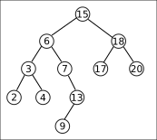
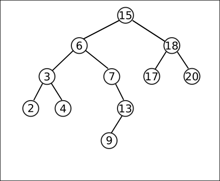

# Arbres Binaires de Recherche (ABR)

## Premier Exemple

{==D'après *Numérique et Sciences Informatiques, 24 leçons avec exercices corrigés*, Balabonski, Conchon, Filliâtre, Nguyen, Editions Ellipses==}

Imaginez une bibliothèque contenant un très très grand nombre de livres. Cette bibliothèque est organisée de la manière suivante :

* Il y a 17 576 pièces différentes.
* Chaque pièce est repérée par une suite de trois lettres, et dans cette pièce sont rangés tous les livres dont les titres commencent par ces trois lettres.
* Chaque pièce possède deux sorties, une à droite et une à gauche.
* La sortie de gauche mène **toujours** soit à une salle dont les trois lettres sont situées avant dans l'ordre alphabétique, soit nulle part.
* La sortie de droite mène **toujours** soit à une salle dont les trois lettres sont situées après dans l'ordre alphabétique, soit nulle part.

Une représentation de cette bibliothèque peut être donnée sous la forme d'un rabre binaire tel que le suivant :

{: style="width:50%; margin:auto;display:block;background-color: #d2dce0;"}


!!! question 
	=== "Enoncé"
		1. Dans cet arbre, préciser où sont situés les livres dont le titre commence par :
			1. `KNU`
			2. `UDP`
			3. `JET`
		2. Pourquoi y-a-t-il 17 576 pièces différentes ?
	
	=== "Réponses"	
		A venir !
		
Cette répartion, *pour peu qu'elle soit correctement faite* (c'est-à-dire que le choix des lettres soit pertinent), peut être incroyablement efficace. Dans **le meilleur des cas**, il ne faudra traverser qu'au maximum 15 salles pour trouver n'importe quel livre (si la bibliothèque est correctement organisée, quasiment chaque noeud aura 2 sorties, d'où une hauteur d'environ $log_2(17 576)$ soit environ $15$). 

Cette structure sera particulièrement utile pour effectuer des recherches : on l'appelle ainsi un {==**arbre binaire de recherche**==} (ou **BST**, *Binary Search Tree* en anglais).

!!! warning "Une mauvaise répartition"
	L'importance de l'organisation des salles est ici primordial, toutes les solutions ne se valant pas. Ci-dessous une répartition qui est dans le pire des cas : les sous-arbres gauche sont toujours vide (on appelle un tel type d'arbre un {==**peigne**==}).
	
	{: style="width:30%; margin:auto;display:block;background-color: #d2dce0;"}
	
	Dans cette situation, il faudra traverser les 17 576 pièces pour atteindre les livres dont le titre commence par `ZZZ`.
	
## Arbres Binaires de recherches et algorithmes

### Définition

!!! abstract "Arbre Binaire de Recherche (ABR)"

	Un {==**ABR**==} ou {==**Arbre Binaire de Recerche**==} est un arbre binaire vérifiant les propriétés suivantes :
	
	* les noeuds contiennent des valeurs appelées {==**clés**==} pouvant être comparées entre elles (nombres, chaînes de caractères, ...) ;
	* toutes les clés situées dans le **sous-arbre gauche** (resp. droit) d'un noeud sont **inférieures** (resp. supérieures) à la clé du noeud.
	
	
!!! example "Exemples"
	
	=== "Exemple 1"
	
		{: style="width:30%; margin:auto;display:block;background-color: #d2dce0;"}
		
		Il s'agit bien d'un ABR.
	
	=== "Exemple 2"
	
		{: style="width:30%; margin:auto;display:block;background-color: #d2dce0;"}
		
		Il s'agit bien d'un ABR. On peut remarquer qu'il possède le même ensemble de noeuds que le précédent, mais pas dans le même ordre.
		
	=== "Contre-exemple 1"
	
		{: style="width:30%; margin:auto;display:block;background-color: #d2dce0;"}
		
		Ce n'est pas un ABR, le noeud 5 étant dans le sous-arbre gauche du noeud 4, alors que les sous-arbres gauches doivent posséder des clés de valeurs inférieures.
		
	=== "Contre-exemple 2"
		
		{: style="width:30%; margin:auto;display:block;background-color: #d2dce0;"}

		Ce n'est pas un ABR tout simplement parce qu'il n'est pas binaire.
		
!!! question "Exercice"

	=== "Enoncé"
		Appliquer à la main les parcours préfixe, infixe et suffixe pour chacun des exemples d'ABR précédents. Que remarque-t-on ?
		
	=== "Réponse"
		A venir !
		
### Principe de l'implémentation en Python

Il n'y a aucune différence entre un ABR et un arbre binaire en terme d'implémentation, on pourra donc conserver :

* les objets `Node`, avec ou sans référence au noeud parent ;
* les fonctions `hauteur`, `taille` et  `est_vide` ;
* les fonctions `visitePrefixe`, `visiteInfixe` et ``visiteSuffixe`, mais on utilisera surtout les parcours infixes au vu de la remarque de l'exercice précédent.


### Recherches dans un ABR

#### Recherche d'une clé

Un ABR est spécialement conçu pour la recherche, particulièrement pour la recherche récursive. La méthdoe est la suivante :


!!! abstract "Algorithme de recherche"

	On compare la valeur cherchée avec la clé de la racine :
	
	* si elle est égale, la valeur est trouvée et on peut renvoyer `Vrai` ;
	* si elle est inférieure, alors on recherche récursivement dans le sous-arbre gauche ;
	* si elle est supérieure, alors on recherche récursivement dans le sous-arbre droit.
	
	Si on atteint une feuille dont la clé n'est pas la valeur recherchée, on sait alors que la valeur recherchée n'est la clé d'aucun nœud, elle ne figure donc pas dans l'arbre de recherche. Pratiquement dès qu'on tombe sur un arbre vide, on peut affirmer que la clé n'est pas dans l'arbre, et on renvoie `Faux`.
	
!!! tips "Implémentation en Python"

	Si on suppose que `tree` est est ABR, la  fonction de recherche de la clé `x` dans `tree` s'écrit :
	
	```` python
	def appartient(x, tree) :
		if tree == None :
			return False
		elif tree.valeur == x :
			return True
		elif x<tree.valeur :
			return appartient(x, tree.gauche)
		else :
			return appartient(x, tree.droit)
	````
	
En terme de complexité, dans le pire des cas (arbre peigne), la complexité dépend de la taille de l'arbre. On est donc dans une complexité linéaire (en $\mathscr{O}(n)$), ce qui n'est pas meilleur que la recherche dans une liste chaînée. Mais si l'arbre est {==**équilibré**==}, la recherche devient en $\mathscr{O}(log(n))$, ce qui est considérablement plus rapide.


#### Recherches de clés particulières 

!!! question "Exercice"

	=== "Enoncé"
		
		1. Où se trouve le plus petit élément d'un ABR ? En déduire l'implémentation en Python d'une fonction `minimum(tree)` renvoyant la clé minimale de l'ABR, et `None` si l'arbre est vide.
		2. Faire de même une fonction `maximum(tree)`.
		3. Quelles sont les complexités de ces deux fonctions dans le pire des cas ?
		
	=== "Soplutions"
		A venir !


#### Recherche du successeur d'une clé

On appelle {==**successeur**==} d'une clé donnée la valeur suivant cette clé lors du parcours infixe de cet arbre. Bien qu'il soit facile de déterminer un successeur en parcourant l'arbre, il existe un algorithme beaucoup plus rapide n'utilisant pas la comparaison des clés :

!!! question "Déterminer le successeur d'un noeud"
	
	=== "Enoncé" 
		
		On considère l'ABR suivant :
		
		{: style="width:50%; margin:auto;display:block;background-color: #d2dce0;"}
		
		1. Quel est le successeur de 15 ? de 17 ? de 13 ? de 20 ?
		2. Pour la structure d’ABR de l’arbre, que représente chacun de ces successeurs vis-à-vis du noeud initial ?
		3. Compléter la phrase suivante :
		
			!!! quote
			
				En utilisant la structure d’un ABR, on déduit la méthode suivante pour déterminer le successeur d’un noeud $A$ :
				
				* si le sous-arbre droit de $A$ est non vide, alors le successeur de $A$ est .......... de ce sous-arbre droit ;
				* si le sous-arbre droit de est vide et que $A$ possède un successeur (il n'est pas le maximum de l'arbre), alors ce successeur est le premier ........ de $A$ dont le ........... est aussi ancêtre de $A$.

!!! warning "Une limite ?"
	Il est à noter que cette méthode de recherche nécessite d'avoir un arbre doublement chaîné, c'est-à-dire où chaque noeud possède un lien vers son parent. Dans ce cas un algorithme exact de cette méthode est :
	
	````
	fonction successeur(x) :
		Si x.droit est non-vide
			Renvoyer minimum(x.droit)
		Sinon
			y = x.parent
			TantQue y est non-vide et x == y.droit Faire
				x = y
				y =  x.parent
			Retourner (y)	
	````
	
!!! question "Recherche du prédeceseur"

	=== "Enoncé"
	
		Comment rechercher efficacement le prédeceseur d'un noeud dans un ABR ?
		
	=== "Réponse"
	
		A venir !
	
### Insertion dans un ABR


Jusqu'à maintenant, nous avons travaillé en supposant que les arbres avec lesquels nous travaillons sont bien des ABR. Mais comment les créer ?

Cette quaestion revient à se demander comment ajouter un noeud à un ABR déjà existant, éventuellement vide. Cette oprétaion n'est pas évidente, car il faut conserver après l'ajout la structure d'ABR. Il existe plusieurs solutions, mais nous ne nous intereserons qu'à une seule : l'{==**insertion aux feuilles**==}.

Dans cette méthode, les nouveaux noeuds sont ajoutés en tant que feuilles du nouvel arbre, là où elles devraient être en conservant la structure d'ABR.

!!! question "Application manuelle"
	
	=== "Enoncé"
			
		{: style="width:50%; margin:auto;display:block;background-color: #d2dce0;"}
		
		On considère l'ABR ci-dessus :
		Insérer les noeuds de valeurs suivantes : 23, 19, 1 10, 8 et 5.

	=== "Solution"
		
		{: style="width:50%; margin:auto;display:block;background-color: #d2dce0;"}

L'insertion aux feuilles d'un élément dans un ABR se fait tout comme une recherche : on cherche la clé du nœud à insérer ; lorsqu'on arrive à une feuille, on ajoute le nœud comme fils de la feuille en comparant sa clé à celle de la feuille : si elle est inférieure, le nouveau nœud sera à gauche ; sinon il sera à droite. 

Un algorithme possible est :

````
fonction Insertion(tree, elem)
	Si tree est vide
		retourner Noeud(elem,None,none)
	Sinon 
		Si elem < tree.valeur
			retourner Noeud(tree.valeur,Insertion(tree.gauche, elem),tree.droit)
		Sinon
			retourner Noeud(tree.valeur,tree.gauche,Insertion(tree.droit, elem))
````

!!! question "Implémentation en Python"

	=== "Enoncé"
		Implémenter une fonction `insertion(tree, elem)` qui insère aux feuilles l'élement `elem` dans l'ABR `tree`.
		
	=== "Solution"
		A venir !
		
!!! question "Exercice"
	
	=== "Enoncé"
		On considère les listes `l1 = [15,12,7,8,1,23,13]` et `l2 = [7,1,23,13,15,8,12]`.
		
		1. Créer à la main les ABR représentants ces listes en utilisant la méthode de l'insertion aux feuilles.
		2. Implémenter ces ABR en Python, et calculer leurs tailles et leurs hauteur.
		3. Effecvtuer un parcours infixe sur chacun de ces ABR. Que remarque-t-on ?
		
	=== "Solution"
		A venir

!!! question "Une autre forme de tri ?"

	=== "Enoncé"
		En s'aidant de l'exercice précédent, créer une fonction `triABR(liste)` qui trie une liste qui lui est pasée en argument en utilisant un ABR.
		
	=== "Solution"
		A venir

