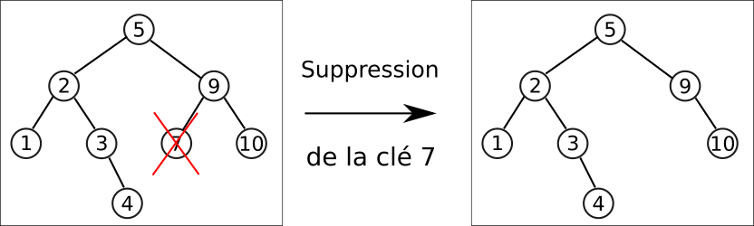
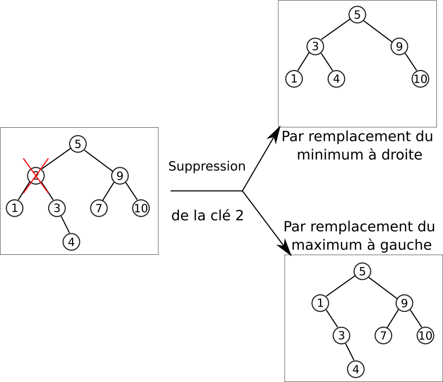

# Encapsulation d'un ABR en Python

Dans cette partie nous travaillerons dans un fichier `ABR.py` qui contiendra les classes, méthodes et fonctions nécessaires.

## Classes Node et ABR

Comme un ABR est avant tout un arbre binaire, nous allons utiliser une construction similaire pour la classe `Node` à celle déjà effectuée pour les arbres binaires :

```` python
class Node :
	def __init__(self, valeur, gauche = None, droit = None, parent = None) :
		self.valeur = valeur
        self.gauche = gauche
        self.droit = droit
        self.parent = parent
````

!!! question "Méthode `estFeuille`"
	 
	=== "Énoncé"
	 
		Ajouter une méthode `estFeuille` renvoyant un booléen permettant de savoir si le nœud en question est une feuille de l'arbre.
		
	=== "Solution"
	
		A venir !
		
Une fois cette classe définie, nous allons définir une classe `ABR` qui encapsulera la totalité de l'arbre et des méthodes qui lui sont associées (avec quelques exceptions toutefois pour ne pas surcharger la compréhension des éléments suivants).

````python
class ABR :
    def __init__ (self, racine = None) :
        self.racine = racine
````

!!! question "Méthode `est_vide`"

	=== "Enoncé"
	 
		Ajouter une méthode `est_vide` à la classe `ABR` renvoyant un booléen permettant de savoir si l'arbre est vide
		
	=== "Solution"
	
		A venir !
		
!!! question "Méthode `hauteur`"

	=== " Enoncé"
	 
		1. Copier-coller la fonction `hauteur`, déjà vue dans la partie [sur les arbres binaires](Def_Arbres.md#implementation-darbres-en-python){: target="_blank"}, **en-dehors des classes `ABR` et `Node`**.
		2. Créer une méthode `hauteur` à la classe `ABR` renvoyant la hauteur de l'arbre, et utilisant la fonction `hauteur` ci-dessus. Vous pouvez utiliser le code suivant permettant d'implémenter l'ABR représenté ci-dessous pour tester vos différentes méthodes :
		
		=== "Arbre"
		
			{: style="width:50%; margin:auto;display:block;background-color: #d2dce0;"}
		
		=== "Code"
		
			```` python
			if __name__ == "__main__" :
				n1 = Node(1)
				n2 = Node(3)
				n3 = Node(2, n1, n2)
				n1.parent = n3
				n2.parent = n3
				n4 = Node(10)
				n5 = Node( 7)
				n6 = Node(9,n5, n4)
				n4.parent=n6
				n5.parent = n6
				n7 = Node(5, n3, n6)
				n3.parent = n7
				n6. parent = n7
				n8 = Node(4)
				n2.droit = n8
				n8.parent = n2
				
				tree = ABR(n7)
			````
		
	=== "Solution"
	
		A venir !
		


## Visualisation d'un ABR

### Sous forme de texte

L'objectif est de représenter un ABR sous la forme d'une chaîne de caractères multilignes, telle que celle-ci :

```` python
5
  2
    1
    3
      X
      4
  9
    7
    10
````

Dans cette représentation :

* Chaque niveau est indenté de deux espaces supplémentaires par rapport au suivant ;
* les nœuds sont affichés, puis leur sous-arbre gauche s'il existe, puis leur sous-arbre droit s'il existe ;
* si un sous-arbre n'existe pas, il est remplacé par `X`, sauf dans le cas des feuilles où les sous-arbres ne sont pas affichés.

!!! question "Méthode `toString` "
	=== "Énonce"
		Ajouter une méthode `toString` à la classe `Node` qui renvoie une chaine de caractères correspondant à l'affichage précédent.
		
		A titre d'aide, la méthode `toString` prend, en plus de l'argument obligatoire `self`, un argument `shift` représentant le décalage de caractère déjà effectué. La représentation d'un nœud sera alors donnée par  :
		
		```` python
		representation = shift + str(self.valeur)+"\n"
		````
		auquel il faudra ajouter le cas échéant la représentation du sous-arbre gauche puis la représentation du sous-arbre droit.
		
		L'appel `n7.toString()` doit renvoyer la bonne représentation.
		
	=== "Solution"
	
		A venir !
		
!!! question "Méthode DUNDERS `__str__`"
	=== "Énonce"
		Ajouter une méthode DUNDERS `__str__` à la classe `ABR` qui renvoie la chaine de caractères correspondant à l'affichage de l'arbre.
		
	=== "Solution"
	
		A venir !
	
### Avec le module Graphviz

Bon, ok, nous avons une représentation, mais elle est loin d'être lisible...

Heureusement il existe un module python, le module `graphviz`, qui va nous permettre de convertir notre ABR en un fichier `png` plus lisible. L'objectif n'étant pas de comprendre comment fonctionne `graphviz`, voici les codes nécessaires :

1. Commençons par [télécharger](https://gitlab.com/api/v4/projects/4207231/packages/generic/graphviz-releases/7.0.4/windows_10_msbuild_Release_graphviz-7.0.4-win32.zip){: target="_blank"} et décompacter le programme `Graphviz` dans le dossier `Documents`
2. Installez le module `graphviz` dans `Thonny`.
3. Dans le fichier Python contenant la classe `ABR`, ajoutez les lignes suivantes (Si le dossier `bin` contenant le programme `dot.exe` correspond bien au chemin donné :

	```` python
	import os

	os.environ['PATH'] += os.pathsep +"P:\\Documents\\Graphviz\\Graphviz\\bin"

	```` 
2. Importez la classe `Digraph` depuis ce module en ajoutant :

	```` python
	from graphviz import Digraph
	````
3. Ajoutez à la classe `Node` la méthode suivante :

	```` python
	def to_image(self, graphe, etiquette = None) :
        nœud = str(self.valeur)
        graphe.node(nœud)
        if not(self.parent is None) :
            graphe.edge(str(self.parent.valeur), nœud, label=etiquette)
        if not(self.gauche is None) :
            self.gauche.to_image(graphe, "G")
        if not(self.droit is None) :
            self.droit.to_image(graphe, "D")
	````
4. Ajoutez à la classe `ABR` la méthode suivante :

	```` python
	def to_image(self, title="arbre") :
		if not(isinstance(title, str)) :
            title = 'arbre'
        graphe=Digraph()
        self.racine.to_image(graphe)
        graphe.render(title, view = True, format='png')
	````
5. Testez la méthode `to_image` sur l'objet `tree`. Elle doit vous donner un PDF nommé `arbre.pdf` (ou autre si vous avez renseigné l'argument optionnel `title`) contenant une représentation de l'ABR.

	
		
## Méthodes de la classe ABR

### Méthode search

La fonction `appartient(x, tree)` que nous avons vu dans la [partie précédente](Def_Arbres.md#recherche-dune-cle) n'est pas directement utilisable en tant que méthode, mais nous allons nous en inspirer :

!!! question "Méthodes `search` "

	=== "Énoncé"
		
		1. Créer une méthode `search` pour la classe `Node` permettant de savoir si une valeur `x` passée en argument appartient au sous-arbre ayant pour racine le nœud actuel. **Cette méthode renverra le nœud contenant la clé, ou `None` si la clé n'est pas trouvée.**(*Indice : un nœud ne peut pas être égal à `None`, ce qui fait la différence par rapport à la fonction `appartient`*) 
		2. Créer une méthode `search` pour la classe `ABR` permettant de savoir si une valeur `x` passée en argument appartient à l'ABR. **Cette méthode renverra le nœud contenant la clé, ou `None` si la clé n'est pas trouvée.**
		
	=== "Solution"
	
		A venir !

### Méthodes minimum et maximum

!!! question "Méthodes `minimum` et `maximum`"

	=== "Énoncé"
	
		1. En s'inspirant de la fonction `minimum` déjà étudiée, créer une méthode minimum pour la classe `Node`, qui **renvoie le nœud de clé minimale** (*Indice : il faudra arrêter la recherche quand le sous-arbre gauche est vide), puis une pour la classe `ABR`.
		2. Faire de même pour le maximum.
		
	=== "Solution"
		
		A venir !
	
		

### Méthodes `successor` et `predecessor`

Les méthodes de recherches de successeurs et de prédécesseurs ne peuvent pas être résolues récursivement. Il faudra donc effectuer une boucle `TantQue` pour rechercher l'un ou l'autre, tel que nous l'avons vu dans cet [algorithme](Def_Arbres.md#recherche-du-successeur-dune-cle){: target="_blank"}

!!! abstract "Recherche du successeur"

	On va implémenter une méthode `successor` pour la classe `ABR`, qui prend en argument la clé du nœud dont on cherche le successeur.

	=== "Etape 1"
	
		La première étape est de chercher le nœud contenant la clé passée en argument. Si bien sûr la clé n'est pas trouvée, on renvoie `None`.
		```` python 
		def successor(self,x) :
			n = self.search(x)
			if n is None :
				return None
			
		````
		
	=== "Etape 2"
	
		Sinon, si le sous-arbre droit de ce nœud n'est pas vide, on renvoie le minimum de ce sous-arbre.
		
		```` python 
		def successor(self,x) :
			n = self.search(x)
			if n is None :
				return None
			else :
				if not(n.droit is None) :
					return n.droit.minimum()
		````

	=== "Etape 3"
	
		Dans les autres cas, il faudra remonter les ancêtres jusqu'à trouver le premier ancêtre dont le fils gauche est aussi un ancêtre du nœud de clé cherchée.
		```` python 
		def successor(self,x) :
			n = self.search(x)
			if n is None :
				return None
			else :
				if not(n.droit is None) :
					return n.droit.minimum()
				else :
					ancetre = n.parent
					while not(ancetre  is None) and (n == ancetre.droit) :
						n = ancetre
						ancetre = n.parent
					return ancetre
		````


!!! question "Méthode `predecessor`"

	=== "Énoncé"
	
		Sur le même modèle que précédemment, implémenter une méthode `predecessor`  pour la classe `ABR`qui donnera le prédécesseur d'une clé `x` passée en argument.
				
	=== "Solution"
		
		A venir !

### Méthode insert

!!! question "Méthode `insert`"

	=== "Énoncé"
	
		1. Sur le modèle de l'[algorithme](Def_Arbres.md#insertion-dans-un-abr){: target="_blank"}, écrire une méthode `ìnsert` pour la classe `Node` permettant d'insérer la clé passée en argument tout en conservant la structure d'ABR, et en respectant les conditions suivantes :
		
			* si une clé est déjà présente, la nouvelle clé sera insérée dans le sous-arbre droit.
			* il faudra penser à mettre à jour le père du nouveau nœud créé ! (*Indice :le père du nœud crée est l'objet courant !*)
			
		2. Créer une méthode `insert ` pour la classe `ABR`.
		
	=== "Solution"
		A venir !
		

Ça-y-est, nous avons maintenant une classe `ABR` qui peut être totalement utilisée de manière indépendante ! Il est désormais possible de créer un ABR vide, d'y insérer des éléments, d'effectuer des recherches, etc. Ainsi le code suivant permet facilement d'itérer sur une liste pour créer un ABR :

```` python
tree = ABR()
for elem in [15,12,7,8,1,23,13] :
	tree.insert(elem)
tree.to_image()
````

## Suppression d'une clé d'un ABR (hors programme)

Pour l'instant, nous avons vu comment ajouter un élément à un ABR, mais nous n'avons pas encore abordé la question de la suppression d'un élément. Il s'agit d'une question bien plus complexe, dont je vais vous présenter les grandes lignes ici, bien qu'elles soient hors-programme (et donc il n'est pas du tout nécessaire de tout comprendre !)

Lorsqu'on veut supprimer une clé d'un ABR, plusieurs situations peuvent se produire :

1. La clé n'est pas présente dans l'ABR, donc il n'y a rien à faire.
2. La clé est celle d'une feuille. Dans ce cas la suppression est simple : on passe à `None` le fils correspondant du parent, ce qui a pour effet de supprimer le nœud.

	{: style="width:50%; margin:auto;display:block;background-color: #d2dce0;"}
	
3. La clé est celle d'un nœud possédant un seul fils. Dans ce cas, on remplace le nœud supprimé par son fils, ce qui conserve les propriétés de l'ABR.

	{: style="width:50%; margin:auto;display:block;background-color: #d2dce0;"}
	
4. Si la clé possède deux fils, alors il y a deux possibilités :
	
	* on remplace le nœud par le minimum du sous-arbre droit, qui est le successeur du nœud supprimé ;
	* ou on remplace par le maximum du sous-arbre gauche, qui est le prédécesseur du nœud supprimé.
	
	{: style="width:60%; margin:auto;display:block;background-color: #d2dce0;"}
	

Pour réaliser une telle implémentation, il faut donc faire un choix, et nous choisissons de remplacer le nœud supprimé par le minium à droite. Pour simplifier la lecture du code, on séparera dans la classe `Node` en différentes méthodes :


```` python
def supprimer(self, valeur):
	if valeur < self.valeur:
		self.gauche = self.gauche.supprimer(valeur)
		return self
	elif valeur > self.valeur:
		self.droit = self.droit.supprimer(valeur)
		return self
	else:
		return self.supprimerNoeudCourant()
				
def supprimerNoeudCourant(self):
	if self.estFeuille():
		return None
	elif self.gauche is None:
		return self.droit
	elif self.droit is None:
		return self.gauche
	else:
		## on cherche le nœud minimum du sous-arbre droit
		nœudMin = self.droit.minimum()
		## On met à jour la valeur du nœud courant
		self.valeur = nœudMin.valeur
		## On supprime le nœud minimal, qui ne possède pas de fils gauche (mais peut
		## éventuellement posséder une descendance droite
		nœudMin.parent.droit = nœudMin.droit
		## et on retourne le nœud courant
		return self      

````

Il ne reste plus qu'à ajouter la méthode suivante à la classe `ABR` :

```` python
def supprimer(self, valeur):
	if self.est_vide():
		return
	else:
		self.racine = self.racine.supprimer(valeur)
````