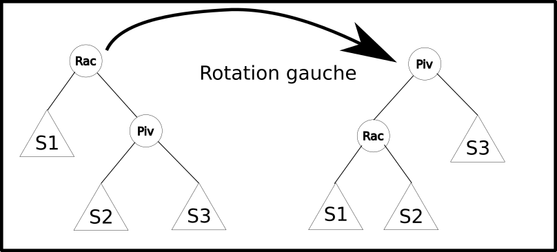
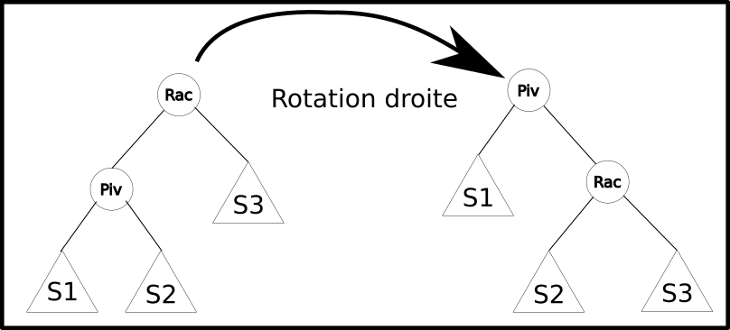
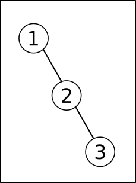
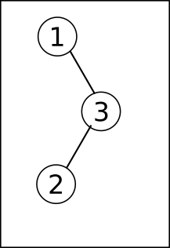
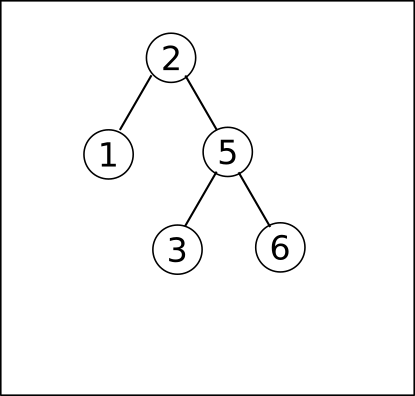

# Equilibrage des arbres

## Arbres déséquilibrés ?

!!! question "Création d'arbres déséquilibrés"

	=== "Enoncé"
	
		1. Créer quatre ABR `tree1`, `tree2`, ...,  à partir des listes suivante :
		
			```` python
			l1 = [5, 2, 11, 3, 7, 13, 9]
			l2 = [7, 3, 11, 2, 5, 9, 13]
			l3 = [2, 3, 5, 11, 7, 13, 9]
			l4 = [2, 3, 5, 7, 9, 11, 13]
			````
		2. Que peut-on dire des quatre listes précédentes.
		3. Afficher les 4 arbres obtenus.
		4. En considérant que le temps de recherche dans un ABR est directement proportionnel à la hauteur du nœud recherché, le temps moyen pour trouver dans `tree1` :
			
			* le nœud 5 est de 1 ;
			* les nœuds 2 et 11 de 2 ;
			* les nœuds 3, 7 et 13 de 3 ;
			* le nœud 9 de 4.
			
			le temps moyen de recherche sur cet arbre est donc $\dfrac{1+2\times 2 + 3\times 3 + 4}{7} = \dfrac{18}{7}$.
			
			Calculer de même le temps moyen pour les ABR `tree2`, `tree3` et `tree4`.
			Que peut-on en conclure ?
			
		5. On considère l'arbre équilibré `tree2`.  Insérer maintenant les éléments suivants dans l'arbre : 17, 14, 15, 16. Comment est l'arbre obtenu ?
		
	=== "Solution"
	
		A venir !
		


On comprend aisément qu’un arbre équilibré (solution 2) donne en moyenne de meilleurs résultats que tout autre arbre, et qu’un arbre dégénéré (solution 4) donne
des résultats plus mauvais que toute autre représentation. La notion formelle {==**d’arbre équilibré**==} (*balanced tree* chez [Donald Knuth](https://fr.wikipedia.org/wiki/Donald_Knuth){: target="_blank"}) n’est pas au programme, mais elle peut être abordée intuitivement.

Sur un ABR équilibré, la recherche d’un élément est en moyenne en $log_2(n)$, comme avec une recherche par dichotomie dans une liste. On peut alors se poser la question de l’intérêt d’utiliser un ABR. La réponse tient dans le temps mis à ajouter / supprimer un élément : dans une liste, on est en $\mathscr{O}(n)$ (complexité linéaire), alors qu’on est en $\mathscr{O}(log_2(n))$ dans un ABR (complexité logarithmique).

Aussi, lorsqu’on doit stocker une collection d’éléments ordonnés, une liste Python peut être utilisée si la collection évolue peu ou bien si les éléments sont stockés dans l’ordre du tri. Mais si la collection doit être régulièrement modifiée et que les recherches par rapport au critère de tri sont fréquentes, on privilégie les ABR.

Il est donc particulièrement important que notre ABR soit équilibré, et surtout que les insertions/délétions conservent la propriété d'équilibrage de ces ABR. Il existe plusieurs techniques permettant d'obtenir des *ABR* équilibrés :

* les arbres AVL ;
* les arbres rouge-noir ;
* les arbres 2-3 ;
* les arbres 2-3-4 ;
* les B-arbres.

## Les arbres AVL

### Présentation des AVL 
En informatique théorique, les arbres AVL ont été historiquement les premiers arbres binaires de recherche **automatiquement équilibrés**.

La dénomination &laquo; arbre AVL &raquo; provient des noms respectifs de ses deux inventeurs, respectivement Georgii Adelson-Velsky et Evguenii Landis, qui l'ont publié en 1962 sous le titre *An Algorithm for the Organization of Information*. 

Dans un arbre AVL, les hauteurs des deux sous-arbres d'un même nœud diffèrent au plus de un, et cette propriété est conservée dynamiquement au moment de l'insertion ou de la délétion d'un nouveau nœud. La recherche, l'insertion et la suppression sont toutes en $\mathscr{O}(log _{2}(n))$ dans le pire des cas. 

Cependant les mécanismes d'insertion et de délétions sont modifiés par rapport à ceux déjà travaillés : ils nécessitent des {==**rotations droites et gauches**==}.

### Rotations droites et gauches

Le mécanisme de rotation gauche consiste à remplacer un nœud {==**racine**==} par son nœud droit (appelé {==**pivot**==}).

{: style="width:50%; margin:auto;display:block;background-color: #d2dce0;"}

Après l'opération :

* les nœuds du sous-arbre `S1` demeurent bien inférieurs au nœud `Racine` ;
* les nœuds du sous-arbre `S2`, qui étaient tous supérieurs à `Racine` tout en étant inférieurs à `Pivot`, le demeurent toujours ; 
* les nœuds du sous-arbre `S2` demeurent bien supérieurs au nœud `Pivot`.

Ainsi par une rotation gauche, le nouvel arbre obtenu est aussi un ABR.

Une version algorithmique de cette implémentation est :

````
Pivot <- Racine.droit
Racine.droit <- Pivot.gauche
Pivot.gauche <- Racine
Racine <- Pivot
````

!!! question "Implémentation"

	=== "Enoncé"
	
		1. Créer une méthode `rotation_gauche` pour la classe `Node`. Attention ! Pour pouvoir implémenter correctement cette méthode, **il ne faudra pas oublier de mettre à jour les parents de chaque nœud !**
		2. Créer de mémé une méthode `rotation_droite` pour la classe `Node`, en s'aidant du schéma suivant :
			
			{: style="width:60%; margin:auto;display:block;background-color: #d2dce0;"}
			
	=== "Solution"
	
		A venir !
		
### Techniques d'équilibrages :


!!! question "Application manuelle"

	=== "Enoncé"
	
		1. Appliquer **à la main** une rotation gauche sur la racine de l'arbre suivant. Le résultat est-il plus équilibré ?
		
			{: style="width:20%; margin:auto;display:block;background-color: #d2dce0;"}
		
		2. Appliquer **à la main** une rotation gauche sur la racine de l'arbre suivant. Le résultat est-il plus équilibré ?
		
			{: style="width:20%; margin:auto;display:block;background-color: #d2dce0;"}
			
		3. Appliquer une rotation droite sur le nœud 3 de l'arbre précédent, puis une rotation gauche sur la racine de l'arbre obtenu. Que peut-on en conclure ?
		
	=== "Solution"
	
		A venir !
		


En pratique on équilibrera un arbre à chaque insertion et à chaque délétion. Pour ce faire, une fois le nœud inséré, on regardera la hauteur de chaque sous-arbre gauche et droit, et si ces hauteurs diffèrent de plus de 1, on effectuera les rotations nécessaires.

!!! question "Application manuelle 2"	

	=== "Enoncé"
	
		1. On considère l'arbre suivant :
		
			{: style="width:50%; margin:auto;display:block;background-color: #d2dce0;"}
			
			Est-il équilibré au sens donné ?
		
		2. On insère maintenant la valeur 4. L'arbre est-il équilibré ?
		3. Appliquer une rotation gauche sur la racine. Cela suffit-il pour que le résultat soit équilibré ?
		4. En repartant de l'arbre de la question 2, quelle rotation faudrait-il faire avant d'appliquer une rotation gauche sur la racine afin d'obtenir un arbre équilibré ?
		
	=== "Solution"
	
		A venir !
		
L'algorithme réel d'équilibrage étant un peu trop complexe pour notre niveau, voici les codes à insérer dans les différentes classes pour obtenir un AVL :

* dans la classe `ABR` :

	```` python
	def insererAVL(self, valeur):
		if self.estVide():
			self.racine = Node(valeur)
		else:
			self.racine = self.racine.insererAVL(valeur)
	````
	
* dans la classe `Node` :

	```` python
	
	def insererAVL(self, valeur):
		if valeur < self.valeur:
			if self.gauche is None:
				self.gauche = Node(valeur, parent=self)
				return self
			else:
				self.gauche = self.gauche.insererAVL(valeur)
				return self.equilibrer()
		elif valeur > self.valeur:
			if self.droit is None:
				self.droit = Node(valeur, parent=self)
				return self
			else:
				self.droit = self.droit.insererAVL(valeur)
				return self.equilibrer()
		else:
			return self
			
	def equilibrer(self):
		hauteur_gauche = hauteur(self.gauche)
		hauteur_droit = hauteur(self.droit)
		if hauteur_gauche - hauteur_droit == 2:
			hauteur_gauche_gauche = hauteur(self.gauche.gauche)
			hauteur_gauche_droit = hauteur(self.gauche.droit)
			if hauteur_gauche_gauche > hauteur_gauche_droit:
				return self.rotation_droite()
			else:
				self.gauche = self.gauche.rotation_gauche()
				return self.rotation_droite()
		elif hauteur_gauche - hauteur_droit == -2:
			hauteur_droit_droit = hauteur(self.droit.droit)
			hauteur_droit_gauche = hauteur(self.droit.gauche)
			if hauteur_droit_droit > hauteur_droit_gauche:
				return self.rotation_gauche()
			else:
				self.droit = self.droit.rotation_droite()
				return self.rotation_gauche()
		else:
			return self
			
	def hauteur(self):
		hauteur_gauche = hauteur(self.gauche)
		hauteur_droit = hauteur(self.droit)
		return 1 + max(hauteur_gauche, hauteur_droit)
	````
	
Désormais, en créant un ABR et en utilisant la méthode `insertionAVL`, l'arbre obtenu doit être automatiquement équilibré.