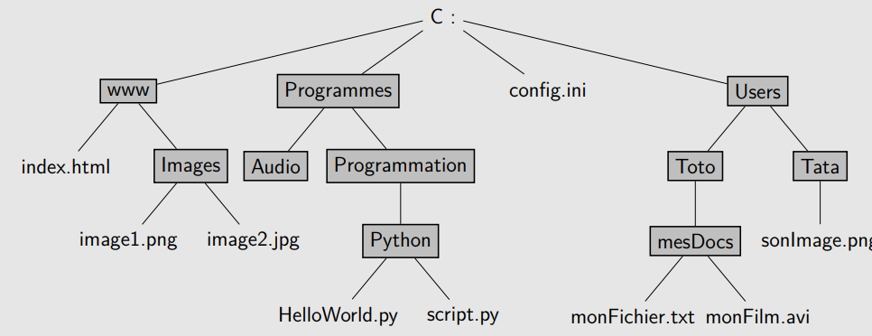
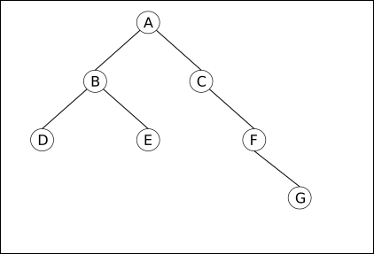

# Arbres Binaires : définitions et propriétés

Les listes, piles et files que nous avons croisé jusqu'ici sont utilisées pour représenter de structures pouvant être énumérées séquentiellement. Elle sont particulièrement efficcaces lorsqu'il s'agit d'accéder au premier élément (ou au dernier selon l'implémentation). Elles ne le sont pas contre pas quand il s'agit **d'accéder à une élément à une position arbitraire** dans la structure, car il faut parcourir toute la liste/pile/file jusqu'à la position recherchée, ce qui donne un temps d'accès proportionnel à la taille de la structure (donc en $\mathbb{O}(n)$).

## Structures arborescentes

Les {==**structures arborescentes**==}, c'est-à-dire sous forme d'arbre, sont une autre forme de **structures chaînées** dans laquel l'accès à un élément se fait potentiellement bien plus rapidement qu'avec les listes chaînées.

Ces types de structures arborescentes sont omniprésentes en informatiques, ne serait-ce que par l'organisation du système de fichier :

{: style="width:50%;"}

!!! abstract "Structure arorescente"
	Une {==**structure arborescente**==} est une structure chaînéee construite à partir d'un point de départ qui se scinde en plusieurs branches à chaque étapes.


## Arbres Binaires

### Définitions et vocabulaire

!!! abstract "définition : Arbre Binaire"
	Un {==**arbre binaire**==} est un cas particulier de structure arborescente ou chaque position ouvre sur exaactement deux branches.
	Plus précisemment, un {==**arbre binaire**==} est un ensemble fini de {==**noeuds**==} correspondant à l'un des deux cas suivants :
	
	* Soit l'arbre est vide, c'est-à-dire qu'il ne contient aucun **noeud**.
	* Soit l'arbre n'est pas vide, et ses **noeuds** sont structurés de la façon suivante :
		* un noeud est appelé {==**la racine**==} de l'arbre ;
		* les noeuds restants sont séparés en deux sous-ensembles qui forment récursivement {==**deux sous-arbres binaires**==} appelés respectivemment **sous-arbre gauche** et **sous-arbre droit** ;
		* la racine est reliée à chacune des racines de ces sous-arbres gauches et droits (à conditions qu'ils ne soient pas vides).
		
	
		
!!! example "Exemples et contre-exemples d'arbres binaires"

	<p align="center">
	{:	style="width:30%; background-color: #546d78;"}
	</p>
	
	L'arbre de gauche n'est pas un arbre binaire : 6 sous-arbres sont-rattachés à $A$, les sous-arbres de racines $B,C,D,E,F,G$.
	
	L'arbre de droite est bien un arbre binaire, de chaque noeud partent deux sous-arbres, éventuellement vides.
	
		
!!! abstract "Vocabulaire des arbres"

	On considère l'arbre binaire ci-dessous :
	
	<p align="center">
	{: style="width:30%; background-color: #546d78;"}
	</p>
	
	* La {==**taille de l'arbre**==} est $4$, c'est le nombre de noeuds qui le compose.
	* Le noeud {==**racine**==} est le noeud $1$.
	* Le sous-arbre gauche à partir de $1$ contient deux noeuds ($2$ et $3$), le sous-arbre droit un seul ($4$).
	* le noeud $1$ possède deux {==**fils**==} : son {==**fils gauche**==} est $2$ et son {==**fils droit**==} est $4$.
	* Le sous-arbre gauche à partir de $2$ n'est pas vide (il contient le noeud $3$), le sous-arbre droit lui l'est.
	* Le noeud {==**parent**==} du noeud $3$ est le noeud $2$.
	* Les deux sous-arbres à partir de $3$ sont vides, touts comme ceux de $4$. On dira que les noeuds $3$ et $4$ sont des {==**feuilles**==} de l'arbre.
	
!!! tips "Remarques"

	Les arbres binaires sont utilisés pour traiter des données. Chaque noeud peut donc être représenté par la donnée qu'il contient. Ainsi, dans les arbres ci-dessus :

	* un contient des valeurs numériques ($1$, $2$, $3$ et $4$) ;
	* l'autre contient des caractères ($A$ à $L$).
	
	

!!! question "Exercice"
	Pour chacun des arbres binaires ci-dessous, préciser sa taille, sa racine ainsi que les noeuds feuilles :
	
	=== "Enoncé"
	
		<div class="container">
		<div class="column2">
		<h6>Arbre 1</h6>
		
		
		{: style="width:90%; background-color: #546d78;"}
			
		</div>
		<div class="column2">
		<h6>Arbre 2</h6>
		
		{: style="width:90%; background-color: #546d78;"}
			
		</div>		 
		</div>
		
	=== "Solution"
	
		A venir !
		
!!! question "Exercice"

	=== "Enoncé"
		
		Dessiner tous les arbres  binaires ayant respectivement 3 et 4 noeuds.
		
	=== "Solution"
	
		A venir.
		
!!! question "Exercice"
	
	=== "Enoncé"
		
		Sachant qu'il y a 1 arbre binaire vide, 1 arbre binaire contenant 1 noeud, 2 arbres binaires contenant 2 noeuds, 5 arbres binaires contenant 3 noeuds, et 14 arbres binaires contenant 4 noeuds, caclculer le nombre d'arbres binaires contenant 5 noeuds, sans chercher à les construire tous.
		
	=== "Solution"
	
		A venir.
		
		
### Hauteur d'un arbre

!!! abstract "Définition : hauteur d'un arbre"

	La {==**hauteur d'un arbre**==} est égale au nombre maximal de noeuds reliant la racine aux feuilles, les extrémités étant comprises.
	
	Si un arbre est de taille $N$ et de hauteur $h$, on a la relation suivante :
	
	$$
	h \leqslant N \leqslant 2^h-1
	$$
	
	
!!! note "Démonstration"

	=== "Inégalité $h\leqslant N$"
		Dans le cas d'un arbre ayant à chaque noeud au moins un de ses sous-arbre vide :
				
		<p align="center">
		{: style="width:20%; background-color: #546d78;"}
		</p>
		
		Il est évident que dans ce cas la hauteur de l'arbre est égale à sa taille, d'où $h\leqslant N$.
		
	=== "Inégalité $N\leqslant 2^h-1$"
		dans le cas d'un {==**arbre binaire parfait**==}, c'est-à-dire dont toutes les feuilles sont situées à la même distance de la racine :
		
		<p align="center">
		{: style="width:30%; background-color: #546d78;"}
		</p>
		
		La taille est alors égale à 
		
		$$
		\begin{align}
		N&= 1 + 2 + 2^2 + \dots +2^{h-1}\\
		&= \dfrac{2^h-1}{2-1}\\
		N&= 2^h-1
		\end{align}		
		$$
		
		D'où l'inégalité recherchée.
		
!!! tips "Hauteur et récursivité"

	La hauteur d'un arbre peut-aussi être définie récursivement :
	
	* la hauteur d'un arbre vide est 0 ;
	* la hauteur d'un arbre est égale à un plus  le maximum de la hauteur des deux sous-arbres de la racine :
	
		$$
		h = 1 + max(hauteur(Gauche), hauteur(Droit))
		$$
		
### Implémentation d'arbres en Python

Il existe bien entendu différentes façons d'implémenter une structure d'arbre binaire en Python. Cependant, la méthode la plus simple est d'utiliser le *paradigme Objet* afin de représenter des noeuds :

```` python
class Node() :
	def __init__(self, valeur, gauche, droit)
		self.valeur=valeur
		self.gauche = gauche
		self.droit = droit
		
````
un sous-arbre vide étant représenté par la valeur `None`.


!!! example "Exemple d'utilisation des objets `Node`"

	On considère l'arbre binaire ci-dessous :
		
	<p align="center">
	{: style="width:30%; background-color: #546d78;"}
	</p>
	
	Une représentation en Python de cet arbre est alors :
	```` python
	tree = Node(1,
			Node(2,
				Node(3, None, None),
				None),
			Node(4, None, None))
	````
	
!!! question "Exercice"

	=== "Enoncé"
		
		Donner le code de représentation de chacun des arbres ci-dessous en Python :
		
		<div class="container">
		<div class="column2">
		<h6>Arbre 1</h6>
		
		
		{: style="width:90%; background-color: #546d78;"}
			
		</div>
		<div class="column2">
		<h6>Arbre 2</h6>
		
		{: style="width:70%; background-color: #546d78;"}
			
		</div>		 
		</div>
	
	=== "Solution"
	
		A venir
		
!!! question "Exercice : Fonction `taille`"

	=== "Enoncé"
	
		Coder une fonction `taille(t)` calculant la taille d'un arbre `t` qui lui est passé en argument (*indice : récursivité*).
		
	=== "Solution"
	
		A venir.

