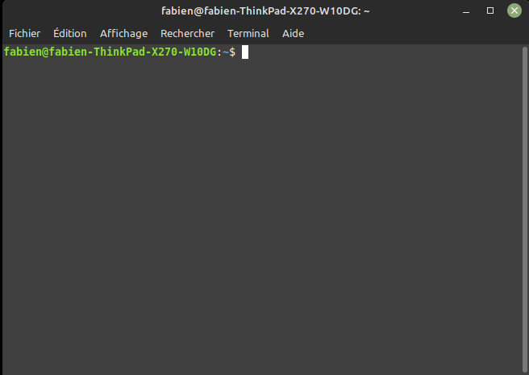

# Système d'exploitation GNU/Linux 

## Systèmes d'exploitations :

### Définition et historique

D'après la définition de [Wikipedia](https://fr.wikipedia.org/wiki/Syst%C3%A8me_d%27exploitation){: target="_blank" } :

&laquo; En informatique, un système d'exploitation (souvent appelé *OS* — de l'anglais *operating system*) est un ensemble de programmes qui dirige l'utilisation des ressources d'un ordinateur par des logiciels applicatifs.

Il reçoit des demandes d'utilisation des ressources de l'ordinateur — ressources de stockage des mémoires (par exemple des accès à la mémoire vive, aux disques durs), ressources de calcul du processeur central, ressources de communication vers des périphériques [...] ou via le réseau — de la part des logiciels applicatifs. Le système d'exploitation gère les demandes ainsi que les ressources nécessaires évitant les interférences entre les logiciels. &raquo; 


!!! abstract "Historique"

	Les années 1960 ont constitué un tournant pour les système d'exploitation. Dans le cadre du projet *MAC* au *MIT* (Massachusset Institute of Technology), le système d'exploitation **CTTS** (*Compatible Time Sharing System*)est publié en 1961. C'est l'un des tout premiers système d'exploitation **à temps partagé**, permettant à plusieurs utilisateurs d'utiliser **un ordinateur en même temps**. Cette **apparente simultanéité dans l'exécution des programmes** a permis de se diriger vers l'informatique moderne. 
	
	Le *MIT* s'associa aux laboratoires *BELL* et à *General Electric* pour créer **Multics** qui était un système innovant, héritant de **CTTS**, et était l'un des premier système d'exploitation avec système de fichier hiérarchique, temps partagé, multitâche préemptif (c'est-à-dire la capacité d'arrêter ou d'exécuter une tâche planifiée en cours), multiutilisateur, avec une prise en compte de la sécurité. La première version sortit en 1965.

	En 1969, les laboratoires BELL sortirent du projet et deux de leurs plus brillants informaticiens, [Ken THOMPSON](https://fr.wikipedia.org/wiki/Ken_Thompson){: target="_blank"} et [Dennis RITCHIE](https://fr.wikipedia.org/wiki/Dennis_Ritchie){: target="_blank"} qui avaient travaillé sur le projet MULTICS en conçurent une version simplifiée (ils considéraient MULTICS inutilement complexe) qu'ils nommèrent initialement UNICS (*UNiplexed Information and Computing Service*) puis {==**UNIX**==}. L'informatique moderne était née ! 

    Au fil des années, des surcouches de plus en plus complexes sont ajoutées aux systèmes d'exploitations afin de gérer par exemple les entrées claviers, puis souris, et une interface graphique est ajoutée, simplifiant la tâche pour l'utilisateur.

Chaque ordinateur doit donc disposer d'un OS afin de pouvoir faire fonctionner les différents logiciels en parallèle. Historiquement, chaque fabriquant d'ordinateur a développé en partie son OS. On pourra, de manière non-exhaustive, citer :

- OS/360 par IBM, en 1968 ;
- DOS par Microsoft en 1981 ;
- Mac OS par Apple en 1984 ;
- TOS par Atari en 1985 ;
- AmigaOS par Commodore en 1985;
- Windows 3.X par Microsoft en 1990 ;
- GNU/Linux par la communauté en 1991 ;
- Android par Google en 2007 ;
- iOS par Apple en 2007.


### GNU/Linux

En 1985, [Richard Stallman](https://fr.wikipedia.org/wiki/Richard_Stallman){: target = "_blank"}[^Stallman] quitte le MIT pour écrire un système d'exploitation compatible Unix :  **GNU** (*Gnu is Not Unix*)[^GNU]. Opposé au principe du logiciel &laquo; propriétaire &raquo;, il publie **le manifeste GNU**, où il expose ses idées de logiciel libre, permettant à chacun de s'approprier, de modifier et de diffuser le code source d'un logiciel.

En 1991, [Linus Torvalds](https://fr.wikipedia.org/wiki/Linus_Torvalds){: target="_blank"}, étudiant norvégien de 21 ans, décide d'écrire un mini OS dérivé d'Unix pour son PC. Réputé pour sa stabilité m(mais aussi pour sa complexité d'installation), le noyau Linux est adopté par une grande communauté de bidouilleurs sur l'internet, qui étendent régulièrement ses possibilités. Sans publicité, soutenu par la communauté du libre et de l'open-source[^FSF], Linux se répand doucement et deviens rapidement une alternative crédible à *Windows*,  à tel point que 90 % des serveurs du cloud sont des serveurs Linux. Linus Torvalds continue à diriger le développement de Linux, et est considéré comme le &laquo; dictateur bienveillant à vie &raquo; (*Benevolent Dictator for Life*) de celui-ci.

[^Stallman]: Richard Stallman est un peu le grand gourou de l'informatique, soit adulé, soit détesté... Mais un personnage incontournable (voir [ici](https://fr.wikipedia.org/wiki/Richard_Stallman){:target="_blank"})

[^GNU]: que voici un bel acronyme récursif !

[^FSF]: en réalité, nous devrions toujours parler de système *GNU/Linux*, car *Linux* n'est que le noyau du système. On trouvera [ici](https://www.gnu.org/gnu/linux-and-gnu.fr.html){: target="_blank"} un célèbre texte faussement attribué à Richard Stallman sur ce point de détail. Fun fact, ce texte est parfois récité par coeur par certains ardents défenseurs du libre...


Il existe de nombreuses distributions Linux, soit pour des serveurs
## Premiers Pas

Selon les modalités du Lycée, nous utiliserons soit Raspberry Pi 4, soit WSL.

### Avec Raspberry Pi 4

#### Installation sur Raspberry Pi 4

Il existe des distributions Linux spécifiques pour Rasberry 4, mais nous utiliserons **Raspberry Pi OS** (anciennement connu sous le nom de **Raspbian**), qui est une distribution basée sur **Linux Debian** spécialement optimisé pour Rasberry Pi.

Une image est téléchargeable [ici](https://www.raspberrypi.com/software/){: target ="_blank"}

Une fois l'image installée sur une carte micro-SD, le mini-ordinateur devrait-être immédiatement fonctionnel.

!!! question "A faire"

    Suivez toutes les étapes d'installation de l'OS **Raspebbry Pi OS**, en créant un utilisateur administrateur avec votre nom de famille + première lettre de votre prénom, et un {==**mot de passe simple**==}. 


#### Le terminal

Pour obtenir la ligne de commande dans **Raspbian**, il faut lancer le programme `Terminal`.

{: style="width:40%; margin:auto;display:block;background-color: #d2dce0;"}

Le prompt est de la forme `nom_utilisateur@nom_machine : chemin_dossier_courant $`.

Normalement, votre répertoire courant est symbolisé par `~`, ce qui est un raccourci pour symboliser le répertoire personnel de l'utilisateur.

### Avec WSL

#### Installation sur WSL

{==**Windows Subsystem for Linux (WSL)**==} est une couche de compatibilité permettant d'exécuter des exécutables binaires Linux de manière native sur les dernières versions de Windows (à partir de windows 10). La version WSL 2,sortie en mai 2019, introduit la présence d'un véritable noyau Linux.

Pour installer la distribution Ubuntu, lancer l'invite de commande windows, puis :

``` bash
wsl -install -d Ubuntu
```

#### Utilisation de WSL

Une fois installé, vous avez accès à la distribution depuis l'invite de commande windows par l'intermédiaire de la commande 

``` bash
wsl 
```

Vous accédez alors à un terminal Linux tout ce qui est des plus classique


Le prompt est de la forme `nom_utilisateur@nom_machine : chemin_dossier_courant $`.

Normalement, votre répertoire courant est symbolisé par `~`, ce qui est un raccourci pour symboliser le répertoire personnel de l'utilisateur.

## Le Shell Linux

### Bash

*Les informations suivantes proviennent du très bon site [qkzk](https://qkzk.xyz/docs/nsi/cours_premiere/os/2_cours/){: target="_blank"}*.


{==**Bash**==} (acronyme de *Bourne-Again shell*) est un interpréteur en ligne de commande de type script. C’est le shell Unix(l'interpréteur de commande) du projet GNU.

Comme tous les interpréteurs en ligne de commande de type script, Bash exécute quatre opérations fondamentales :

- Il fournit une liste de commandes permettant d’opérer sur l’ordinateur (lancement de programmes, copie de fichiers, etc.) ;
- Il permet de regrouper ces commandes dans un fichier unique appelé script ;
- Il vérifie la ligne de commande lors de son exécution ou lors d’une éventuelle procédure de vérification et renvoie un message d’erreur en cas d’erreur de syntaxe ;
- En cas de validation, chaque ligne de commande est interprétée, c’est-à-dire traduite dans un langage compréhensible par le système d’exploitation qui l’exécute alors.

Les scripts sont de courts programmes généralement faciles à construire. `Bash` offre un service de gestion de flux, c’est-à-dire qu’il permet que le résultat d’un script (la sortie) soit transmis à un autre script (l’entrée). De cette façon, les scripts peuvent être « chaînés », chacun effectuant une seule tâche bien délimitée.

Les scripts peuvent être exécutés manuellement par l’utilisateur ou automatiquement par le système. Par exemple, dans la distribution GNU/Linux Ubuntu, le répertoire `resume.d` contient un certain nombre de scripts qui s’exécutent automatiquement lors du redémarrage du système, c’est-à-dire après la fin de la mise en veille de celui-ci. Ces scripts servent à relancer les différents programmes interrompus par la mise en veille.

### Le système de fichiers

Sur un système Linux, **tout est un fichier**, y compris un dossier. Mais pour rester compatible avec l'arborescence classique de windows, nous parlerons donc de :

- **fichier** lorsqu'il s'agit d'une feuille de l'arborescence ;
- **dossier** lorsqu'on parle d'un noeud ayant des enfants.

Pour naviguer dans l'arborescence, il est nécessaire de connaître deux commandes[^Terminus] :

[^Terminus]: si vous avez oublié, le jeu [terminus](https://frederic-junier.gitlab.io/parc-nsi/chapitre9/terminus/corrige/terminus.html){: target = "_blank"}

1. la commande `ls`, qui permet de lister tous les enfants du répertoire courant dans l'arborescence et peut utiliser les options suivantes :
    - `ls -a` affiche les fichiers cachés ;
    - `ls -R` affiche tous les fichiers dans les sous-répertoires (de manière **récursive**) ;
    - `ls -l` affichera les détails des fichiers (autorisations, taille, propriétaires, etc...).
2. la commande `cd` pour *Change Directory*, qui peut s'utiliser selon les manières suivantes :
    - `cd ~`, ramène au répertoire de l'utilisateur courant ;
    - `cd nom_du_repertoire_enfant`, qui déplace le prompt dans le répertoire enfant sélectionné (**adressage relatif**) ;
    - `cd /chemin/absolu/vers/un répertoire`, qui déplace vers le répertoire cible (**adressage absolu**) ;
    - `cd ..` qui permet de remonter au répertoire parent.

!!! question "Se repérer dans l'arborescence"

    1. Remonter l'arborescence jusqu'à la racine. Quel est le chemin absolu de votre répertoire personnel ?
    2. Déplacez-vous jusqu'au répertoire `/usr/bin` et listez les fichiers présents
    3. Retournez dans votre dossier personnel, puis listez les fichiers présents,en affichant les détails. Quelles sont les informations données ? Quels sont les utilisateurs recensés du système ?

!!! abstract "Les dossiers systèmes Linux"

    Dans un système de type `UNIX`, on dispose d'une arborescence de fichiers dont la racine est `/`, puis d'un certain nombres de répertoires dont voici les principaux éléments :

    ```
    /
    ├── bin     ← Commandes de base du système
    ├── dev     ← Fichiers représentant les dispositifs matériels (devices) du système
    ├── etc     ← Fichiers de configuration du système
    ├── home    ← Répertoire d'accueil (HOME) des utilisateurs
    ├── lib     ← Librairies
    ├── mnt     ← Points de montage (clés usb etc.)
    ├── proc    ← État du système et de ses processus
    ├── root    ← Répertoire de l'administrateur système
    ├── run     ← Variables d'état du système depuis le boot
    ├── sys     ← Informations sur le noyau et les périphériques
    ├── usr     ← Logiciels installés avec le système, base de données etc.
    └── var     ← Données fréquemment utilisées et modifiées
    ``` 

### Les utilisateurs et les droits

En Linux, tout fichier, et par extension dossier, appartient à un propriétaire ainsi qu'à un groupe et un utilisateur quelconque ne pourra pas forcément avoir tous les droits sur un fichier qui ne lui appartient pas.

Par exemple, étudions la sortie donnée par la commande `ls -l` suivante   :

```bash
drwxr-xr-x 31 fabien fabien      36864 févr. 22 19:27  Téléchargements
```

- `d` indique qu'il s'agit d'un dossier ;
- les 9 lettres suivantes indiquent les droits dont disposent les utilisateurs sur ce fichier;
- le 3 est pour nous sans intérêt (il s'agit d'un compteur de liaison) ;
- le groupe de lettre suivant est le nom de l'utilisateur propriétaire du fichier ;
- le groupe de lettre suivant est le nom **du groupe** propriétaire du fichier ;
- `36864` représente la taille en octet du dossier ;
- on trouve ensuite la date et l'heure de la dernière modification ;
- enfin le nom du dossier.

!!! info "Les utilisateurs"

    Pour un fichier, on distinguera **trois types d'utilisateurs** :

    * `u` pour *user*, c'est-à-dire le propriétaire du fichier ;
    * `g`pour *group*, le groupe auquel appartient le fichier ;
    * `o` pour *other*, tous les autres utilisateurs.

!!! warning "Super-Utilisateur"


    {: style="width:30%; margin:auto;display:block;background-color: #d2dce0;"}

    Par défaut, il existe un **super-utilisateur** nommé `root` qui possède tous les droits sur un os Linux. Pour modifier des attributs au niveau système, il faut prendre les droits de super-utilisateur, grâce à la commande `sudo` (*super-user do*). Cette commande demande systématiquement à l'utilisateur faisant partie du groupe des super-utilisateurs (*sudoers*)de confirmer avec son mot de passe (celui choisi à l'installation du système) toute action de modification effectuée au niveau du sytème.

    Par exemple pour une mise à jour sous Ubuntu, on taperas les commandes suivantes :

    * Mise à jour de la base de donnée des paquets systèmes :

        ``` bash
        sudo apt update
        ```
    * mise à jour des paquets :

        ``` bash
        sudo apt upgrade
        ```

    {==Attention ! Avec de grands pouvoirs viennent de grandes responsabilités !==}


!!! info "Les droits" 

    Pour un fichier donné, on distinguera **4 permissions** :

    * `r` : *read*, droit de lire le fichier ;
    * `w` : *write*, droit de modifier le fichier ;
    * `x` : *execute*, droit d'exécution du fichier ;
    * `-` : aucun droit sur le fichier ; 

!!! exercice "Exercice"

    Quels sont les droits des utilisateurs sur le dossier `Téléchargements` de mon PC ?

!!! info "Attribution des permissions"

    Pour donner ou supprimer des permissions sur un fichier `mon_texte.txt`, on utilise la commande `chmod` de la manière suivante :

    * pour donner les droits en lecture et écriture à l'utilisateur 

        `chmod u+rw mon_texte.txt`

    * pour supprimer les droits en modification au groupe :

        `chmod g-w mon_texte.txt`

    * pour supprimer tous les droits aux autres utilisateurs :

        `chmod o-rwx mon_texte.txt`

    Il est aussi possible d'utiliser la {==**notation octale**==} pour gérer ces droits. Par exemple, la commande suivante :
    
    ``` bash
    chmod 640 mon_texte.txt
    ```

    en sachant que `r = 4, w =2, x=1`, et que le premier chiffre correspond à l'utilisateur, le second au groupe, et le troisième aux autres. Ainsi ici :

    * l'utilisateur à les droits de lecture et d'écriture (4+2 = 6) ;
    * le groupe à le droit de lecture (4) ;
    * les autres n'ont aucun droit (0).

    Une commande telle que `chmod 777 mon_texte.txt` done tous les droits de lecture, écriture et exécution à tous les utilisateurs du système.


!!! exercice "Exercice"

    1. Copiez un fichier quelconque depuis votre session Windows vers votre session WSL par l'intermédiaire de l'explorateur de fichier de windows.
    2. Quels sont les droits sur ce fichier ?
    3. Modifiez-les de manière à ce que seul l'utilisateur principal (vous) ait des droits de lecture, écriture et exécution sur ce fichier, et que les autres n'aient qu'un droit de lecture.


### Les principales commandes Shell sous Linux

Voici, de manière non-exhaustive, quelques-unes des commandes les plus utiles sous Linux :

* `pwd` : donne le chemin absolu du répertoire courant.
* `man`(raccourci de *manual*) : donne le manuel de la commande passée en argument.  
* `cat` (raccourci de *concatenate*) : son utilisation simple est d'afficher le contenu d'un fichier directement dans le terminal. Cependant cette commande permet bien d'autres choses :
    * `cat > nv_fichier.txt` : crée un nouveau fichier dans le répertoire courant, et le remplit avec les saisies de l'utilisateur (++ctrl+c++ pour quitter) ;
    * `cat fichier 1 fichier2 > fichier3` : concatène les contenus des fichiers 1 et 2 dans un nouveau fichier. 
* `cp`(raccourci de *copy*) : copie un fichier dans un dossier : 

    `cp bidule.jpg /home/bob/photo` copie le fichier `bidule.jpg` vers le répertoire `/home/bob/photo`, si les permissions sont correctement attribuées.

* `mv` (raccourci de *move*) : dépalce un fichier vers un répertoire cible, et par extension permet de renommer un fichier :
    * `mv bidule.jpg /home/bob/photo` déplace le fichier `bidule.jpg` vers `/home/bob/photo` ;
    * `mv bidule.jpg truc.jpg` renomme le fichier `bidule.jpg` en `truc.jpg`.

* `mkdir nv_dossier` (pour *make directory*) : crée un nouveau répertoire dont le nom est passé en argument.
* `rmdir nom_dossier` (pour *remove directory*) : supprime un répertoire **vide** dont le nom est passé en argument.
* `rm` (pour *remove*) : supprime le ou les fichiers passés en arguments. Attention à cette commande qui **peut tout casser !** :
    * `rm *` : supprime tous les fichiers du répertoire courant
    * `rm -R`: supprime de manière récursive tous les fichiers et sous-dossiers du répertoire courant !
    * Il existe aussi des [commandes interdites](https://korben.info/les-commandes-a-ne-jamais-lancer-sous-linux.html){:target="_blank"}, à ne jamais utiliser sous peine de mise au ban de la société, lynchage en place publique, etc...

* `touch nv_fichier` : permet de créer un nouveau fichier vide en lui passant le nom en argument. A préférer à la commande `cat`. 

* `find` : permet de chercher des fichiers et/ou des dossier dans un dossier donné. Par exemple ` find /home/ -name mon_texte.txt` cherche le fichier `mon_texte.txt` dans le répertoire `home` et tous ses sous-dossiers.
* `locate` : permet de donner la localisation d'un fichier dans le système de fichier. `locate` est très rapide, car elle utilise une base de donnée mise à jour régulièrement qui recense tous les fichiers du système. Cependant, la mise à jour de cette base de donnée n'est pas immédiate, donc les modifications récentes ne sont pas prises en compte.
* `grep` : permet de chercher une chaîne de caractère dans un fichier. `grep toto bob.txt` renverra toutes les lignes du fichier `bob.txt` contenant la chaîne `toto`. `grep`est très efficace, mais ne fonctionne pas correctement sur les fichiers `pdf` et `odt` ...
* `head` : renvoie les 10 premières lignes d'un fichier. On peut paramétrer le nombre de lignes obtenues avec l'option `-n` : `head -n 5 bob.txt` envoie les 5 premières lignes du fichier `bob.txt`.
* `tail` : fonctionne de la même manière que `head`, mais en renvoyant les 10 dernières lignes.
* `diff` : compare deux fichiers lignes par lignes, et renvoie toutes celles présentant une différence. Pratique !


!!! question "Un petit TP"

    1. Téléchargez le fichier [Arborescence.tar.gz](Arborescence.tar.gz){:target="_blank"}
    2. Créez dans votre dossier personnel un dossier `TP`
    3. Copiez le fichier précédent dans ce dossier, puis décompressez le avec la commande

        ``` bash
        tar -xzf Arborescence.tar.gz

        ```

        Attention, ce peut-être long...
    4. Vous aurez besoin de la commande `locate` qui n'est pas installée. Exécutez la commande suivante pour installer le paquet nécessaire à son utilisation :

        ``` bash
        sudo apt install plocate
        ```
    5. Pour débuter, cherchez le fichier `commencement.txt`dans l'arborescence, et lisez-le ! Bon courage, vous aurez probablement à chercher en parallèle sur `StackOverflow` des commandes spécifiques avec les options qui vont bien pour parvenir à la fin de ce TP ! (Petit point de détail, si une commande vous semble trop longue, vous pouvez l'interrompre avec le raccourci clavier ++ctrl+C++)