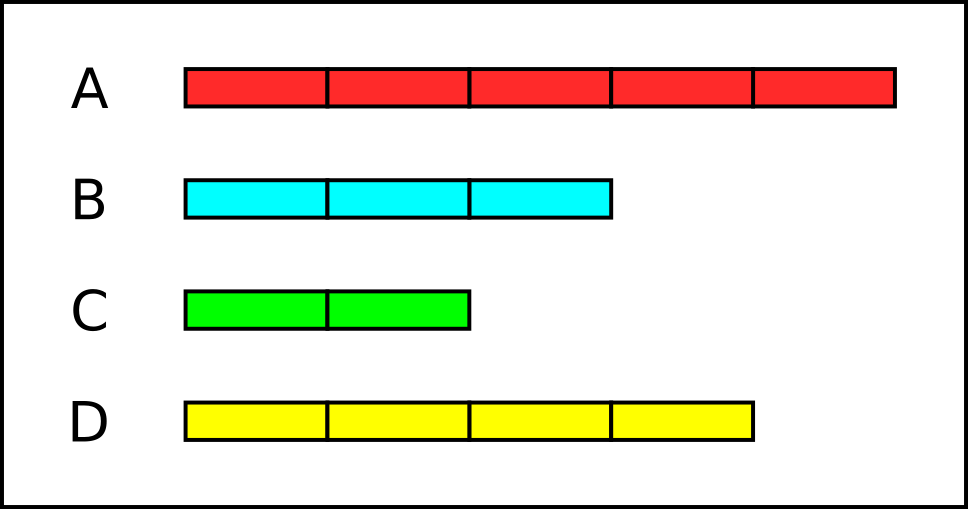
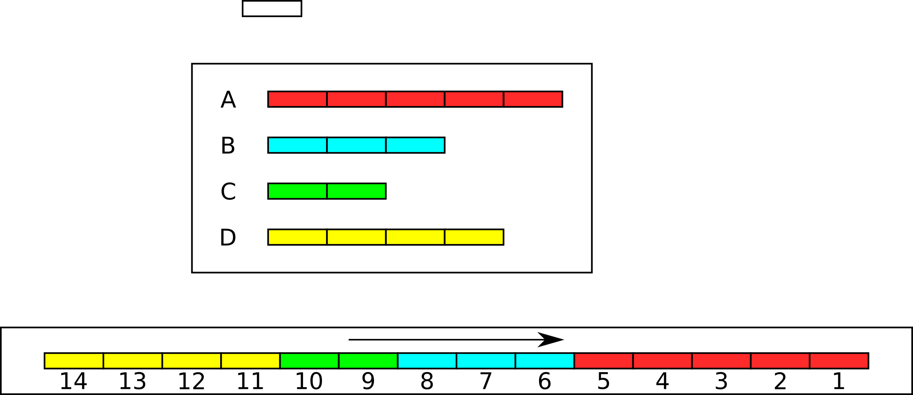
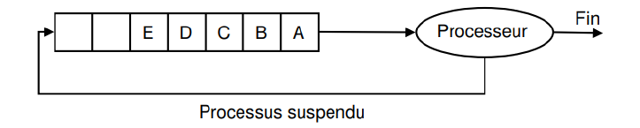

# Ordonnancement des Processus

## Une vision faussée ?

Nous rappelons qu’un {==**exécutable**==} est un fichier (par exemple stocké sur le disque dur) contenant une suite d’instructions en langage machine. C’est donc une suite d’octets que le processeur est capable de décoder et exécuter. Concrètement, lorsqu'on exécute un programme (par exemple en cliquant sur l’icône du fichier exécutable ou en renseignant son chemin dans un terminal), le système d’exploitation effectue les actions suivantes[^rappel] :

[^rappel]: voir [le cours de première](../../Premiere/C05/Architecture.md#cycles-dinstructions-et-parallelisme)

1. le fichier contenant le programme (l’exécutable) est copié dans la mémoire RAM, à une certaine adresse `a` ;
2. le système d’exploitation écrit la valeur `a` dans le registre `IP` (*Instruction Pointer*).
 
 Au prochain cycle d'horloge du processeur, ce dernier va alors lire l’instruction se trouvant à l’adresse `a` et l’exécuter. Une fois cela fait, il exécutera ensuite la seconde instruction et ainsi de suite. On rappelle que l’exécution d’une instruction se décompose elle-même en plusieurs sous-étapes effectuées au sein du processeur : 
	
* le chargement (récupérer l'instruction en mémoire) ;
* le décodage (déterminer dans la suite d’octets chargés quelle instruction ils encodent) ;
* l’exécution proprement dite.

!!! warning "Descriptif incomplet"
	Même si elle semble correcte, la description que nous avons faite de l’exécution d’un programme est incomplète. En effet, si rien de plus n’est fait, alors **la seule chose que l’on peut attendre, c’est que le programme en question s'exécute jusqu’à sa dernière instruction, puis rende la main au système d'exploitation**. Impossible alors de l’interrompre ! Impossible aussi de pouvoir exécuter deux programmes en même temps.


## Les interruptions systèmes
 
Pour pallier ce problème, les systèmes d’exploitation utilisent une fonctionnalité importante des processeurs modernes : la notion d ‘{==**interruption**==}.

!!! asbtract "Interruption"
	Une {==**interruption**==} est un signal envoyé au processeur lorsqu'un évènement se produit. Il existe plusieurs types d’interruptions. Certaines sont générées par le {==matériel==} (par exemple, un disque dur signale qu’il a fini d'écrire des octets, une carte réseau signale que des paquets de données arrivent, etc.), d'autres par du {==logiciel==}.
	
	Lorsque le processeur reçoit une interruption, il interrompt son exécution à la fin de l'instruction courante et exécute un programme se trouvant à une adresse prédéfinie. Ce programme reçoit en argument une copie des valeurs courante des registres, ainsi qu’un code numérique lui permettant de savoir à quel type d’interruption il fait face. Ce programme spécial s'appelle le	{==**gestionnaire d'interruption**==}. Il est installé à une certaine adresse mémoire par le système d'exploitation, très tôt après le démarrage de la machine.


!!! abstract "Interruption d'horloge"
	Parmi les interruptions matérielles, on retrouve les {==**interruptions d’horloge**==}. Le processeur génère de lui-même une interruption matérielle à intervalles de temps fixe. Historiquement, sur processeur *Intel*, cette interruption était levée toutes les 55 ms (environ 18 fois par seconde). Le gestionnaire d'interruption était donc appelé au moins toutes les 55 ms. De nos jours, les processeurs disposent d’horloges de haute précision capables d'émettre des interruptions avec une fréquence de 10 Mhz, donc toutes les 100 ns. Ces interruptions d’horloges, alliées au gestionnaire d'interruption, sont les pièces essentielles permettant d'{==**exécuter des programmes de façon concurrente**==}.


## Principe de l'ordonnanceur

Dans un système d'exploitation moderne, **plusieurs processus** peuvent être présents en mémoire centrale en attente d’exécution. Si plusieurs processus sont prêts, le système d’exploitation doit gérer l’allocation du processeur aux différents processus à exécuter. C’est l’{==**ordonnanceur**==} qui s’acquitte de cette tâche.


!!! abstract  "Notion d’ordonnancement"
	Le système d’exploitation d’un ordinateur peut être vu comme un ensemble de processus dont l’exécution est gérée par un processus particulier : l’{==**ordonnanceur**==} (*scheduler* en anglais). Il s'agit en gros du &laquo; chef d'orchestre &raquo; du système d'exploitation.

Les objectifs d’un ordonnanceur sont, entre autres :

1. s’assurer que chaque processus en attente d’exécution reçoive sa part de temps processeur ;
2. minimiser le temps de réponse ;
3. utiliser le processeur à 100% (ce serait gâcher de la ressource);
4. utiliser d’une manière équilibrée les ressources ;
5. prendre en compte les priorités ;
6. être prédictible (et ce n'est pas une mince affaire...).

Pour répondre à ces objectifs parfois contradictoires, un ordonnanceur fait face à deux problèmes principaux :	

1. Comment choisir quel processus exécuter ?
2. Combien de temps de processeur allouer au processus choisi ?

## Différentes méthodes d'ordonnancement


Imaginons que le processeur ait à exécuter 4 processus, dont les temps d'exécutions sont différents, et qui se sont présentés à différents instants au processeur :

* le processus `A` a besoin de 5 cycles d'horloge, et est arrivé au *tick* 0 ;
* le processus `B` a besoin de 3 cycles d'horloge, et est arrivé au *tick* 1 ;
* le processus `C` a besoin de 2 cycles d'horloge, et est arrivé au *tick* 3 ;
* le processus `D` a besoin de 4 cycles d'horloge, et est arrivé au *tick* 5 ;

{: style="width:80%; margin:auto;display:block;background-color: #546d78;"}

Le processeur ne pouvant traiter qu'une information à la fois, au vu des chevauchements, il faudra ordonner les différents processus afin qu'ils soient tous exécutés.

### Systèmes non-préemptifs : 

!!! example "Méthode PÄPS"
	
	Si le système d'exploitation **n'est pas préemptif**, on pourrait penser au principe d'une file de type &laquo; Premier Arrivé, Premier Servi &raquo; (*FIFO*).

	{: style="width:60%; margin:auto;display:block;background-color: #546d78;"}

	Avec ce système, chaque processus sera exécuté du début à la fin, sans interruptions. Il faudra 14 cycles d'horloge pour terminer les 4 processus. C'est le principe de la file d'attente pour les imprimantes : peu importe le nombre de pages à imprimer, les documents seront imprimés en entier et dans leur ordre d'arrivée.

	Regardons le {==**temps de séjour**==} nécessaire à l'exécution de chaque processus, qui correspond à la *différence entre le temps de terminaison du processus et le temps d'entrée dans le processeur* :

	* `A` est terminé au tick 5, et est entré au tick 0 , donc son temps de séjour est $t_A = 5-0 = 5$
	* `B` est terminé au tick 8, et est entré au tick 1 d'où : $t_B = 8-1 = 7$
	* `C` est terminé au tick 10, et est entré au tick 3 d'où : $t_C = 10-3 = 7$
	* `D` est terminé au tick 14, et est entré au tick 5 d'où : $t_D = 14-5 = 9$

	Le {==**temps de séjour moyen**==} avec cette méthode est donc $\dfrac{5+7+7+9}{4} = \dfrac{28}{4} = 7$.

	Le {==**temps d'attente**==}, lui, est le temps de séjour auquel on retranche le temps d'exécution :

	* `A` a pour temps de séjour 5 et pour temps d'exécution 5. Son temps d'attente est donc $t'_A = 5-5 = 0$, ce qui signifie que le processus `A` n'a passé aucun temps en état prêt ou bloqué ;
	* `B` a pour temps de séjour 7 et pour temps d'exécution 3 : $t'_B = 7-3 = 4$. 
	* `C` a pour temps de séjour 7 et pour temps d'exécution 2 : $t'_C = 7-2 = 5$
	* `D` a pour temps de séjour 9 et pour temps d'exécution 4 : $t'_B = 9-4 = 5$

	Le {==**temps d'attente moyen**==} avec cette méthode est donc $\dfrac{0+4+5+5}{4} = \dfrac{14}{4} = 3,5$.

!!! example "Méthode Short Job First (`SJF`)"

	Une autre possibilité est de prioriser dans les processus en attente celui qui sera le {==**plus rapide**==} à terminer. Ainsi :

	* au tick 0, on exécute le processus `A` ;
	* au tick 5, on a le choix entre les processus `B`, `C` et `D` qui sont dans la file d'attente, donc on exécute `C`, qui est le plus rapide ;
	* au tick 7 on exécute `B` ;
	* et on termine par `D`.

	{: style="width:60%; margin:auto;display:block;background-color: #546d78;"}

	En terme de performances :

	* `A` est terminé au tick 5, et est entré au tick 0 : $t_A = 5-0 = 5$
	* `B` est terminé au tick 10, et est entré au tick 1 : $t_B = 10-1 = 9$
	* `C` est terminé au tick 7, et est entré au tick 3 : $t_C = 7-3 = 4$
	* `D` est terminé au tick 14, et est entré au tick 5 : $t_D = 14-5 = 9$

	Le temps de séjour moyen avec cette méthode est donc $\dfrac{5+9+4+9}{4} = \dfrac{27}{4} = 6,75$.

	* `A` a pour temps de séjour 5 et pour temps d'exécution 5 : $t'_A = 5-5 = 0$
	* `B` a pour temps de séjour 9 et pour temps d'exécution 3 : $t'_B = 9-3 = 6$
	* `C` a pour temps de séjour 4 et pour temps d'exécution 2 : $t'_C = 4-2 = 2$
	* `D` a pour temps de séjour 9 et pour temps d'exécution 4 : $t'_B = 9-4 = 5$
Le temps d'attente moyen avec cette méthode est donc $\dfrac{0+6+2+5}{4} = \dfrac{13}{4} = 3,25$.


### Systèmes préemptifs 

Dans un schéma {==**d’ordonnanceur préemptif**==}, pour s’assurer qu’aucun processus ne s’exécute pendant trop de temps, l'horloge électronique génère périodiquement une interruption. {==**À chaque interruption d’horloge, le système d’exploitation reprend la main et décide si le processus courant doit poursuivre son exécution ou s’il doit être suspendu pour laisser place à un autre**==}.

S’il décide de suspendre son exécution au profit d’un autre, il doit d’abord sauvegarder l’état des registres du processeur avant de charger dans les registres les données du processus à lancer. C’est qu’on appelle la {==**commutation de contexte**==}(ou changement de contexte, *context switch* en anglais). Cette sauvegarde est nécessaire pour pouvoir poursuivre ultérieurement l’exécution du processus suspendu.

Le processeur passe donc d’un processus à un autre en exécutant chaque processus pendant quelques dizaines ou centaines de millisecondes. Le temps d’allocation du processeur au processus est appelé un {==**quantum**==}. Cette commutation entre processus doit être rapide, c’est-à-dire, exiger un temps nettement inférieur au quantum. Le processeur, à un instant donné, **n’exécute réellement qu’un seul processus, mais pendant une seconde, le processeur peut exécuter plusieurs processus** et donne ainsi l’**impression de** {==**parallélisme**==} (pseudo-parallélisme).

!!! example "Méthode Shortest Remaining Time (`SRT`)"

	L’ordonnancement du plus petit temps de séjour ou *Shortest Remaining Time* (`SRT`) est la version préemptive de l’algorithme `SJF`. Un processus arrive dans la file de processus, l’ordonnanceur compare la valeur espérée pour ce processus contre la valeur du processus actuellement en exécution. Si le temps du nouveau processus est plus petit, il rentre en exécution immédiatement. Ainsi :
	
	* au tick 0, le processus `A` est exécuté ;
	* au tick 1, le processus `B` est estimé plus court que la partie restante de `A` (3 contre 4), donc `A` est suspendu et `B` est exécuté ;
	* au tick 3, il reste 4 temps au processus `A`, 1 seul pour `B`, et 2 pour `C`, donc on ternmine `B` ;
	* au tick 4, on exécute `C`, qui est le plus court ;
	* au tick 6, il reste 4 temps pour `A` et `D`, un choix est fait : comme `À` est déjà en cours, on le termine en priorité.
	
	{: style="width:60%; margin:auto;display:block;background-color: #546d78;"}
	
	En terme de performances :

	* `A` est terminé au tick 10, et est entré au tick 0 : $t_A = 10-0 = 10$
	* `B` est terminé au tick 4, et est entré au tick 1 : $t_B = 4-1 = 3$
	* `C` est terminé au tick 6, et est entré au tick 3 : $t_C = 6-3 = 3$
	* `D` est terminé au tick 14, et est entré au tick 5 : $t_D = 14-5 = 9$

	Le temps de séjour moyen avec cette méthode est donc $\dfrac{10+3+3+9}{4} = \dfrac{25}{4} = 6,25$.

	* `A` a pour temps de séjour 10 et pour temps d'exécution 5 : $t'_A = 10-5 = 5$
	* `B` a pour temps de séjour 3 et pour temps d'exécution 3 : $t'_B = 3-3 = 0$
	* `C` a pour temps de séjour 3 et pour temps d'exécution 2 : $t'_C = 3-2 = 1$
	* `D` a pour temps de séjour 9 et pour temps d'exécution 4 : $t'_B = 9-4 = 5$

	Le temps d'attente moyen avec cette méthode est donc $\dfrac{5+0+1+5}{4} = \dfrac{11}{4} = 2,75$.
	
	Cet algorithme est nettement plus performant que les algorithmes des systèmes non-préemptifs, mais il faut tenir compte d'un temps d'estimation des temps restants, qui peut parfois rendre cette méthodes beaucoup plus longue et moins efficace.

!!! example "Méthode Round Robin (`RR`)"

	L’algorithme du {==**tourniquet**==} ou *Round Robin* (`RR`) représenté sur la figure ci-dessous est un algorithme ancien, simple, fiable et très utilisé. Il mémorise dans une file du type `FIFO` (*First In First Out*) la liste des processus prêts, c’est-à-dire en attente d’exécution.
	
	{: style="width:60%; margin:auto;display:block;background-color: #546d78;"}

	Il alloue le processeur au processus en tête de file, {==**pendant un quantum de temps**==}. Si le processus se bloque ou se termine avant la fin de son quantum, le processeur est immédiatement alloué à un autre processus (celui en tête de file). Si le processus ne se termine pas au bout de son quantum, son exécution est suspendue. Le processeur est alloué à un autre processus (celui en tête de file). Le processus suspendu est inséré en queue de file. Les processus qui arrivent ou qui passent de l’état bloqué à l’état prêt sont insérés en queue de file.
	
	!!! example "Comparer les performances de l'algorithme `RR`"

		Toujours en utilisant l'exemple :

		{: style="width:60%; margin:auto;display:block;background-color: #546d78;"}

		=== "Quantum 1"

			Si le quantum de temps est de 1 tick :
		
			{: style="width:60%; margin:auto;display:block;background-color: #546d78;"}

			
			Pour les performances :
		
			* `A` est terminé au tick ..., et est entré au tick ... : $t_A =...$
			* `B` est terminé au tick ..., et est entré au tick ... : $t_B = ...$
			* `C` est terminé au tick ..., et est entré au tick ... : $t_C = ...$
			* `D` est terminé au tick ..., et est entré au tick ... : $t_D = ...$

			Le temps de séjour moyen avec cette méthode est donc ...

			* `A` a pour temps d'attente ... et pour temps d'exécution ... : $t'_A = ...$
			* `B` a pour temps d'attente ... et pour temps d'exécution ... : $t'_B = ...$
			* `C` a pour temps d'attente ... et pour temps d'exécution ... : $t'_C = ...$
			* `D` a pour temps d'attente ... et pour temps d'exécution ... : $t'_B = ...$

			Le temps d'attente moyen avec cette méthode est donc ...

		=== "Quantum 2"

			Si le quantum de temps est de 2 ticks :
		
			{: style="width:60%; margin:auto;display:block;background-color: #546d78;"}

			
			Pour les performances :
		
			* `A` est terminé au tick ..., et est entré au tick ... : $t_A =...$
			* `B` est terminé au tick ..., et est entré au tick ... : $t_B = ...$
			* `C` est terminé au tick ..., et est entré au tick ... : $t_C = ...$
			* `D` est terminé au tick ..., et est entré au tick ... : $t_D = ...$

			Le temps de séjour moyen avec cette méthode est donc ...

			* `A` a pour temps d'attente ... et pour temps d'exécution ... : $t'_A = ...$
			* `B` a pour temps d'attente ... et pour temps d'exécution ... : $t'_B = ...$
			* `C` a pour temps d'attente ... et pour temps d'exécution ... : $t'_C = ...$
			* `D` a pour temps d'attente ... et pour temps d'exécution ... : $t'_B = ...$

			Le temps d'attente moyen avec cette méthode est donc ...

		=== "Quantum 3"

			Si le quantum de temps est de 3 ticks :
		
			{: style="width:60%; margin:auto;display:block;background-color: #546d78;"}

			
			Pour les performances :
		
			* `A` est terminé au tick ..., et est entré au tick ... : $t_A =...$
			* `B` est terminé au tick ..., et est entré au tick ... : $t_B = ...$
			* `C` est terminé au tick ..., et est entré au tick ... : $t_C = ...$
			* `D` est terminé au tick ..., et est entré au tick ... : $t_D = ...$

			Le temps de séjour moyen avec cette méthode est donc ...

			* `A` a pour temps d'attente ... et pour temps d'exécution ... : $t'_A = ...$
			* `B` a pour temps d'attente ... et pour temps d'exécution ... : $t'_B = ...$
			* `C` a pour temps d'attente ... et pour temps d'exécution ... : $t'_C = ...$
			* `D` a pour temps d'attente ... et pour temps d'exécution ... : $t'_B = ...$

			Le temps d'attente moyen avec cette méthode est donc ...


		=== "Quantum 4"

			Si le quantum de temps est de 4 ticks :
		
			{: style="width:60%; margin:auto;display:block;background-color: #546d78;"}

			
			Pour les performances :
		
			* `A` est terminé au tick ..., et est entré au tick ... : $t_A =...$
			* `B` est terminé au tick ..., et est entré au tick ... : $t_B = ...$
			* `C` est terminé au tick ..., et est entré au tick ... : $t_C = ...$
			* `D` est terminé au tick ..., et est entré au tick ... : $t_D = ...$

			Le temps de séjour moyen avec cette méthode est donc ...

			* `A` a pour temps d'attente ... et pour temps d'exécution ... : $t'_A = ...$
			* `B` a pour temps d'attente ... et pour temps d'exécution ... : $t'_B = ...$
			* `C` a pour temps d'attente ... et pour temps d'exécution ... : $t'_C = ...$
			* `D` a pour temps d'attente ... et pour temps d'exécution ... : $t'_B = ...$

			Le temps d'attente moyen avec cette méthode est donc ...

		
	
!!! question "Exercice"

	=== "Enoncé"
	
		Soient deux processus A et B prêts tels que A est arrivé en premier suivi de B, 2 unités de temps après. Les temps CPU nécessaires pour l’exécution des processus A et B sont respectivement 15 et 4 unités de temps. Le temps de commutation est supposé nul.
		
		Calculer les temps moyen de séjour et les temps moyens d'attente pour les algorithmes :
		
		1. SRT
		2. RR avec un quantum de 10
		3. RR avec un quantum de 3
		
	=== "Réponses"
	
		A venir !


## Les Threads

*Merci [http://lycee.educinfo.org/index.php?page=creation_thread&activite=processus](http://lycee.educinfo.org/index.php?page=creation_thread&activite=processus){: target="_blank"}*

!!! question " Programmation séquentielle"


	=== "Enoncé"
		Copiez le code suivant dans un fichier `sequence.py`
		```` python
		def f1():
			for _ in range(5):
				 print("Bonjour !")

		def f2():
			for _ in range(5):
				print("Ca va ?")

		if __name__ == "__main__" :
			f1()
			f2()
		````

		Quel est l'ordre d'affichage ?
		
	=== "Réponses"
		Comme d'habitude en programmation séquentielle, nous voyons apparaitre d'abord les 5 `"Bonjour !"` puis les 5 `"Ca va ?"`.
		
!!! asbtract "Threads"

	Un {==**thread**==} est un processus qui va partager avec un programme l'espace des données et va s'exécuter de façon simultané avec d'autres thread. On parle aussi de {==**processus légers**==}. Ils peuvent être très utile, mais peuvent aussi causer de multiples problèmes. 
	
!!! question "Création de threads"

	=== "Enoncé"
	
		Nous allons utiliser le module `threading` de Python avec le code ci-dessous, que vous copierez dans un fichier `concurrent.py` :
		
		```` python
		from threading import Thread
		from time import sleep

		def f1():
			for _ in range(5):
				print("Bonjour !")
				sleep(0.01)

		def f2():
			for _ in range(5):
				print("Ca va ?")
				sleep(0.01)

		if __name__ == "__main__" :
			p1 = Thread(target=f1)
			p2 = Thread(target=f2)
			p1.start()
			p2.start()
			p1.join()
			p2.join()
		````
		Exécutez plusieurs fois ce code. Quelle différence constatez vous avec le code précédent ?
		
	=== "Réponses"
	
		Cette fois ci, les `"Bonjour !"` et les `"Ca va ?"` se sont affichés de façon intercalée. Si vous avez exécuté le programme plusieurs fois, vous avez peut être vu qu'il n'y avait pas toujours le même ordre. Par exemple : 
		````
		Bonjour !
		Ca va ?
		Bonjour !
		Ca va ?
		Ca va ?
		Bonjour !
		Bonjour !
		Ca va ?
		Bonjour !
		Ca va ?
		````
		
		Nous créons deux objets de la classe `Thread`. Ce sont des processus légers qui vont partager l'espace mémoire de notre programme principal et s'exécuter de façon parallèle. Les deux lignes suivantes appellent la méthode `start` sur les Thread, et va lancer leur exécution. Mais pendant que le premier s'exécute, le programme continue et va lancer le second. 
		
		Enfin, nous utilisons la méthode `join` sur ces deux threads. En effet, le programme principal continue de s'exécuter pendant que les threads tournent, et si il se termine, il met fin à tous ses threads. La méthode `join` force le programme principal à attendre la fin des threads. 
		
!!! abstract "Pourquoi faire ça ?"

	L'avantage principal, c'est de pouvoir faire plusieurs choses en même temps. Surtout si on travaille sur une machine qui a plusieurs processeur. Par exemple, on peut avoir une machine qui a 2 processeur, chaque processeur ayant quatre cœurs, chaque cœeurs pouvant lui même exécuter deux threads… on va pouvoir au total exécuter en parallèle 16 threads ! 


!!! question "Chauffeur, si t'as pas peur..."	

	=== "Enoncé"
	
		Appliquons les threads pour calculer plus vite ! Imaginons  un programme qui doit bêtement faire 400 calculs. On va simuler cela par un petit sleep avec le code suivant :

		```` python
		from time import sleep

		# Variable globale
		compteur = 0 
		limite = 400

		def calcul():
			"""Une fonction qui fait un calcul"""
			global compteur
			for c in range(limite):
				temp = compteur
				# simule un traitement nécessitant des calculs
				sleep(0.000000001)
				compteur = temp + 1

		compteur = 0
		calcul()
		print(compteur)
		````

		1. Recopiez et exécutez ce code, et vérifiez qu'il affiche bien 400.
		2. Les macines du Lycée peuvent supporter 4 threads diférents, essayons alors avec le code suivant, pour gagner un facteur 4 dans notre temps de calcul :
		
			```` python
			
			from threading import Thread
			from time import sleep

			# Variable globale
			compteur = 0 
			limite = 100

			def calcul():
				"""Une fonction qui fait un calcul"""
				global compteur
				for c in range(limite):
					temp = compteur
					# simule un traitement nécessitant des calculs
					sleep(0.000000001)
					compteur = temp + 1

			compteur = 0
			mesThreads = []
			for i in range(4): # Lance en parallèle 4 exécutions de calcul
				p = Thread(target = calcul)
				p.start()      # Lance calcul dans un processus léger à part.
				mesThreads.append(p)

			# On attend la fin de l'exécution des threads.
			for p in mesThreads :
					p.join()

			print(compteur)
			````
			
			Exécutez plusieurs fois ce code. Obtient-on le résultat attendu ?
			
	=== "Réponses"
	
		1. Oui, le résultat est correct.
		2. Le résultat n'est pas du tout le résultat attendu. Chaque thread se lance et fait 100 calcul, mais le compteur à la fin ne vaut en général même pas 100 ! Ce résultat est très perturbant quand on le rencontre pour la première fois, et cela explique la réticence de bien des développeurs à l'égard des threads. On peut lire sur bien des forums de développeur «Threads are EVIL, don't use them !». Mais non, il ne sont pas le diable, il faut juste être parfaitement conscient de ce qui se passe. Ils sont même indispensables dans bien des programmes, particulièrment tous les programmes client/serveur qui doivent répondre à un grand nombre de requêtes concurrentes. 
		
		
Quelques explications sont nécesaires pour comprendre réellement ce qui s'est produit. Quatre processus (appelons les P1, P2, P3 et P4) exécutent la fonction calcul simultanément. Celle-ci utilise une variable globale qui sera donc modifiée par chacun de ces processus et une variable locale temp qui sera spécifique à chacun de nos processus. Nous la désignerons par temp(P1), temp(P2), etc... Un scénario possible est le suivant, en imagineant qu'au départ le compteur vaille 10.

* P1 sauvegarde compteur dans `temp(P1)`, d'où `temp(P1)`vaut 10
* P2 sauvegarde compteur dans `temp(P2)`, d'où `temp(P2)` vaut 10
* P3 sauvegarde compteur dans `temp(P3)`, d'où `temp(P3)` vaut 10
* P1 et P2 incrémentent `temp` et sauvegardent la réponse dans `compteur`, donc `compteur` vaut 11 (et pas 12...)
* P4 sauvegarde compteur dans `temp(P4)`, d'où `temp(P4)` vaut 11
* P3 et P4 incrémentent `temp` et sauvegardent la réponse dans `compteur` qui vaut donc maintenant 12

Au final, le compteur a bien été incrémenté 4 fois, mais du fait de l'éxécution en parallèle, le compteur ne vaut que 12 et non 14 ! Ceci explique que notre compteur au final ne vaut pas 400 car sa sauvegarde dans des variables temporaires fait que la plupart des incrémentations ne sont pas prises en compte. 

Le résultat est aléatoire par ce que les threads s'exécutent dans un ordre qui peut varier, comme nous l'avons vu sur l'exemple des salutations. C'est le principal problème avec les threads : on ne maîtrise absolument pas l'ordre dans lequel ils sont exécutés, et il faut en tenir compte dès la conception. 
		
!!! tips "Une solution : le verrou ?"		

	Il existe un mécanisme qui va nous ralentir potentiellement un peu mais qui évite ce genre de problèmes : les {==**verrous**==}. Ce sont des objets de la classe `Lock` du module threading. Dans notre cas, ils ont deux méthodes qui nous intéressent.

    * La méthode `acquire` s'accapare le verrou s'il est disponible, sinon elle attend qu'il se libère.
    * La méthode `release` libère le verrou.

	Ce verrou sera une variable globale du programme principal qui sera partagé entre les threads. Notre programme devient alors le suivant : 
	
	```` python
	
	from threading import Thread,Lock
	from time import sleep

	# Variable globale
	compteur = 0 
	limite = 100
	verrou = Lock()

	def calcul():
		"""Une fonction qui fait un calcul"""
		global compteur
		for c in range(limite):
			# Début de la section critique
			verrou.acquire()
			temp = compteur
			# simule un traitement nécessitant des calculs
			sleep(0.000000001)
			compteur = temp + 1
			# fin de la section critique
			verrou.release()
			
	compteur = 0
	mesThreads = []
	for i in range(4): # Lance en parallèle 4 exécutions de calcul
		p = Thread(target = calcul)
		p.start()      # Lance calcul dans un processus léger à part.
		mesThreads.append(p)

	# On attend la fin de l'exécution des threads.
	for p in mesThreads :
			p.join()

	print(compteur)
	````
	
	Le programme permet alors bien d'avoir le résultat escompté. Mais malheureusement, tous nos problèmes ne sont pas résolus...


