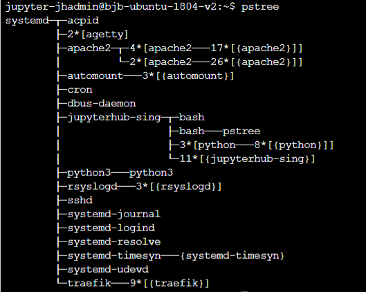

# Notion de  processus

*Cette page et les suivantes du chapitre sont insiprées des pages suivantes :*

* [https://www.lecluse.fr/nsi/NSI_T/archi/process/](https://www.lecluse.fr/nsi/NSI_T/archi/process/)
* [https://www.lyceum.fr/tg/nsi/3-architectures-materielles-systemes-dexploitation-et-reseaux/2-gestion-des-processus-par-un-systeme-dexploitation](https://www.lyceum.fr/tg/nsi/3-architectures-materielles-systemes-dexploitation-et-reseaux/2-gestion-des-processus-par-un-systeme-dexploitation)
* [http://lycee.educinfo.org/index.php?page=creation_thread&activite=processus](http://lycee.educinfo.org/index.php?page=creation_thread&activite=processus)

*et bien entendu de l'habituel* Numérique et Sciences Informatique, 24 leçons avec exercices corrigés *aux editions* Ellipses.


	
	
L'objectif de cette partie est de comprendre comment une machine peut exécuter plusieurs tâcches de manière simultanées : si l'on prend l'exemple du smartphone,  alors que nous regardons une vidéo, il va suivre les antennes relais et se synchroniser avec, écouter s'il y a un appel téléphonique ou des SMS qui arrive, vérifier les nouveaux courriers électroniques, mettre à jour les notifications des différents réseaux sociaux,etc.

Pour comprendre, il nous faudra nous poser les questions suivantes :

1. Comment sont donc exécutés les programmes par le système d'exploitation ?
2. Comment plusieurs programmes peuvent-ils être exécutés simultanément ?
3. Quels sont les risques et preoblèmes soulevés par ces exécutions simultanées ?


## Du programme au processus

!!! abstract "Les processus"
	Un {==**processus**==} est un programme en cours d'exécution sur un ordinateur. Il est caractérisé par

    * un **ensemble d'instructions** à exécuter - souvent stockées dans un fichier sur lequel on clique pour lancer un programme (par exemple `firefox.exe`)
    * un **espace mémoire** dédié à ce processus pour lui permettre de travailler sur des **données** qui lui sont propres : si vous lancez deux instances de firefox, chacune travaillera indépendament de l'autre avec ses propres données.
    * des **ressources matérielles** : processeur, entrées-sorties (accès à internet en utilisant la connexion Wifi).

	Il ne faut donc pas confondre le fichier contenant un **programme** (portent souvent l'extension `.exe` sous windows) et le ou les processus qu'ils engendrent quand ils sont exécutés : un programme est juste un fichier contenant une suite d'instructions (`firefox.exe` par exemple) alors que les processus sont des instances de ce programme ainsi que les ressources nécessaires à leur exécution (plusieurs fenêtres de firefox ouvertes en même temps).
	
Il est possible de visualiser et gérer les processus actifs d'une machine par l'intermédiaire d'un **gestionnaire de processus**, qui est un programme spécifique au système d'exploitation :

* sur windows, en utilisant ++ctrl+alt+delete++, mais pas au Lycée... La gestion des processus étant critique, seuls les administrateurs de la machine peuvent y accéder...
* sur linux simplement par l'utilisation d'un *terminal* (la ligne de commande)

??? warning "En cas de problème avec les Raspberry Pi, ou pour vous entrainer chez vous"

	*JupyterHub* est un serveur de Notebook que j'avais installé il y a fort longtemps, avant l'appartition de *Capytale*. Il est obsolète pour l'utilisation des notebooks, mais nous pouvons toujours en avoir une utilité : un terminal **Linux** est toujours disponible !
	
	1. Connectez vous sur [jupyterHub](https://zonensi.fr:8443){: target="_blank"} (Votre identifiant est votre nom de famille immédiatement suivi de la première lettre de votre prénom. Pour le mot de passe, vous le choisissez à la pemière connexion)
	2. Ouvrir un terminal :
	
		{: style="width:20%; margin:auto;display:block;background-color: #546d78;"}
		

!!! question "Manipulations"
	1. Sous linux, les programmes sont par convention situées dans les dossiers `bin` (pour binaries en anglais):
		* `/bin/`: commandes de base nécessaires au démarrage et à l'utilisation d'un système minimaliste.
		* `/sbin/`: Exécutables pour les administrateurs (abréviation de *system binaries*, soit binaires système en français).
		* `/usr/bin/`: Binaires exécutables qui ne sont pas déjà présents dans `/bin` et donc pas indispensables à un système minimaliste.
		
		Utiliser la commande `ls` pour **lister les programmes** présents dans `/bin/`.
	2. Utilisez la commande `cat /bin/ls` pour afficher le contenu du programme `ls`. On constate que le fichier est un fichier  compilé (utilisez ++ctrl+c++ pour revenir au *prompt*).
	3. Pour lancer un programme, il suffit d'écrire son **nom** (sans préciser le chemin si le dossier a été ajouté aux variables d'environnement). Par exemple vous pouvez lancer un interpréteur python par la commande `python3` (tapez `exit()` pour sortir de l'interpréteur). 
	4. Vous pouvez visualiser les {==**processus en exécution**==} par l'intermédiaire de la commande `ps` :
		1. `ps` simplement listera *vos propres processus utilisateurs*
		2. `ps -l` donnera plus de détails
		3. `ps -a -u -x` ou `ps -aux` affichera tous les processus de tous les utilisateurs(`-a`), avec le propriétaire du processus (`-u`), ainsi que les processus qui ne sont pas attachés à un  terminal (`-x`).
		4. `ps -ef` affichera tous les processus (*every*) avec toutes les informations disponibles (*full*).
		4. Le manuel d'utilisation de la commande `ps` est obtenu par la commande `man ps` (ou par [wikipedia](https://fr.wikipedia.org/wiki/Ps_(Unix)){: target="_blank"}, comme d'habitude).

## Création d'un processus


!!! abstract "Création des processus"
	La création d'un processus peut intervenir

    * au démarrage du système ;
    * par un appel d'un autre processus ;
    * par une action d'un utilisateur (lancement d'application).
	
	Quand un processus est crée, le système d'exploitation lui aloue un identifiant unique: le {==**PID**==} (*Process Identifier*).

	Sur Linux, la création d'un processus se fait par clonage d'un autre processus au travers d'un appel systeme `fork()`.

    * le processus qui fait appel à `fork()` est appelé processus père ;
    * le processus qui est ainsi créé par clonage est le processus fils ;
    * après le clonage, un processus peut remplacer son programme par un autre programme grâce à l'appel système exec().
	
	Lorsqu'un processus engendre un fils, l'OS génère un nouveau PID pour le fils, et le fils connait aussi le numéro de son père : le {==**PPID**==} (*Parent Process Identifier)
	
	
!!! info "Le premier processus ?"

	Sous un système d'exploitation comme Linux, au moment du démarrage de l'ordinateur un tout premier processus (appelé processus 0 ou encore Swapper) est créé à partir de "rien" (il n'est le fils d'aucun processus). Ensuite, ce processus 0 crée un processus souvent appelé `init` ou `systemd`, il est créé au démarrage du système.
	
	À partir de ce premier processus, les processus nécessaires au bon fonctionnement du système d’exploitation Linux sont créés (par exemple les processus `crond`, `inetd`, `getty`,...). Puis d'autres processus sont créés à partir des fils de `init`... 
	
	Ce système de création un peu particulier (désigné souvent par `fork/exec`) conduit à l'émergence d'une arborescence de processus : un processus père engendre un ou plusieurs fils qui à leur tour engendrent des fils etc... 
	
	L'instruction `pstree` permet de visualiser l'arbre de processus :
	
	{: style="width:50%; margin:auto;display:block;background-color: #546d78;"}

!!! question "Chercher les PID"

	=== "Enoncé"
	
		A l'aide de la commande `ps -ef | more`, chercher les PID et PPID des processus :
		
		1. `systemd`
		2. `apache2`
		3. `cron`
		4. `python3` (situé dans le dossier `/opt/`)
		5. Commencez par exécuter Thonny, puis cherchez le PID et PPID du processus qui lui correspond.
		
	=== "Réponses"
		A venir !
		
!!! tips "Commande `top`"

	Une des commandes les plus utiles sous Linux est la commande `top`. Cette commandes affiche les processus actifs **en temps réel**.
	L'application est plus riche qu'il n'y paraît. Il faut passer un peu de temps à explorer toutes les options. Celles-ci s'activent par des raccourcis clavier. En voici quelques uns :

    * ++h++ : affiche l'aide
    * ++m++ : trie la liste par ordre décroissant d'occupation mémoire. Pratique pour repérer les processus trop gourmands
    * ++p++ : trie la liste par ordre décroissant d'occupation processeur
    * ++i++ : filtre les processus inactifs. Cela ne montre que ceux qui travaillent réellement.
    * ++k++ : permet de tuer un processus - à condition d'en être le propriétaire. Essayez de tuer `systemd` ...
    * ++v++ : permet d'avoir la vue arborescente sur les processus.
    * ++q++ : permet de quitter top
	

## Etats d'un processus

Un processus n'a pas seulement besoin d'accéder au processeur, mais il a souvent besoin d'accéder à des ressources autres comme :

* la mémoire vive: RAM,
* la mémoire de masse: disques durs, clés USB, mémoire flash...
* la lecture ou l'écriture d'un fichier...
* les périphériques d'entrée et de sortie: clavier, souris, écran, imprimante...

Ces ressources externes étant beaucoup moins rapides que le processeur, elles bloquent les processus lors de leur exécution.

Ainsi, lors de la vie d'un processus, celui-ci peut passer par trois états:

* `PRET` (*ready*) : le processus est lancé et attend l'accès au processeur.
* `ELU` (*running*) : le processus a obtenu l'accès au processeur: il peut s'exécuter.
* `BLOQUE`(*sleeping*) : le processus est en cours d'exécution, mais attend une ressource en mémoire par exemple, il quitte le processeur pour libérer les ressources.

{: style="width:40%; margin:auto;display:block;background-color: #546d78;" alt="Source : wikipedia"}


!!! example "Exemple"

	Imaginons un simple programme Python :
	
	```` python
	texte = input("Entrez une phrase ?")
	print(f"La longueur de votre phrase est {len(texte)}")	
	````
	Lorsqu'on exécute ce programme, un processus est crée, et passe en état `PRET`. Dès qu'il a accès au proceseur, il passe dans l'état `Elu`. La première instruction est alors excécutée. Or celle ci *attend une saisie au clavier*, et le processus ne peut pas continuer tant que l'utilisateur n'a pas agit. L'OS met alors en attente le processus (en état `BLOQUE`).
	
	Lorsque l'OS, qui gère aussi les entrées et les sorties, repère une interaction avec le clavier, il va alors débloquer le processus, qui repassera en état `PRET`, puis en état `ELU` et exécutera alors la dfeuxième instruction. Sans autre intervention, le processus passera en état final (*stopped*), et se terminera naturellement. Il libèrera alors les ressources mémoire qu'il occupait, et enverra un signal à son processus parent, afin que celui-ci l'élimine de la table des processus.
	
	

## Terminer un processus


!!! abstract "Terminer un processus"

	Il est possible d'envoyer un *signal de terminaison* à un processus actif, par l'intermédiaire de la commande `kill`, en lui précisant le PID du processus qu'on souhaite arrêter. Un tel signal est équivalent au fait de fermer une fenêtre en interface graphique, ou bien au raccourci ++ctrl+c++ dans la console.
	
	Un tel signal est intercepté par l'application du processus et géré par cette dernière. Parexemple un logiciel de traitement de texte peut alors proposer à l'utilisateur de sauvegarder ses fichiers avant de quitter.
	
!!! question 

	1. Dans JupyterHub, ouvrir un des notebooks de première.
	2. Repérer le PID correspondant à cette instance de notebook ( processus de type `ipython`)
	3. Terminer le processus.
	

!!! abstract "Tuer un processus"

	parfois un processus se comporte de manière anormale, par exemple par une trop grande consommation de  mémoire, ou lorsqu'une application &laquo; ne répond plus &raquo;. Il est possible dans ce cas de tuer  le processus en question, en lui envoyant un signal de terminaison sans que l'application puisse l'intercepeter, en passant l'option `-9` à la commande `kill`, par exemple `kill -9 13259`. 
	En reprenant l'exemple du traitement de texte, dans ce cas les modifications ne seront pas sauvegardées et des donénes risquent d'être perdues. C'est une commande à utiliser avec précaution.
	

	
!!! question "Création et suppression de processus en Python"

	Nous allons créer un processus à partir de Python. Pour cela :
	
	1. Dans Thonny, créer un fichier texte vide, puis y insérer le code suivant :
	
		```` python
		import time

		a = 0
		for i in range(100000):
			a += a**3
			time.sleep(0.01)
		print("terminé")
		````
	2. Sauvegardez ce fichier sous le nom `test.py`
	3. Ouvrez **DEUX** terminaux .
	4. Dans le premier, utilisez la commande `python3 test.py`. 
	5. Dans le second, lancez la commande `ps -aux`, et cherchez le processus correspondant à l'exécution du script `test.py`.
	6. Tuez le processus avec la commande `kill`, et observez ce qui se passe dans les deux terminaux.
	7. Recommencez la procédure à partir de 4 en tuant le processus avec la commande `kill -9`, et observez les deux terminaux.
		
		
!!! question "Utilisation de `fork()`"

	1. Dans Thonny, créez un fichier nommé `testFork.py` dans lequel vous copierez les lignes suivantes :
	
		```` python
		# Python program to explain os.fork() method 
  
		# importing os module 
		import os, time
		  
		  
		# Create a child process
		# using os.fork() method 
		pid = os.fork()
		  
		# pid greater than 0 represents
		# the parent process 
		if pid > 0 :
			print("I am parent process:")
			print("Process ID:", os.getpid())
			print("Child's process ID:", pid)
		  
		# pid equal to 0 represents
		# the created child process
		else :
			print("\nI am child process:")
			print("Process ID:", os.getpid())
			print("Parent's process ID:", os.getppid())
			
		a = 0
		for i in range(10000):
			a += a**3
			time.sleep(0.001)
		print("Finished")
			 
		  
		  
		# If any error occurred while
		# using os.fork() method
		# OSError will be raised
		````
	2. Excéutez ce fichier par la commande `python3 testFork.py`. Observez dans ce terminal l'effet du script.
	3. Dans un autre terminal, avec la commande `ps -ef`, observez les processus créés, ainsi que leurs PID et PPID.
	4. (Si nécessaire, relancez le script !) Tuez le processus enfant. Que se passe-t-il ?
	5. Relancez le script ! Tuez le processus parent et attendez quelques instants. Que se passe-t-il ?
	
!!! tips "Processus Zombies"

	Parfois un processus père est tué avant que ses processus fils soient terminés. Ceux-ci restent alors dans la table des processus en situation finale, mais ne sont pas supprimés. On parle alors de {==**processus zombies**==}. Ceux-ci occupent une parrtie de la mémoire, tout en étant devenus inutiles...
	


