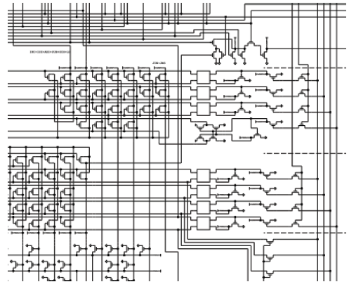

# Des circuits aux systèmes sur puces

*Cette partie est directement inspirée des documents d'accompagnement du programme de NSI.*

Nous allons utiliser une vidéo du Collège de France : une conférence enseignement de Gérard Berry [&laquo; Pourquoi
et comment le monde devient numérique (Chaire Innovation technologique — Liliane Bettencourt) &raquo;](https://www.college-de-france.fr/site/gerard-berry/course-2008-02-01-10h30.htm){: target="_blank"}. On trouvera avec ce lien le diaporama associé à la conférence.

## Questionnaire conférence

### Introduction

1. Qu’est-ce qui a permis la progression du monde numérique ?
2. De quoi est composé un circuit ?
3. À ce stade de l’exposé, quel est le facteur limitant à la progression des circuits ?
4. Quel est le nom de la loi qui gouverne la densité des circuits ?
5. Où travaillait M. Moore ?
6. Citez quelques types de circuits autres que les microprocesseurs (CPU).
7. Quelle qualité présente le CPU ?
8. Quel est son principal défaut ?
9. Que font principalement les DSP (Digital Signal Processor) ?
10. Les puces peuvent être conçues avec un grand nombre de transistors, quelle est la conséquence sur la fabrication des puces ?
11. Quels sont les deux principaux avantages d’une intégration plus grande dans les puces ?
12. Que signifie SOC ?
13. Comment sont reliés tous les blocs fonctionnels à l’intérieur des puces ?

	{: style="width:70%; margin:auto;display:block;background-color: #d2dce0;"}
	
### La description des circuits

*A partir de 7'48*

1. Quel est le niveau de conception le plus basique décrit par M. Berry ?

	{: style="width:50%; margin:auto;display:block;background-color: #d2dce0;"}
	
2. Comment s’appelle le niveau le plus central utilisé pour la description des circuits ?

	{: style="width:50%; margin:auto;display:block;background-color: #d2dce0;"}

3. Quelle est la partie du signal d’horloge, qui est active, utilisée pour piloter le circuit ?
4. Dans un calcul logique, que signifie l’expression « chemin critique » ?
5. Que permet de définir ce chemin critique ?

### Quelques réflexions autour de l'addition

*A partir de 16'30*

1. Quel est le problème posé par le mécanisme de propagation de la retenue lors du passage à l’échelle pour des additions de deux mots d’un grand nombre de bits ?
2. Quelle est la valeur du chemin critique de l’additionneur de Von Neumann pour $n$ bits ?
3. Quelle méthode d’additionneur est présentée pour accélérer le traitement de l’addition ?
4. Que se passe-t-il dans ce type de fonctionnement ?
5. Quel est le domaine technologique présenté qui réalise un très grand nombre d’opérations de calcul selon un mode pipeline ?

	{: style="width:50%; margin:auto;display:block;background-color: #d2dce0;" alt="Source : wikipedia"}
	
### Le microprocesseur

*A partir de 24'20*

1. Que permet le mode de fonctionnement pipeline pour un microprocesseur ?
2. Quel est le défaut principal de la mémoire RAM des ordinateurs ?
3. Quelle est la solution pour résoudre ce problème ?

### La mémoire cache

*A partir de 34'35*

1. Quelle est la deuxième technique utilisée par les microprocesseurs pour accélérer les calculs ?
2. Au détriment de quelles ressources internes au CPU le gain de temps est-il obtenu par la technique précédente ?
3.  En quoi consiste le prefetch ?
4. Que conclure sur les microprocesseurs ?
5. À quel moment ont lieu les pics de consommation dans le fonctionnement du microprocesseur ?
6. Peut-on augmenter indéfiniment la fréquence de fonctionnement d’un circuit ?
7. Quelle difficulté l’emploi des CPU multi coeurs entraine-t-il ?

### La conception des circuits

*A partir de 42'00*

1. Décrire succinctement la chaine de conception des circuits.
2. Citez les deux jeux de logiciels qui interviennent.
3. Quel est le pourcentage du coût dans le design d’un circuit ?

### L'avenir des circuits

1. Citez les trois principaux freins à la miniaturisation des circuits.
2. Quelle piste client est présentée pour remplacer les nouveaux circuits trop chers ?
3. Comment définir un FPGA ?
4. Quel est l’avantage d’utiliser des FPGA dans des routeurs par exemple ?

## Questionnaire complémentaire

### Densité d'intégration

Le schéma ci-dessous est une vue partielle du microprocesseur 4004 d’Intel. Ce premier microprocesseur de l’histoire contenait 2300 transistors gravés avec une
finesse de 10 μm. Le schéma complet tenait sur trois pages. En 2017, la finesse de gravure atteint 10 nm avec 10 milliards de transistors.

{: style="width:70%; margin:auto;display:block;background-color: #d2dce0;"}

1. Déterminer le nombre de pages nécessaire pour assurer l’impression du schéma d’un tel microprocesseur, en prenant comme base les données du 4004 et le ratio :
nombre de transistors/nombre de pages.
2. En considérant la surface standard d’une feuille A4, quelle est la surface totale du schéma de notre microprocesseur de technologie 2017 ? Convertir ensuite le
résultat en km².

### Lithographie des circuits intégrés

À partir du site [suivant](http://villemin.gerard.free.fr/Multimed/Gravure.htm){: target="_blank"} répondre aux questions ci-dessous :

1. Combien de transistors sont intégrés dans les super-puces en 2017 ?
2. Quel est l’ordre de grandeur de l’investissement nécessaire pour bâtir une usine qui fabriquera des puces avec une finesse de gravure de 3 nanomètres ?
3. Quel autre fabricant, concurrent de Samsung, investi dans une usine capable de graver en 5 nanomètres ?

### La famille core i9 d’Intel

À partir des informations données sur la [page du constructeur Intel](https://www.intel.fr/content/www/fr/fr/products/processors/core/x-series/i9-10980xe.html){: target="_blank"}pour son microprocesseur de la famille i9, répondre aux questions ci-dessous :

1. Quelle est la technologie de ce processeur ?
2. Donner la définition d’un coeur.
3. Que représente la fréquence de base de 3.00 GHz ?
4. Que représente la PDT ?
5. Quelle est la relation entre la fréquence de base et le PDT ?Quelle est la capacité mémoire maximum possible pour ce processeur ?
6. Par quel terme désigne-t-on un fabricant de circuits électroniques ?
7. Quelle finesse de gravure la société TSMC (Taiwan) prépare-t-elle dans sa nouvelle usine ?