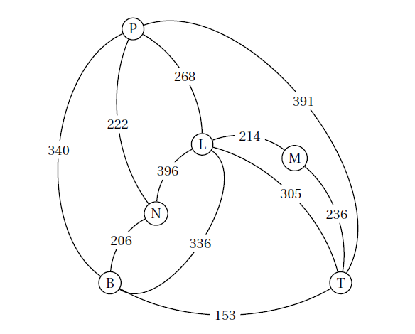

# Protocole OSPF

## Le routage à état de lien 

### Une vidéo de Mines - Télécom

<iframe width="560" height="315" src="https://www.youtube.com/embed/-utHPKREZV8" title="YouTube video player" frameborder="0" allow="accelerometer; autoplay; clipboard-write; encrypted-media; gyroscope; picture-in-picture" allowfullscreen></iframe>

### Le principe

Les algorithmes à état de lien sont basés sur la technique du plus court chemin, nommée {==**SPF**==} (*Shortest Path First*). 

Pour pouvoir calculer le plus court chemin, les routeurs doivent disposer de  **la carte complète du réseau**. Ainsi, un routeur *SPF* teste l’état des liens qui le connectent aux routeurs voisins puis diffuse périodiquement l’état de ses liens (actif ou inactif) à **tous les routeurs du réseau**. Les informations échangées sont uniquement l’état des liens entre deux routeurs, c'est-à-dire la qualité du lien, souvent exprimée par sa vitesse en **bits par secondes**( *bps*, déclinés en *Mbps*, *Gbps*, etc...). Dès qu’un routeur reçoit une information, si elle est différente de celle stockée dans sa table de lien, il la met à jour.

Au bout d'un certain temps, quand tous les routeurs ont échangé les informations, **ils disposent tous de la même table de routage**.

!!! example "Exemple"
	On considère le réseau suivant dont la table de routage partagée est donnée :
	
	

	

	{: style="width:90%; margin:auto;display:block;background-color: #d2dce0;"}

	

	

	{: style="width:80%; margin:auto;display:block;background-color: #d2dce0;"}

	

	

	
Lorsque la table des liens est modifiée, chaque routeur recalcule le plus court chemin pour chaque route affectée par la modification. Ainsi, chaque routeur possède la vue des plus courts chemins en termes de coûts partant de lui-même. La vue logique donne une arborescence dont la racine est le routeur en question.

!!! example "Depuis le routeur A"

	Si on considère l'exemple précédent, le routeur A sélectionnera le routeur B comme voie pour atteindre C et D. Il choisira par contre de rejoindre E par sa liaison directe avec lui, certes lente mais qui reste plus rapide que de passer par `B -> C -> D ->E`.
	
## Algorithme de Dijkstra

### Description de l'algorithme

L'algorithme de {==**Dijkstra**==}, crée par l'informaticien néerlandais [Edsger Dijkstra](https://fr.wikipedia.org/wiki/Edsger_Dijkstra), et publié en 1959, est un algorithme permettant de déterminer le plus court chemin entre deux sommets dans un *graphe orienté pondéré de réels positifs* (on définira plus tard ces termes dans le chapitre sur les graphes).

Il consiste à partir d'un sommet, et de construire progressivement un sous-graphe dans lequel sont classés les différents sommets par ordre croissant de leur distance minimale au sommet de départ, cette distance correspondant à la somme des *poids* des *arcs* empruntés.

On décrit l'algorithme ainsi :

1. Au départ, on considère que les distances de chaque sommet au sommet de départ sont **infinies**, sauf pour le sommet de départ pour lequel la **distance est nulle**. Le sous-graphe des sommets visités contient uniquement le sommet de départ.
2. On choisit en dehors du sous-graphe des sommets visités un sommet de distance minimale et on l'ajoute au sous-graphe. Ensuite, on met à jour les distances des sommets voisins de celui ajouté, selon les conditions suivantes pour chaque sommet voisin :

	* on calcule la distance correspondant à celle déjà parcourue jusqu'au sommet choisi auquel on ajoute le poids de l'arc entre le sommet choisi et le sommet voisin ;
	* si cette distance est inférieure à celle déjà connue pour le sommet voisin, on met à jour cette distance comme étant la nouvelle distance minimale pour atteindre ce sommet.
	
3. On reprend le point 2 jusqu'à épuisement des sommets (ou jusqu'à atteindre le sommet de destination dans certains cas).

### Exemple commenté d'application sur une carte

On considère le graphe suivant représentant un ensemble de villes et les distances les séparant :

{: style="width:50%; margin:auto;display:block;background-color: #d2dce0;"}

On va exécuter l'algorithme de Dijkstra en partant de la ville `A`, en complétant le tableau suivant :

{: style="width:100%; margin:auto;display:block;background-color: #d2dce0;"}

!!! info "Utilisation de l'algorithme de Dijkstra"
	L'algorithme de Dijkstra n'est pas limité à une utilisation dans le protocole OSPF. Il peut en réalité être utilisé dans toute situation modélisable par un graphe orienté et pour laquelle on cherche à minimiser une « distance » (c'est-à-dire une valeur calculée à partir du poids affecté aux arêtes du graphe).

	L'algorithme de Dijkstra est donc adapté pour les situations de déplacement sur une carte (comme dans Waze, Google Map ou encore mieux : [Open Street Map](https://www.openstreetmap.org/#map=16/51.99753/-0.74533){:target="_blank"}).
	Pour ces logiciels/applications, on utilisera une version optimisée de l'algorithme de Dijkstra, appelée algorithme [`A*` (*A star*)](https://fr.wikipedia.org/wiki/Algorithme_A*){:target="_blank"}.)

### Quelques exercices pour maitriser Dijkstra

!!! question "Exercice n°1"

	=== "Énoncé"
	
		Un journaliste britannique d’une revue consacrée à l’automobile doit tester les autoroutes françaises. Pour remplir sa mission, il décide de louer une voiture et de circuler entre six grandes villes françaises : Bordeaux (B), Lyon (L),Marseille (M), Nantes (N), Paris (P) et Toulouse(T).
		
		{: style="width:50%; margin:auto;display:block;background-color: #d2dce0;"}
		
		Le journaliste se trouve à Nantes et désire se rendre le plus rapidement possible à  Marseille.Déterminer un trajet qui minimise son temps de parcours.
	
	=== "Solutions"
	
		A venir !
	
	
!!! question "Exercice n°2"

	=== "Énoncé"
	
		Un parcours sportif est composé d’un banc pour abdominaux, de haies et d’anneaux. Le graphe orienté ci-contre indique les différents parcours conseillés partant de D et terminant à F. Les sommets sont : D (départ), B (banc pour abdominaux), H (haies), A (anneaux) et F (fin du parcours). Les arêtes représentent les différents sentiers reliant les sommets.
		Assia a relevé ses temps de course en minute entre les différents sommets. Ces durées sont portées sur le graphe ci-dessous. Lors d’un entraînement, Assia souhaite courir le moins longtemps possible en allant de D à F. Déterminer le trajet pour lequel le temps de course est minimal et préciser la durée de sa course.
		
		{: style="width:50%; margin:auto;display:block;background-color: #d2dce0;"}
	
	
	=== "Solutions"
	
		A venir !

## Le protocole OSPF

Le protocole {==**OSPF**==} pour *Open Shortest Path First* est un protocole à état de lien, normalisé en 1990, décrit dans la RFC 2328. Il est pris en charge par le protocole `IP`. C’est le protocole de routage interne dominant et il est supporté par la plupart des routeurs. Ce  protocole attribue un coût à chaque lien entre les routeurs du réseau. Le *O* du sigle *OSPF* signifie que sa spécification doit appartenir au domaine public et que toute solution propriétaire est exclue.

L’algorithme pour trouver la meilleure route est celui de Dijkstra qui fournit dans ce cas **le coût cumulé le plus faible des liens de la route** vers une destination d’une zone donnée. Le coût utilisé pour chaque lien doit être **inversement proportionnel à la bande passante du lien** en question. Ce coût peut être défini manuellement ou calculé avec la formule suivante :

$$
Coût = \cfrac{Cst}{bande~~passante}
$$

!!! warning 
	La valeur $Cst$ est arbitraire. Elle peut valoir $10^8$, $10^9$ ou $10^{10}$ selon la plus grande bande passante du réseau. Par contre, il faut veiller à utiliser la même valeur pour tous les routeurs d'un même réseau. Ce choix est effectué afin que tous les coûts calculés soient des entiers positifs.
	
!!! example "Exemple"

	En reprenant les bandes passantes données dans le premier exemple, et avec une constante de $10^9$ :
	
	* $1~Gbps$ correspond à un coût de $\cfrac{10^9}{10^9}=1$ ;
	* $100~Mbps$ correspond à un coût de $\cfrac{10^9}{100 \times 10^6}=10$ ;
	* $10~Mbps$ correspond à un coût de $\cfrac{10^9}{10 \times 10^6}=100$.
	
	Ainsi une route à $10$ Mbps est considérée comme 100 fois plus &laquo; lente &raquo; qu'une liaison à $1$ Gbps.
	
!!! question "Exercice"

	=== "Enoncé"
	
		1. Exercice n°5 du sujet [Métropole J1 2021](https://www.sujetdebac.fr/annales/spe-numerique-informatique-2021-metropole-1){: target ="_blank"}
		2. Exercice n°2 du sujet [Métropole J1 2023](https://pixees.fr/informatiquelycee/term/suj_bac/2023/sujet_07.pdf){: target="_blank"}
		3. Exercice n°2 su sujet [Métropole J1 2024](https://pixees.fr/informatiquelycee/term/suj_bac/2023/sujet_07.pdf){: target="_blank"}
		
	=== "Solution"
	
		A venir !

## Pour aller plus loin :

<iframe width="560" height="315" src="https://www.youtube.com/embed/FeZI3Xl7j84" title="YouTube video player" frameborder="0" allow="accelerometer; autoplay; clipboard-write; encrypted-media; gyroscope; picture-in-picture" allowfullscreen></iframe>
