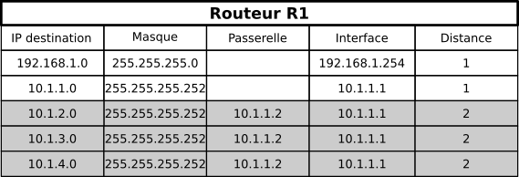
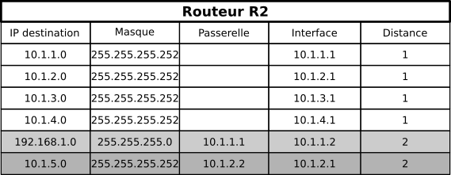
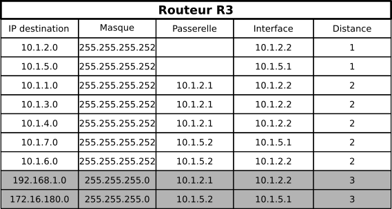

# Protocoles à vecteur de distance : RIP

## Pourquoi automatiser le routage.

<iframe width="560" height="315" src="https://www.youtube.com/embed/sT9-IcbjqzI" title="YouTube video player" frameborder="0" allow="accelerometer; autoplay; clipboard-write; encrypted-media; gyroscope; picture-in-picture" allowfullscreen></iframe>

## Le routage à vecteur de distance : le protocole RIP

*D'après [https://www.lecluse.fr/nsi/NSI_T/archi/routage/RIP/](https://www.lecluse.fr/nsi/NSI_T/archi/routage/RIP/).*

### Le principe

Le protocole RIP (*Routing Information Protocol*) rentre dans la catégorie des protocoles à {==**vecteur de distance**==}. Un vecteur de distance est un couple `(adresse, distance)`, et ce protocole cherche à minimiser le nombre de routeurs (c'est-à-dire la distance) à traverser pour atteindre la destination (on cherche ici à minimiser le nombre de sauts).

<iframe width="560" height="315" src="https://www.youtube.com/embed/kzablGaqUXM" title="YouTube video player" frameborder="0" allow="accelerometer; autoplay; clipboard-write; encrypted-media; gyroscope; picture-in-picture" allowfullscreen></iframe>

Chaque routeur reçoit en permanence (toutes les 30 secondes environ) de ses voisins les informations de routage qu'ils possèdent. Il va alors exploiter ces informations pour construire lui-même sa table de routage en ne retenant que les informations les plus pertinentes : une simple comparaison permet de ne garder que le chemin le plus avantageux. Il transmettra à son tour ces informations à ses voisins et ainsi de suite. C'est l'algorithme de [Bellman-Ford](https://fr.wikipedia.org/wiki/Algorithme_de_Bellman-Ford){: target="_blank"}, un des algorithmes de recherche de plus court chemin dans un graphe, que nous étudierons plus en détail dans le chapitre à venir sur les graphes.

À l'issue de quelques étapes, les tables de tous les routeurs se stabilisent et le routage est pleinement opérationnel. Le temps nécessaire à la stabilisation des tables est proportionnel au diamètre du réseau, c'est-à-dire à la plus grande route possible entre deux routeurs - c'est ce qui est appelé **vitesse de convergence** dans la vidéo de l'[Institut Mines-Télécom](https://www.imt.fr/admissibles/?utm_source=google&utm_medium=cpc&utm_campaign=terminales_22&gclid=CjwKCAiAsNKQBhAPEiwAB-I5zTNjtBIyeW7Vbmmm29O3Vlap964Uk3PZ7QykzymnIFS2IOB0196U8hoCBDMQAvD_BwE){: target="_blank"}.

### Débranche tout !

Chacun d'entre vous se verra remettre un numéro de routeur, ainsi que la connaissance de ses voisins proches. Nous allons simuler l'exécution de l'algorithme de Bellman-Ford, en construisant petit-à-petit vos tables de routages. Le fichier LibreOffice utilisé est téléchargeable [ici](Activite_debranchee.odt){: target="_blank"}.

### Un exemple d'application

Considérons le réseau suivant, pour lequel on admettra la norme suivante :

* Le poste client et le poste serveur se voient attribués respectivement la première adresse de la plage de leur réseau (soit respectivement `192.168.0.1` et `172.16.180.1`).
* Les routeurs d'accès `R1` et `R6` ont sur leurs interfaces réseaux les dernières adresses IP de la plage de leurs réseaux (soit respectivement `192.168.0.254` et `172.16.180.254`).
* Entre deux interfaces internes, le routeur **de plus bas indice** possède la première adresse et le routeur de dernier indice la seconde adresse : par exemple entre `R2` et `R5`, les interfaces sont connectées par le réseau `10.1.4.0/30`, donc l'interface de `R2` est `10.1.4.1` et celle de `R5` est `10.1.4.2` (car l'indice 2 de `R2`est plus petit que l'indice 5 de `R5`).
* Tous les routeurs suivent le protocole RIP.

{: style="width:100%; margin:auto;display:block;background-color: #d2dce0;"}

#### Initialisation 

Au démarrage, les routeurs ne connaissent que leur voisin immédiat. Les tables de routages pour les routeurs `R1`, `R2` et `R3` sont donc :

{: style="width:50%; margin:auto;display:block;background-color: #d2dce0;"}

!!! info "Principe de l'algorithme"

	Lorsqu'un routeur reçoit une nouvelle route de la part d'un voisin, 4 cas sont envisageables :

	* Il découvre une route vers un nouveau **réseau inconnu** : il l'ajoute à sa table.
	* Il découvre une route vers un réseau **connu**, **plus courte** que celle qu'il possède dans sa table : il actualise sa table.
	* Il découvre une route vers un réseau **connu**, **plus longue** que celle qu'il possède dans sa table : il ignore cette route.
	* Il reçoit une route vers un réseau **connu** en provenance d'un routeur **déjà existant dans sa table** : il met à jour sa table car la topologie du réseau a été modifiée.
	
	Quand il mets à jour les distances reçues, il {==**ajoute 1**==} à celles-ci, pour prendre en compte le *hop* (saut) supplémentaire effectué pour l'atteindre.
	
#### Étape 1

* R1 reçoit les routes de R2. Sa table de routage devient :

	{: style="width:50%; margin:auto;display:block;background-color: #d2dce0;"}
	
* R3 reçoit les routes de R2, et celles de R5. On peut constater qu'il est possible d'atteindre de deux manières différentes les routeurs R2 et R5, car R3 ne réalise pas que les interfaces `10.1.2.1` et `10.1.4.1` sont toutes deux des interfaces de R2. De même il sait rejoindre de deux manières ayant la même métrique le réseau `10.1.4.0/30`, donc il garde la première arrivée (ici on suppose d'il a reçu les informations de R2 avant celles de R5)

	{: style="width:50%; margin:auto;display:block;background-color: #d2dce0;"}

* R2 reçoit les routes de R1, puis de R3, mais aussi de R4 et de R5 :

	{: style="width:50%; margin:auto;display:block;background-color: #d2dce0;"}
	

	
#### Étape 2

* R1 reçoit les nouvelles routes de R2 :

	{: style="width:50%; margin:auto;display:block;background-color: #d2dce0;"}
	
* R2 reçoit les nouvelles routes de R3 et de R5 :

	{: style="width:50%; margin:auto;display:block;background-color: #d2dce0;"}
	
* R2 reçoit les nouvelles routes de R1 (qui ne lui apportent rien), de R3, de R4, de R5.... Très rapidement, la construction de ces routes devient absolument ingérable à la main... Mais voici quand même la table de routage :

	{: style="width:50%; margin:auto;display:block;background-color: #d2dce0;"}

#### Étape 3

Cette dernière table de R2 sera transmise à l'étape suivante à R1, et une liaison sera alors possible dès l'étape 3 entre le Client et le Serveur. Dans ce mini-réseau, les tables sont alors toutes stabilisées dès la troisième étape et le réseau est totalement opérationnel.

## Quelques points importants

Un des inconvénients du protocole RIP est qu'il génère un trafic important entre voisins, chacun envoyant sa table de routage à tous ses voisins à intervalles réguliers. 	

En conséquences, le protocole RIP est configuré pour se limiter à un {==**nombre maximum de 15 sauts**==}, ce qui le réserve à des réseaux de petites taille.

L'avantage de cette limite est qu'elle permet d'éviter les {==**éventuelles boucles de routage**==} (comme R2 => R3 => R5 => R2), en utilisant le TTL qui ne doit pas dépasser 15, afin qu'un paquet qui tourne en rond soit détruit.

De même, si un routeur ne reçoit pas d'informations d'un de ses voisins directs au bout d'un ordre de temps de trois minutes, il considère que ce routeur est hors service et lui affecte une distance de 16, qui est alors considérée dans ce protocole comme une distance infinie. En conséquence, tous ses voisins recalculeront leurs vecteurs en évitant le lien qui est tombé.
