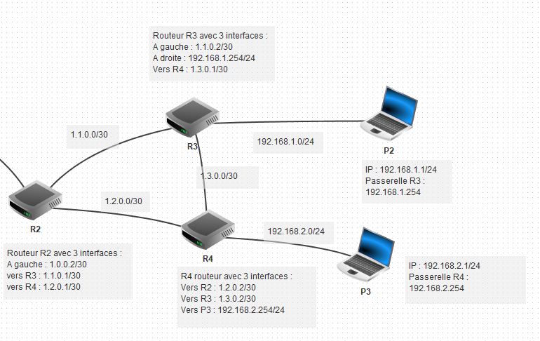
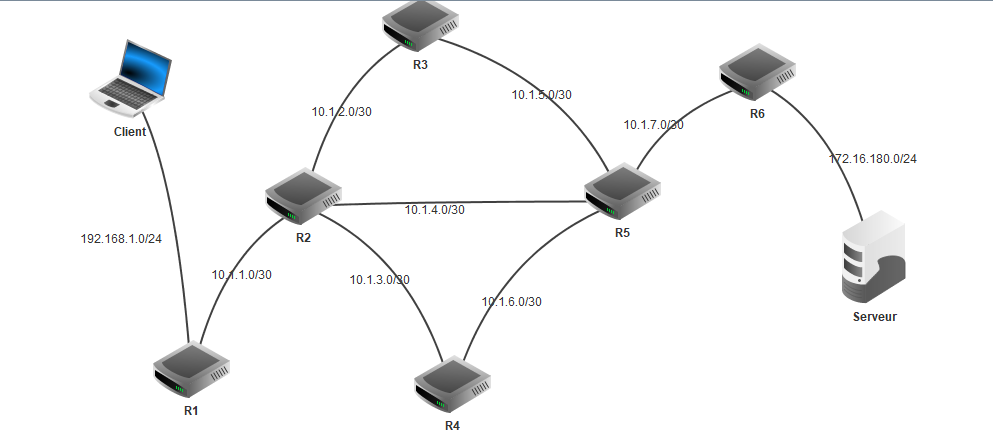

# Protocoles de routages

Il est fortement conseillé d'avoir repris le cours de [SNT sur les réseaux](../../../../SNT/Reseaux/TCP_IP/) avant d'entamer cette partie.

## Chacun sa route...

### La commande `ping`

Nous connaissons la commande `ping` qui permet d'envoyer des paquets `ICMP` (*Internet Control Message Protocol*) à une adresse de destination. Le but de ce protocole `ICMP` est d'échanger des informations d'états et des messages d'erreurs. Par exemple, le commande `ping` sur l'adresse `8.8.8.8` (DNS de Google), donne depuis chez moi :

{: style="width:60%; margin:auto;display:block;background-color: #d2dce0;"}

Parmi les informations données par la commande `ping`, on a bien entendu le temps d'aller-retour entre l'ordinateur émetteur et l'ordinateur cible, le nombre de paquets envoyés et reçus, mais aussi une information dont nous n'avons pas encore parlé : le `TTL` (*Time To Live* - attention seulement en IPV4).

!!! abstract "TTL"

	La durée de vie `TTL` correspond à la durée pendant laquelle un paquet de données est valide. 
	La valeur initiale est au maximum de 255. Habituellement, les implémentations ont une TTL initiale de 31, 63 ou 127. Pour chaque noeud de réseau (en gros un *routeur*) par lequel passe le paquet de données, le TTL est décrémenté de 1. On parle dans ce cas de {==**hops**==}. Si la TTL baisse jusque 0, le paquet de données est rejeté.

	En pratique, le TTL qui vous est communiqué correspond généralement à la **valeur initiale** de l’ordinateur distant, dont on aura **déduit le nombre de passages par un routeur**.

	Si vous avez par exemple un TTL de 58, vous pouvez en déduire que le paquet de réponse avait été émis avec une valeur initiale de 63, et que sur le chemin du retour, il est passé par 5 machines.
	
	!!! warning
		Attention, nous ne sommes pas certain de ce point... Il pourrait tout aussi bien avoir été émis avec une valeur initiale de 127, et donc être passé par 69 routeurs... Le TTL n'est donc qu'une indication...
		
Dans notre exemple, on peut supposer qu'avec un TTL de 119, on est passé par 8 machines pour aller de chez moi jusqu'au DNS de Google.

!!! question "Tester `ping`"

	1. Depuis l'invite de commande de windows  :
		1. Tester la commande `ping 8.8.8.8`. Quel est le TTL, que peut-on supposer ?
		2. Tester la commande `ping -4 www.zonensi.fr`. Que se passe-t-il ?
		3. Tester la commande `ping -6 www.zonensi.fr`. Que se passe-t-il ?
	2. Depuis l'invite de commande Linux :
		1. Tester la commande `ping 8.8.8.8`. Quelle différence y-a-t'il avec la commande windows ?
		2. Tester la commande `ping -c 5 8.8.8.8`. Que se passe-t-il ?
		3. Tester la commande `ping -t 5 8.8.8.8`. Que se passe-t-il ?
		4. Tester la commande `ping -c 5 -t 10 8.8.8.8`. Que se passe-t-il ?
		

		
??? tips "Fixer le TTL"
	L'option `-t` pour la commande `ping`, sous Linux, permet de fixer un nombre maximum de **hops** possibles. Si la destination est plus lointaine que ce nombre, on aura alors l'erreur `Time to live exceeded`.
	Cette possibilité existe aussi sous Windows mais :

	* l'option `-t` désactive par défaut la limite de 4 paquets `ICMP`, et envoie donc en continu (comme la commande de base sous Linux) ;
	* l'option `-c` fixe le nombre maximal de **hops**, mais nécessite d'être dans une console en mode administrateur pour être utilisée (ce qui n'est pas possible au Lycée).
	
### La commande `tracert` (ou `traceroute` sous linux)
		
Il est possible de globalement connaitre les différents routeurs par lesquels passe un paquet IP, en utilisant le principe précédent :

* On envoie un paquet avec un `TTL` de 1, le premier routeur atteint va décrémenter et atteindre 0, il va donc envoyer un message signalant qu'il a détruit le paquet en question. Dans ce message, il y aura bien entendu son adresse `IP`.
* On fait de même avec un `TTL` de 2, le premier routeur décrémente le `TTL`, le second le décrémente encore une fois, et comme il atteint 0, il détruit le paquet et renvoie un message d'erreur, avec bien entendu son adresse `IP`.
* On continue ainsi en augmentant le `TTL`.

La commande permettant d'appliquer cette méthode est `tracert` sous windows (`traceroute`sous Linux) :

{: style="width:60%; margin:auto;display:block;background-color: #d2dce0;"}

On constate ici qu'on a bien un passage par 8 machines (7 routeurs plus mon propre PC) :

* le premier routeur d'ip `192.168.1.254` (adresse classique des passerelles chez Free, c'est-à-dire de ma box);
* le second `194.149.164.68`, qui correspond à un routeur Free  (on peut le vérifier avec l'outil [who is](https://www.crawl-tools.com/fr/whois-client/){target = '_blank'};
* etc... jusqu'à atteindre le DNS Google d'IP `8.8.8.8`

!!! question "Tester la commande"

	1. Depuis l'invite de commande windows (non-testé depuis le lycée... On pourrait avoir des surprises...) :
		1. Tester la commande `tracert 8.8.8.8`.
		2. Tester la commande `tracert 95.142.174.138`
		3. Tester la commande `tracert www.toutatice.fr`. Que se passe-t-il ?
	2. Depuis l'invite de commande Linux :
		1. Tester la commande `traceroute 8.8.8.8`.
		2. Tester la commande `traceroute 95.142.174.138`
		3. Tester la commande `traceroute www.toutatice.fr`. Que se passe-t-il ?

## Routage des paquets dans un réseau

### Un point sur les adresses IP

Nous avons vu qu'une adresse IP n'est jamais donnée seule, elle est toujours accompagnée d'un {==**masque de sous-réseau**==}, dont le rôle est de différencier l'adresse du réseau de celle de la machine.

En IPV4, donc sur 4 octets, une adresse IP et un masque de sous-réseau sont représentés par une série de 32 bits. Pour déterminer le numéro de réseau d'une machine, une opération logique `ET` est effectuée bit à bit entre l'IP et le masque.

!!! example "Exemple" 

	Considérons une machine d'IP `194.152.20.12`, qui correspond donc à la suite binaire `11000010.10011000.00010100.00001100`, et de  masque '157.132.140.128' soit la suite binaire `10011101.10000100.10001100.10000000`. L'opération logique `ET` entre ces deux suites donne :
	
	{: style="width:60%; margin:auto;display:block;background-color: #d2dce0;"}
	
	Soit une adresse réseau `128.128.4.0`.

Historiquement, le masque de sous-réseau pouvait être une suite quelconque de 0 et de 1, comme dans l'exemple précédent. Mais ceci n'est absolument pas pratique !

Il a donc été décidé que la norme serait qu'un masque de sous-réseau serait constitué {==**d'une suite contiguë de 1 suivis de 0**==} comme, par exemple, `11111111.11111111.11100000.00000000`. Ceci permet entre-autres de simplifier l'écriture des masques en donnant l'IP suivie d'un nombre représentant le nombre de bits de poids fort ayant pour valeur 1.

Ainsi au lieu d'écrire :

* IP : `192.168.20.4`
* Masque : `255.255.224.0`, soit `11111111.11111111.11100000.00000000`, 

on écrira : 

* IP : `192.168.20.4/19`, 

ce qui signifie que les 19 bits de poids forts du masque ont pour valeur 1, et que les 13 suivants sont à 0.

!!! question "Exercice"

	1. On considère une machine dont l'IP est `192.168.20.4/19`. Quel est l'adresse du réseau de cette machine ?
	2. On considère une machine dont l'IP est `192.168.20.4/8`. Quel est l'adresse du réseau de cette machine ?
	3. On considère une machine dont l'IP est `192.168.20.4/16`. Quel est l'adresse du réseau de cette machine ?
	4. On considère une machine dont l'IP est `192.168.20.4/24`. Quel est l'adresse du réseau de cette machine ?

		
??? tips "Simplification d'écriture"

	Dans le cadre d'exercices de NSI, on cherchera souvent à simplifier les calculs, c'est pourquoi on trouvera souvent des adresses IP sous la forme : 
	
	* `X.X.X.X/8`, c'est-à-dire avec un masque `255.0.0.0` ;
	* `X.X.X.X/16`, c'est-à-dire avec un masque `255.255.0.0` ;
	* `X.X.X.X/24`, c'est-à-dire avec un masque `255.255.255.0`.

### Un exemple avec routage manuel sur 3 routeurs

On considère les réseaux suivants (téléchargeable [ici](Exo_Routage_1.fls){:target="_blank"}) dans le logiciel `Filius`, pour lesquels les routeurs R1, R2 et R3 **ne sont pas en routage automatique**.

{: style="width:100%; margin:auto;display:block;background-color: #d2dce0;"}

* Les routeurs R1 et R3 sont appelés {==**routeurs d'accès**==}, car ils sont en bordure de réseaux.
* Le routeur R2 est un {==**routeur interne**==}.

L'objectif est de comprendre comment les routeurs font pour transmettre des paquets de l'ordinateur P1 du réseau `192.168.0.0/24` à l'ordinateur P2 du réseau `192.168.1.0/24`.

!!! abstract "Tables de routage"

	Une table de routage est une structure de données utilisée par un routeur ou un ordinateur en réseau, et qui définit en fonction des adresses de destination par quels routeurs passer.
	
!!! question "Comprendre une table de routage"

	Voici la table de routage actuelle du routeur R1 :
	
	{: style="width:60%; margin:auto;display:block;background-color: #d2dce0;"}
	
	1. Quels sont les champs de cette table ?
	2. Chercher sur le web la signification informatique de {==**loopback**==} (ou **rebouclage**).
	3. Que signifie alors la troisième ligne ? La quatrième ligne ?
	4. Nous allons devoir indiquer au routeur R1 quelle direction devra prendre un paquet à destination du réseau `192.168.1.0/24` :

		1. Ajoutez une ligne à la table de routage de R1.
		2. Dans celle ci, complétez les champs :

			* *IP de destination* : `192.168.1.0/24`
			* *Masque* : `255.255.255.0`
			* *Paserelle suivante* : `1.0.0.2`
			* *Via l'interface* : `1.0.0.1`
			
		3. Testez à partir de P1 et la commande `ping 192.168.1.0`. Le paquet est-il transmis à P2 ? *Vous pouvez ouvrir les fenêtres d'échanges de données nécessaires*.
		4. Complétez les tables de routages de R2 et et R3 pour que la commande `ping` fonctionne correctement.
	5. Nous allons modifier la {==**topologie**==} du réseau, en ajoutant un  routeur R4 et un portable P3 de la manière suivante (le portable P1 et le routeur R1 sont inchangés) :
	
		{: style="width:70%; margin:auto;display:block;background-color: #d2dce0;"}
		
		!!! tips
			Si vous êtes à cours de prises réseaux sur certains routeurs, vous pouvez en ajouter de nouvelles via le bouton `Gérer les connexions`
		
		Modifiez les tables de routages nécessaires pour que les 3 portables puissent communiquer.
		
	
	
!!! warning "Routage manuel"
	Même pour des réseaux de petites taille, il est difficile de maintenir des tables de routages manuellement. Dès que le nombre de routeurs internes augmente, arrivent d'autres questions :
	
	{: style="width:100%; margin:auto;display:block;background-color: #d2dce0;"}
	
	Dans une situation comme celle-ci, plusieurs routes permettent à un paquet de transiter du routeur `R1` au routeur `R6`.
	
	* `R1 -> R2 -> R3 -> R5 -> R6`
	* `R1 -> R2 -> R4 -> R5 -> R6` 
	* `R1 -> R2 -> R5 -> R6`
	
	La question est : quelle route devra être privilégiée ? Nous aurions tendance à penser naturellement qu'il faut prendre la troisième solution, pour laquelle un *hop* de moins est nécessaire, mais est-ce judicieux si les liaisons `R2->R3->R5` sont fibrées alors que la liaison `R2 -> R5` est une liaison cuivre classique ? 

	Nous répondrons à ces questions dans les deux parties suivantes du cours, en étudiant deux algorithmes de routage : les protocoles `RIP` et `OSPF`.

